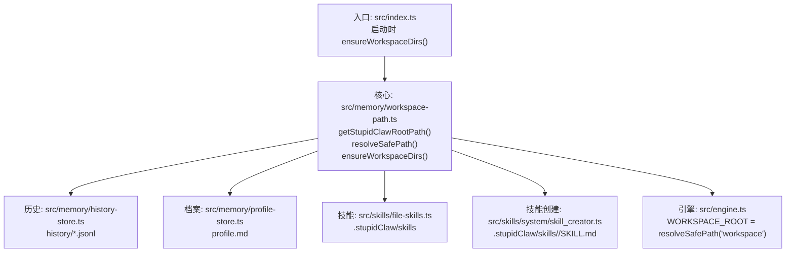
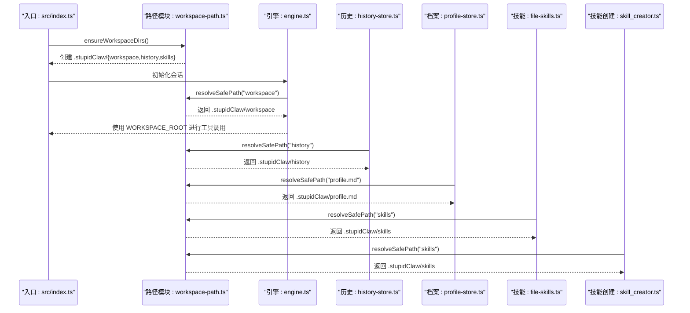
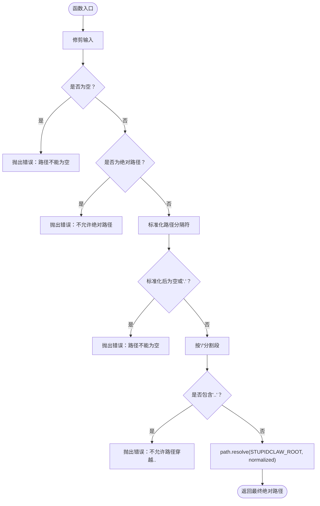
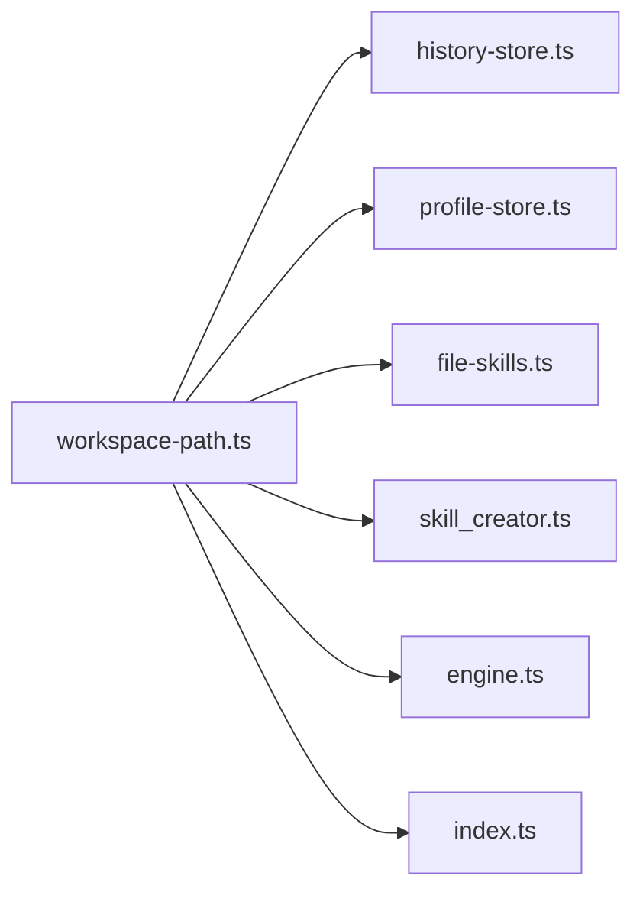

# 工作区路径控制

<cite>
**本文档引用的文件**
- [workspace-path.ts](file://src/memory/workspace-path.ts)
- [workspace-path.test.ts](file://src/memory/workspace-path.test.ts)
- [history-store.ts](file://src/memory/history-store.ts)
- [profile-store.ts](file://src/memory/profile-store.ts)
- [file-skills.ts](file://src/skills/file-skills.ts)
- [skill_creator.ts](file://src/skills/system/skill_creator.ts)
- [engine.ts](file://src/engine.ts)
- [index.ts](file://src/index.ts)
- [README.md](file://README.md)
- [StupidClaw-第5期-安全沙盒PathJailing防止越权读写.md](file://StupidClaw-第5期-安全沙盒PathJailing防止越权读写.md)
</cite>

## 目录
1. [简介](#简介)
2. [项目结构](#项目结构)
3. [核心组件](#核心组件)
4. [架构总览](#架构总览)
5. [详细组件分析](#详细组件分析)
6. [依赖关系分析](#依赖关系分析)
7. [性能考量](#性能考量)
8. [故障排查指南](#故障排查指南)
9. [结论](#结论)
10. [附录](#附录)

## 简介
本文件系统性阐述 StupidClaw 的工作区路径控制系统，重点围绕安全沙盒机制、路径验证与访问控制、越权防护策略展开。文档聚焦于统一的安全路径解析入口 resolveSafePath 的工作机制，解释其在路径规范化、相对路径处理、禁止访问父目录等方面的强制性安全检查；同时梳理工作区目录的创建与管理流程（尤其是 .stupidClaw 目录的初始化与权限设置），并给出安全配置最佳实践、测试用例分析与常见安全漏洞的防范措施。

## 项目结构
- 路径控制核心位于 src/memory/workspace-path.ts，提供 getStupidClawRootPath、resolveSafePath、ensureWorkspaceDirs 三个关键函数，作为全应用的唯一安全路径解析入口。
- 业务模块通过导入该模块，将所有落盘路径统一收敛至 .stupidClaw 目录，避免越权访问 src、根目录等敏感区域。
- 启动入口 src/index.ts 在进程启动时调用 ensureWorkspaceDirs，确保工作区目录树存在；engine.ts 将工作区根目录设置为 resolveSafePath("workspace")，供会话工具链使用。

图表来源
- [index.ts:114](file://src/index.ts#L114)
- [workspace-path.ts:28-41](file://src/memory/workspace-path.ts#L28-L41)
- [history-store.ts:20](file://src/memory/history-store.ts#L20)
- [profile-store.ts:18-19](file://src/memory/profile-store.ts#L18-L19)
- [file-skills.ts:15-24](file://src/skills/file-skills.ts#L15-L24)
- [skill_creator.ts:7](file://src/skills/system/skill_creator.ts#L7)
- [engine.ts:37](file://src/engine.ts#L37)

章节来源
- [README.md:46-51](file://README.md#L46-L51)
- [index.ts:114](file://src/index.ts#L114)
- [workspace-path.ts:28-41](file://src/memory/workspace-path.ts#L28-L41)

## 核心组件
- 安全根路径常量 STUPIDCLAW_ROOT：通过 process.cwd() 与 ".stupidClaw" 组合得到，作为所有安全路径的根目录。
- normalizeRelativePath：对输入路径进行修剪、判空、拒绝绝对路径、标准化分隔符、二次判空、禁止 ".." 穿越等强制性检查。
- resolveSafePath：在 normalizeRelativePath 成功后，使用 path.resolve(STUPIDCLAW_ROOT, normalized) 生成最终绝对路径，保证最终路径始终位于 .stupidClaw 根目录之下。
- ensureWorkspaceDirs：在 .stupidClaw 下创建 workspace、history、skills 三大目录，确保后续读写可用。

章节来源
- [workspace-path.ts:4-35](file://src/memory/workspace-path.ts#L4-L35)
- [workspace-path.ts:37-41](file://src/memory/workspace-path.ts#L37-L41)

## 架构总览
安全路径控制贯穿启动、引擎、历史记录、档案、技能与技能创建等模块。统一入口确保所有业务落盘路径均经过严格的相对路径与越权检查，从而将风险阻断在解析阶段。

图表来源
- [index.ts:114](file://src/index.ts#L114)
- [workspace-path.ts:32-35](file://src/memory/workspace-path.ts#L32-L35)
- [engine.ts:37](file://src/engine.ts#L37)
- [history-store.ts:20](file://src/memory/history-store.ts#L20)
- [profile-store.ts:18-19](file://src/memory/profile-store.ts#L18-L19)
- [file-skills.ts:15-24](file://src/skills/file-skills.ts#L15-L24)
- [skill_creator.ts:7](file://src/skills/system/skill_creator.ts#L7)

## 详细组件分析

### 组件一：路径解析与安全检查（workspace-path.ts）
- 设计要点
  - 仅接受相对路径，拒绝绝对路径与空白路径。
  - 规范化路径分隔符，禁止包含 ".." 段，确保最终路径位于 STUPIDCLAW_ROOT 之内。
  - 通过 path.resolve 合并根路径与规范化路径，形成最终绝对路径。
- 错误处理
  - 对空路径、绝对路径、包含 ".." 的路径抛出错误，阻止进入后续文件操作。
- 目录管理
  - ensureWorkspaceDirs 递归创建 workspace、history、skills 三类目录，便于后续模块直接使用。

图表来源
- [workspace-path.ts:6-26](file://src/memory/workspace-path.ts#L6-L26)
- [workspace-path.ts:32-35](file://src/memory/workspace-path.ts#L32-L35)

章节来源
- [workspace-path.ts:4-41](file://src/memory/workspace-path.ts#L4-L41)

### 组件二：历史记录存储（history-store.ts）
- 访问模式
  - HISTORY_DIR 由 resolveSafePath("history") 构成，确保历史目录位于 .stupidClaw 下。
  - 每日文件命名采用 getDateString，路径通过 path.resolve(HISTORY_DIR, ...) 生成。
- 异常处理
  - 读取历史文件时捕获 ENOENT 并返回空列表，其他错误向上抛出。

章节来源
- [history-store.ts:20](file://src/memory/history-store.ts#L20)
- [history-store.ts:54](file://src/memory/history-store.ts#L54)
- [history-store.ts:77-81](file://src/memory/history-store.ts#L77-L81)

### 组件三：个人档案存储（profile-store.ts）
- 访问模式
  - PROFILE_PATH 由 resolveSafePath("profile.md") 构成，确保档案文件位于 .stupidClaw 下。
  - 启动时若档案不存在则创建默认模板。
- 数据处理
  - 解析与写入均在安全路径范围内进行，避免越权访问。

章节来源
- [profile-store.ts:18-19](file://src/memory/profile-store.ts#L18-L19)
- [profile-store.ts:103-110](file://src/memory/profile-store.ts#L103-L110)

### 组件四：文件技能加载（file-skills.ts）
- 访问模式
  - PROJECT_SKILL_DIRS 中的 dir 字段使用 resolveSafePath("skills")，限定技能目录在 .stupidClaw/skills 下。
- 加载策略
  - 若目录不存在则跳过，避免因越权路径导致的异常。

章节来源
- [file-skills.ts:15-24](file://src/skills/file-skills.ts#L15-L24)

### 组件五：技能创建工具（skill_creator.ts）
- 访问模式
  - PROJECT_SKILLS_ROOT 使用 resolveSafePath("skills")，确保技能文件在 .stupidClaw/skills 下。
  - 每个技能独立子目录，文件名为 SKILL.md，路径通过 path.join 组合。
- 安全要点
  - 仅在 .stupidClaw/skills 下创建与写入，杜绝越权路径。
  - 对已存在文件进行显式判断，避免覆盖。

章节来源
- [skill_creator.ts:7](file://src/skills/system/skill_creator.ts#L7)
- [skill_creator.ts:149-150](file://src/skills/system/skill_creator.ts#L149-L150)
- [skill_creator.ts:194-200](file://src/skills/system/skill_creator.ts#L194-L200)

### 组件六：引擎工作区根目录（engine.ts）
- 访问模式
  - WORKSPACE_ROOT = resolveSafePath("workspace")，将工作区根目录固定在 .stupidClaw/workspace。
- 生命周期
  - 在创建会话前确保目录存在，随后将该路径传递给工具链，作为默认工作目录。

章节来源
- [engine.ts:37](file://src/engine.ts#L37)
- [engine.ts:421](file://src/engine.ts#L421)

### 组件七：启动与目录初始化（index.ts）
- 访问模式
  - ensureWorkspaceDirs 在进程启动时调用，确保 .stupidClaw/{workspace,history,skills} 存在。
- 单实例锁
  - 启动时创建 .stupidClaw/polling.lock，避免多实例冲突。

章节来源
- [index.ts:114](file://src/index.ts#L114)
- [index.ts:45-69](file://src/index.ts#L45-L69)

## 依赖关系分析
- 松耦合与集中控制
  - 所有模块仅依赖 workspace-path.ts 的 resolveSafePath 与 getStupidClawRootPath，避免分散的路径拼接逻辑。
- 直接依赖
  - history-store.ts、profile-store.ts、file-skills.ts、skill_creator.ts、engine.ts、index.ts 直接导入 workspace-path.ts。
- 间接依赖
  - engine.ts 通过 resolveSafePath("workspace") 影响工具链默认工作目录，间接影响所有文件操作的相对路径行为。

图表来源
- [workspace-path.ts:28-41](file://src/memory/workspace-path.ts#L28-L41)
- [history-store.ts:3](file://src/memory/history-store.ts#L3)
- [profile-store.ts:2](file://src/memory/profile-store.ts#L2)
- [file-skills.ts:8](file://src/skills/file-skills.ts#L8)
- [skill_creator.ts:4](file://src/skills/system/skill_creator.ts#L4)
- [engine.ts:14](file://src/engine.ts#L14)
- [index.ts:8](file://src/index.ts#L8)

章节来源
- [workspace-path.ts:28-41](file://src/memory/workspace-path.ts#L28-L41)
- [history-store.ts:3](file://src/memory/history-store.ts#L3)
- [profile-store.ts:2](file://src/memory/profile-store.ts#L2)
- [file-skills.ts:8](file://src/skills/file-skills.ts#L8)
- [skill_creator.ts:4](file://src/skills/system/skill_creator.ts#L4)
- [engine.ts:14](file://src/engine.ts#L14)
- [index.ts:8](file://src/index.ts#L8)

## 性能考量
- 路径解析成本极低：仅涉及字符串修剪、正则/分割、一次 path.resolve，开销可忽略。
- 目录创建 ensureWorkspaceDirs 仅在启动时执行一次，避免频繁 IO。
- 历史与档案读写遵循每日/单文件策略，文件规模可控，IO 压力较小。
- 建议
  - 避免在热路径中重复解析同一相对路径，可在模块级缓存 resolveSafePath 结果（如 HISTORY_DIR、PROFILE_PATH）。
  - 对大量并发写入场景，建议在业务层增加队列或去抖策略，降低磁盘压力。

## 故障排查指南
- 常见错误与定位
  - “路径不能为空”：输入为空或仅空白字符。检查调用方传参。
  - “不允许绝对路径”：传入以 "/" 开头的路径。改为相对路径。
  - “不允许路径穿越（..）”：路径包含 ".."。检查是否试图访问父目录。
- 日志与调试
  - 启动时打印 runtime config，包含 workspaceRoot，便于核对路径解析结果。
  - 历史读取对 ENOENT 进行静默处理并返回空列表，避免误报。
- 安全加固
  - 确保 .stupidClaw 目录权限仅限当前用户读写，避免被其他用户篡改。
  - 避免在 .stupidClaw 下存放可执行文件，降低潜在攻击面。

章节来源
- [workspace-path.test.ts:6-28](file://src/memory/workspace-path.test.ts#L6-L28)
- [engine.ts:401-419](file://src/engine.ts#L401-L419)
- [history-store.ts:77-81](file://src/memory/history-store.ts#L77-L81)

## 结论
StupidClaw 的工作区路径控制通过“一处定义、处处复用”的安全路径解析策略，将所有文件落盘路径收敛至 .stupidClaw 目录，并在解析阶段严格执行“非空、非绝对、无穿越”的硬约束，有效防止越权读写。配合启动时的目录初始化与模块化的接入方式，系统在保持极简的同时实现了可靠的边界控制。建议在生产环境中进一步强化权限与审计策略，并持续通过测试用例覆盖边界场景。

## 附录

### 安全配置最佳实践
- 路径白名单
  - 仅允许相对路径，禁止绝对路径与 ".." 穿越。
  - 限制落盘目录为 .stupidClaw/{workspace,history,skills}。
- 访问日志
  - 在 resolveSafePath 成功后记录目标绝对路径与调用方模块，便于审计。
- 异常处理
  - 对所有文件操作进行 try/catch，区分 ENOENT 与其他错误，避免泄露内部路径信息。
- 权限设置
  - .stupidClaw 目录仅授予当前用户读写权限，避免组/其他用户访问。

### 测试用例分析
- 合法路径解析
  - resolveSafePath("history/2026-03-10.jsonl") 应返回 .stupidClaw/history/...，且以 .stupidClaw 为前缀。
- 越权路径拒绝
  - resolveSafePath("../src/index.ts") 应抛出“不允许路径穿越（..）”错误。
- 绝对路径拒绝
  - resolveSafePath("/tmp/evil.txt") 应抛出“不允许绝对路径”错误。
- 空路径拒绝
  - resolveSafePath("") 与 resolveSafePath("   ") 应抛出“路径不能为空”错误。

章节来源
- [workspace-path.test.ts:6-28](file://src/memory/workspace-path.test.ts#L6-L28)

### 常见安全漏洞与防范
- 路径穿越（..）
  - 通过 normalizeRelativePath 的段检查与 path.resolve 的根目录约束双重保障。
- 绝对路径注入
  - 严格拒绝绝对路径，避免攻击者绕过安全根目录。
- 目录遍历与越权读写
  - 所有落盘路径均由 resolveSafePath 生成，确保最终路径始终位于 .stupidClaw 之下。
- 配置泄露与路径暴露
  - 在日志中避免输出真实绝对路径，仅输出相对路径或摘要信息。

章节来源
- [workspace-path.ts:6-26](file://src/memory/workspace-path.ts#L6-L26)
- [StupidClaw-第5期-安全沙盒PathJailing防止越权读写.md:26-30](file://StupidClaw-第5期-安全沙盒PathJailing防止越权读写.md#L26-L30)