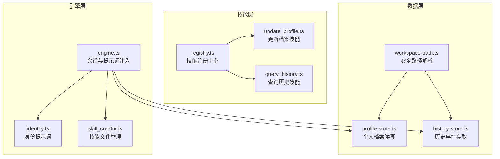
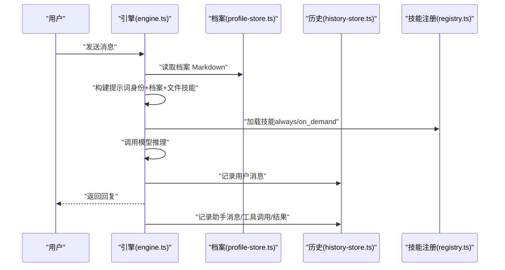
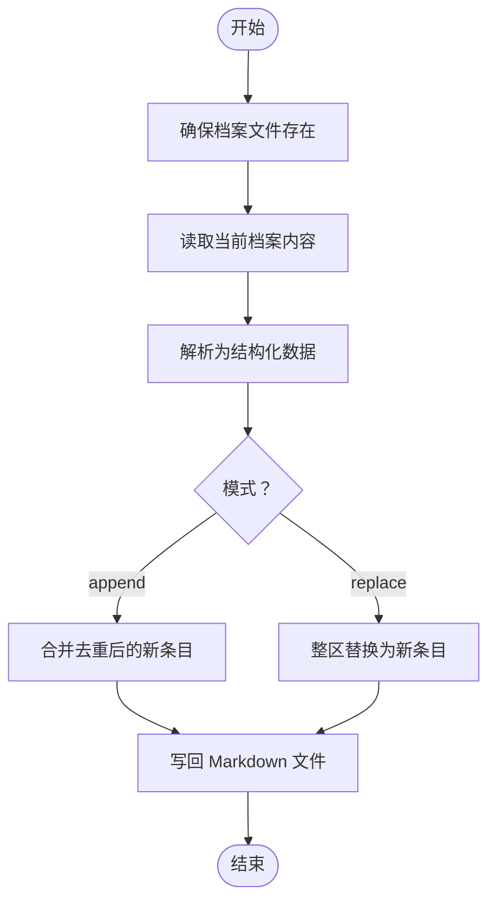
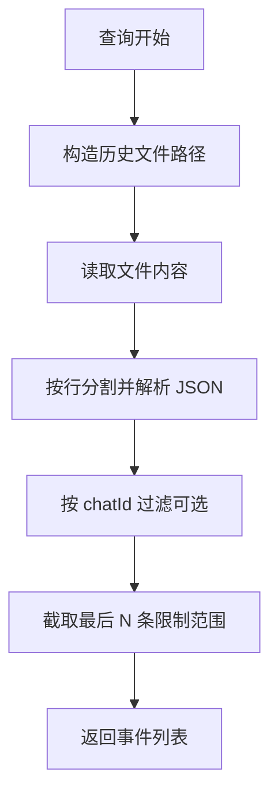
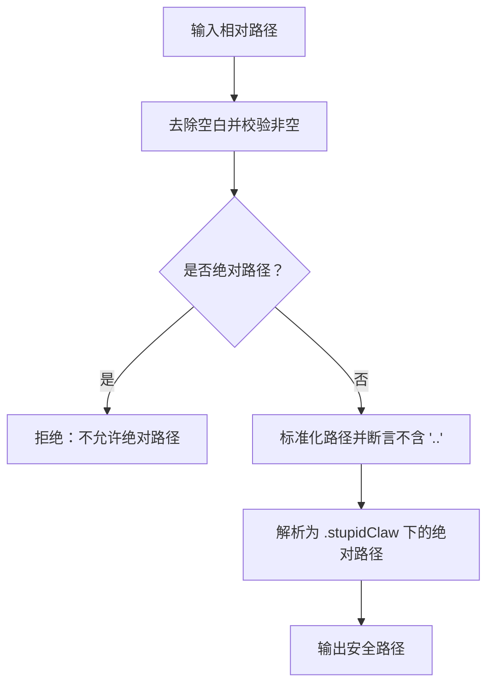
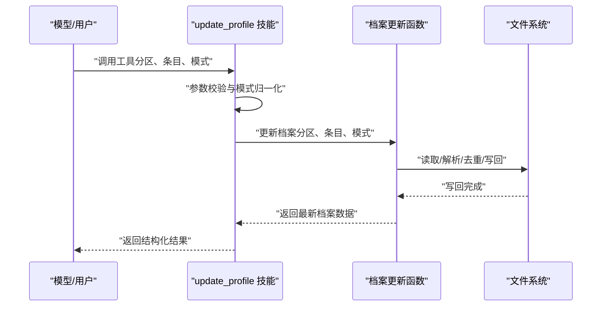
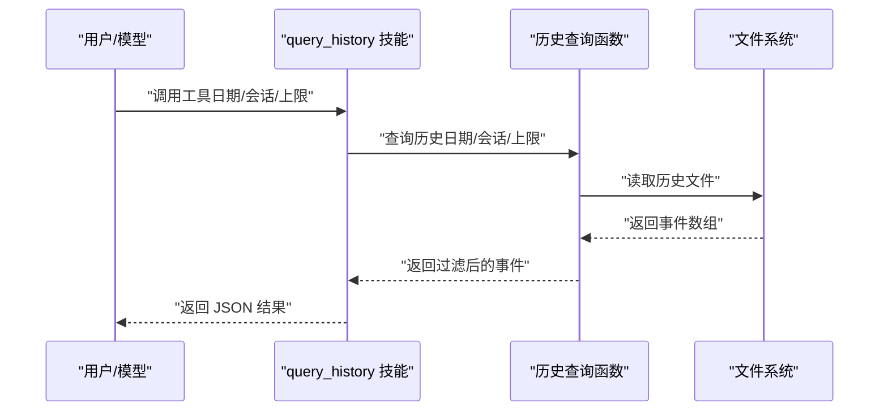
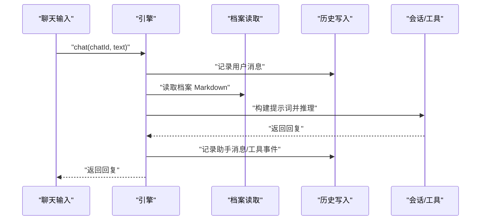
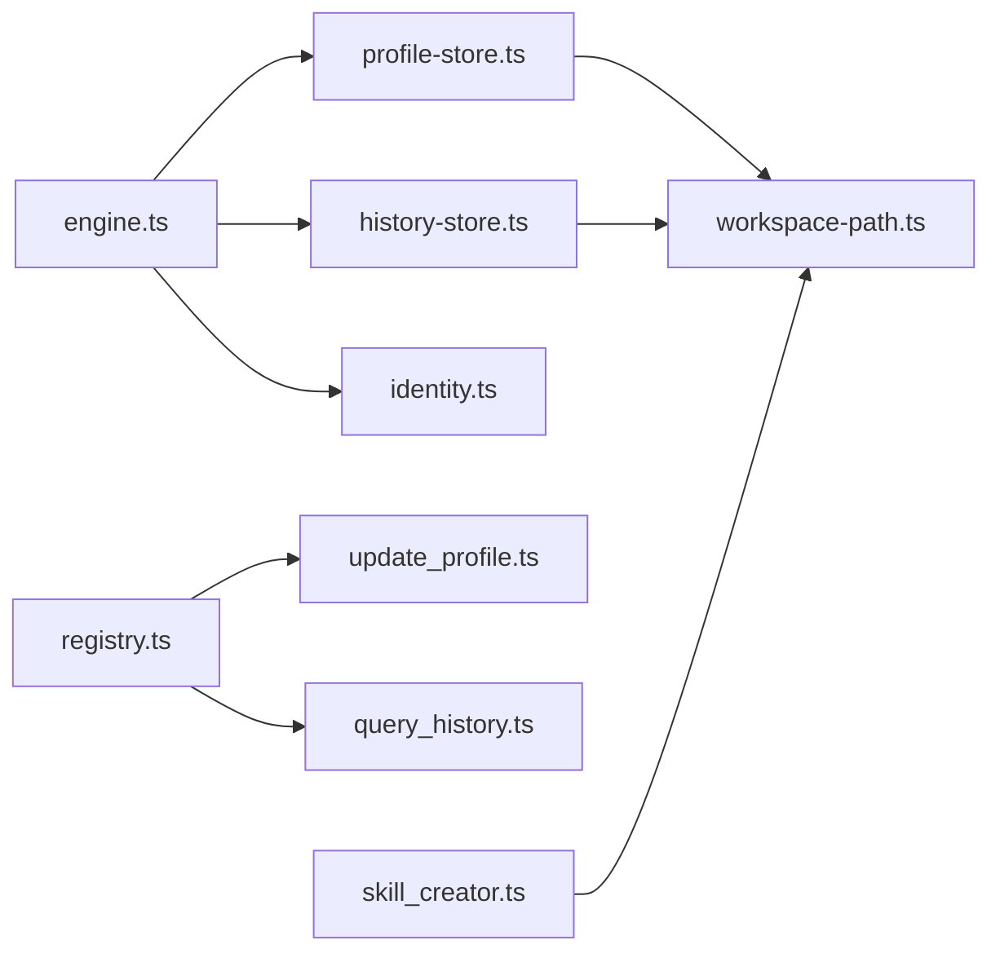

# 长期记忆管理

<cite>
**本文引用的文件**
- [src/memory/profile-store.ts](file://src/memory/profile-store.ts)
- [src/memory/history-store.ts](file://src/memory/history-store.ts)
- [src/memory/workspace-path.ts](file://src/memory/workspace-path.ts)
- [src/skills/memory/update_profile.ts](file://src/skills/memory/update_profile.ts)
- [src/skills/memory/query_history.ts](file://src/skills/memory/query_history.ts)
- [src/skills/registry.ts](file://src/skills/registry.ts)
- [src/engine.ts](file://src/engine.ts)
- [src/prompt/identity.ts](file://src/prompt/identity.ts)
- [src/skills/system/skill_creator.ts](file://src/skills/system/skill_creator.ts)
- [StupidClaw-第4期-用profile做长期记忆让Agent记住你.md](file://StupidClaw-第4期-用profile做长期记忆让Agent记住你.md)
- [StupidClaw-第5期-安全沙盒PathJailing防止越权读写.md](file://StupidClaw-第5期-安全沙盒PathJailing防止越权读写.md)
- [docs/troubleshooting.md](file://docs/troubleshooting.md)
- [package.json](file://package.json)
</cite>

## 目录
1. [简介](#简介)
2. [项目结构](#项目结构)
3. [核心组件](#核心组件)
4. [架构总览](#架构总览)
5. [组件详解](#组件详解)
6. [依赖关系分析](#依赖关系分析)
7. [性能考量](#性能考量)
8. [故障排查指南](#故障排查指南)
9. [结论](#结论)
10. [附录](#附录)

## 简介
本文件面向 StupidClaw 的长期记忆管理系统，聚焦“个人档案（Profile）”的数据结构、存储机制与访问控制，系统性阐述档案的创建、更新、读取与删除流程，解释其在对话个性化中的作用（偏好记忆、上下文连续性、技能选择优化），并提供最佳实践、迁移策略与隐私保护建议。文档同时给出与历史对话（History）的协同关系、调试技巧与常见问题排查方法。

## 项目结构
围绕长期记忆与历史对话的关键模块如下：
- 数据层
  - 个人档案：profile-store.ts
  - 历史对话：history-store.ts
  - 安全路径解析：workspace-path.ts
- 技能层
  - 更新档案：skills/memory/update_profile.ts
  - 查询历史：skills/memory/query_history.ts
  - 技能注册中心：skills/registry.ts
- 引擎层
  - 会话构建与提示词注入：engine.ts
  - 身份提示词：prompt/identity.ts
  - 技能文件管理：skills/system/skill_creator.ts
- 文档与脚手架
  - 项目设计文档（长期记忆与安全路径）：StupidClaw-第4期…、StupidClaw-第5期…
  - 故障排查：docs/troubleshooting.md
  - 包与脚本：package.json

图表来源
- [src/memory/profile-store.ts:1-132](file://src/memory/profile-store.ts#L1-L132)
- [src/memory/history-store.ts:1-83](file://src/memory/history-store.ts#L1-L83)
- [src/memory/workspace-path.ts:1-42](file://src/memory/workspace-path.ts#L1-L42)
- [src/skills/memory/update_profile.ts:1-84](file://src/skills/memory/update_profile.ts#L1-L84)
- [src/skills/memory/query_history.ts:1-57](file://src/skills/memory/query_history.ts#L1-L57)
- [src/skills/registry.ts:1-55](file://src/skills/registry.ts#L1-L55)
- [src/engine.ts:1-706](file://src/engine.ts#L1-L706)
- [src/prompt/identity.ts:1-9](file://src/prompt/identity.ts#L1-L9)
- [src/skills/system/skill_creator.ts:1-312](file://src/skills/system/skill_creator.ts#L1-L312)

章节来源
- [src/memory/profile-store.ts:1-132](file://src/memory/profile-store.ts#L1-L132)
- [src/memory/history-store.ts:1-83](file://src/memory/history-store.ts#L1-L83)
- [src/memory/workspace-path.ts:1-42](file://src/memory/workspace-path.ts#L1-L42)
- [src/skills/memory/update_profile.ts:1-84](file://src/skills/memory/update_profile.ts#L1-L84)
- [src/skills/memory/query_history.ts:1-57](file://src/skills/memory/query_history.ts#L1-L57)
- [src/skills/registry.ts:1-55](file://src/skills/registry.ts#L1-L55)
- [src/engine.ts:1-706](file://src/engine.ts#L1-L706)
- [src/prompt/identity.ts:1-9](file://src/prompt/identity.ts#L1-L9)
- [src/skills/system/skill_creator.ts:1-312](file://src/skills/system/skill_creator.ts#L1-L312)
- [StupidClaw-第4期-用profile做长期记忆让Agent记住你.md:1-134](file://StupidClaw-第4期-用profile做长期记忆让Agent记住你.md#L1-L134)
- [StupidClaw-第5期-安全沙盒PathJailing防止越权读写.md:1-111](file://StupidClaw-第5期-安全沙盒PathJailing防止越权读写.md#L1-L111)
- [docs/troubleshooting.md:1-194](file://docs/troubleshooting.md#L1-L194)
- [package.json:1-39](file://package.json#L1-L39)

## 核心组件
- 个人档案（Profile）
  - 数据结构：包含三个固定分区（stable_facts、preferences、constraints），每个分区由去重后的字符串条目组成。
  - 文件格式：Markdown，带固定标题分区与无序列表形式的事实条目。
  - 存储位置：位于工作空间根目录下的 profile.md（统一通过安全路径解析）。
  - 访问控制：仅允许指定分区写入，支持追加或替换模式，禁止整文件覆盖。
- 历史对话（History）
  - 数据结构：事件对象包含时间戳、会话标识、角色、事件类型、文本、工具名、参数、结果与错误标记。
  - 存储位置：按日期划分的 JSONL 文件，位于 history 目录。
  - 查询接口：支持按日期与会话标识过滤，限制返回条目数量。
- 安全路径解析（Workspace Path）
  - 统一将所有内部文件落盘路径收敛至 .stupidClaw 目录，拒绝绝对路径与路径穿越。
- 技能与注册
  - 更新档案技能：对外暴露受控的写入入口，参数严格校验。
  - 查询历史技能：提供按日期与会话过滤的历史查询。
  - 技能注册中心：集中注册内置与文件型技能，区分 always/on_demand 暴露策略。
- 引擎与提示词
  - 引擎在每次对话前构建提示词，注入身份提示、当前运行时上下文、档案内容与文件型技能描述，确保模型在稳定事实与可执行技能上具备上下文连续性。

章节来源
- [src/memory/profile-store.ts:4-16](file://src/memory/profile-store.ts#L4-L16)
- [src/memory/profile-store.ts:50-101](file://src/memory/profile-store.ts#L50-L101)
- [src/memory/history-store.ts:8-18](file://src/memory/history-store.ts#L8-L18)
- [src/memory/history-store.ts:44-82](file://src/memory/history-store.ts#L44-L82)
- [src/memory/workspace-path.ts:32-35](file://src/memory/workspace-path.ts#L32-L35)
- [src/skills/memory/update_profile.ts:10-84](file://src/skills/memory/update_profile.ts#L10-L84)
- [src/skills/memory/query_history.ts:5-57](file://src/skills/memory/query_history.ts#L5-L57)
- [src/skills/registry.ts:23-54](file://src/skills/registry.ts#L23-L54)
- [src/engine.ts:484-509](file://src/engine.ts#L484-L509)
- [src/prompt/identity.ts:1-9](file://src/prompt/identity.ts#L1-L9)

## 架构总览
长期记忆与历史对话在引擎层协同工作，形成“稳定事实 + 流水账”的双轨记忆体系。档案作为长期稳定事实，历史作为短期上下文，两者共同支撑对话个性化与技能选择优化。

图表来源
- [src/engine.ts:484-509](file://src/engine.ts#L484-L509)
- [src/memory/profile-store.ts:112-115](file://src/memory/profile-store.ts#L112-L115)
- [src/memory/history-store.ts:37-42](file://src/memory/history-store.ts#L37-L42)
- [src/skills/registry.ts:23-54](file://src/skills/registry.ts#L23-L54)

## 组件详解

### 个人档案（Profile）数据结构与存储机制
- 分区与不变量
  - 固定分区：stable_facts、preferences、constraints。
  - 条目规范：每条为独立的无序列表项，自动去重与空白过滤。
  - 写入模式：append（默认，追加并去重）、replace（整区替换）。
  - 安全约束：仅允许写入固定分区，拒绝任意整文件覆盖。
- 文件格式与解析
  - 采用 Markdown 标题分区与列表项，解析时忽略空行与非目标分区内容。
  - 回写时生成标准 Markdown，保证可读性与一致性。
- 存储位置与访问控制
  - 统一通过安全路径解析函数生成绝对路径，确保始终位于工作空间根目录下。
  - 任何越权路径（绝对路径、包含路径穿越）均被拒绝。
- 创建、更新、读取、删除
  - 创建：首次访问时自动创建空档案文件。
  - 更新：根据分区与模式进行合并或替换，随后回写文件。
  - 读取：直接读取档案 Markdown 文本，供引擎注入提示词。
  - 删除：通过外部清理工作空间根目录下的 profile.md 实现。

图表来源
- [src/memory/profile-store.ts:103-131](file://src/memory/profile-store.ts#L103-L131)

章节来源
- [src/memory/profile-store.ts:4-16](file://src/memory/profile-store.ts#L4-L16)
- [src/memory/profile-store.ts:50-101](file://src/memory/profile-store.ts#L50-L101)
- [src/memory/profile-store.ts:103-131](file://src/memory/profile-store.ts#L103-L131)
- [src/memory/workspace-path.ts:32-35](file://src/memory/workspace-path.ts#L32-L35)
- [StupidClaw-第4期-用profile做长期记忆让Agent记住你.md:13-46](file://StupidClaw-第4期-用profile做长期记忆让Agent记住你.md#L13-L46)

### 历史对话（History）数据结构与查询
- 数据结构
  - 事件字段：时间戳、会话标识、角色（用户/助手）、事件类型（消息/工具调用/工具结果）、文本、工具名、参数、结果、错误标记。
- 存储与命名
  - 按 UTC 日期划分文件，文件名为 YYYY-MM-DD.jsonl，逐条以 JSON 行存储。
- 查询接口
  - 支持按日期与会话标识过滤，限制返回条目数量（默认 20，最大 200）。
  - 不存在日期文件时返回空列表，其他错误向上抛出。
- 写入与会话追踪
  - 引擎在用户消息与助手消息前后分别追加历史事件，工具调用与结果亦同步记录，便于后续检索与审计。

图表来源
- [src/memory/history-store.ts:50-82](file://src/memory/history-store.ts#L50-L82)

章节来源
- [src/memory/history-store.ts:8-18](file://src/memory/history-store.ts#L8-L18)
- [src/memory/history-store.ts:29-31](file://src/memory/history-store.ts#L29-L31)
- [src/memory/history-store.ts:50-82](file://src/memory/history-store.ts#L50-L82)
- [src/engine.ts:680-705](file://src/engine.ts#L680-L705)

### 安全路径解析（Workspace Path）
- 统一入口
  - getStupidClawRootPath：工作空间根目录（.stupidClaw）。
  - resolveSafePath：将相对路径规范化并解析为绝对路径，拒绝空路径、绝对路径与路径穿越。
- 应用范围
  - 引擎工作区、档案、历史、文件型技能目录等全部接入统一解析，避免越权访问。
- 越权路径行为
  - 在解析阶段直接拒绝，调用方无法获得最终路径，从而避免读写操作。

图表来源
- [src/memory/workspace-path.ts:6-35](file://src/memory/workspace-path.ts#L6-L35)

章节来源
- [src/memory/workspace-path.ts:6-35](file://src/memory/workspace-path.ts#L6-L35)
- [StupidClaw-第5期-安全沙盒PathJailing防止越权读写.md:53-87](file://StupidClaw-第5期-安全沙盒PathJailing防止越权读写.md#L53-L87)

### 更新档案技能（update_profile）
- 功能与参数
  - 仅允许更新固定分区（stable_facts、preferences、constraints）。
  - 支持 facts 数组与写入模式（append/replace），默认 append。
- 执行流程
  - 参数校验与模式归一化。
  - 调用档案更新函数，回写文件并返回结构化结果。
- 与引擎集成
  - 作为 on-demand 技能注册，可在模型决策时按需调用。

图表来源
- [src/skills/memory/update_profile.ts:35-81](file://src/skills/memory/update_profile.ts#L35-L81)
- [src/memory/profile-store.ts:117-131](file://src/memory/profile-store.ts#L117-L131)

章节来源
- [src/skills/memory/update_profile.ts:10-84](file://src/skills/memory/update_profile.ts#L10-L84)
- [src/skills/registry.ts:23-54](file://src/skills/registry.ts#L23-L54)

### 查询历史技能（query_history）
- 功能与参数
  - 支持按日期（YYYY-MM-DD，默认当天）、会话标识、返回条目上限（默认 20，最大 200）。
- 执行流程
  - 校验参数并构造文件路径。
  - 读取 JSONL 文件，解析事件，按条件过滤并截取尾部若干条。
- 与引擎集成
  - 作为 on-demand 技能注册，可用于诊断与审计。

图表来源
- [src/skills/memory/query_history.ts:31-53](file://src/skills/memory/query_history.ts#L31-L53)
- [src/memory/history-store.ts:50-82](file://src/memory/history-store.ts#L50-L82)

章节来源
- [src/skills/memory/query_history.ts:5-57](file://src/skills/memory/query_history.ts#L5-L57)
- [src/skills/registry.ts:23-54](file://src/skills/registry.ts#L23-L54)

### 引擎与提示词注入（engine.ts）
- 会话构建
  - 加载模型、创建会话、注册工具（内置技能 + 文件型技能）。
- 提示词构建
  - 注入身份提示词、当前运行时上下文（会话标识、时间）、档案内容、文件型技能描述。
- 事件记录
  - 用户消息与助手消息前后分别追加历史事件；工具调用与结果亦同步记录。
- 错误处理
  - 对 API Key 缺失等错误进行归一化提示，便于定位配置问题。

图表来源
- [src/engine.ts:484-509](file://src/engine.ts#L484-L509)
- [src/engine.ts:680-705](file://src/engine.ts#L680-L705)

章节来源
- [src/engine.ts:421-459](file://src/engine.ts#L421-L459)
- [src/engine.ts:484-509](file://src/engine.ts#L484-L509)
- [src/engine.ts:680-705](file://src/engine.ts#L680-L705)
- [src/prompt/identity.ts:1-9](file://src/prompt/identity.ts#L1-L9)

### 技能文件管理（skill_creator）
- 功能
  - 在 .stupidClaw/skills 下创建、读取或更新 SKILL.md 文件，支持标准化模板与自定义内容。
- 安全与命名
  - 技能名规范化，目录与文件名严格约束，确保与父目录同名。
- 与工作空间路径
  - 使用统一安全路径解析，确保仅在 .stupidClaw/skills 下操作。

章节来源
- [src/skills/system/skill_creator.ts:65-312](file://src/skills/system/skill_creator.ts#L65-L312)
- [src/memory/workspace-path.ts:32-35](file://src/memory/workspace-path.ts#L32-L35)

## 依赖关系分析
- 组件耦合
  - 引擎依赖档案读取与历史写入，体现“稳定事实 + 短期上下文”的双轨记忆。
  - 技能注册中心集中管理技能暴露策略，降低引擎与技能实现的耦合。
  - 安全路径解析作为横切关注点，被多处模块复用，避免重复校验。
- 外部依赖
  - 引擎基于外部模型服务进行推理，错误处理包含 API Key 归一化提示。
  - 包脚本与调试开关（DEBUG_STUPIDCLAW、DEBUG_PROMPT）辅助定位问题。

图表来源
- [src/engine.ts:1-706](file://src/engine.ts#L1-L706)
- [src/memory/profile-store.ts:1-132](file://src/memory/profile-store.ts#L1-L132)
- [src/memory/history-store.ts:1-83](file://src/memory/history-store.ts#L1-L83)
- [src/memory/workspace-path.ts:1-42](file://src/memory/workspace-path.ts#L1-L42)
- [src/skills/registry.ts:1-55](file://src/skills/registry.ts#L1-L55)
- [src/skills/memory/update_profile.ts:1-84](file://src/skills/memory/update_profile.ts#L1-L84)
- [src/skills/memory/query_history.ts:1-57](file://src/skills/memory/query_history.ts#L1-L57)
- [src/skills/system/skill_creator.ts:1-312](file://src/skills/system/skill_creator.ts#L1-L312)

章节来源
- [src/engine.ts:1-706](file://src/engine.ts#L1-L706)
- [src/skills/registry.ts:1-55](file://src/skills/registry.ts#L1-L55)
- [src/memory/workspace-path.ts:1-42](file://src/memory/workspace-path.ts#L1-L42)

## 性能考量
- 档案读取
  - 每次对话前读取档案 Markdown，解析成本极低，适合频繁注入提示词。
- 历史写入
  - 采用追加写入，单行 JSONL，写入延迟低；按日期分片便于裁剪与归档。
- 查询限制
  - 查询接口限制最大返回条目，避免一次性加载过多数据导致内存压力。
- 建议
  - 对于大规模历史数据，可结合日期范围与会话标识进行分页查询。
  - 档案条目建议控制在合理规模，避免提示词过长影响模型响应速度。

[本节为通用性能讨论，不直接分析具体文件]

## 故障排查指南
- API Key 与模型配置
  - 若缺少 API Key，引擎会归一化提示错误，建议检查 .env 中对应 Provider 的密钥配置。
- 启动与重复实例
  - 若出现锁文件冲突，清理 .stupidClaw/polling.lock 后重启。
- Telegram 模式冲突
  - Polling 模式下同一 Bot 仅允许一个长轮询连接；若出现 HTTP 409，检查并关闭其他实例或清理 Webhook。
- 技能调用失败
  - 确认技能已注册并可被模型选用；文件类技能仅允许在 .stupidClaw 目录下操作，越权路径会被拒绝。
- Profile 记忆丢失
  - profile.md 保存在 .stupidClaw/profile.md，不在版本控制中；重启不会丢失，清空工作空间会丢失。

章节来源
- [docs/troubleshooting.md:5-194](file://docs/troubleshooting.md#L5-L194)
- [src/engine.ts:162-186](file://src/engine.ts#L162-L186)

## 结论
StupidClaw 的长期记忆系统以“个人档案 + 历史对话”为核心，通过固定分区与受控写入保障稳定性与可审计性，借助统一的安全路径解析与严格的暴露策略确保安全性。引擎在提示词中注入档案与文件型技能，使模型在对话个性化、上下文连续性与技能选择方面具备稳定依据。配合调试开关与故障排查指南，开发者可高效定位问题并优化体验。

[本节为总结性内容，不直接分析具体文件]

## 附录

### 使用案例
- 用户偏好记忆
  - 场景：用户声明“不吃香菜”“喜欢简洁回答”。
  - 操作：通过更新档案技能将偏好写入 preferences 分区，引擎在后续对话中优先引用。
- 上下文连续性保持
  - 场景：跨轮次对话中模型需要记住用户身份、时间与会话标识。
  - 操作：引擎自动注入运行时上下文与档案内容，确保连续性。
- 技能选择优化
  - 场景：用户表达“每天早上 8 点执行某任务”。
  - 操作：引擎优先调用定时任务技能，结合档案中的稳定事实与当前时间，自动创建或更新计划。

章节来源
- [src/engine.ts:484-509](file://src/engine.ts#L484-L509)
- [src/skills/memory/update_profile.ts:35-81](file://src/skills/memory/update_profile.ts#L35-L81)

### 最佳实践
- 档案管理
  - 仅使用固定分区写入，避免自由拼写导致碎片化。
  - 使用 append 模式累积条目，必要时用 replace 进行整区清理与重建。
  - 定期备份 .stupidClaw/profile.md，避免工作空间被意外清空。
- 历史管理
  - 按日期归档历史文件，定期清理过期数据。
  - 使用查询历史技能进行诊断与审计，避免一次性加载过多数据。
- 安全与合规
  - 严禁在技能中使用绝对路径或包含路径穿越的相对路径。
  - 仅在 .stupidClaw 目录下进行文件读写，确保越权访问被拒绝。
- 隐私保护
  - 档案与历史中避免存储敏感个人信息；如需处理，建议在外部加密存储并在使用前解密。
  - 通过环境变量与最小权限原则控制访问密钥与端口。

章节来源
- [src/memory/profile-store.ts:117-131](file://src/memory/profile-store.ts#L117-L131)
- [src/memory/history-store.ts:50-82](file://src/memory/history-store.ts#L50-L82)
- [src/memory/workspace-path.ts:6-35](file://src/memory/workspace-path.ts#L6-L35)
- [docs/troubleshooting.md:161-168](file://docs/troubleshooting.md#L161-L168)

### 数据迁移策略
- 从旧版工作区迁移
  - 将旧版 profile 与历史文件迁移到 .stupidClaw 目录下，确保路径解析正确。
  - 使用查询历史技能核对迁移后的数据完整性。
- 版本升级
  - 升级包脚本与调试开关，确认引擎与技能注册中心正常加载。
  - 对照设计文档（长期记忆与安全路径）验证功能回归。

章节来源
- [package.json:14-21](file://package.json#L14-L21)
- [StupidClaw-第4期-用profile做长期记忆让Agent记住你.md:1-134](file://StupidClaw-第4期-用profile做长期记忆让Agent记住你.md#L1-L134)
- [StupidClaw-第5期-安全沙盒PathJailing防止越权读写.md:1-111](file://StupidClaw-第5期-安全沙盒PathJailing防止越权读写.md#L1-L111)