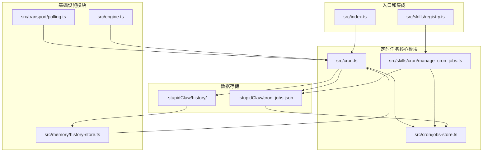
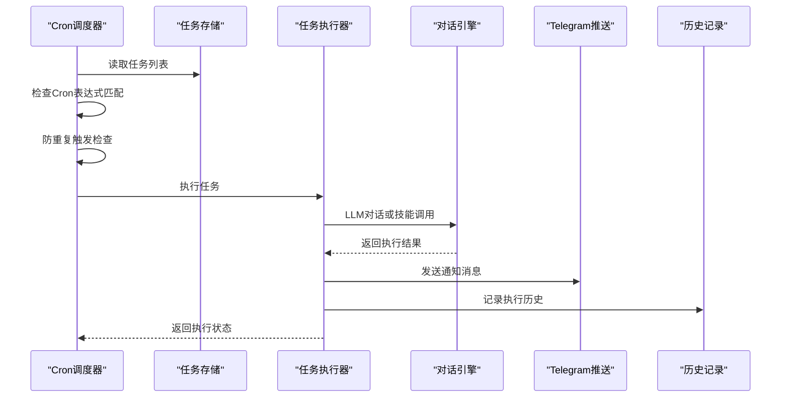
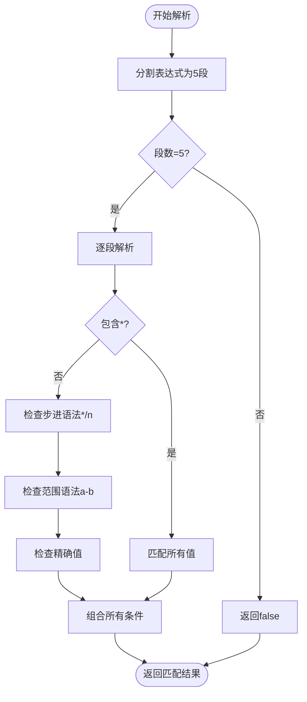
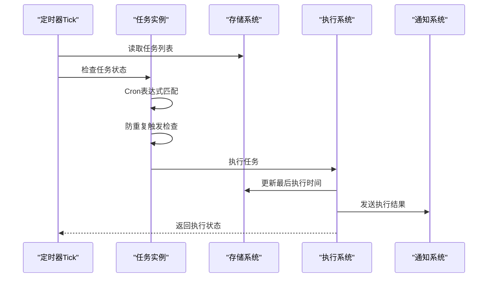
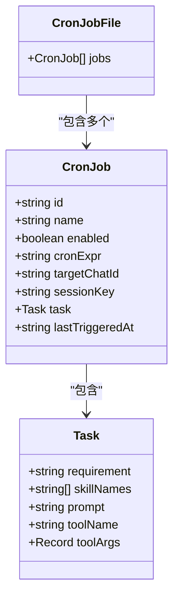
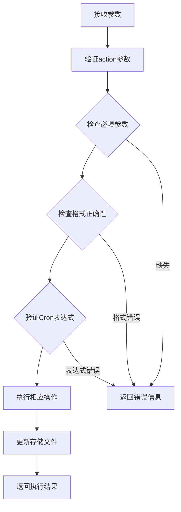
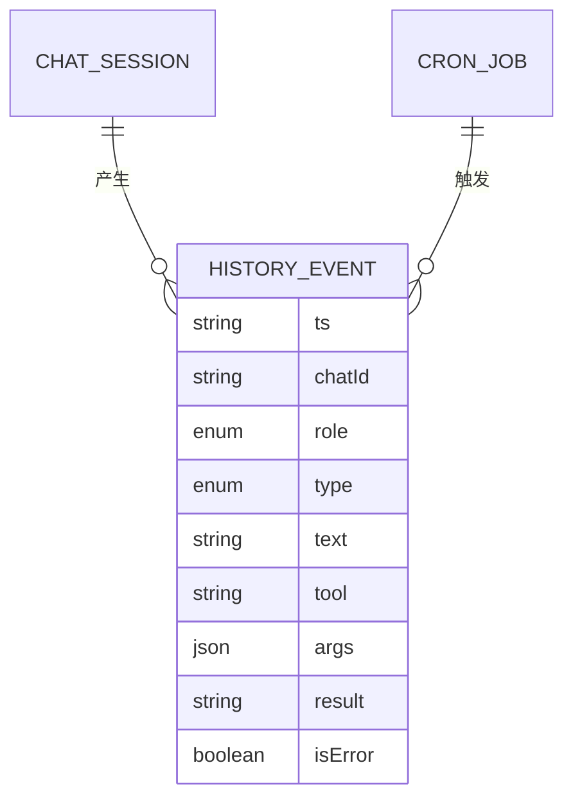
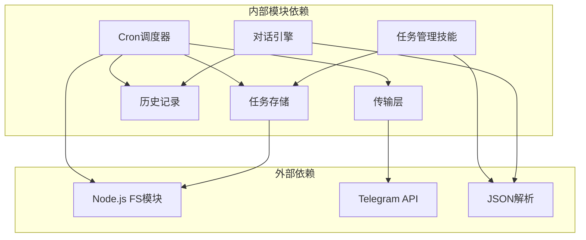
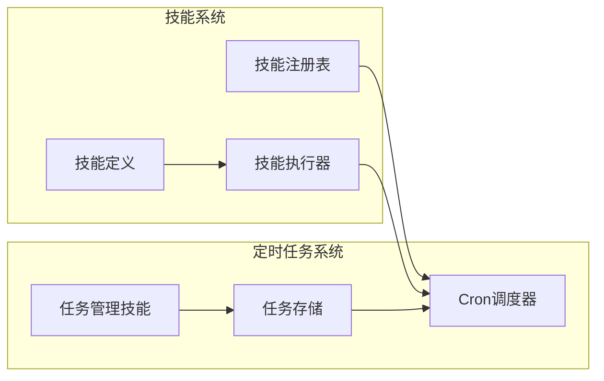

# 定时任务系统

<cite>
**本文档引用的文件**
- [src/cron.ts](file://src/cron.ts)
- [src/cron/jobs-store.ts](file://src/cron/jobs-store.ts)
- [src/skills/cron/manage_cron_jobs.ts](file://src/skills/cron/manage_cron_jobs.ts)
- [src/cron/cron.test.ts](file://src/cron/cron.test.ts)
- [src/memory/history-store.ts](file://src/memory/history-store.ts)
- [src/transport/polling.ts](file://src/transport/polling.ts)
- [src/engine.ts](file://src/engine.ts)
- [src/index.ts](file://src/index.ts)
- [src/skills/registry.ts](file://src/skills/registry.ts)
- [README.md](file://README.md)
</cite>

## 目录
1. [简介](#简介)
2. [项目结构](#项目结构)
3. [核心组件](#核心组件)
4. [架构概览](#架构概览)
5. [详细组件分析](#详细组件分析)
6. [依赖关系分析](#依赖关系分析)
7. [性能考虑](#性能考虑)
8. [故障排除指南](#故障排除指南)
9. [结论](#结论)
10. [附录](#附录)

## 简介

StupidClaw 的定时任务系统是一个基于 Cron 表达式的自动化任务调度框架，允许 AI Agent 在预设的时间点自动执行各种任务。该系统通过文件存储实现任务持久化，支持多种任务执行模式，包括直接技能调用和 LLM 驱动的任务执行。

系统的核心特性包括：
- 基于五段 Cron 表达式的精确调度
- 文件系统持久化存储
- 支持直接技能调用和动态内容生成
- 完整的执行历史记录和监控
- Telegram 消息推送通知

## 项目结构

定时任务系统主要分布在以下模块中：

**图表来源**
- [src/cron.ts:1-265](file://src/cron.ts#L1-L265)
- [src/cron/jobs-store.ts:1-151](file://src/cron/jobs-store.ts#L1-L151)
- [src/skills/cron/manage_cron_jobs.ts:1-336](file://src/skills/cron/manage_cron_jobs.ts#L1-L336)

**章节来源**
- [src/cron.ts:1-265](file://src/cron.ts#L1-L265)
- [src/cron/jobs-store.ts:1-151](file://src/cron/jobs-store.ts#L1-L151)
- [src/skills/cron/manage_cron_jobs.ts:1-336](file://src/skills/cron/manage_cron_jobs.ts#L1-L336)

## 核心组件

### Cron 调度器
Cron 调度器是系统的核心执行引擎，负责：
- 每 15 秒检查一次任务触发条件
- 解析和匹配 Cron 表达式
- 防止同一分钟内的重复触发
- 执行任务并记录执行历史

### 任务存储管理器
任务存储管理器负责任务数据的持久化：
- 使用 JSON 文件存储所有任务配置
- 提供任务的增删改查操作
- 实现数据验证和规范化
- 支持任务状态的启用/禁用

### 任务管理技能
任务管理技能提供了通过聊天界面管理定时任务的能力：
- 支持列出、添加、更新、删除任务
- 支持启用/禁用任务
- 提供完整的参数验证
- 支持多种任务执行模式

**章节来源**
- [src/cron.ts:5-265](file://src/cron.ts#L5-L265)
- [src/cron/jobs-store.ts:4-151](file://src/cron/jobs-store.ts#L4-L151)
- [src/skills/cron/manage_cron_jobs.ts:28-336](file://src/skills/cron/manage_cron_jobs.ts#L28-L336)

## 架构概览

**图表来源**
- [src/cron.ts:171-249](file://src/cron.ts#L171-L249)
- [src/engine.ts:680-705](file://src/engine.ts#L680-L705)
- [src/transport/polling.ts:215-242](file://src/transport/polling.ts#L215-L242)

系统采用分层架构设计，确保各组件职责清晰分离：

1. **调度层**：负责任务触发时机判断
2. **存储层**：负责任务数据的持久化
3. **执行层**：负责具体任务的执行
4. **通知层**：负责执行结果的通知
5. **记录层**：负责执行历史的追踪

## 详细组件分析

### Cron 调度器实现

#### Cron 表达式解析器
调度器实现了完整的 Cron 表达式解析功能：

**图表来源**
- [src/cron.ts:85-109](file://src/cron.ts#L85-L109)
- [src/cron.ts:27-83](file://src/cron.ts#L27-L83)

#### 任务执行流程
任务执行采用异步非阻塞模式：

**图表来源**
- [src/cron.ts:171-249](file://src/cron.ts#L171-L249)

**章节来源**
- [src/cron.ts:16-109](file://src/cron.ts#L16-L109)

### 任务存储系统

#### 数据模型设计
任务存储采用简洁的数据模型：

**图表来源**
- [src/cron/jobs-store.ts:4-25](file://src/cron/jobs-store.ts#L4-L25)

#### 存储策略
系统采用文件系统存储策略：
- 使用 JSON 文件作为唯一数据源
- 自动创建缺失的文件和目录
- 提供完整的数据验证和清理
- 支持向后兼容的旧格式迁移

**章节来源**
- [src/cron/jobs-store.ts:27-151](file://src/cron/jobs-store.ts#L27-L151)

### 任务管理技能

#### 参数验证机制
任务管理技能提供了严格的参数验证：

**图表来源**
- [src/skills/cron/manage_cron_jobs.ts:98-332](file://src/skills/cron/manage_cron_jobs.ts#L98-L332)

#### 支持的操作类型
系统支持以下操作：
- `list`：列出所有任务
- `add`：添加新任务
- `update`：更新现有任务
- `remove`：删除任务
- `set_enabled`：启用/禁用任务

**章节来源**
- [src/skills/cron/manage_cron_jobs.ts:10-336](file://src/skills/cron/manage_cron_jobs.ts#L10-L336)

### 执行历史记录

#### 历史事件类型
系统记录三种类型的执行事件：
- `tool_call`：工具调用开始
- `tool_result`：工具调用结果
- `message`：普通消息

**图表来源**
- [src/memory/history-store.ts:8-18](file://src/memory/history-store.ts#L8-L18)

**章节来源**
- [src/memory/history-store.ts:1-83](file://src/memory/history-store.ts#L1-L83)

## 依赖关系分析

**图表来源**
- [src/cron.ts:1-3](file://src/cron.ts#L1-L3)
- [src/skills/cron/manage_cron_jobs.ts:1-8](file://src/skills/cron/manage_cron_jobs.ts#L1-L8)

### 组件耦合度分析
- **低耦合**：各模块职责明确，接口清晰
- **高内聚**：每个模块专注于特定功能领域
- **可测试性**：模块间依赖通过接口抽象，便于单元测试

**章节来源**
- [src/index.ts:6-187](file://src/index.ts#L6-L187)
- [src/skills/registry.ts:23-54](file://src/skills/registry.ts#L23-L54)

## 性能考虑

### 调度精度控制
系统采用 15 秒的调度间隔，在精度和性能之间取得平衡：
- **精度**：支持分钟级任务调度
- **性能**：避免过于频繁的文件 I/O 操作
- **防重复**：通过 `lastTriggeredAt` 字段防止同分钟重复触发

### 内存使用优化
- 任务数据采用惰性加载策略
- 仅在需要时读取和解析存储文件
- 使用对象池减少垃圾回收压力

### 并发处理
- 异步非阻塞的执行模型
- 错误隔离和恢复机制
- 超时控制和资源清理

## 故障排除指南

### 常见问题诊断

#### Cron 表达式错误
**症状**：任务从未触发
**原因**：Cron 表达式格式不正确
**解决方案**：使用测试用例验证表达式

#### 文件权限问题
**症状**：任务无法保存或读取
**原因**：存储目录权限不足
**解决方案**：检查 `.stupidClaw` 目录权限

#### Telegram 通知失败
**症状**：任务执行但无通知
**原因**：Telegram Bot Token 配置错误
**解决方案**：验证环境变量配置

**章节来源**
- [src/cron/cron.test.ts:1-26](file://src/cron/cron.test.ts#L1-L26)

### 调试技巧
1. **启用调试模式**：设置 `DEBUG_STUPIDCLAW=1`
2. **查看历史记录**：检查 `.stupidClaw/history/` 目录
3. **验证存储文件**：直接编辑 `cron_jobs.json` 进行测试

## 结论

StupidClaw 的定时任务系统通过简洁而强大的设计，实现了可靠的自动化任务调度功能。系统的主要优势包括：

1. **简单可靠**：基于文件存储，易于理解和维护
2. **功能完整**：支持多种任务执行模式和管理操作
3. **可观测性**：完整的执行历史记录和监控能力
4. **易扩展**：模块化设计便于功能扩展

该系统特别适合需要自动化执行的场景，如定期报告生成、数据同步、系统维护等任务。

## 附录

### Cron 表达式语法支持

系统支持标准的五段 Cron 表达式：
- 分钟：0-59
- 小时：0-23  
- 日期：1-31
- 月份：1-12
- 星期：0-6 (0=周日)

支持的特殊语法：
- `*`：匹配任意值
- `n,m`：匹配多个值
- `n-m`：匹配范围
- `*/n`：步进模式

### 集成示例

定时任务与技能系统的集成通过以下方式实现：

**图表来源**
- [src/skills/registry.ts:23-54](file://src/skills/registry.ts#L23-L54)
- [src/index.ts:125-187](file://src/index.ts#L125-L187)