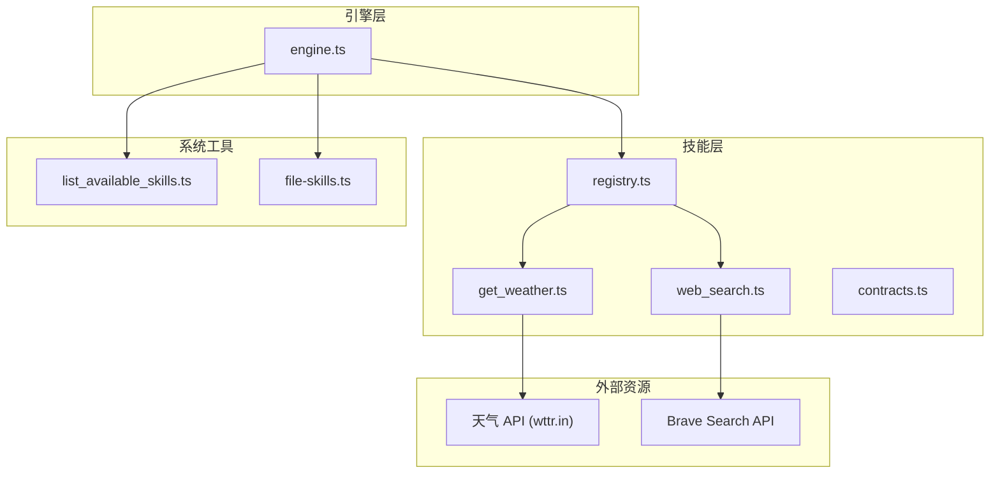
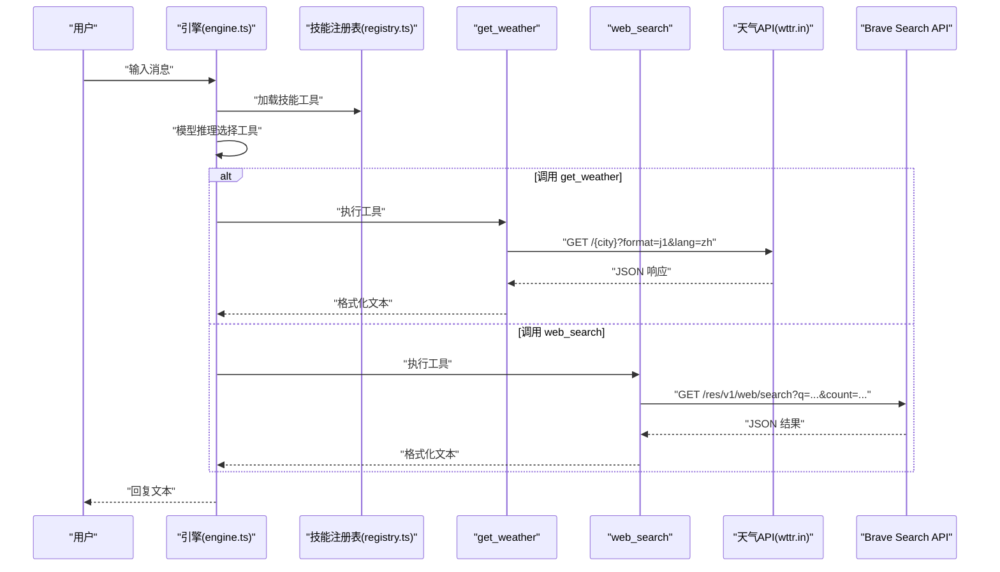
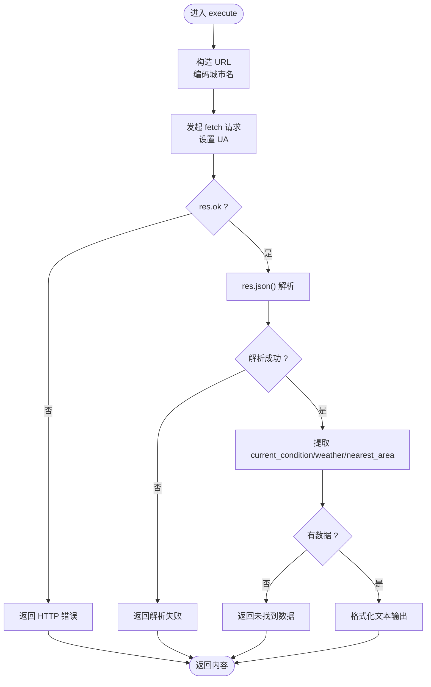
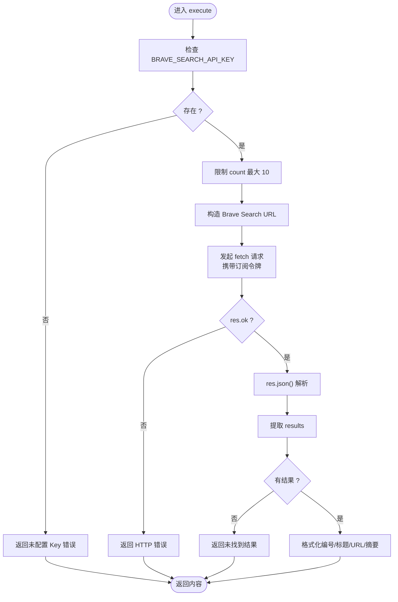
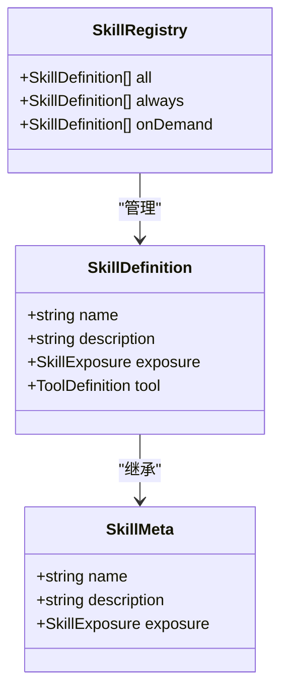
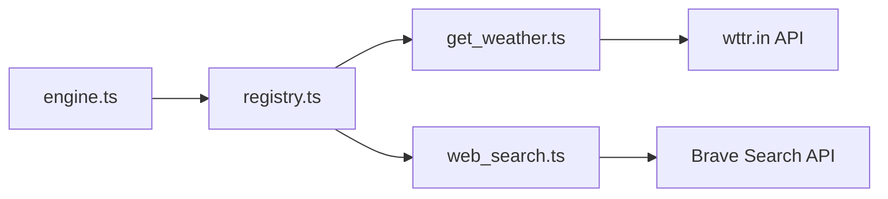

# Web 技能

<cite>
**本文引用的文件列表**
- [get_weather.ts](file://src/skills/web/get_weather.ts)
- [web_search.ts](file://src/skills/web/web_search.ts)
- [contracts.ts](file://src/skills/contracts.ts)
- [registry.ts](file://src/skills/registry.ts)
- [engine.ts](file://src/engine.ts)
- [file-skills.ts](file://src/skills/file-skills.ts)
- [list_available_skills.ts](file://src/skills/system/list_available_skills.ts)
- [SKILL.md](file://builtin-skills/web_reach/SKILL.md)
- [README.md](file://README.md)
- [StupidClaw-详细设计文档-v3.md](file://StupidClaw-详细设计文档-v3.md)
- [package.json](file://package.json)
</cite>

## 目录
1. [简介](#简介)
2. [项目结构](#项目结构)
3. [核心组件](#核心组件)
4. [架构总览](#架构总览)
5. [详细组件分析](#详细组件分析)
6. [依赖关系分析](#依赖关系分析)
7. [性能与网络优化](#性能与网络优化)
8. [安全与防护](#安全与防护)
9. [扩展与集成指南](#扩展与集成指南)
10. [使用场景与最佳实践](#使用场景与最佳实践)
11. [故障排查](#故障排查)
12. [结论](#结论)

## 简介
本文件面向 StupidClaw 的 Web 技能系统，聚焦两大核心能力：
- 天气查询技能（get_weather）：对接公开天气 API，获取指定城市的实时天气与当日预报。
- 网络搜索技能（web_search）：对接 Brave Search API，返回高质量网页搜索结果（标题、链接、摘要）。

文档将从架构、数据流、错误处理、配置参数、请求/响应格式、性能优化、安全防护、扩展与集成等方面进行系统化说明，并给出典型使用场景与排障建议。

## 项目结构
Web 技能位于 skills 子模块中，采用“技能即工具”的设计，通过统一的技能注册表对外暴露，供引擎在对话中按需调用。

图表来源
- [get_weather.ts:30-109](file://src/skills/web/get_weather.ts#L30-L109)
- [web_search.ts:16-94](file://src/skills/web/web_search.ts#L16-L94)
- [registry.ts:23-54](file://src/skills/registry.ts#L23-L54)
- [engine.ts:422-458](file://src/engine.ts#L422-L458)

章节来源
- [README.md:38-70](file://README.md#L38-L70)
- [StupidClaw-详细设计文档-v3.md:201-216](file://StupidClaw-详细设计文档-v3.md#L201-L216)

## 核心组件
- 技能契约与类型
  - 技能元数据与工具定义：名称、描述、暴露策略、工具参数与执行器。
  - 统一的技能定义接口用于注册与分发。
- 技能注册表
  - 负责收集内置与项目自定义技能，按“always/on_demand”两类暴露。
- 引擎
  - 创建会话、加载技能工具、订阅工具调用事件、执行工具并回填结果。
- 天气查询技能
  - 参数：城市名（支持中英文）。
  - 请求：调用 wttr.in 的 JSON 接口，解析响应并格式化输出。
- 网络搜索技能
  - 参数：关键词 q，结果数量 count（默认 5，上限 10）。
  - 请求：Brave Search API，附带订阅令牌认证。
  - 返回：标题、URL、摘要列表。

章节来源
- [contracts.ts:4-19](file://src/skills/contracts.ts#L4-L19)
- [registry.ts:23-54](file://src/skills/registry.ts#L23-L54)
- [engine.ts:422-458](file://src/engine.ts#L422-L458)
- [get_weather.ts:30-109](file://src/skills/web/get_weather.ts#L30-L109)
- [web_search.ts:16-94](file://src/skills/web/web_search.ts#L16-L94)

## 架构总览
Web 技能在 StupidClaw 中的调用链路如下：

图表来源
- [engine.ts:511-589](file://src/engine.ts#L511-L589)
- [registry.ts:30-39](file://src/skills/registry.ts#L30-L39)
- [get_weather.ts:43-106](file://src/skills/web/get_weather.ts#L43-L106)
- [web_search.ts:32-91](file://src/skills/web/web_search.ts#L32-L91)

## 详细组件分析

### 天气查询技能（get_weather）
- 技能元数据
  - 名称：get_weather
  - 描述：查询指定城市的实时天气与今日预报，支持中国城市（如北京、上海）及全球城市
  - 暴露策略：按需（on_demand）
- 工具参数
  - city：字符串，城市名（支持中文或英文）
- 执行流程
  - 构造请求 URL（编码城市名），设置 User-Agent。
  - 发起 HTTP 请求，处理网络异常与非 2xx 状态码。
  - 解析 JSON，提取当前天气、当日预报与最近区域信息。
  - 格式化输出文本，包含地点、天气描述、温度、体感、最高最低温、湿度、风速与风向。
- 错误处理
  - 网络请求失败：返回结构化错误内容。
  - HTTP 非 OK：返回结构化错误内容。
  - JSON 解析失败：返回结构化错误内容。
  - 数据缺失：返回未找到数据的结构化提示。

图表来源
- [get_weather.ts:43-106](file://src/skills/web/get_weather.ts#L43-L106)

章节来源
- [get_weather.ts:30-109](file://src/skills/web/get_weather.ts#L30-L109)

### 网络搜索技能（web_search）
- 技能元数据
  - 名称：web_search
  - 描述：用 Brave Search 搜索互联网，返回相关网页标题、链接与摘要
  - 暴露策略：按需（on_demand）
- 工具参数
  - q：字符串，搜索关键词
  - count：可选数字，返回结果数，默认 5，最多 10
- 执行流程
  - 读取 BRAVE_SEARCH_API_KEY 环境变量，若缺失则返回错误。
  - 限制 count 上限为 10，构造 Brave Search API 查询 URL。
  - 发起请求，附带 Accept 与 X-Subscription-Token 头。
  - 解析 JSON，提取 web.results，格式化为编号、标题、URL、摘要。
- 错误处理
  - 未配置 API Key：返回结构化错误内容。
  - HTTP 非 OK：返回结构化错误内容。
  - 无结果：返回未找到结果的结构化提示。

图表来源
- [web_search.ts:32-91](file://src/skills/web/web_search.ts#L32-L91)

章节来源
- [web_search.ts:16-94](file://src/skills/web/web_search.ts#L16-L94)

### 技能注册与暴露策略
- 注册表
  - 聚合系统内置技能与文件系统技能，按 exposure 分类。
  - always 技能在首轮即暴露；on_demand 技能需模型明确意图后才暴露。
- 列出可用技能
  - 提供 list_available_skills 工具，返回技能清单与使用指引。

图表来源
- [contracts.ts:4-19](file://src/skills/contracts.ts#L4-L19)
- [registry.ts:13-54](file://src/skills/registry.ts#L13-L54)

章节来源
- [registry.ts:23-54](file://src/skills/registry.ts#L23-L54)
- [list_available_skills.ts:4-39](file://src/skills/system/list_available_skills.ts#L4-L39)

## 依赖关系分析
- 天气查询技能依赖：
  - 类型系统（Type.Object）用于参数校验。
  - fetch 用于 HTTP 请求。
  - JSON 响应解析与字段提取。
- 网络搜索技能依赖：
  - 类型系统（Type.Object）用于参数校验。
  - fetch 用于 HTTP 请求。
  - 环境变量 BRAVE_SEARCH_API_KEY。
  - JSON 响应解析与字段提取。
- 引擎依赖：
  - 技能注册表提供工具集合。
  - 订阅工具调用事件，回填结果并输出最终回复。

图表来源
- [engine.ts:422-458](file://src/engine.ts#L422-L458)
- [registry.ts:30-39](file://src/skills/registry.ts#L30-L39)
- [get_weather.ts:43-106](file://src/skills/web/get_weather.ts#L43-L106)
- [web_search.ts:32-91](file://src/skills/web/web_search.ts#L32-L91)

章节来源
- [engine.ts:422-458](file://src/engine.ts#L422-L458)
- [registry.ts:30-39](file://src/skills/registry.ts#L30-L39)

## 性能与网络优化
- 请求头与 UA
  - 天气查询技能设置了 User-Agent，有助于避免被部分站点误判为爬虫。
- 结果数量控制
  - 搜索技能对 count 进行上限控制，避免过度请求与响应体积过大。
- 错误早返回
  - 在网络异常、HTTP 非 OK、JSON 解析失败、数据缺失等情况下尽早返回结构化错误，减少无效重试。
- 输出格式化
  - 将多源数据整合为统一文本格式，便于模型进一步处理或直接展示。

章节来源
- [get_weather.ts:49-51](file://src/skills/web/get_weather.ts#L49-L51)
- [web_search.ts:48-49](file://src/skills/web/web_search.ts#L48-L49)
- [web_search.ts:58-68](file://src/skills/web/web_search.ts#L58-L68)

## 安全与防护
- 环境变量与密钥
  - Brave Search 技能依赖 BRAVE_SEARCH_API_KEY，未配置时直接返回错误，避免泄露与误用。
- 路径安全与工作区隔离
  - 项目整体采用 Path Jailing，AI 文件操作限定在 .stupidClaw 目录，防止越权读写。
- 代理与中间件
  - 项目文档中提供了 web_reach 技能的 Bash 工具使用指南，可用于绕过某些反爬或受限场景（例如通过 r.jina.ai 读取页面）。

章节来源
- [web_search.ts:34-46](file://src/skills/web/web_search.ts#L34-L46)
- [StupidClaw-详细设计文档-v3.md:149-169](file://StupidClaw-详细设计文档-v3.md#L149-L169)
- [SKILL.md:117-122](file://builtin-skills/web_reach/SKILL.md#L117-L122)

## 扩展与集成指南
- 新增 Web 技能步骤
  - 定义技能元数据与工具参数（Type.Object）。
  - 实现 execute 函数，封装 HTTP 请求、参数校验、响应解析与错误处理。
  - 在注册表中加入新技能，选择 exposure 策略（always/on_demand）。
- 集成第三方 API
  - 明确鉴权方式（如订阅令牌、API Key、OAuth）。
  - 控制请求频率与并发，必要时增加重试与退避策略。
  - 对响应进行结构化解析与字段映射，统一输出格式。
- 与文件系统技能协同
  - 使用 file-skills 加载项目自定义技能，实现“文件即技能”的扩展模式。

章节来源
- [registry.ts:30-39](file://src/skills/registry.ts#L30-L39)
- [file-skills.ts:26-48](file://src/skills/file-skills.ts#L26-L48)
- [package.json:30-37](file://package.json#L30-L37)

## 使用场景与最佳实践
- 实时信息查询
  - 天气查询技能适合日常出行规划、健康提醒等场景。
  - 搜索技能适合获取最新资讯、技术资料、政策解读等。
- 数据聚合与信息服务
  - 将多个技能组合使用：先搜索获取概览，再根据需要调用天气技能补充细节。
  - 在 Cron 任务中定时触发搜索技能，结合模型整理后主动推送摘要。
- 输出格式化
  - 保持统一的文本格式，便于用户阅读与二次加工。

章节来源
- [StupidClaw-详细设计文档-v3.md:121-140](file://StupidClaw-详细设计文档-v3.md#L121-L140)

## 故障排查
- 天气查询失败
  - 检查城市名拼写与编码；确认网络可达；查看 HTTP 状态码。
  - 若解析失败，确认返回 JSON 结构与字段是否存在。
- 搜索失败
  - 确认 BRAVE_SEARCH_API_KEY 已正确配置；检查订阅令牌有效性。
  - 若无结果，尝试调整关键词或减少 count。
- 引擎与工具调用
  - 查看工具调用事件与历史记录，定位具体失败环节。
  - 检查模型配置与 API Key 是否匹配。

章节来源
- [get_weather.ts:52-76](file://src/skills/web/get_weather.ts#L52-L76)
- [web_search.ts:36-46](file://src/skills/web/web_search.ts#L36-L46)
- [engine.ts:550-575](file://src/engine.ts#L550-L575)

## 结论
StupidClaw 的 Web 技能体系以“技能即工具”的方式实现了天气查询与网络搜索两大核心能力。通过统一的技能契约、注册表与引擎协作，实现了按需暴露、结构化错误处理与稳定的输出格式。配合 Path Jailing 与环境变量密钥管理，系统在安全性与可维护性方面具备良好基础。未来可通过新增技能与第三方 API 集成，进一步拓展信息服务能力。