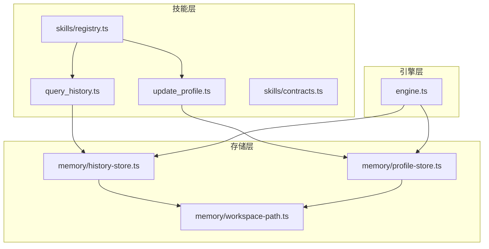
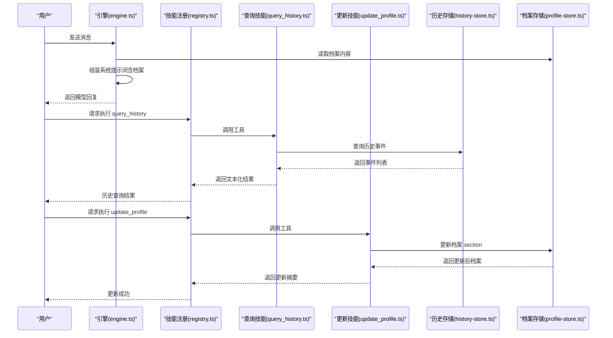
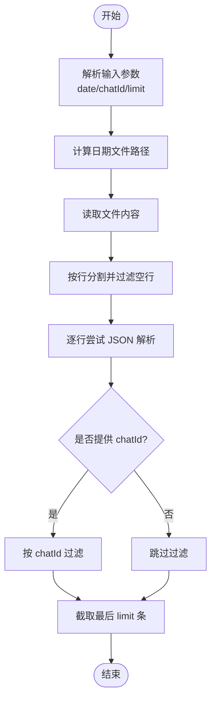
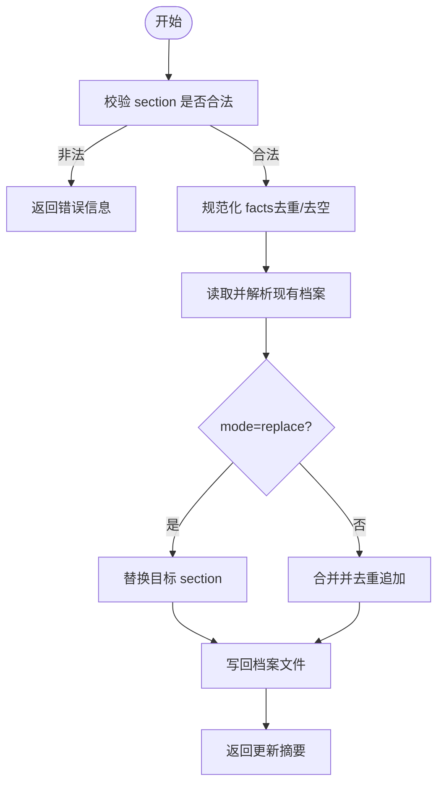
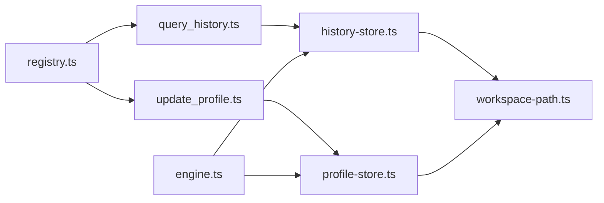

# 内存技能

<cite>
**本文引用的文件**
- [src/skills/memory/query_history.ts](file://src/skills/memory/query_history.ts)
- [src/skills/memory/update_profile.ts](file://src/skills/memory/update_profile.ts)
- [src/memory/history-store.ts](file://src/memory/history-store.ts)
- [src/memory/profile-store.ts](file://src/memory/profile-store.ts)
- [src/memory/workspace-path.ts](file://src/memory/workspace-path.ts)
- [src/skills/registry.ts](file://src/skills/registry.ts)
- [src/skills/contracts.ts](file://src/skills/contracts.ts)
- [src/engine.ts](file://src/engine.ts)
- [src/memory/workspace-path.test.ts](file://src/memory/workspace-path.test.ts)
- [StupidClaw-第4期-用profile做长期记忆让Agent记住你.md](file://StupidClaw-第4期-用profile做长期记忆让Agent记住你.md)
</cite>

## 目录
1. [简介](#简介)
2. [项目结构](#项目结构)
3. [核心组件](#核心组件)
4. [架构总览](#架构总览)
5. [组件详解](#组件详解)
6. [依赖关系分析](#依赖关系分析)
7. [性能考量](#性能考量)
8. [故障排查指南](#故障排查指南)
9. [结论](#结论)
10. [附录](#附录)

## 简介
本文件面向 StupidClaw 的“内存技能”，系统性阐述两大核心能力：
- 历史查询技能（query_history）：基于时间维度与会话标识的对话历史检索机制
- 档案更新技能（update_profile）：面向 profile.md 的长期记忆管理与更新

文档将解释内存技能如何与历史存储与档案存储系统集成，涵盖数据读取、写入与更新流程；详述查询语法、数据格式与缓存策略；给出个性化对话中的应用示例，并说明如何通过内存技能实现 Agent 的学习与适应能力；最后总结数据安全与隐私保护措施。

## 项目结构
内存技能位于 skills/memory 目录，底层存储位于 memory 目录，引擎在 engine.ts 中负责将档案注入到系统提示词中，供模型在每轮对话中参考。

图表来源
- [src/skills/memory/query_history.ts:1-57](file://src/skills/memory/query_history.ts#L1-L57)
- [src/skills/memory/update_profile.ts:1-84](file://src/skills/memory/update_profile.ts#L1-L84)
- [src/memory/history-store.ts:1-83](file://src/memory/history-store.ts#L1-L83)
- [src/memory/profile-store.ts:1-132](file://src/memory/profile-store.ts#L1-L132)
- [src/memory/workspace-path.ts:1-42](file://src/memory/workspace-path.ts#L1-L42)
- [src/skills/registry.ts:1-55](file://src/skills/registry.ts#L1-L55)
- [src/skills/contracts.ts:1-20](file://src/skills/contracts.ts#L1-L20)
- [src/engine.ts:1-706](file://src/engine.ts#L1-L706)

章节来源
- [src/skills/registry.ts:1-55](file://src/skills/registry.ts#L1-L55)
- [src/skills/contracts.ts:1-20](file://src/skills/contracts.ts#L1-L20)
- [src/engine.ts:1-706](file://src/engine.ts#L1-L706)

## 核心组件
- 历史查询技能（query_history）
  - 功能：按日期与会话标识过滤历史事件，限制返回数量
  - 输入参数：date（YYYY-MM-DD）、chatId（可选）、limit（默认20，上限200）
  - 输出：历史事件数组的文本化结果
- 档案更新技能（update_profile）
  - 功能：对 profile.md 的指定 section（稳定事实、偏好、约束）进行追加或替换
  - 输入参数：section（限定值）、facts（字符串数组）、mode（append/replace）
  - 输出：更新后的档案数据摘要

章节来源
- [src/skills/memory/query_history.ts:1-57](file://src/skills/memory/query_history.ts#L1-L57)
- [src/skills/memory/update_profile.ts:1-84](file://src/skills/memory/update_profile.ts#L1-L84)

## 架构总览
内存技能通过技能注册中心统一暴露，引擎在构建每轮对话提示词时，将档案内容注入系统提示词，使模型在对话中可引用长期记忆。历史事件以 JSONL 文本形式写入历史目录，查询时按日期文件读取并过滤。

图表来源
- [src/engine.ts:484-509](file://src/engine.ts#L484-L509)
- [src/skills/registry.ts:23-54](file://src/skills/registry.ts#L23-L54)
- [src/skills/memory/query_history.ts:31-53](file://src/skills/memory/query_history.ts#L31-L53)
- [src/skills/memory/update_profile.ts:35-80](file://src/skills/memory/update_profile.ts#L35-L80)
- [src/memory/history-store.ts:50-82](file://src/memory/history-store.ts#L50-L82)
- [src/memory/profile-store.ts:117-131](file://src/memory/profile-store.ts#L117-L131)

## 组件详解

### 历史查询技能（query_history）
- 技能定义与参数校验
  - 使用类型系统定义参数：date、chatId、limit
  - 日期默认为当天，limit 默认20，上限200
- 执行流程
  - 调用历史存储模块的查询函数，按日期文件读取 JSONL 行
  - 对每行尝试解析为历史事件对象
  - 若提供 chatId 则按会话过滤
  - 截取最后 N 条（N 由 limit 决定）
- 错误处理
  - 文件不存在时返回空数组
  - 其他错误抛出异常

图表来源
- [src/skills/memory/query_history.ts:31-53](file://src/skills/memory/query_history.ts#L31-L53)
- [src/memory/history-store.ts:50-82](file://src/memory/history-store.ts#L50-L82)

章节来源
- [src/skills/memory/query_history.ts:1-57](file://src/skills/memory/query_history.ts#L1-L57)
- [src/memory/history-store.ts:1-83](file://src/memory/history-store.ts#L1-L83)

### 档案更新技能（update_profile）
- 技能定义与参数校验
  - 限定 section 为 stable_facts、preferences、constraints
  - 接受 facts 数组与 mode（append/replace），默认 append
- 执行流程
  - 校验 section 合法性
  - 规范化 facts（去重、去空）
  - 读取现有档案内容并解析为结构化数据
  - 根据 mode 追加或替换目标 section
  - 写回档案文件并返回更新后的数据
- 安全与一致性
  - 仅允许固定 section，拒绝任意拼接
  - 不提供整文件覆盖能力，避免误伤
  - 去重与规范化确保数据整洁

图表来源
- [src/skills/memory/update_profile.ts:35-80](file://src/skills/memory/update_profile.ts#L35-L80)
- [src/memory/profile-store.ts:117-131](file://src/memory/profile-store.ts#L117-L131)

章节来源
- [src/skills/memory/update_profile.ts:1-84](file://src/skills/memory/update_profile.ts#L1-L84)
- [src/memory/profile-store.ts:1-132](file://src/memory/profile-store.ts#L1-L132)

### 历史存储（history-store.ts）
- 数据模型
  - 历史事件包含时间戳、会话标识、角色、事件类型、文本、工具调用与结果等字段
- 文件组织
  - 每日一文件，文件名为 YYYY-MM-DD.jsonl
  - 每行一个事件对象，便于增量写入与流式读取
- 写入与查询
  - 写入：确保目录存在，按日期文件追加一行
  - 查询：按日期读取，逐行解析，支持 chatId 过滤与 limit 截断

章节来源
- [src/memory/history-store.ts:1-83](file://src/memory/history-store.ts#L1-L83)

### 档案存储（profile-store.ts）
- 数据模型
  - 三段式档案：stable_facts、preferences、constraints
  - 每个 section 为字符串数组，采用 Markdown 列表形式持久化
- 文件组织
  - 档案文件为 profile.md，位于工作区根目录
  - 首次访问时自动创建空档案
- 读取与更新
  - 读取：保证文件存在后读取全文
  - 更新：解析为结构化数据，规范化后按 mode 写回

章节来源
- [src/memory/profile-store.ts:1-132](file://src/memory/profile-store.ts#L1-L132)

### 工作区路径安全（workspace-path.ts）
- 路径安全策略
  - 仅允许相对路径，禁止绝对路径与路径穿越（..）
  - 将所有相对路径解析到 .stupidClaw 根目录之下
- 目录初始化
  - 确保工作区、历史、技能等子目录存在

章节来源
- [src/memory/workspace-path.ts:1-42](file://src/memory/workspace-path.ts#L1-L42)
- [src/memory/workspace-path.test.ts:1-29](file://src/memory/workspace-path.test.ts#L1-L29)

### 技能注册与暴露（registry.ts）
- 注册方式
  - 将 query_history 与 update_profile 作为 on-demand 技能注册
  - 提供 list_available_skills 等辅助技能
- 分类
  - always：始终可用
  - on_demand：按需调用

章节来源
- [src/skills/registry.ts:1-55](file://src/skills/registry.ts#L1-L55)
- [src/skills/contracts.ts:1-20](file://src/skills/contracts.ts#L1-L20)

### 引擎集成（engine.ts）
- 上下文注入
  - 在构建每轮提示词前，读取档案内容并注入系统提示词
  - 同时注入文件技能集合，形成稳定的长期记忆与静态知识
- 历史记录
  - 在工具调用开始与结束时分别记录 tool_call/tool_result
  - 用户消息与模型回复也会被记录为 message 类型

章节来源
- [src/engine.ts:484-509](file://src/engine.ts#L484-L509)
- [src/engine.ts:550-575](file://src/engine.ts#L550-L575)
- [src/engine.ts:680-705](file://src/engine.ts#L680-L705)

## 依赖关系分析
- 技能到存储
  - query_history 依赖 history-store 的查询与文件读取
  - update_profile 依赖 profile-store 的读取、解析与写回
- 存储到工作区
  - 两者均通过 workspace-path 的安全路径解析，确保只在 .stupidClaw 下操作
- 引擎到存储
  - 引擎在构建提示词时读取档案，从而将长期记忆注入模型上下文
- 注册中心
  - registry 负责集中暴露技能，控制暴露级别（always/on_demand）

图表来源
- [src/skills/memory/query_history.ts:1-57](file://src/skills/memory/query_history.ts#L1-L57)
- [src/skills/memory/update_profile.ts:1-84](file://src/skills/memory/update_profile.ts#L1-L84)
- [src/memory/history-store.ts:1-83](file://src/memory/history-store.ts#L1-L83)
- [src/memory/profile-store.ts:1-132](file://src/memory/profile-store.ts#L1-L132)
- [src/memory/workspace-path.ts:1-42](file://src/memory/workspace-path.ts#L1-L42)
- [src/skills/registry.ts:1-55](file://src/skills/registry.ts#L1-L55)
- [src/engine.ts:1-706](file://src/engine.ts#L1-L706)

章节来源
- [src/skills/registry.ts:1-55](file://src/skills/registry.ts#L1-L55)
- [src/skills/contracts.ts:1-20](file://src/skills/contracts.ts#L1-L20)
- [src/engine.ts:1-706](file://src/engine.ts#L1-L706)

## 性能考量
- 历史查询
  - 采用每日 JSONL 文件，逐行解析，适合中小规模历史数据
  - limit 截断避免一次性读取过多行导致内存压力
  - chatId 过滤在内存中进行，建议在高并发场景下配合外部索引或归档策略
- 档案更新
  - 读取-解析-写回为原子性操作，适合小到中型档案
  - 去重与规范化在内存中完成，避免重复写入与冗余数据
- 缓存策略
  - 引擎在构建提示词时读取档案，可在应用层引入轻量缓存减少频繁 IO
  - 历史查询未内置缓存，建议在上层服务层增加缓存以降低重复查询成本

[本节为通用性能讨论，不直接分析具体文件]

## 故障排查指南
- 历史查询返回空数组
  - 检查日期文件是否存在；若不存在则返回空数组属预期行为
  - 确认 chatId 是否正确传入；过滤后可能为空
- 档案更新失败
  - section 必须为限定值之一；否则返回错误信息
  - 确认 facts 为字符串数组；非数组将被忽略
  - mode 仅支持 append/replace；其他值将回退为 append
- 路径安全错误
  - workspace-path 对绝对路径、路径穿越与空路径进行严格校验
  - 出错时检查传入路径是否为相对路径且不包含 ..
- 引擎提示词调试
  - 设置调试开关后，可在控制台查看完整提示词与工具清单，便于定位技能未触发问题

章节来源
- [src/memory/history-store.ts:72-82](file://src/memory/history-store.ts#L72-L82)
- [src/skills/memory/update_profile.ts:42-52](file://src/skills/memory/update_profile.ts#L42-L52)
- [src/memory/workspace-path.test.ts:14-28](file://src/memory/workspace-path.test.ts#L14-L28)
- [src/engine.ts:65-73](file://src/engine.ts#L65-L73)
- [src/engine.ts:122-142](file://src/engine.ts#L122-L142)

## 结论
内存技能通过“历史查询”与“档案更新”两条主线，实现了 StupidClaw 的对话历史检索与长期记忆管理。历史存储采用简单可靠的 JSONL 文件组织，档案存储以固定结构与严格的权限控制保障数据安全与可审计性。引擎将档案注入系统提示词，使模型在每轮对话中都能引用长期记忆，从而提升个性化与一致性。结合安全路径解析与最小权限原则，内存技能在保持简洁的同时具备良好的可维护性与安全性。

[本节为总结性内容，不直接分析具体文件]

## 附录

### 查询语法与数据格式
- 历史查询（query_history）
  - 参数
    - date：可选，格式 YYYY-MM-DD，默认当天
    - chatId：可选，按会话过滤
    - limit：可选，返回条数，默认20，上限200
  - 输出：事件数组的文本化结果
- 档案更新（update_profile）
  - 参数
    - section：限定值（stable_facts | preferences | constraints）
    - facts：字符串数组
    - mode：可选（append | replace），默认 append
  - 输出：更新摘要（包含 section、mode 与更新后的档案）

章节来源
- [src/skills/memory/query_history.ts:14-30](file://src/skills/memory/query_history.ts#L14-L30)
- [src/skills/memory/update_profile.ts:19-34](file://src/skills/memory/update_profile.ts#L19-L34)
- [src/memory/history-store.ts:8-18](file://src/memory/history-store.ts#L8-L18)
- [src/memory/profile-store.ts:4-16](file://src/memory/profile-store.ts#L4-L16)

### 应用示例（个性化对话）
- 场景一：根据用户偏好定制回复
  - 通过 update_profile 将用户偏好写入 preferences
  - 引擎在构建提示词时注入档案，模型据此调整语气与内容
- 场景二：跨轮次记忆一致性
  - 通过 query_history 检索历史事件，识别用户意图变化与上下文线索
  - 结合档案中的稳定事实，避免模型遗忘关键信息
- 场景三：学习与适应
  - 将用户反复强调的事实写入 stable_facts
  - 在后续对话中优先引用，逐步形成稳定的交互模式

章节来源
- [src/engine.ts:484-509](file://src/engine.ts#L484-L509)
- [StupidClaw-第4期-用profile做长期记忆让Agent记住你.md:89-98](file://StupidClaw-第4期-用profile做长期记忆让Agent记住你.md#L89-L98)

### 数据安全与隐私保护
- 路径安全
  - 仅允许相对路径，禁止绝对路径与路径穿越，确保文件系统访问边界
- 权限最小化
  - 档案更新仅允许固定 section，避免模型误写其他区域
  - 不提供整文件覆盖能力，降低误伤风险
- 可审计性
  - 档案采用 Markdown 结构，便于人工审阅与修改
  - 历史事件以 JSONL 记录，便于导出与分析
- 隐私建议
  - 建议在部署环境中对 .stupidClaw 目录进行访问控制
  - 对敏感信息在档案中进行脱敏处理或不在档案中记录

章节来源
- [src/memory/workspace-path.ts:6-26](file://src/memory/workspace-path.ts#L6-L26)
- [src/skills/memory/update_profile.ts:8-8](file://src/skills/memory/update_profile.ts#L8-L8)
- [src/memory/profile-store.ts:80-101](file://src/memory/profile-store.ts#L80-L101)
- [src/memory/workspace-path.test.ts:14-28](file://src/memory/workspace-path.test.ts#L14-L28)