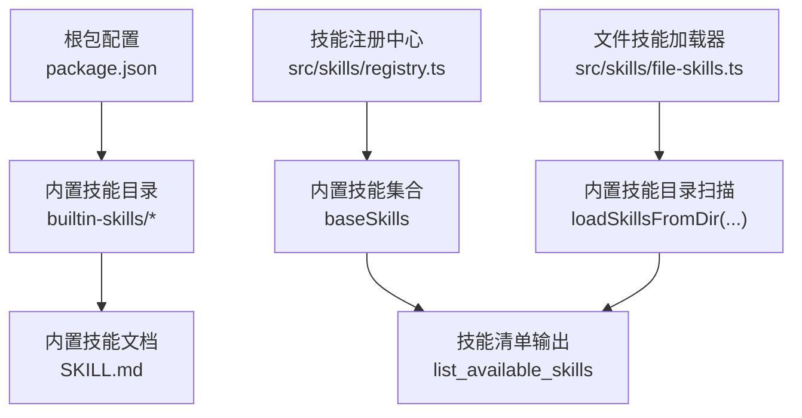
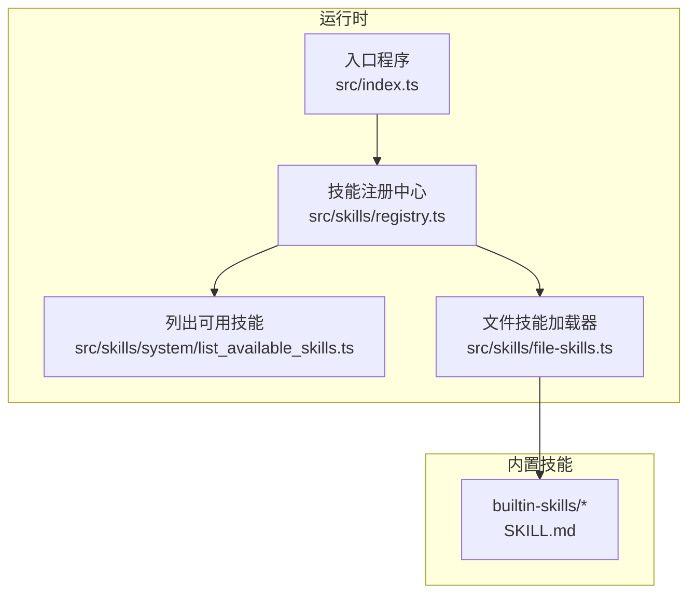
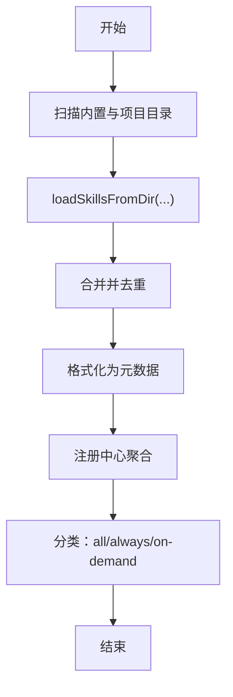
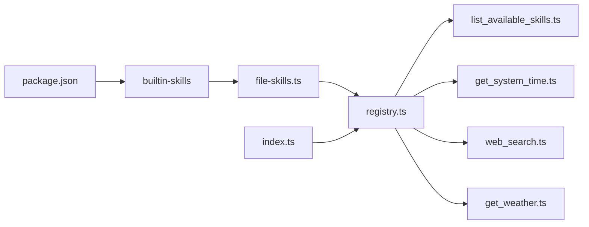

# 内置技能

<cite>
**本文引用的文件**
- [README.md](file://README.md)
- [package.json](file://package.json)
- [src/index.ts](file://src/index.ts)
- [src/skills/registry.ts](file://src/skills/registry.ts)
- [src/skills/contracts.ts](file://src/skills/contracts.ts)
- [src/skills/file-skills.ts](file://src/skills/file-skills.ts)
- [src/skills/system/list_available_skills.ts](file://src/skills/system/list_available_skills.ts)
- [src/skills/system/get_system_time.ts](file://src/skills/system/get_system_time.ts)
- [src/skills/system/skill_creator.ts](file://src/skills/system/skill_creator.ts)
- [src/skills/web/web_search.ts](file://src/skills/web/web_search.ts)
- [src/skills/web/get_weather.ts](file://src/skills/web/get_weather.ts)
- [builtin-skills/web_reach/SKILL.md](file://builtin-skills/web_reach/SKILL.md)
</cite>

## 目录
1. [引言](#引言)
2. [项目结构](#项目结构)
3. [核心组件](#核心组件)
4. [架构总览](#架构总览)
5. [详细组件分析](#详细组件分析)
6. [依赖关系分析](#依赖关系分析)
7. [性能考量](#性能考量)
8. [故障排查指南](#故障排查指南)
9. [结论](#结论)
10. [附录](#附录)

## 引言
本篇文档围绕 StupidClaw 的“内置技能”展开，系统阐述其概念、设计目的、管理机制与实践方法。内置技能是指随包分发、在安装阶段即被纳入可用技能集合的一部分，与“动态技能（由用户项目目录提供）”相对。StupidClaw 采用“内置技能 + 动态技能”的双轨策略：内置技能确保开箱即用的基础能力与一致性，动态技能允许用户按需扩展与定制。

选择内置技能而非完全动态加载的原因如下：
- 可靠性与一致性：内置技能在构建时确定，避免运行时外部依赖缺失导致的功能中断。
- 安全与可控：内置技能位于受控的仓库路径，便于审计与版本管理。
- 性能与体验：内置技能无需运行时扫描与解析文件系统，启动更快、调用更稳定。
- 边界清晰：内置技能与动态技能职责分离，降低耦合与误用风险。

## 项目结构
与内置技能相关的关键位置与职责：
- 根级打包声明包含内置技能目录，确保发布物包含内置技能资源。
- 内置技能目录位于 builtin-skills，每个技能以独立子目录存放，典型为 SKILL.md 文档。
- 技能注册中心负责聚合内置与动态技能，并按曝光级别分类。
- 文件技能加载器负责从内置与项目目录加载技能元数据与定义。

图表来源
- [package.json:8-12](file://package.json#L8-L12)
- [builtin-skills/web_reach/SKILL.md:1-122](file://builtin-skills/web_reach/SKILL.md#L1-L122)
- [src/skills/registry.ts:23-54](file://src/skills/registry.ts#L23-L54)
- [src/skills/file-skills.ts:11-48](file://src/skills/file-skills.ts#L11-L48)

章节来源
- [README.md:22-52](file://README.md#L22-L52)
- [package.json:8-12](file://package.json#L8-L12)
- [src/skills/file-skills.ts:11-48](file://src/skills/file-skills.ts#L11-L48)

## 核心组件
- 技能契约与曝光级别
  - 技能元数据包含名称、描述与曝光级别（always/on_demand），用于控制可见性与调用时机。
  - 技能定义在工具层封装了参数校验与执行逻辑。
- 技能注册中心
  - 聚合内置技能，生成“全部/总是/按需”三类集合，供引擎与调度器使用。
- 文件技能加载器
  - 统一从内置与项目目录加载技能，去重并格式化为标准元数据。
- 列出可用技能
  - 提供“always 技能优先、on_demand 按需调用”的使用指导。

章节来源
- [src/skills/contracts.ts:4-19](file://src/skills/contracts.ts#L4-L19)
- [src/skills/registry.ts:23-54](file://src/skills/registry.ts#L23-L54)
- [src/skills/file-skills.ts:58-64](file://src/skills/file-skills.ts#L58-L64)
- [src/skills/system/list_available_skills.ts:4-39](file://src/skills/system/list_available_skills.ts#L4-L39)

## 架构总览
内置技能在系统中的位置与交互：

图表来源
- [src/index.ts:122-123](file://src/index.ts#L122-L123)
- [src/skills/registry.ts:23-54](file://src/skills/registry.ts#L23-L54)
- [src/skills/system/list_available_skills.ts:4-39](file://src/skills/system/list_available_skills.ts#L4-L39)
- [src/skills/file-skills.ts:11-48](file://src/skills/file-skills.ts#L11-L48)

## 详细组件分析

### 组件一：内置技能的打包、分发与版本控制
- 打包
  - 包配置声明将 builtin-skills 与 dist/public 等目录纳入发布产物，确保内置技能随包分发。
- 分发
  - 发布物包含内置技能目录，用户安装后即可直接使用。
- 版本控制
  - 通过包版本号管理内置技能的演进；升级包版本即升级内置技能集合。
  - 内置技能的变更遵循包版本迭代流程，保持与主版本一致。

章节来源
- [package.json:8-12](file://package.json#L8-L12)
- [package.json:3-4](file://package.json#L3-L4)

### 组件二：内置技能的管理机制
- 加载与去重
  - 文件技能加载器遍历内置与项目目录，使用去重集合确保同名技能仅保留一份。
- 元数据标准化
  - 统一转换为技能元数据（名称、描述、曝光级别），内置技能统一标记为 on_demand。
- 注册与分类
  - 注册中心将内置技能加入“全部/总是/按需”集合，供后续路由与调度使用。

图表来源
- [src/skills/file-skills.ts:30-47](file://src/skills/file-skills.ts#L30-L47)
- [src/skills/registry.ts:40-51](file://src/skills/registry.ts#L40-L51)

章节来源
- [src/skills/file-skills.ts:26-64](file://src/skills/file-skills.ts#L26-L64)
- [src/skills/registry.ts:23-54](file://src/skills/registry.ts#L23-L54)

### 组件三：以 web_reach 技能为例的开发流程与配置规范
- 目录结构
  - 在 builtin-skills 下创建技能子目录，放置 SKILL.md 文档，文档中声明技能名称与用途。
- 开发流程
  - 在 SKILL.md 中编写技能说明、使用场景与调用方式。
  - 如需集成外部工具，应在文档中明确依赖与注意事项。
- 配置规范
  - 使用 YAML Front Matter 声明技能元数据（名称、描述等）。
  - 在文档主体中提供调用示例与注意事项，便于使用者快速上手。

章节来源
- [builtin-skills/web_reach/SKILL.md:1-122](file://builtin-skills/web_reach/SKILL.md#L1-L122)
- [src/skills/file-skills.ts:11-24](file://src/skills/file-skills.ts#L11-L24)

### 组件四：内置技能与动态技能的区别与适用场景
- 区别
  - 内置技能：随包分发、安装即用、统一曝光级别（通常为 on_demand）、版本与发布绑定。
  - 动态技能：由用户项目目录提供，可按需增删、灵活定制、适合业务专属能力。
- 适用场景
  - 内置技能：通用基础能力（如系统时间、天气查询、网页搜索等），确保一致性与稳定性。
  - 动态技能：企业内部流程、特定领域知识、个性化工作流等。

章节来源
- [src/skills/registry.ts:30-39](file://src/skills/registry.ts#L30-L39)
- [src/skills/file-skills.ts:15-24](file://src/skills/file-skills.ts#L15-L24)

### 组件五：维护策略与更新机制（含向后兼容与迁移）
- 维护策略
  - 内置技能变更通过包版本升级发布，遵循语义化版本。
  - 新增技能需提供完整的 SKILL.md 文档与最小可运行示例。
- 向后兼容
  - 保持技能名称与参数命名稳定，避免破坏性变更；必要时提供迁移指引。
- 迁移方案
  - 若内置技能调整为动态技能，可通过文件技能加载器自动识别并覆盖内置同名技能。
  - 用户可在项目目录下创建同名技能以替代内置版本。

章节来源
- [src/skills/file-skills.ts:30-47](file://src/skills/file-skills.ts#L30-L47)
- [src/skills/system/skill_creator.ts:65-312](file://src/skills/system/skill_creator.ts#L65-L312)

### 组件六：性能优势与局限性
- 优势
  - 启动快：内置技能无需运行时扫描与解析，注册阶段一次性加载。
  - 稳定性强：依赖固定、行为可预期，减少外部环境波动带来的失败。
- 局限性
  - 不够灵活：内置技能一旦发布难以快速迭代；用户自定义能力有限。
  - 占用空间：内置技能随包分发，可能包含用户不需要的能力。

章节来源
- [src/skills/registry.ts:23-54](file://src/skills/registry.ts#L23-L54)
- [src/skills/file-skills.ts:26-48](file://src/skills/file-skills.ts#L26-L48)

## 依赖关系分析
内置技能在系统中的依赖与耦合关系如下：

图表来源
- [package.json:8-12](file://package.json#L8-L12)
- [src/skills/file-skills.ts:11-24](file://src/skills/file-skills.ts#L11-L24)
- [src/skills/registry.ts:23-54](file://src/skills/registry.ts#L23-L54)
- [src/skills/system/list_available_skills.ts:4-39](file://src/skills/system/list_available_skills.ts#L4-L39)
- [src/skills/system/get_system_time.ts:4-38](file://src/skills/system/get_system_time.ts#L4-L38)
- [src/skills/web/web_search.ts:16-95](file://src/skills/web/web_search.ts#L16-L95)
- [src/skills/web/get_weather.ts:30-110](file://src/skills/web/get_weather.ts#L30-L110)
- [src/index.ts:122-123](file://src/index.ts#L122-L123)

章节来源
- [src/skills/registry.ts:23-54](file://src/skills/registry.ts#L23-L54)
- [src/skills/file-skills.ts:11-48](file://src/skills/file-skills.ts#L11-L48)

## 性能考量
- 内置技能的优势
  - 减少运行时 I/O 与解析成本，注册阶段完成加载与去重，提升启动速度与响应稳定性。
- 劣势与权衡
  - 包体积增大，部分用户可能不需要的内置功能会随包分发。
- 建议
  - 将高频、稳定的通用能力放入内置；将低频或高度定制化的技能放入动态目录，按需启用。

章节来源
- [src/skills/registry.ts:23-54](file://src/skills/registry.ts#L23-L54)
- [src/skills/file-skills.ts:26-48](file://src/skills/file-skills.ts#L26-L48)

## 故障排查指南
- 内置技能未生效
  - 检查包是否包含内置技能目录；确认技能已随包分发。
- 技能重复或冲突
  - 若项目目录存在同名技能，将覆盖内置技能；检查项目 skills 目录与内置目录的同名冲突。
- 列出可用技能
  - 使用列出可用技能工具，确认内置与动态技能的曝光级别与描述是否符合预期。

章节来源
- [package.json:8-12](file://package.json#L8-L12)
- [src/skills/file-skills.ts:30-47](file://src/skills/file-skills.ts#L30-L47)
- [src/skills/system/list_available_skills.ts:4-39](file://src/skills/system/list_available_skills.ts#L4-L39)

## 结论
内置技能为 StupidClaw 提供了稳定、一致且开箱即用的能力基线，配合动态技能实现“通用能力内置、个性能力外置”的平衡策略。通过明确的打包、分发与版本控制流程，以及清晰的开发与维护规范，内置技能能够在保证可靠性的同时，为用户提供可扩展、可演进的智能体能力体系。

## 附录
- 示例技能：web_reach
  - 说明：提供多平台网页访问与搜索能力，适用于“联网检索、内容抓取”等场景。
  - 文档：参见 [builtin-skills/web_reach/SKILL.md:1-122](file://builtin-skills/web_reach/SKILL.md#L1-L122)。

章节来源
- [builtin-skills/web_reach/SKILL.md:1-122](file://builtin-skills/web_reach/SKILL.md#L1-L122)