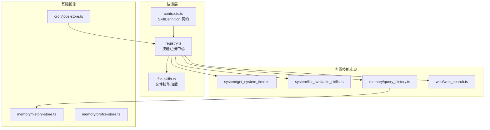
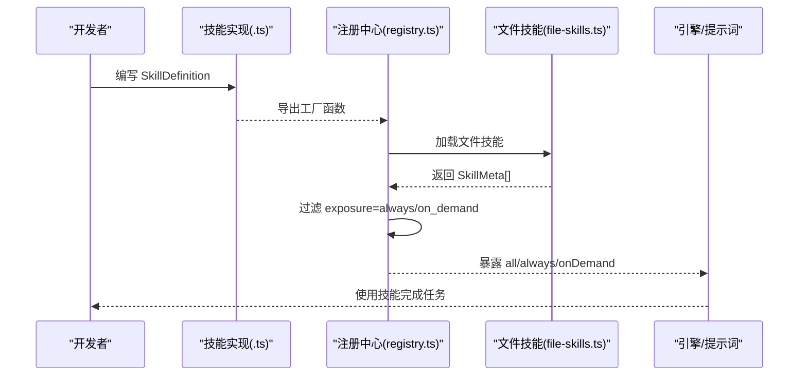
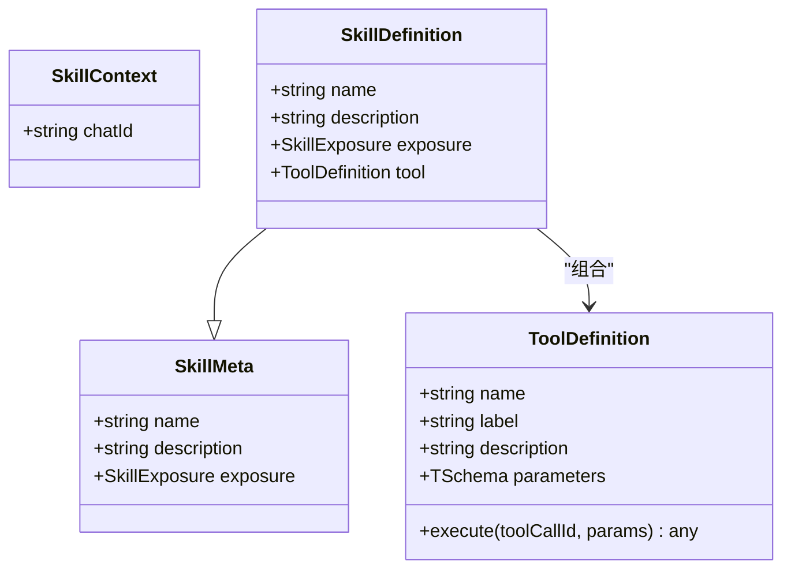
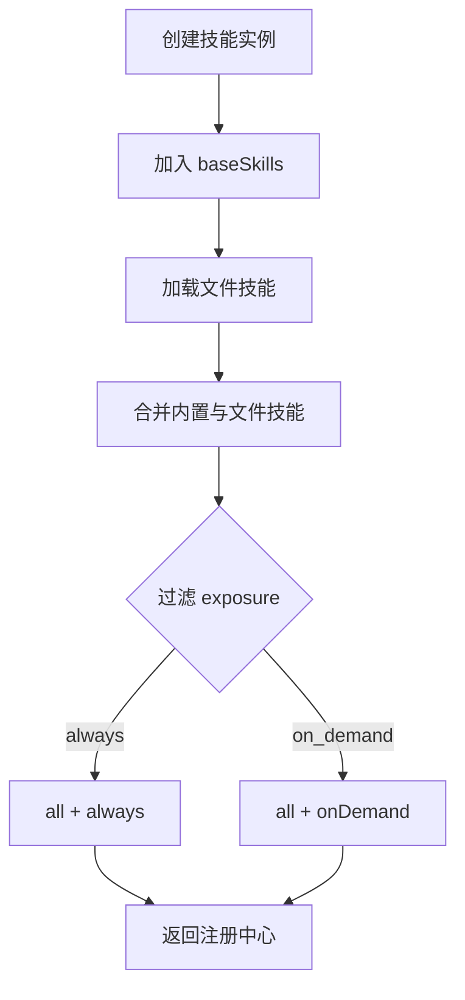
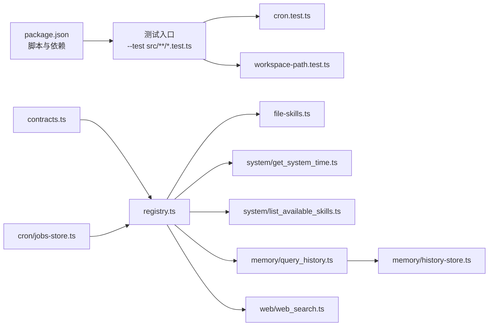

# 技能开发指南

<cite>
**本文引用的文件**
- [README.md](file://README.md)
- [package.json](file://package.json)
- [src/skills/contracts.ts](file://src/skills/contracts.ts)
- [src/skills/registry.ts](file://src/skills/registry.ts)
- [src/skills/file-skills.ts](file://src/skills/file-skills.ts)
- [src/skills/system/get_system_time.ts](file://src/skills/system/get_system_time.ts)
- [src/skills/system/list_available_skills.ts](file://src/skills/system/list_available_skills.ts)
- [src/skills/memory/query_history.ts](file://src/skills/memory/query_history.ts)
- [src/skills/web/web_search.ts](file://src/skills/web/web_search.ts)
- [src/memory/history-store.ts](file://src/memory/history-store.ts)
- [src/memory/profile-store.ts](file://src/memory/profile-store.ts)
- [src/cron/jobs-store.ts](file://src/cron/jobs-store.ts)
- [src/cron/cron.test.ts](file://src/cron/cron.test.ts)
- [src/memory/workspace-path.test.ts](file://src/memory/workspace-path.test.ts)
- [builtin-skills/web_reach/SKILL.md](file://builtin-skills/web_reach/SKILL.md)
</cite>

## 目录
1. [简介](#简介)
2. [项目结构](#项目结构)
3. [核心组件](#核心组件)
4. [架构总览](#架构总览)
5. [详细组件分析](#详细组件分析)
6. [依赖关系分析](#依赖关系分析)
7. [性能考量](#性能考量)
8. [故障排查指南](#故障排查指南)
9. [结论](#结论)
10. [附录](#附录)

## 简介
本指南面向希望为 StupidClaw 开发新技能的开发者，覆盖从技能设计、接口定义、实现到集成的全流程。文档重点解释 SkillDefinition 接口的字段含义与配置方法，给出最佳实践（错误处理、参数校验、性能优化、安全性），并提供测试与调试策略、模板与示例、文档规范与发布流程。

## 项目结构
StupidClaw 的技能体系由“契约层”“注册中心”“文件技能加载器”“内置技能实现”“持久化与调度”等模块组成。核心入口位于 src/skills 目录，技能以“函数工厂 + ToolDefinition”的形式声明，最终被注册中心统一暴露给引擎。

图表来源
- [src/skills/contracts.ts:1-20](file://src/skills/contracts.ts#L1-L20)
- [src/skills/registry.ts:1-55](file://src/skills/registry.ts#L1-L55)
- [src/skills/file-skills.ts:1-65](file://src/skills/file-skills.ts#L1-L65)
- [src/skills/system/get_system_time.ts:1-38](file://src/skills/system/get_system_time.ts#L1-L38)
- [src/skills/system/list_available_skills.ts:1-40](file://src/skills/system/list_available_skills.ts#L1-L40)
- [src/skills/memory/query_history.ts:1-57](file://src/skills/memory/query_history.ts#L1-L57)
- [src/skills/web/web_search.ts:1-95](file://src/skills/web/web_search.ts#L1-L95)
- [src/memory/history-store.ts:1-83](file://src/memory/history-store.ts#L1-L83)
- [src/memory/profile-store.ts:1-132](file://src/memory/profile-store.ts#L1-L132)
- [src/cron/jobs-store.ts:1-151](file://src/cron/jobs-store.ts#L1-L151)

章节来源
- [README.md:22-52](file://README.md#L22-L52)
- [package.json:14-22](file://package.json#L14-L22)

## 核心组件
- SkillDefinition 契约：定义技能元数据与工具定义，决定技能的可见性与调用方式。
- 注册中心：收集内置技能与文件技能，按 exposure 分类导出。
- 文件技能加载器：扫描项目与内置技能目录，标准化为 SkillMeta 并去重。
- 内置技能实现：提供系统、内存、网络等常用能力。
- 基础设施：历史记录、个人档案、定时任务等支撑模块。

章节来源
- [src/skills/contracts.ts:6-20](file://src/skills/contracts.ts#L6-L20)
- [src/skills/registry.ts:13-55](file://src/skills/registry.ts#L13-L55)
- [src/skills/file-skills.ts:58-65](file://src/skills/file-skills.ts#L58-L65)

## 架构总览
技能生命周期从“定义”到“注册”，再到“被引擎消费”。文件技能通过统一格式加载，注册中心负责暴露“always/on-demand”两类技能，并提供“列出技能目录”的能力。

图表来源
- [src/skills/registry.ts:23-54](file://src/skills/registry.ts#L23-L54)
- [src/skills/file-skills.ts:26-65](file://src/skills/file-skills.ts#L26-L65)

## 详细组件分析

### SkillDefinition 接口详解
- name：技能名称，全局唯一标识，用于注册与调用。
- description：技能描述，用于向 LLM 展示用途。
- exposure：暴露级别，"always" 或 "on_demand"。
  - always：默认始终可用，适合通用能力（如获取系统时间、列出技能目录）。
  - on_demand：按需披露，适合高风险或昂贵能力（如网络搜索、历史查询）。
- tool：ToolDefinition，包含工具名、标签、描述、参数 Schema 与执行函数 execute。

图表来源
- [src/skills/contracts.ts:4-20](file://src/skills/contracts.ts#L4-L20)

章节来源
- [src/skills/contracts.ts:6-20](file://src/skills/contracts.ts#L6-L20)

### 注册中心与暴露策略
- 注册中心聚合内置技能与文件技能，构建 all/always/onDemand 三类集合。
- always 技能优先展示，on_demand 技能按需披露，避免过度暴露敏感能力。
- 列出技能目录技能用于向用户/LLM 展示可用能力及暴露级别。

图表来源
- [src/skills/registry.ts:23-54](file://src/skills/registry.ts#L23-L54)
- [src/skills/file-skills.ts:58-65](file://src/skills/file-skills.ts#L58-L65)

章节来源
- [src/skills/registry.ts:13-55](file://src/skills/registry.ts#L13-L55)

### 文件技能加载与去重
- 支持项目自定义 skills 目录与内置 builtin-skills 两处来源。
- 通过名称去重，保证同名技能只保留一份。
- 输出标准化的 SkillMeta，统一暴露级别为 on_demand。

章节来源
- [src/skills/file-skills.ts:15-65](file://src/skills/file-skills.ts#L15-L65)

### 内置技能示例

#### 系统时间技能（always）
- 作用：返回 ISO 与本地时间字符串，便于时间相关推理。
- 参数：无。
- 返回：文本内容，包含格式化后的双时间表示。

章节来源
- [src/skills/system/get_system_time.ts:4-38](file://src/skills/system/get_system_time.ts#L4-L38)

#### 列出技能目录（always）
- 作用：返回当前可用技能清单与使用指引。
- 参数：无。
- 返回：文本内容，包含技能名称、暴露级别与描述，以及使用建议。

章节来源
- [src/skills/system/list_available_skills.ts:4-40](file://src/skills/system/list_available_skills.ts#L4-L40)

#### 历史查询技能（on_demand）
- 作用：按日期、chatId、数量限制查询历史事件。
- 参数：
  - date：YYYY-MM-DD，默认当天。
  - chatId：可选，按会话过滤。
  - limit：可选，默认 20，最大 200。
- 返回：事件数组的 JSON 文本或空数组。

章节来源
- [src/skills/memory/query_history.ts:5-57](file://src/skills/memory/query_history.ts#L5-L57)
- [src/memory/history-store.ts:44-83](file://src/memory/history-store.ts#L44-L83)

#### 网络搜索技能（on_demand）
- 作用：通过 Brave Search API 搜索并返回标题、链接与摘要。
- 参数：
  - q：关键词（必填）。
  - count：结果数量，默认 5，最大 10。
- 返回：文本内容，每条结果一行，或错误提示。

章节来源
- [src/skills/web/web_search.ts:16-95](file://src/skills/web/web_search.ts#L16-L95)

### 基础设施与安全

#### 历史存储
- 采用 JSONL 文本文件按日期分片存储，支持追加与查询。
- 查询时对异常进行兜底处理（如文件不存在），限制返回数量。

章节来源
- [src/memory/history-store.ts:37-83](file://src/memory/history-store.ts#L37-L83)

#### 个人档案
- 以 Markdown 形式维护长期稳定事实、偏好与约束。
- 写入前进行去重与规范化，保证一致性。

章节来源
- [src/memory/profile-store.ts:117-132](file://src/memory/profile-store.ts#L117-L132)

#### 定时任务
- 以 JSON 文件持久化任务，支持 cron 表达式、目标 chatId、技能/工具调用等。
- 兼容旧格式字段，校验任务有效性。

章节来源
- [src/cron/jobs-store.ts:29-151](file://src/cron/jobs-store.ts#L29-L151)

## 依赖关系分析

图表来源
- [package.json:14-22](file://package.json#L14-L22)
- [src/cron/cron.test.ts:1-26](file://src/cron/cron.test.ts#L1-L26)
- [src/memory/workspace-path.test.ts:1-29](file://src/memory/workspace-path.test.ts#L1-L29)
- [src/skills/contracts.ts:1-20](file://src/skills/contracts.ts#L1-L20)
- [src/skills/registry.ts:1-55](file://src/skills/registry.ts#L1-L55)
- [src/skills/file-skills.ts:1-65](file://src/skills/file-skills.ts#L1-L65)
- [src/skills/system/get_system_time.ts:1-38](file://src/skills/system/get_system_time.ts#L1-L38)
- [src/skills/system/list_available_skills.ts:1-40](file://src/skills/system/list_available_skills.ts#L1-L40)
- [src/skills/memory/query_history.ts:1-57](file://src/skills/memory/query_history.ts#L1-L57)
- [src/skills/web/web_search.ts:1-95](file://src/skills/web/web_search.ts#L1-L95)
- [src/memory/history-store.ts:1-83](file://src/memory/history-store.ts#L1-L83)
- [src/cron/jobs-store.ts:1-151](file://src/cron/jobs-store.ts#L1-L151)

章节来源
- [package.json:14-22](file://package.json#L14-L22)

## 性能考量
- 参数校验与裁剪：对可选参数设置合理默认值与上限（如历史查询 limit、网络搜索 count），避免过大负载。
- I/O 限制：历史与档案读写采用 JSONL/Markdown 文本，尽量批量写入与惰性读取。
- 外部调用：对外部 API 的请求应设置超时与重试策略，避免阻塞主线程。
- 暴露策略：将高成本或高风险能力标记为 on_demand，减少不必要的调用。

## 故障排查指南
- 测试策略
  - 单元测试：针对关键逻辑（如 cron 表达式匹配、路径安全解析）编写最小可复现用例。
  - 集成测试：验证技能注册、文件技能加载、历史查询等端到端流程。
  - 端到端测试：结合引擎与传输层，模拟真实消息闭环。
- 常见问题
  - 环境变量缺失：如网络搜索技能需要特定 API Key，未配置时应返回明确错误提示。
  - 路径穿越与越权：使用安全路径解析函数，拒绝绝对路径与上级目录访问。
  - 文件不存在：对历史查询等读取场景，捕获并优雅处理“文件不存在”异常。
- 调试技巧
  - 使用最小参数集复现问题，逐步增加复杂度。
  - 在工具执行函数中输出结构化日志，便于定位参数与返回值。
  - 利用注册中心的“列出技能目录”能力核对暴露级别与描述是否正确。

章节来源
- [src/cron/cron.test.ts:1-26](file://src/cron/cron.test.ts#L1-L26)
- [src/memory/workspace-path.test.ts:1-29](file://src/memory/workspace-path.test.ts#L1-L29)
- [src/skills/web/web_search.ts:36-46](file://src/skills/web/web_search.ts#L36-L46)
- [src/memory/history-store.ts:72-81](file://src/memory/history-store.ts#L72-L81)

## 结论
通过契约清晰、注册集中、文件加载标准化与基础设施完备的体系，StupidClaw 为技能开发提供了稳健的框架。遵循 always/on-demand 的暴露策略、严格的参数校验与安全路径解析、完善的测试与调试流程，可高效产出高质量技能。

## 附录

### 技能开发最佳实践
- 设计阶段
  - 明确技能职责单一、参数最小化、返回结构化文本。
  - 评估成本与风险，合理选择 exposure。
- 实现阶段
  - 使用 Type.Object 定义参数 Schema，提供清晰描述。
  - 在 execute 中进行参数校验与边界裁剪，返回一致的 content 结构。
  - 对外部依赖进行健壮性处理（鉴权、网络、限流）。
- 集成阶段
  - 通过注册中心导出工厂函数，确保名称唯一。
  - 使用文件技能加载器时，遵循命名规范，避免重复。
- 文档与发布
  - 为文件技能提供 SKILL.md，说明用途、注意事项与示例。
  - 使用统一的版本与发布脚本，确保构建产物与依赖一致。

章节来源
- [src/skills/contracts.ts:16-20](file://src/skills/contracts.ts#L16-L20)
- [src/skills/registry.ts:23-54](file://src/skills/registry.ts#L23-L54)
- [src/skills/file-skills.ts:58-65](file://src/skills/file-skills.ts#L58-L65)
- [builtin-skills/web_reach/SKILL.md:1-122](file://builtin-skills/web_reach/SKILL.md#L1-L122)
- [package.json:14-22](file://package.json#L14-L22)

### 模板与示例（路径指引）
- 最小技能模板：参考系统时间技能的工厂函数与 ToolDefinition 结构。
  - [src/skills/system/get_system_time.ts:4-38](file://src/skills/system/get_system_time.ts#L4-L38)
- 列出技能目录模板：参考列出技能目录技能的参数与返回结构。
  - [src/skills/system/list_available_skills.ts:4-40](file://src/skills/system/list_available_skills.ts#L4-L40)
- 历史查询模板：参考历史查询技能的参数 Schema 与 execute 实现。
  - [src/skills/memory/query_history.ts:5-57](file://src/skills/memory/query_history.ts#L5-L57)
- 网络搜索模板：参考网络搜索技能的鉴权、请求与错误处理。
  - [src/skills/web/web_search.ts:16-95](file://src/skills/web/web_search.ts#L16-L95)

### 文档编写规范
- 文件技能文档
  - 使用 YAML front matter 指定 name 与 description。
  - 说明用途、注意事项与示例命令或调用方式。
  - 示例参考：[builtin-skills/web_reach/SKILL.md:1-122](file://builtin-skills/web_reach/SKILL.md#L1-L122)

### 发布流程
- 构建与测试
  - 使用 TypeScript 编译与类型检查。
  - 使用 Node 测试入口运行所有测试。
- 发布
  - 使用版本更新与发布脚本，确保依赖预构建。
- 参考
  - [package.json:14-22](file://package.json#L14-L22)