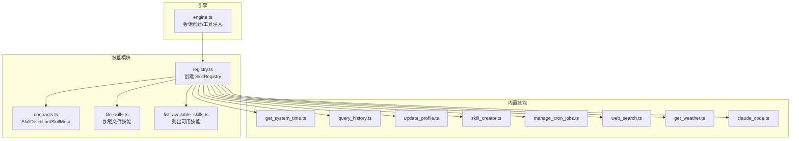
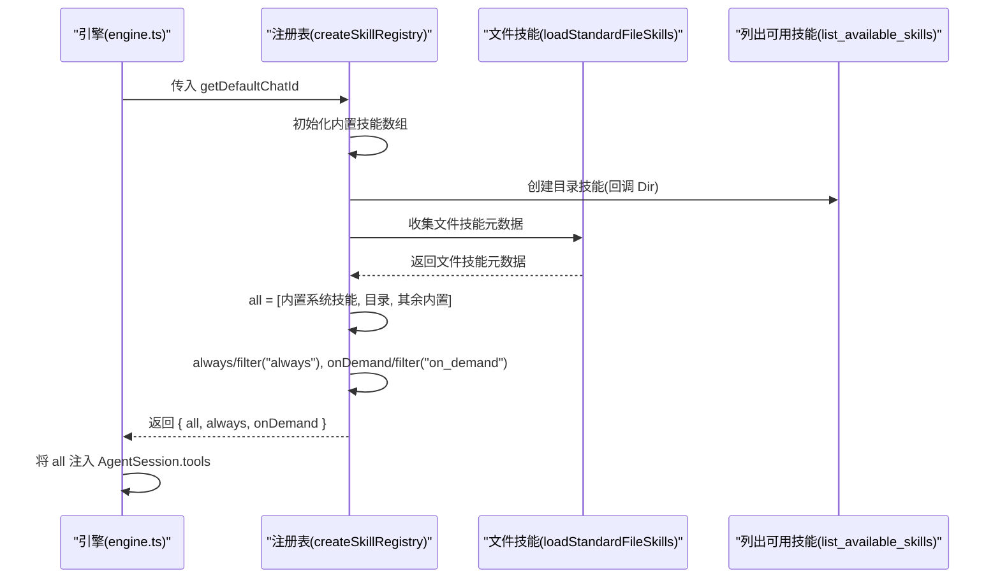
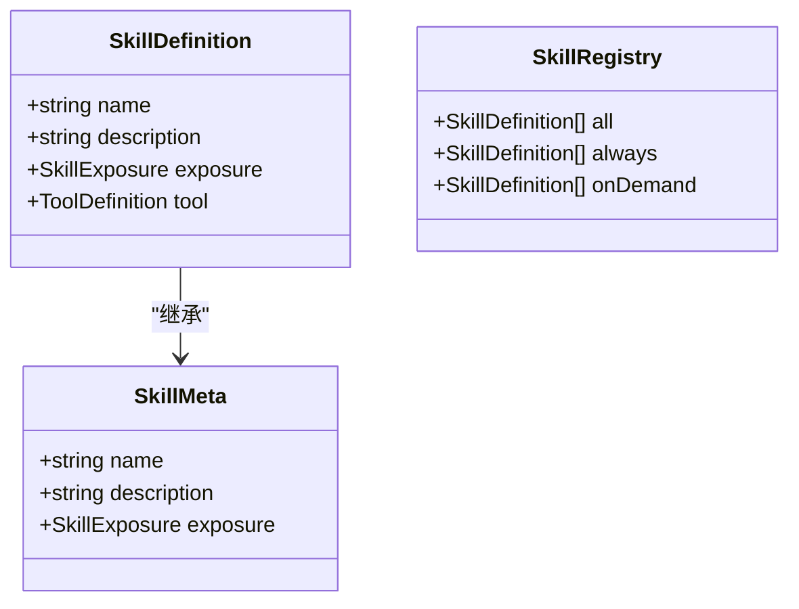
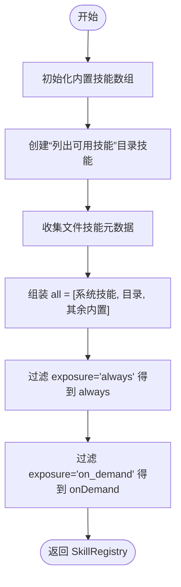
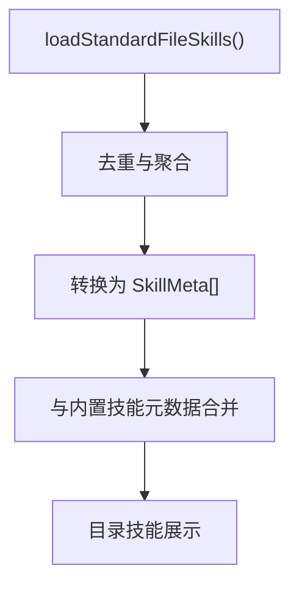
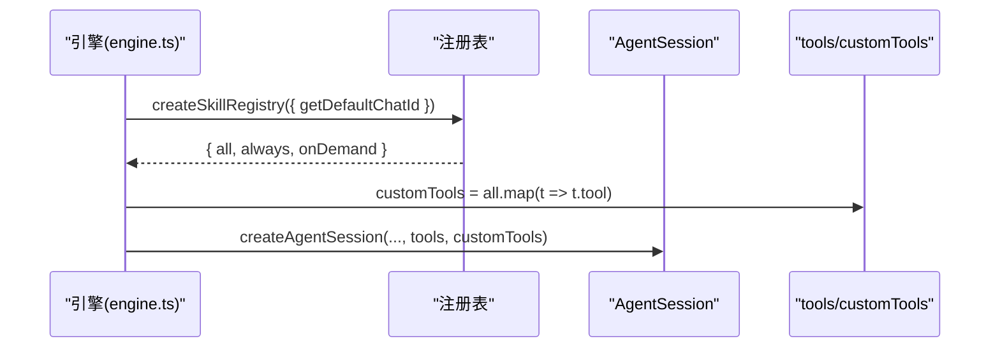
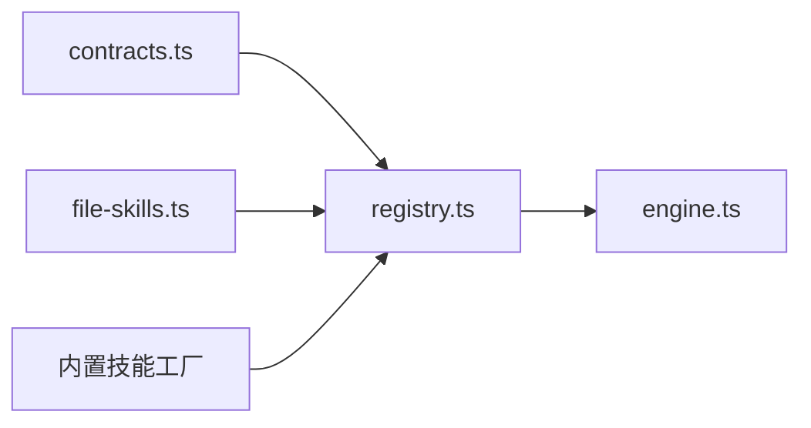

# 技能注册表

<cite>
**本文档引用的文件**
- [src/skills/registry.ts](file://src/skills/registry.ts)
- [src/skills/contracts.ts](file://src/skills/contracts.ts)
- [src/engine.ts](file://src/engine.ts)
- [src/skills/file-skills.ts](file://src/skills/file-skills.ts)
- [src/skills/system/list_available_skills.ts](file://src/skills/system/list_available_skills.ts)
- [src/skills/system/skill_creator.ts](file://src/skills/system/skill_creator.ts)
- [src/skills/system/get_system_time.ts](file://src/skills/system/get_system_time.ts)
- [src/skills/memory/query_history.ts](file://src/skills/memory/query_history.ts)
- [src/skills/memory/update_profile.ts](file://src/skills/memory/update_profile.ts)
- [src/skills/web/web_search.ts](file://src/skills/web/web_search.ts)
- [src/skills/web/get_weather.ts](file://src/skills/web/get_weather.ts)
- [src/skills/coding/claude_code.ts](file://src/skills/coding/claude_code.ts)
- [src/skills/cron/manage_cron_jobs.ts](file://src/skills/cron/manage_cron_jobs.ts)
</cite>

## 目录
1. [简介](#简介)
2. [项目结构](#项目结构)
3. [核心组件](#核心组件)
4. [架构总览](#架构总览)
5. [详细组件分析](#详细组件分析)
6. [依赖关系分析](#依赖关系分析)
7. [性能考量](#性能考量)
8. [故障排查指南](#故障排查指南)
9. [结论](#结论)
10. [附录](#附录)

## 简介
本文件面向 StupidClaw 的“技能注册表”子系统，系统性阐述其设计理念、架构原理与实现细节。重点包括：
- SkillRegistry 接口的设计思路与职责边界
- 技能暴露级别的分类机制：always（始终可用）、onDemand（按需使用）、all（全部技能）
- 注册表的创建流程：内置技能初始化、元数据收集与过滤逻辑
- 在引擎中的集成方式，以及如何通过 getDefaultChatId 实现聊天上下文感知
- 扩展方法与最佳实践

## 项目结构
技能注册表位于 src/skills/registry.ts，围绕 SkillDefinition 与 SkillMeta 两个核心契约组织，通过 createSkillRegistry 统一装配内置技能与文件技能，形成 all/always/onDemand 三类视图。



**图表来源**
- [src/skills/registry.ts:1-55](file://src/skills/registry.ts#L1-L55)
- [src/skills/contracts.ts:1-20](file://src/skills/contracts.ts#L1-L20)
- [src/skills/file-skills.ts:1-65](file://src/skills/file-skills.ts#L1-L65)
- [src/skills/system/list_available_skills.ts:1-40](file://src/skills/system/list_available_skills.ts#L1-L40)
- [src/engine.ts:420-459](file://src/engine.ts#L420-L459)

**章节来源**
- [src/skills/registry.ts:1-55](file://src/skills/registry.ts#L1-L55)
- [src/skills/contracts.ts:1-20](file://src/skills/contracts.ts#L1-L20)
- [src/skills/file-skills.ts:1-65](file://src/skills/file-skills.ts#L1-L65)
- [src/engine.ts:420-459](file://src/engine.ts#L420-L459)

## 核心组件
- SkillDefinition：技能的完整定义，包含元数据（name/description/exposure）与工具定义（tool）。
- SkillMeta：技能元数据，用于目录展示与过滤。
- SkillRegistry：注册表对象，提供 three views：
  - all：所有技能（含“列出可用技能”目录）
  - always：始终暴露的技能（如系统时间）
  - onDemand：按需暴露的技能（如查询历史、天气、网络搜索、代码助手等）

**章节来源**
- [src/skills/contracts.ts:4-19](file://src/skills/contracts.ts#L4-L19)
- [src/skills/registry.ts:13-17](file://src/skills/registry.ts#L13-L17)

## 架构总览
SkillRegistry 的创建流程如下：
- 初始化内置技能集合
- 创建“列出可用技能”目录技能，动态聚合内置与文件技能的元数据
- 组装 all 视图（内置系统技能 + 列出目录 + 其余内置技能）
- 基于 exposure 属性切分为 always 与 onDemand
- 将 all 注入引擎 AgentSession 的工具集



**图表来源**
- [src/engine.ts:420-459](file://src/engine.ts#L420-L459)
- [src/skills/registry.ts:23-54](file://src/skills/registry.ts#L23-L54)
- [src/skills/file-skills.ts:58-64](file://src/skills/file-skills.ts#L58-L64)
- [src/skills/system/list_available_skills.ts:4-39](file://src/skills/system/list_available_skills.ts#L4-L39)

**章节来源**
- [src/engine.ts:420-459](file://src/engine.ts#L420-L459)
- [src/skills/registry.ts:23-54](file://src/skills/registry.ts#L23-L54)
- [src/skills/file-skills.ts:58-64](file://src/skills/file-skills.ts#L58-L64)
- [src/skills/system/list_available_skills.ts:4-39](file://src/skills/system/list_available_skills.ts#L4-L39)

## 详细组件分析

### SkillRegistry 接口与暴露级别
- exposure 类型限定为 "always" | "on_demand"，用于控制技能在 all 视图中的呈现与在对话中的可用性。
- always 技能：系统级基础能力，如获取系统时间，确保在任何上下文中都可用。
- onDemand 技能：需要用户明确触发或具备特定条件（如聊天上下文）才可用，如查询历史、天气、网络搜索、代码助手等。
- all 视图：包含目录技能与所有内置/文件技能，便于统一注入与提示。



**图表来源**
- [src/skills/contracts.ts:4-19](file://src/skills/contracts.ts#L4-L19)
- [src/skills/registry.ts:13-17](file://src/skills/registry.ts#L13-L17)

**章节来源**
- [src/skills/contracts.ts:4-19](file://src/skills/contracts.ts#L4-L19)
- [src/skills/registry.ts:13-17](file://src/skills/registry.ts#L13-L17)

### 注册表创建流程与内置技能初始化
- 内置技能初始化：按顺序创建系统时间、查询历史、更新 profile、技能创建器、定时任务管理、网络搜索、天气查询、代码助手等技能。
- 目录技能构建：通过 createListAvailableSkillsSkill 回调 getStandardFileSkillMetas，聚合文件技能元数据，形成“按需技能目录”。
- all/always/onDemand 切分：将内置系统技能置于 all 前部，目录技能紧随其后，其余内置技能加入 all；随后基于 exposure 过滤得到 always 与 onDemand。



**图表来源**
- [src/skills/registry.ts:23-54](file://src/skills/registry.ts#L23-L54)
- [src/skills/file-skills.ts:58-64](file://src/skills/file-skills.ts#L58-L64)
- [src/skills/system/list_available_skills.ts:4-39](file://src/skills/system/list_available_skills.ts#L4-L39)

**章节来源**
- [src/skills/registry.ts:23-54](file://src/skills/registry.ts#L23-L54)
- [src/skills/file-skills.ts:58-64](file://src/skills/file-skills.ts#L58-L64)
- [src/skills/system/list_available_skills.ts:4-39](file://src/skills/system/list_available_skills.ts#L4-L39)

### 聊天上下文感知与 getDefaultChatId
- 定时任务管理技能（manage_cron_jobs）接收 SkillRegistryOptions，默认 chatId 来源为 getDefaultChatId。
- 引擎在创建会话时，将当前 chatId 作为 getDefaultChatId 提供给注册表，从而让 onDemand 技能（如定时任务）在无显式 chatId 时也能绑定到当前会话上下文。

```mermaid
sequenceDiagram
participant Eng as "引擎(engine.ts)"
participant Reg as "注册表(createSkillRegistry)"
participant MCJ as "定时任务管理(manage_cron_jobs)"
participant Opt as "SkillRegistryOptions"
Eng->>Opt : getDefaultChatId = () => chatId
Opt-->>Reg : 传入 options
Reg->>MCJ : 创建时注入 options.getDefaultChatId
MCJ-->>Reg : 使用 getDefaultChatId 作为默认 chatId
```

**图表来源**
- [src/engine.ts:420-424](file://src/engine.ts#L420-L424)
- [src/skills/registry.ts:27-29](file://src/skills/registry.ts#L27-L29)
- [src/skills/cron/manage_cron_jobs.ts:28-30](file://src/skills/cron/manage_cron_jobs.ts#L28-L30)

**章节来源**
- [src/engine.ts:420-424](file://src/engine.ts#L420-L424)
- [src/skills/registry.ts:27-29](file://src/skills/registry.ts#L27-L29)
- [src/skills/cron/manage_cron_jobs.ts:28-30](file://src/skills/cron/manage_cron_jobs.ts#L28-L30)

### 文件技能元数据收集与过滤
- 文件技能通过 loadStandardFileSkills 从项目与内置目录加载，去重后汇总。
- getStandardFileSkillMetas 将文件技能转换为 SkillMeta（exposure 固定为 "on_demand"），供目录技能展示。
- 注册表将文件技能元数据与内置技能合并，形成完整的“按需技能目录”。



**图表来源**
- [src/skills/file-skills.ts:26-64](file://src/skills/file-skills.ts#L26-L64)
- [src/skills/registry.ts:40-47](file://src/skills/registry.ts#L40-L47)

**章节来源**
- [src/skills/file-skills.ts:26-64](file://src/skills/file-skills.ts#L26-L64)
- [src/skills/registry.ts:40-47](file://src/skills/registry.ts#L40-L47)

### 引擎集成与工具注入
- 引擎在 createChatSession 中创建 SkillRegistry，并将 all 注入 AgentSession 的 tools 字段。
- 同时加载文件技能并拼接到系统提示中，形成静态系统提示的一部分。
- 调试日志会打印会话工具与自定义工具的名称与参数模式，辅助定位问题。



**图表来源**
- [src/engine.ts:420-459](file://src/engine.ts#L420-L459)
- [src/skills/registry.ts:49-53](file://src/skills/registry.ts#L49-L53)

**章节来源**
- [src/engine.ts:420-459](file://src/engine.ts#L420-L459)
- [src/skills/registry.ts:49-53](file://src/skills/registry.ts#L49-L53)

### 典型技能示例与职责边界
- 系统时间：always，提供 ISO 与本地时间，便于推理与日志。
- 查询历史：onDemand，支持按日期与 chatId 过滤，保护隐私。
- 更新 profile：onDemand，维护长期记忆的稳定事实、偏好与约束。
- 技能创建器：onDemand，帮助用户规范地创建与维护 SKILL.md。
- 定时任务管理：onDemand，支持 list/add/update/remove/set_enabled，结合 getDefaultChatId 实现上下文感知。
- 网络搜索：onDemand，依赖外部 API Key。
- 天气查询：onDemand，跨语言城市名支持。
- 代码助手：onDemand，调用本地 Claude Code CLI。

**章节来源**
- [src/skills/system/get_system_time.ts:4-37](file://src/skills/system/get_system_time.ts#L4-L37)
- [src/skills/memory/query_history.ts:5-56](file://src/skills/memory/query_history.ts#L5-L56)
- [src/skills/memory/update_profile.ts:10-83](file://src/skills/memory/update_profile.ts#L10-L83)
- [src/skills/system/skill_creator.ts:65-311](file://src/skills/system/skill_creator.ts#L65-L311)
- [src/skills/cron/manage_cron_jobs.ts:32-335](file://src/skills/cron/manage_cron_jobs.ts#L32-L335)
- [src/skills/web/web_search.ts:16-94](file://src/skills/web/web_search.ts#L16-L94)
- [src/skills/web/get_weather.ts:30-109](file://src/skills/web/get_weather.ts#L30-L109)
- [src/skills/coding/claude_code.ts:8-98](file://src/skills/coding/claude_code.ts#L8-L98)

## 依赖关系分析
- 注册表依赖 contracts.ts 中的类型定义，确保 SkillDefinition 与 SkillMeta 的一致性。
- 注册表依赖 file-skills.ts 收集文件技能元数据，形成“按需技能目录”的动态内容。
- 注册表依赖各内置技能的工厂函数，统一装配到 all 视图。
- 引擎依赖注册表提供的 all 视图，注入 AgentSession 的工具集。



**图表来源**
- [src/skills/contracts.ts:1-20](file://src/skills/contracts.ts#L1-L20)
- [src/skills/registry.ts:1-11](file://src/skills/registry.ts#L1-L11)
- [src/skills/file-skills.ts:1-9](file://src/skills/file-skills.ts#L1-L9)
- [src/engine.ts:16-17](file://src/engine.ts#L16-L17)

**章节来源**
- [src/skills/contracts.ts:1-20](file://src/skills/contracts.ts#L1-L20)
- [src/skills/registry.ts:1-11](file://src/skills/registry.ts#L1-L11)
- [src/skills/file-skills.ts:1-9](file://src/skills/file-skills.ts#L1-L9)
- [src/engine.ts:16-17](file://src/engine.ts#L16-L17)

## 性能考量
- 注册表创建为一次性装配，开销主要来自文件技能扫描与目录技能回调，通常在会话初始化阶段完成，对在线推理影响有限。
- onDemand 技能按需触发，避免不必要的外部调用与 IO。
- 建议：
  - 控制文件技能数量与层级，减少 loadStandardFileSkills 的扫描成本。
  - 对外部 API 调用（如天气、搜索）增加合理的超时与缓存策略（可在各自技能内部实现）。
  - 使用调试开关观察工具清单与参数模式，避免注入过多无关工具导致提示膨胀。

## 故障排查指南
- API Key 缺失或无效：引擎在会话创建与推理过程中会标准化错误信息，提示缺失的 provider 与环境变量名，便于快速定位。
- 文件技能加载异常：确认 skills 与 builtin-skills 目录存在且权限正确，避免重复名称导致的去重覆盖。
- 定时任务 chatId 未指定：若未显式传入 chatId，需确保 getDefaultChatId 返回有效值，否则添加任务会失败。
- 外部工具不可用：如 Claude Code 未安装，相关技能会返回明确的安装指引。

**章节来源**
- [src/engine.ts:162-186](file://src/engine.ts#L162-L186)
- [src/skills/coding/claude_code.ts:61-71](file://src/skills/coding/claude_code.ts#L61-L71)
- [src/skills/cron/manage_cron_jobs.ts:152-162](file://src/skills/cron/manage_cron_jobs.ts#L152-L162)

## 结论
SkillRegistry 通过清晰的暴露级别与统一的装配流程，实现了“按需披露”的技能治理：always 技能保证基础能力，onDemand 技能按需启用，all 视图便于引擎注入与提示。结合 getDefaultChatId 的上下文感知与文件技能的动态目录，注册表既满足工程扩展需求，又保持了系统的可控性与安全性。

## 附录
- 最佳实践
  - 为每个 onDemand 技能提供明确的触发描述与参数约束，提升 LLM 的意图识别能力。
  - 将高频、低风险的系统能力标记为 always，减少用户交互成本。
  - 对外部依赖（API Key、CLI 工具）进行前置校验与清晰报错，降低运行时失败率。
  - 使用目录技能统一展示按需技能，配合“always 优先、按需补充”的使用建议。
  - 通过调试日志核对 tools 与参数模式，确保注入的工具符合预期。