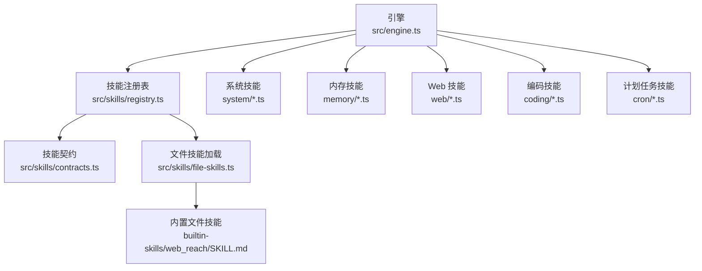
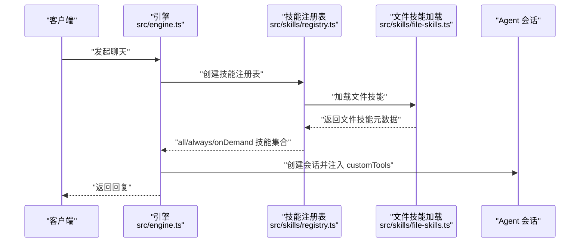
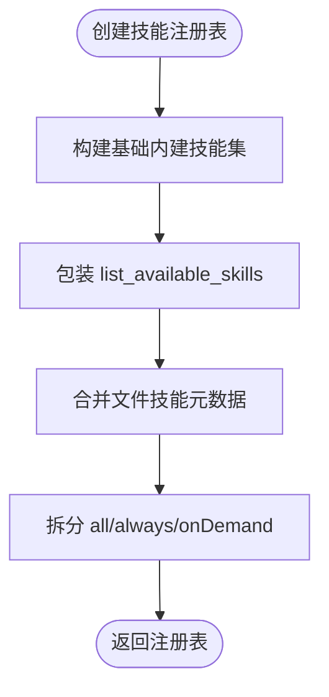
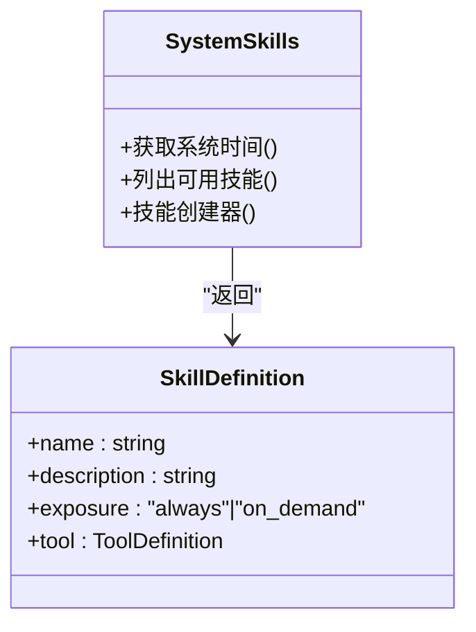
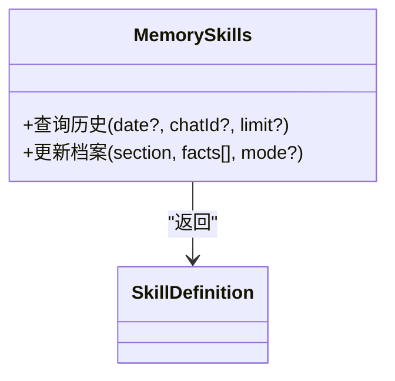
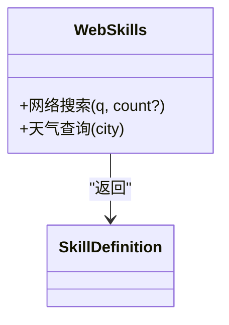
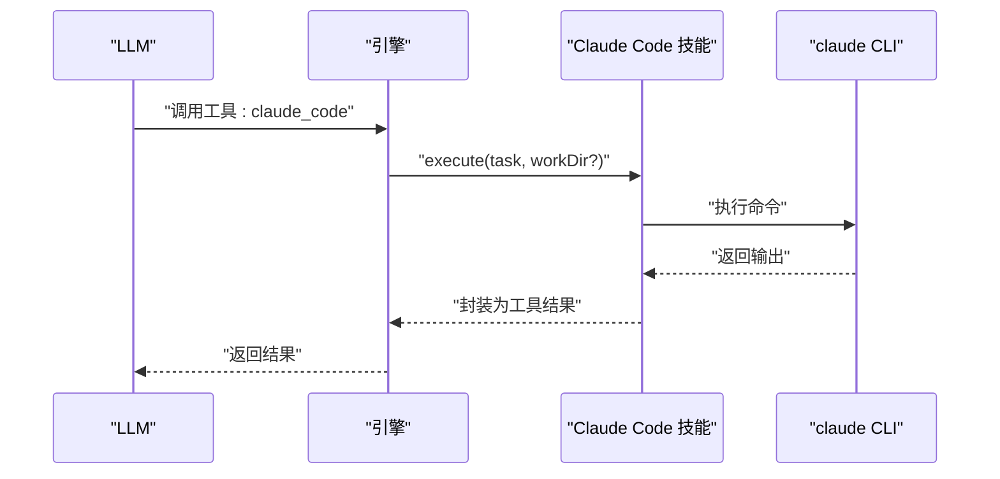
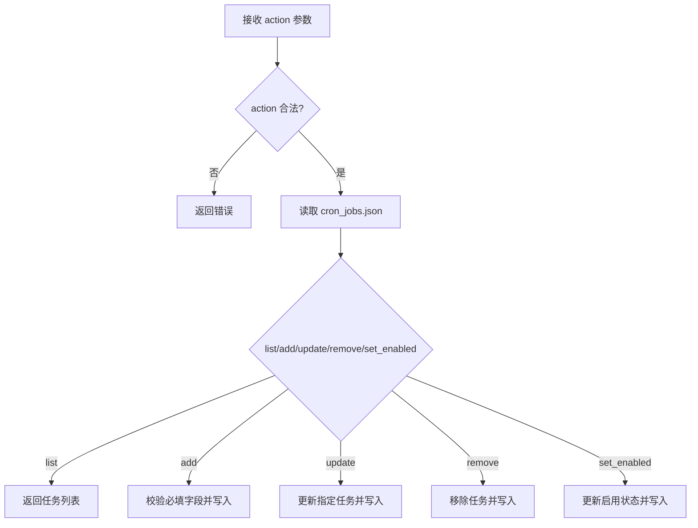
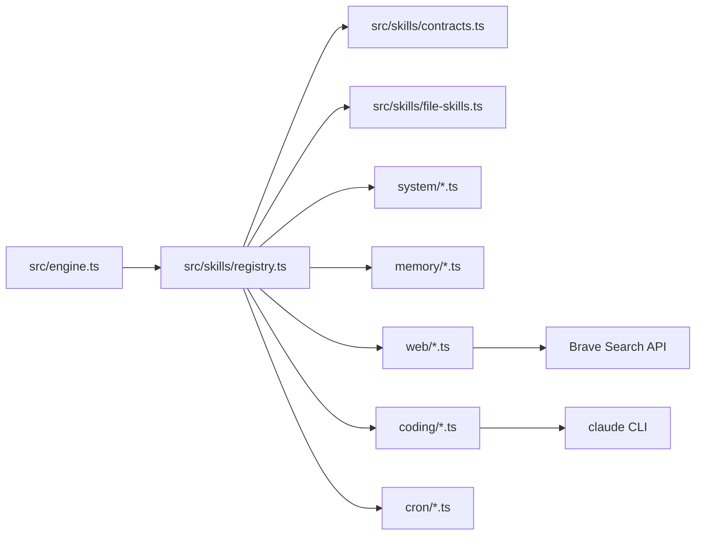

# 技能系统

<cite>
**本文引用的文件**
- [src/skills/registry.ts](file://src/skills/registry.ts)
- [src/skills/contracts.ts](file://src/skills/contracts.ts)
- [src/skills/file-skills.ts](file://src/skills/file-skills.ts)
- [src/engine.ts](file://src/engine.ts)
- [src/skills/system/get_system_time.ts](file://src/skills/system/get_system_time.ts)
- [src/skills/system/list_available_skills.ts](file://src/skills/system/list_available_skills.ts)
- [src/skills/system/skill_creator.ts](file://src/skills/system/skill_creator.ts)
- [src/skills/memory/query_history.ts](file://src/skills/memory/query_history.ts)
- [src/skills/memory/update_profile.ts](file://src/skills/memory/update_profile.ts)
- [src/skills/web/web_search.ts](file://src/skills/web/web_search.ts)
- [src/skills/web/get_weather.ts](file://src/skills/web/get_weather.ts)
- [src/skills/coding/claude_code.ts](file://src/skills/coding/claude_code.ts)
- [src/skills/cron/manage_cron_jobs.ts](file://src/skills/cron/manage_cron_jobs.ts)
- [builtin-skills/web_reach/SKILL.md](file://builtin-skills/web_reach/SKILL.md)
</cite>

## 目录
1. [简介](#简介)
2. [项目结构](#项目结构)
3. [核心组件](#核心组件)
4. [架构总览](#架构总览)
5. [详细组件分析](#详细组件分析)
6. [依赖关系分析](#依赖关系分析)
7. [性能考量](#性能考量)
8. [故障排查指南](#故障排查指南)
9. [结论](#结论)
10. [附录](#附录)

## 简介
本文件系统性阐述 StupidClaw 的技能系统设计与实现，包括技能注册表机制、技能定义规范与工具接口标准、内置技能分类与功能说明、技能开发与集成最佳实践，以及安全与性能注意事项。读者可据此快速理解如何扩展与安全地使用技能体系。

## 项目结构
技能系统围绕“技能注册表”组织，将内建技能与文件技能统一注入到引擎会话中，供 LLM 在对话中按需调用。核心目录与文件如下：
- 注册表与契约：src/skills/registry.ts、src/skills/contracts.ts
- 文件技能加载：src/skills/file-skills.ts
- 引擎集成：src/engine.ts
- 内置技能实现：
  - 系统技能：src/skills/system/*.ts
  - 内存技能：src/skills/memory/*.ts
  - Web 技能：src/skills/web/*.ts
  - 编码技能：src/skills/coding/*.ts
  - 计划任务技能：src/skills/cron/*.ts
- 内置文件技能样例：builtin-skills/web_reach/SKILL.md

图表来源
- [src/engine.ts:422-459](file://src/engine.ts#L422-L459)
- [src/skills/registry.ts:23-54](file://src/skills/registry.ts#L23-L54)
- [src/skills/file-skills.ts:26-64](file://src/skills/file-skills.ts#L26-L64)

章节来源
- [src/engine.ts:422-459](file://src/engine.ts#L422-L459)
- [src/skills/registry.ts:23-54](file://src/skills/registry.ts#L23-L54)
- [src/skills/file-skills.ts:26-64](file://src/skills/file-skills.ts#L26-L64)

## 核心组件
- 技能契约与元数据
  - SkillMeta：技能名称、描述、曝光级别（always/on_demand）
  - SkillDefinition：在 SkillMeta 基础上附加 ToolDefinition，作为可被引擎识别与调用的工具单元
  - SkillContext：当前会话上下文（chatId）
- 技能注册表
  - 统一收集内建技能与文件技能，拆分为 all、always、onDemand 三类
  - 提供 list_available_skills 作为“技能目录”工具，帮助用户了解可用能力
- 文件技能加载
  - 从项目 skills 目录与内置 builtin-skills 目录加载 SKILL.md，并去重合并
  - 将文件技能以 on_demand 方式暴露给引擎

章节来源
- [src/skills/contracts.ts:4-19](file://src/skills/contracts.ts#L4-L19)
- [src/skills/registry.ts:13-21](file://src/skills/registry.ts#L13-L21)
- [src/skills/registry.ts:23-54](file://src/skills/registry.ts#L23-L54)
- [src/skills/file-skills.ts:58-64](file://src/skills/file-skills.ts#L58-L64)

## 架构总览
引擎在创建会话时：
- 构造技能注册表，包含系统、内存、Web、编码、计划任务等内建技能，以及文件技能
- 将所有技能注入 AgentSession 的 customTools，同时保留基础 read/write/edit/bash 工具
- 将文件技能以静态 prompt 片段形式注入系统提示，确保 LLM 知晓其存在与能力

图表来源
- [src/engine.ts:422-459](file://src/engine.ts#L422-L459)
- [src/skills/registry.ts:23-54](file://src/skills/registry.ts#L23-L54)
- [src/skills/file-skills.ts:26-64](file://src/skills/file-skills.ts#L26-L64)

## 详细组件分析

### 技能注册表与加载流程
- 内建技能来源：系统技能（时间、列出技能、创建技能）、内存技能（查询历史、更新档案）、Web 技能（搜索、天气）、编码技能（Claude Code）、计划任务技能（管理 cron）
- 文件技能来源：项目 skills 目录与内置 builtin-skills 目录，按名称去重后合并
- 暴露策略：
  - always：始终可用，如获取系统时间、列出技能
  - on_demand：按需调用，如查询历史、更新档案、Web 搜索、天气、编码、计划任务管理、文件技能

图表来源
- [src/skills/registry.ts:23-54](file://src/skills/registry.ts#L23-L54)

章节来源
- [src/skills/registry.ts:23-54](file://src/skills/registry.ts#L23-L54)
- [src/skills/file-skills.ts:26-64](file://src/skills/file-skills.ts#L26-L64)

### 系统技能
- 获取系统时间
  - 名称与描述：见实现
  - 暴露级别：always
  - 输出：包含 ISO 时间与本地时间字符串
- 列出可用技能
  - 名称与描述：见实现
  - 暴露级别：always
  - 输出：技能目录（含名称、描述、曝光级别），并附带使用指引
- 技能创建器
  - 名称与描述：见实现
  - 暴露级别：on_demand
  - 能力：读取/创建/更新 SKILL.md，规范化名称，生成模板，支持 references 子目录

图表来源
- [src/skills/system/get_system_time.ts:4-37](file://src/skills/system/get_system_time.ts#L4-L37)
- [src/skills/system/list_available_skills.ts:4-39](file://src/skills/system/list_available_skills.ts#L4-L39)
- [src/skills/system/skill_creator.ts:65-311](file://src/skills/system/skill_creator.ts#L65-L311)

章节来源
- [src/skills/system/get_system_time.ts:4-37](file://src/skills/system/get_system_time.ts#L4-L37)
- [src/skills/system/list_available_skills.ts:4-39](file://src/skills/system/list_available_skills.ts#L4-L39)
- [src/skills/system/skill_creator.ts:65-311](file://src/skills/system/skill_creator.ts#L65-L311)

### 内存技能
- 查询历史
  - 名称与描述：见实现
  - 暴露级别：on_demand
  - 能力：按日期、chatId、限制条数查询历史事件
- 更新档案
  - 名称与描述：见实现
  - 暴露级别：on_demand
  - 能力：更新 profile.md 的指定 section（stable_facts、preferences、constraints），支持追加或替换模式

图表来源
- [src/skills/memory/query_history.ts:5-56](file://src/skills/memory/query_history.ts#L5-L56)
- [src/skills/memory/update_profile.ts:10-83](file://src/skills/memory/update_profile.ts#L10-L83)

章节来源
- [src/skills/memory/query_history.ts:5-56](file://src/skills/memory/query_history.ts#L5-L56)
- [src/skills/memory/update_profile.ts:10-83](file://src/skills/memory/update_profile.ts#L10-L83)

### Web 技能
- 网络搜索
  - 名称与描述：见实现
  - 暴露级别：on_demand
  - 能力：Brave Search API 搜索，返回标题、链接与摘要
  - 依赖：BRAVE_SEARCH_API_KEY 环境变量
- 天气查询
  - 名称与描述：见实现
  - 暴露级别：on_demand
  - 能力：查询指定城市实时天气与今日预报，支持中文城市名

图表来源
- [src/skills/web/web_search.ts:16-94](file://src/skills/web/web_search.ts#L16-L94)
- [src/skills/web/get_weather.ts:30-109](file://src/skills/web/get_weather.ts#L30-L109)

章节来源
- [src/skills/web/web_search.ts:16-94](file://src/skills/web/web_search.ts#L16-L94)
- [src/skills/web/get_weather.ts:30-109](file://src/skills/web/get_weather.ts#L30-L109)

### 编码技能
- Claude Code
  - 名称与描述：见实现
  - 暴露级别：on_demand
  - 能力：调用本机 Claude Code CLI 执行编程任务，支持工作目录参数
  - 依赖：本机安装 claude CLI

图表来源
- [src/skills/coding/claude_code.ts:8-98](file://src/skills/coding/claude_code.ts#L8-L98)

章节来源
- [src/skills/coding/claude_code.ts:8-98](file://src/skills/coding/claude_code.ts#L8-L98)

### 计划任务技能
- 管理定时任务
  - 名称与描述：见实现
  - 暴露级别：on_demand
  - 能力：list/add/update/remove/set_enabled，支持固定工具调用或 LLM 动态生成内容两种模式
  - 数据持久化：.stupidClaw/cron_jobs.json

图表来源
- [src/skills/cron/manage_cron_jobs.ts:32-335](file://src/skills/cron/manage_cron_jobs.ts#L32-L335)

章节来源
- [src/skills/cron/manage_cron_jobs.ts:32-335](file://src/skills/cron/manage_cron_jobs.ts#L32-L335)

### 文件技能与内置示例
- 文件技能加载
  - 从项目 skills 与内置 builtin-skills 目录加载 SKILL.md
  - 去重策略：按名称去重，保留首次出现的定义
  - 暴露策略：统一标记为 on_demand
- 内置示例：web_reach
  - 描述：覆盖多平台联网能力（网页、搜索、社交、视频、RSS 等）
  - 使用方式：通过 bash 工具与命令行调用，示例位于 SKILL.md

章节来源
- [src/skills/file-skills.ts:26-64](file://src/skills/file-skills.ts#L26-L64)
- [builtin-skills/web_reach/SKILL.md:1-122](file://builtin-skills/web_reach/SKILL.md#L1-L122)

## 依赖关系分析
- 引擎对注册表的依赖
  - 引擎在创建会话时调用 createSkillRegistry，并将 all 注入 customTools
  - 引擎将文件技能的 prompt 片段拼接到系统提示中
- 注册表对各技能模块的依赖
  - 注册表聚合内建技能与文件技能元数据，形成统一的技能目录
- 技能对环境变量与外部资源的依赖
  - Web 技能依赖 BRAVE_SEARCH_API_KEY
  - 编码技能依赖本机 claude CLI
  - 计划任务技能依赖本地文件存储

图表来源
- [src/engine.ts:422-459](file://src/engine.ts#L422-L459)
- [src/skills/registry.ts:23-54](file://src/skills/registry.ts#L23-L54)
- [src/skills/web/web_search.ts:34-46](file://src/skills/web/web_search.ts#L34-L46)
- [src/skills/coding/claude_code.ts:38-52](file://src/skills/coding/claude_code.ts#L38-L52)

章节来源
- [src/engine.ts:422-459](file://src/engine.ts#L422-L459)
- [src/skills/registry.ts:23-54](file://src/skills/registry.ts#L23-L54)
- [src/skills/web/web_search.ts:34-46](file://src/skills/web/web_search.ts#L34-L46)
- [src/skills/coding/claude_code.ts:38-52](file://src/skills/coding/claude_code.ts#L38-L52)

## 性能考量
- 工具调用开销
  - Web 技能涉及网络请求，建议合理设置 count/limit，避免过度请求
  - 编码技能执行时间较长，建议控制任务粒度与工作目录范围
- 注册表与会话初始化
  - 文件技能加载在会话创建时进行，建议减少不必要的 SKILL.md 数量与冗余内容
- 输出与日志
  - 引擎提供调试开关，可在开发阶段开启以观察工具清单与提示构造

## 故障排查指南
- API 密钥相关
  - 引擎在模型调用失败时会归一化错误，提示缺少或错误的 API Key，并给出配置建议
- Web 技能
  - 未配置 BRAVE_SEARCH_API_KEY 时，技能会返回明确错误提示
- 编码技能
  - 未安装 claude CLI 时，技能会提示安装指引
- 计划任务
  - cron 表达式必须为 5 段格式；新增任务时需提供必要参数；启用状态变更需提供 id 与布尔值

章节来源
- [src/engine.ts:162-186](file://src/engine.ts#L162-L186)
- [src/skills/web/web_search.ts:36-46](file://src/skills/web/web_search.ts#L36-L46)
- [src/skills/coding/claude_code.ts:61-71](file://src/skills/coding/claude_code.ts#L61-L71)
- [src/skills/cron/manage_cron_jobs.ts:164-174](file://src/skills/cron/manage_cron_jobs.ts#L164-L174)

## 结论
StupidClaw 的技能系统通过“注册表 + 契约 + 文件技能”的组合，实现了内建能力与用户自定义能力的一致化暴露与安全集成。系统遵循“先 always、后 on_demand”的使用策略，既保证高频能力的可用性，又避免技能过多导致的上下文污染。配合内置文件技能与示例，开发者可快速扩展符合自身业务的技能生态。

## 附录

### 技能定义规范与工具接口标准
- 技能元数据
  - name：技能唯一标识，小写字母、数字、连字符组成
  - description：技能用途与触发条件说明
  - exposure：always 或 on_demand
- 工具定义
  - name、label、description
  - parameters：基于 Schema 的参数定义
  - execute：异步执行函数，返回标准化内容与详情
- 上下文
  - SkillContext 提供 chatId，便于跨技能共享会话信息

章节来源
- [src/skills/contracts.ts:4-19](file://src/skills/contracts.ts#L4-L19)

### 内置技能一览
- 系统技能
  - get_system_time：always
  - list_available_skills：always
  - skill_creator：on_demand
- 内存技能
  - query_history：on_demand
  - update_profile：on_demand
- Web 技能
  - web_search：on_demand（依赖 BRAVE_SEARCH_API_KEY）
  - get_weather：on_demand
- 编码技能
  - claude_code：on_demand（依赖本机 CLI）
- 计划任务技能
  - manage_cron_jobs：on_demand（持久化于本地文件）

章节来源
- [src/skills/system/get_system_time.ts:4-37](file://src/skills/system/get_system_time.ts#L4-L37)
- [src/skills/system/list_available_skills.ts:4-39](file://src/skills/system/list_available_skills.ts#L4-L39)
- [src/skills/system/skill_creator.ts:65-311](file://src/skills/system/skill_creator.ts#L65-L311)
- [src/skills/memory/query_history.ts:5-56](file://src/skills/memory/query_history.ts#L5-L56)
- [src/skills/memory/update_profile.ts:10-83](file://src/skills/memory/update_profile.ts#L10-L83)
- [src/skills/web/web_search.ts:16-94](file://src/skills/web/web_search.ts#L16-L94)
- [src/skills/web/get_weather.ts:30-109](file://src/skills/web/get_weather.ts#L30-L109)
- [src/skills/coding/claude_code.ts:8-98](file://src/skills/coding/claude_code.ts#L8-L98)
- [src/skills/cron/manage_cron_jobs.ts:32-335](file://src/skills/cron/manage_cron_jobs.ts#L32-L335)

### 技能开发指南与最佳实践
- 创建新技能
  - 在项目 skills/<name>/ 目录下创建 SKILL.md，遵循 YAML frontmatter 与正文结构
  - 使用 skill_creator 工具进行读取/创建/更新，确保 name 规范化并与目录同名
- 触发描述
  - description 是主要触发机制，应明确“做什么”和“何时触发”，尽量具体
- 输出格式
  - 统一返回结构化文本，必要时使用 references/ 子目录存放长文档
- 安全与隔离
  - 严格限制文件技能对工作区的写入，优先使用临时目录
  - 对外部 API 调用增加超时与错误处理
- 暴露策略
  - 高频、低风险能力使用 always；需要谨慎授权或高成本能力使用 on_demand

章节来源
- [src/skills/system/skill_creator.ts:65-311](file://src/skills/system/skill_creator.ts#L65-L311)
- [src/skills/file-skills.ts:26-64](file://src/skills/file-skills.ts#L26-L64)
- [builtin-skills/web_reach/SKILL.md:1-122](file://builtin-skills/web_reach/SKILL.md#L1-L122)