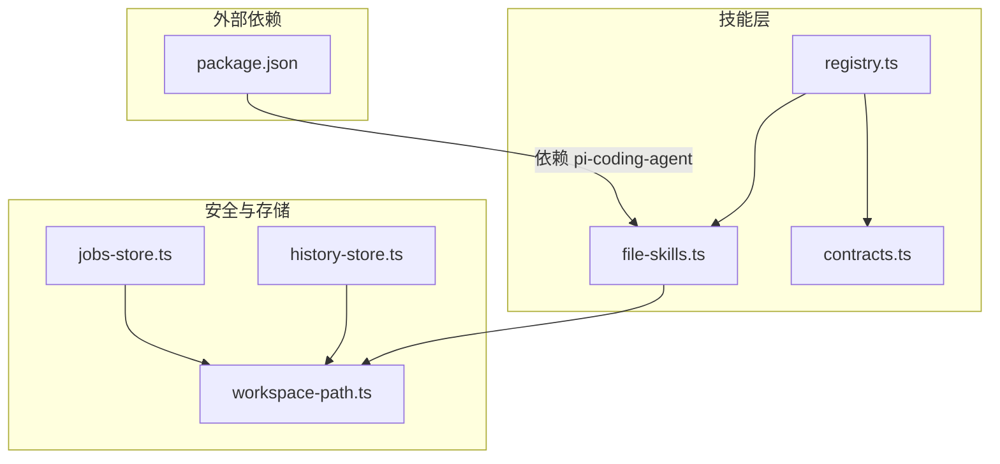
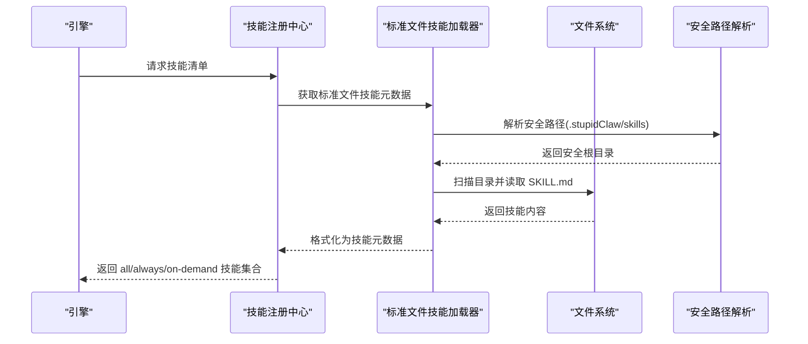
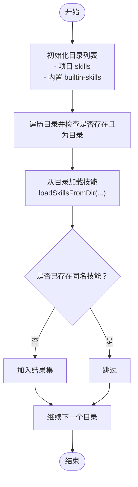
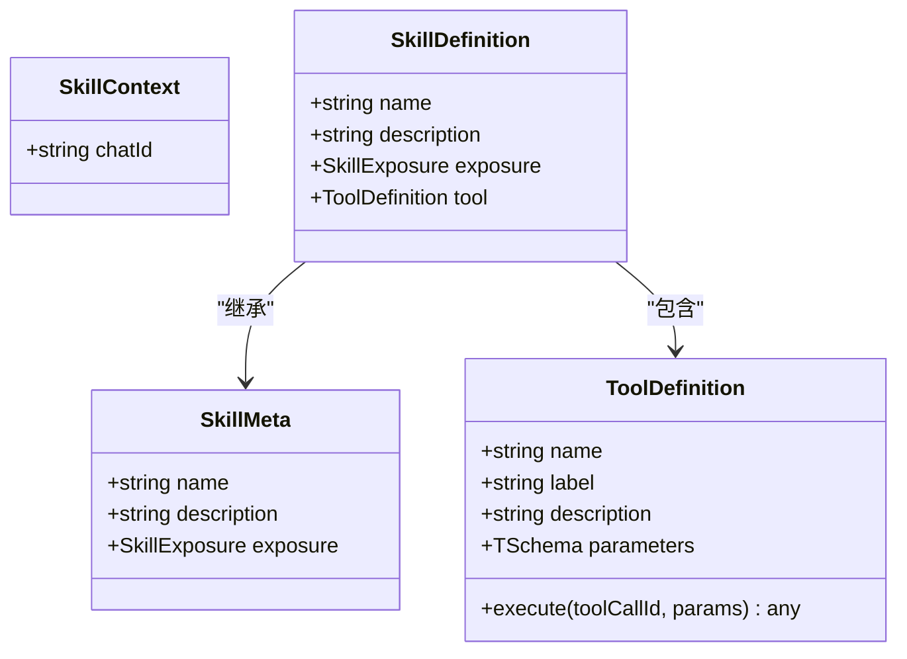
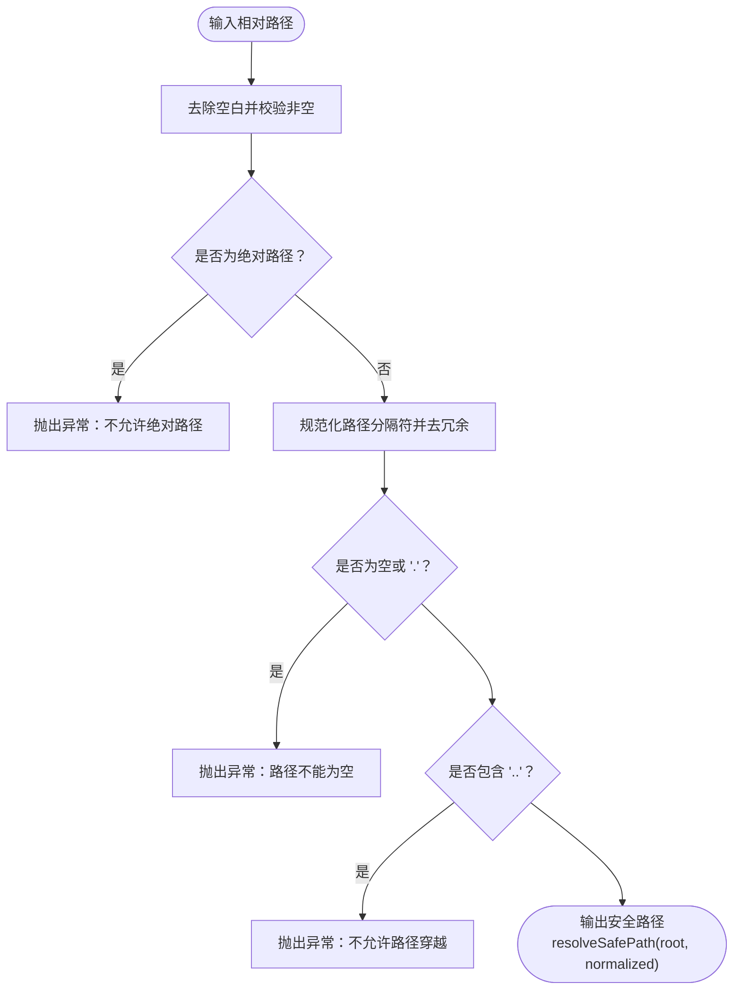
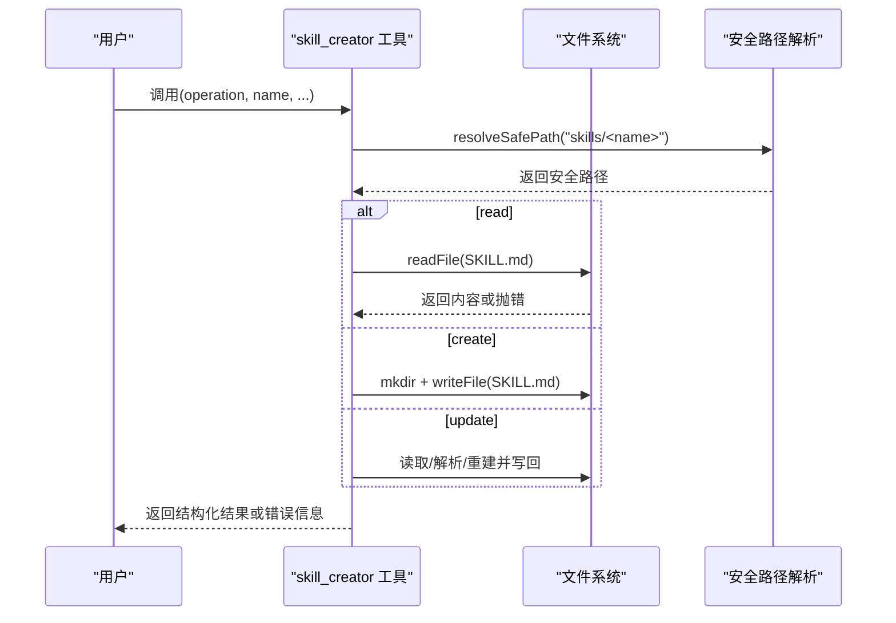
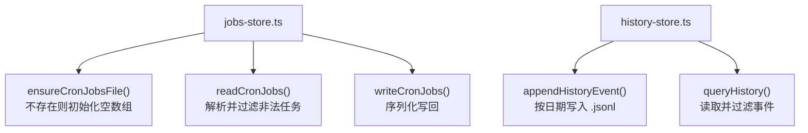
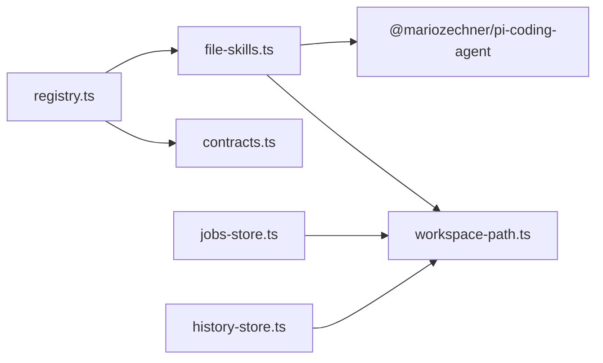

# 文件技能

<cite>
**本文引用的文件**
- [src/skills/file-skills.ts](file://src/skills/file-skills.ts)
- [src/skills/contracts.ts](file://src/skills/contracts.ts)
- [src/memory/workspace-path.ts](file://src/memory/workspace-path.ts)
- [src/memory/workspace-path.test.ts](file://src/memory/workspace-path.test.ts)
- [src/skills/registry.ts](file://src/skills/registry.ts)
- [src/cron/jobs-store.ts](file://src/cron/jobs-store.ts)
- [src/memory/history-store.ts](file://src/memory/history-store.ts)
- [src/skills/system/skill_creator.ts](file://src/skills/system/skill_creator.ts)
- [package.json](file://package.json)
- [StupidClaw-第5期-安全沙盒PathJailing防止越权读写.md](file://StupidClaw-第5期-安全沙盒PathJailing防止越权读写.md)
</cite>

## 目录
1. [简介](#简介)
2. [项目结构](#项目结构)
3. [核心组件](#核心组件)
4. [架构总览](#架构总览)
5. [详细组件分析](#详细组件分析)
6. [依赖关系分析](#依赖关系分析)
7. [性能考虑](#性能考虑)
8. [故障排查指南](#故障排查指南)
9. [结论](#结论)
10. [附录](#附录)

## 简介
本文件技能体系围绕“文件技能”的标准化接口设计与实现展开，重点覆盖以下方面：
- 文件读取、写入、删除、列表等基础操作的技能封装方式
- 安全机制：路径沙盒控制、文件权限验证、访问日志记录
- 工具定义规范、参数验证规则与错误处理机制
- 实际应用场景示例：配置文件管理、日志处理、数据备份
- 性能优化建议与安全最佳实践

## 项目结构
文件技能系统位于 src/skills 目录下，核心文件包括：
- file-skills.ts：标准文件技能的加载与元数据导出
- contracts.ts：技能与工具定义的类型契约
- workspace-path.ts：统一的安全路径解析与沙盒根目录
- registry.ts：技能注册中心，整合内置技能与文件技能
- jobs-store.ts、history-store.ts：与文件相关的持久化存储示例（定时任务与历史记录）
- skill_creator.ts：用于演示“基于文件的技能”组织方式与参数校验

图表来源
- [src/skills/file-skills.ts:1-65](file://src/skills/file-skills.ts#L1-L65)
- [src/skills/registry.ts:1-55](file://src/skills/registry.ts#L1-L55)
- [src/memory/workspace-path.ts:1-42](file://src/memory/workspace-path.ts#L1-L42)
- [src/cron/jobs-store.ts:1-151](file://src/cron/jobs-store.ts#L1-L151)
- [src/memory/history-store.ts:1-83](file://src/memory/history-store.ts#L1-L83)
- [package.json:1-39](file://package.json#L1-L39)

章节来源
- [src/skills/file-skills.ts:1-65](file://src/skills/file-skills.ts#L1-L65)
- [src/skills/registry.ts:1-55](file://src/skills/registry.ts#L1-L55)
- [src/memory/workspace-path.ts:1-42](file://src/memory/workspace-path.ts#L1-L42)
- [package.json:1-39](file://package.json#L1-L39)

## 核心组件
- 标准文件技能加载器：负责扫描项目与内置技能目录，去重并格式化为统一技能清单
- 技能元数据导出：提供技能名称、描述与曝光级别
- 统一安全路径解析：将相对路径规范化并限制在 .stupidClaw 根目录之下
- 技能注册中心：将标准文件技能与内置技能合并，区分 always/on-demand 暴露策略

章节来源
- [src/skills/file-skills.ts:26-64](file://src/skills/file-skills.ts#L26-L64)
- [src/skills/contracts.ts:4-19](file://src/skills/contracts.ts#L4-L19)
- [src/memory/workspace-path.ts:32-41](file://src/memory/workspace-path.ts#L32-L41)
- [src/skills/registry.ts:40-54](file://src/skills/registry.ts#L40-L54)

## 架构总览
文件技能系统通过“文件即技能”的模式，将每个技能封装为独立目录下的 SKILL.md 文档。运行时由加载器扫描目录，将每个技能转换为统一的工具定义，供引擎按需调用。

图表来源
- [src/skills/file-skills.ts:15-48](file://src/skills/file-skills.ts#L15-L48)
- [src/skills/registry.ts:40-54](file://src/skills/registry.ts#L40-L54)
- [src/memory/workspace-path.ts:32-35](file://src/memory/workspace-path.ts#L32-L35)

## 详细组件分析

### 组件A：标准文件技能加载器
职责
- 定义项目与内置技能目录
- 去重与合并技能清单
- 将技能格式化为提示可用的字符串

关键点
- 使用安全路径解析确保只在限定目录内扫描
- 基于技能名称去重，避免重复暴露
- 输出技能元数据，供注册中心与提示构造使用

图表来源
- [src/skills/file-skills.ts:15-48](file://src/skills/file-skills.ts#L15-L48)

章节来源
- [src/skills/file-skills.ts:15-48](file://src/skills/file-skills.ts#L15-L48)

### 组件B：技能元数据与工具定义契约
职责
- 定义技能元信息（名称、描述、曝光级别）
- 定义工具定义（名称、标签、描述、参数模式、执行函数）

关键点
- 曝光级别分为 always 与 on_demand，影响可见性与调用时机
- 工具参数采用强类型模式（Type.Object/Type.Union 等），便于自动校验与提示

图表来源
- [src/skills/contracts.ts:4-19](file://src/skills/contracts.ts#L4-L19)

章节来源
- [src/skills/contracts.ts:4-19](file://src/skills/contracts.ts#L4-L19)

### 组件C：安全路径解析与沙盒
职责
- 将相对路径规范化，拒绝绝对路径与路径穿越
- 将所有受控路径解析到 .stupidClaw 根目录之下
- 提供工作区目录的初始化与保证

关键点
- 输入校验：空串、绝对路径、路径穿越均被拒绝
- 输出保证：解析后的路径始终位于 .stupidClaw 根目录内
- 辅助函数：确保 workspace/history/skills 目录存在

图表来源
- [src/memory/workspace-path.ts:6-35](file://src/memory/workspace-path.ts#L6-L35)

章节来源
- [src/memory/workspace-path.ts:6-35](file://src/memory/workspace-path.ts#L6-L35)
- [src/memory/workspace-path.test.ts:6-28](file://src/memory/workspace-path.test.ts#L6-L28)

### 组件D：技能注册中心与文件技能集成
职责
- 整合内置技能与标准文件技能
- 区分 always 与 on_demand 技能集合
- 对外提供统一的技能查询与提示

关键点
- 通过 getStandardFileSkillMetas() 将文件技能纳入注册中心
- 保持内置技能与文件技能的统一曝光策略

图表来源
- [src/skills/registry.ts:40-54](file://src/skills/registry.ts#L40-L54)
- [src/skills/file-skills.ts:58-64](file://src/skills/file-skills.ts#L58-L64)

章节来源
- [src/skills/registry.ts:40-54](file://src/skills/registry.ts#L40-L54)
- [src/skills/file-skills.ts:58-64](file://src/skills/file-skills.ts#L58-L64)

### 组件E：基于文件的技能示例（技能文件管理）
职责
- 展示“文件即技能”的组织方式：每个技能一个目录，包含 SKILL.md
- 提供读取、创建、更新技能文件的能力
- 参数校验与错误处理示范

关键点
- 名称规范化：仅允许小写字母、数字、连字符
- 创建流程：先读取是否存在，再写入模板或自定义内容
- 更新流程：支持完整替换或仅更新触发描述

图表来源
- [src/skills/system/skill_creator.ts:127-308](file://src/skills/system/skill_creator.ts#L127-L308)
- [src/memory/workspace-path.ts:32-35](file://src/memory/workspace-path.ts#L32-L35)

章节来源
- [src/skills/system/skill_creator.ts:127-308](file://src/skills/system/skill_creator.ts#L127-L308)
- [src/memory/workspace-path.ts:32-35](file://src/memory/workspace-path.ts#L32-L35)

### 组件F：与文件相关的持久化示例
职责
- 展示如何在安全路径下进行文件读写
- 作为“文件技能”的参考实现（读取/写入 JSON/文本）

关键点
- jobs-store：定时任务配置文件的读写与校验
- history-store：历史事件的追加与查询（按日期分片）

图表来源
- [src/cron/jobs-store.ts:115-142](file://src/cron/jobs-store.ts#L115-L142)
- [src/memory/history-store.ts:37-82](file://src/memory/history-store.ts#L37-L82)

章节来源
- [src/cron/jobs-store.ts:115-142](file://src/cron/jobs-store.ts#L115-L142)
- [src/memory/history-store.ts:37-82](file://src/memory/history-store.ts#L37-L82)

## 依赖关系分析
- file-skills.ts 依赖 pi-coding-agent 的工具加载能力，并通过 workspace-path.ts 进行路径安全控制
- registry.ts 依赖 file-skills.ts 的元数据导出，将文件技能与内置技能统一管理
- jobs-store.ts 与 history-store.ts 均依赖 workspace-path.ts 的安全路径解析，确保数据文件在受控目录内

图表来源
- [src/skills/file-skills.ts:1-9](file://src/skills/file-skills.ts#L1-L9)
- [src/skills/registry.ts:1-11](file://src/skills/registry.ts#L1-L11)
- [src/cron/jobs-store.ts:1-2](file://src/cron/jobs-store.ts#L1-L2)
- [src/memory/history-store.ts:1-3](file://src/memory/history-store.ts#L1-L3)

章节来源
- [src/skills/file-skills.ts:1-9](file://src/skills/file-skills.ts#L1-L9)
- [src/skills/registry.ts:1-11](file://src/skills/registry.ts#L1-L11)
- [src/cron/jobs-store.ts:1-2](file://src/cron/jobs-store.ts#L1-L2)
- [src/memory/history-store.ts:1-3](file://src/memory/history-store.ts#L1-L3)

## 性能考虑
- 目录扫描与去重：在技能数量较多时，建议缓存已加载技能列表，避免重复扫描
- I/O 合并：对频繁的小文件读写（如历史记录）可考虑批量写入或缓冲策略
- 路径解析复用：将 resolveSafePath 结果缓存于单次调用上下文中，减少重复计算
- 类型校验前置：利用工具参数的强类型定义在进入执行逻辑前尽早失败，降低后续 I/O 成本

## 故障排查指南
- 路径相关错误
  - 现象：抛出“路径不能为空/不允许绝对路径/不允许路径穿越”
  - 排查：确认传入路径为相对路径，不包含 .. 或绝对前缀
  - 参考：安全路径解析的输入校验逻辑
- 文件不存在
  - 现象：读取失败或返回“技能不存在”
  - 排查：确认 SKILL.md 是否存在于对应目录；检查目录权限与大小写
- 权限不足
  - 现象：写入/创建失败
  - 排查：确认 .stupidClaw 根目录及其子目录具备写权限
- 参数校验失败
  - 现象：返回“缺少必要参数/参数非法”
  - 排查：对照工具定义的参数模式，补齐必填项并修正格式

章节来源
- [src/memory/workspace-path.ts:6-26](file://src/memory/workspace-path.ts#L6-L26)
- [src/skills/system/skill_creator.ts:136-147](file://src/skills/system/skill_creator.ts#L136-L147)
- [src/skills/system/skill_creator.ts:184-192](file://src/skills/system/skill_creator.ts#L184-L192)
- [src/skills/system/skill_creator.ts:244-255](file://src/skills/system/skill_creator.ts#L244-L255)

## 结论
文件技能系统通过“文件即技能”的模式，结合统一的安全路径解析与严格的参数校验，实现了可扩展、可审计、可维护的技能生态。配合注册中心的曝光策略与提示构造，能够在保证安全的前提下灵活地按需披露与调用技能。

## 附录

### 文件技能使用示例
- 配置文件管理
  - 在 .stupidClaw/skills/<name>/SKILL.md 中定义技能描述与步骤
  - 使用 skill_creator 工具进行读取/创建/更新
- 日志处理
  - 历史记录按日期分片存储于 .stupidClaw/history/<YYYY-MM-DD>.jsonl
  - 使用历史查询工具按日期与 chatId 过滤
- 数据备份
  - 将备份数据写入 .stupidClaw/workspace/<type>/<date>.json
  - 通过安全路径解析确保写入位置受控

章节来源
- [src/skills/system/skill_creator.ts:127-308](file://src/skills/system/skill_creator.ts#L127-L308)
- [src/memory/history-store.ts:37-82](file://src/memory/history-store.ts#L37-L82)
- [src/cron/jobs-store.ts:115-142](file://src/cron/jobs-store.ts#L115-L142)

### 安全最佳实践
- 始终使用 resolveSafePath 解析用户输入的相对路径
- 严格禁止绝对路径与路径穿越（..）
- 对外暴露的工具参数必须具备强类型定义与最小必要性
- 访问日志：对关键文件操作（读取/写入/删除）记录操作者、时间、路径与结果
- 权限最小化：仅授予必要的读写权限，避免全局可写

章节来源
- [src/memory/workspace-path.ts:6-35](file://src/memory/workspace-path.ts#L6-L35)
- [StupidClaw-第5期-安全沙盒PathJailing防止越权读写.md:105-111](file://StupidClaw-第5期-安全沙盒PathJailing防止越权读写.md#L105-L111)