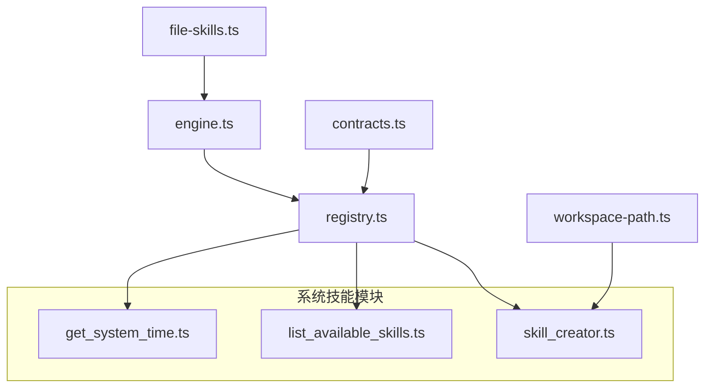
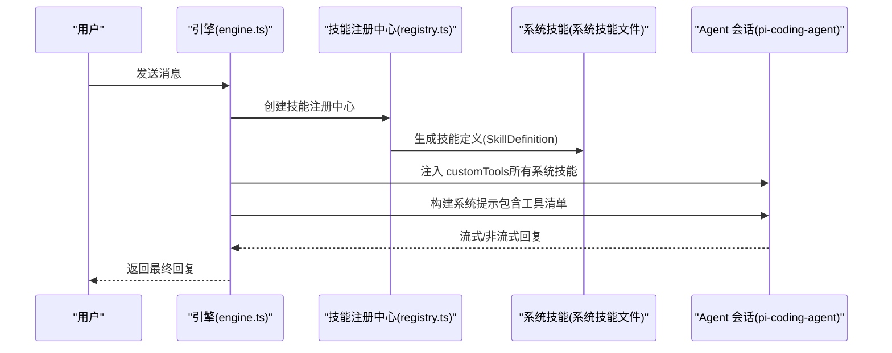
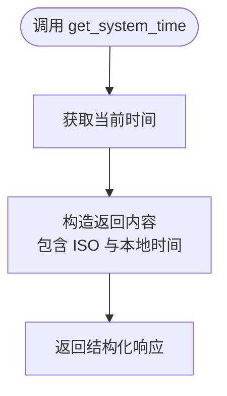
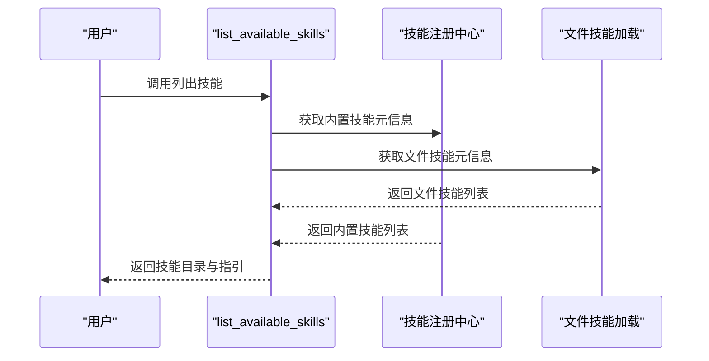
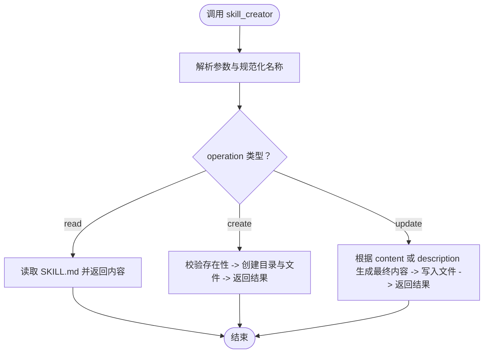
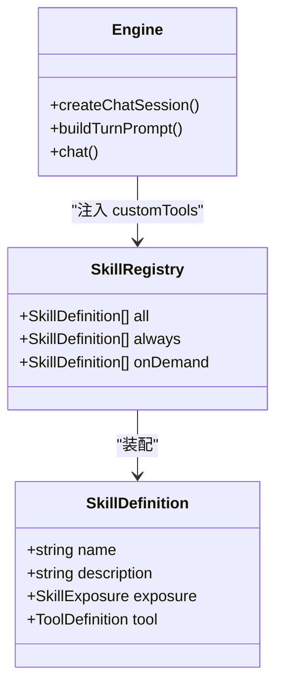
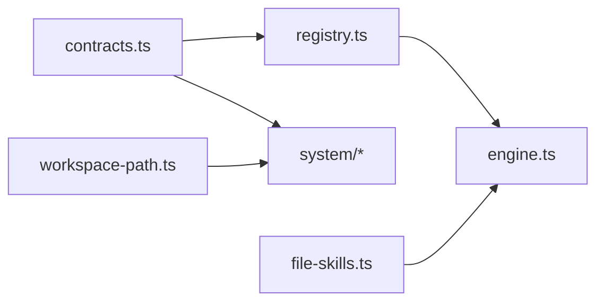

# 系统技能

<cite>
**本文引用的文件列表**
- [get_system_time.ts](file://src/skills/system/get_system_time.ts)
- [list_available_skills.ts](file://src/skills/system/list_available_skills.ts)
- [skill_creator.ts](file://src/skills/system/skill_creator.ts)
- [registry.ts](file://src/skills/registry.ts)
- [contracts.ts](file://src/skills/contracts.ts)
- [workspace-path.ts](file://src/memory/workspace-path.ts)
- [engine.ts](file://src/engine.ts)
- [file-skills.ts](file://src/skills/file-skills.ts)
- [web_reach/SKILL.md](file://builtin-skills/web_reach/SKILL.md)
- [StupidClaw-第5期-安全沙盒PathJailing防止越权读写.md](file://StupidClaw-第5期-安全沙盒PathJailing防止越权读写.md)
</cite>

## 目录
1. [简介](#简介)
2. [项目结构](#项目结构)
3. [核心组件](#核心组件)
4. [架构总览](#架构总览)
5. [详细组件分析](#详细组件分析)
6. [依赖关系分析](#依赖关系分析)
7. [性能考量](#性能考量)
8. [故障排查指南](#故障排查指南)
9. [结论](#结论)
10. [附录](#附录)

## 简介
本章节面向 StupidClaw 的系统技能，系统性介绍三类核心系统技能：获取系统时间技能（get_system_time）、列出可用技能技能（list_available_skills）、技能创建器技能（skill_creator）。文档将解释每项技能的功能、参数、返回值格式、实现原理、使用场景，以及它们在 Agent 对话中的集成方式。同时给出安全考虑与性能优化建议，帮助读者在实际部署中安全、高效地使用这些能力。

## 项目结构
系统技能位于 skills/system 目录下，由技能注册中心统一装配，并在引擎层注入到 Agent 会话中，供对话时按需调用。文件组织遵循“按功能分层 + 按职责拆分”的原则，便于扩展与维护。

图表来源
- [registry.ts:23-54](file://src/skills/registry.ts#L23-L54)
- [engine.ts:422-459](file://src/engine.ts#L422-L459)
- [file-skills.ts:26-48](file://src/skills/file-skills.ts#L26-L48)
- [workspace-path.ts:32-35](file://src/memory/workspace-path.ts#L32-L35)

章节来源
- [registry.ts:1-55](file://src/skills/registry.ts#L1-L55)
- [engine.ts:422-459](file://src/engine.ts#L422-L459)

## 核心组件
- 获取系统时间技能（get_system_time）
  - 功能：返回当前系统时间（ISO 与本地字符串），用于时间感知与日志记录。
  - 暴露级别：always（始终可用）
  - 参数：无
  - 返回：文本内容，包含 ISO 时间与本地时间字符串
- 列出可用技能技能（list_available_skills）
  - 功能：列举所有内置与项目/内置文件技能，标注暴露级别与用途，指导用户按需调用。
  - 暴露级别：always（始终可用）
  - 参数：无
  - 返回：文本内容，包含技能清单与使用指引
- 技能创建器技能（skill_creator）
  - 功能：在 .stupidClaw/skills/<name>/SKILL.md 下创建、读取或更新技能文件，支持标准化模板与触发描述。
  - 暴露级别：on_demand（按需）
  - 参数：operation（read/create/update）、name、description（可选）、body（可选）、content（可选）
  - 返回：文本内容，包含操作结果与路径信息

章节来源
- [get_system_time.ts:4-37](file://src/skills/system/get_system_time.ts#L4-L37)
- [list_available_skills.ts:4-39](file://src/skills/system/list_available_skills.ts#L4-L39)
- [skill_creator.ts:65-312](file://src/skills/system/skill_creator.ts#L65-L312)

## 架构总览
系统技能通过技能注册中心装配到 Agent 会话中，引擎在每次对话前构建会话工具集（customTools），并将工具名称、参数模式与暴露级别注入到系统提示中，使模型在对话中能够按需调用。

图表来源
- [engine.ts:422-459](file://src/engine.ts#L422-L459)
- [registry.ts:23-54](file://src/skills/registry.ts#L23-L54)
- [contracts.ts:16-19](file://src/skills/contracts.ts#L16-L19)

## 详细组件分析

### 组件一：获取系统时间技能（get_system_time）
- 实现要点
  - 使用 Date 对象获取当前时间，分别输出 ISO 与本地时间字符串
  - 返回内容采用统一的文本片段结构，便于 Agent 输出与历史记录
- 参数与返回
  - 参数：无
  - 返回：包含 content 数组（文本片段）与 details 的结构化响应
- 使用场景
  - 日志记录、时间戳标记、提醒与调度
  - 在系统提示中提供运行时上下文（配合引擎构建运行时上下文）

图表来源
- [get_system_time.ts:14-34](file://src/skills/system/get_system_time.ts#L14-L34)

章节来源
- [get_system_time.ts:4-37](file://src/skills/system/get_system_time.ts#L4-L37)
- [engine.ts:484-509](file://src/engine.ts#L484-L509)

### 组件二：列出可用技能技能（list_available_skills）
- 实现要点
  - 通过回调函数收集所有技能元信息（名称、描述、暴露级别）
  - 将内置技能与文件技能合并，统一输出技能目录
  - 提供使用指引，强调 always 技能优先、on_demand 技能按需调用
- 参数与返回
  - 参数：无
  - 返回：包含 skills 列表与 guidance 的文本内容
- 使用场景
  - 用户首次接入时了解可用能力
  - 模型在对话中需要“技能导航”时进行自我披露

图表来源
- [list_available_skills.ts:16-36](file://src/skills/system/list_available_skills.ts#L16-L36)
- [registry.ts:40-47](file://src/skills/registry.ts#L40-L47)
- [file-skills.ts:58-64](file://src/skills/file-skills.ts#L58-L64)

章节来源
- [list_available_skills.ts:4-39](file://src/skills/system/list_available_skills.ts#L4-L39)
- [registry.ts:40-47](file://src/skills/registry.ts#L40-L47)
- [file-skills.ts:58-64](file://src/skills/file-skills.ts#L58-L64)

### 组件三：技能创建器技能（skill_creator）
- 实现要点
  - 通过统一的安全路径解析（resolveSafePath）限定技能文件写入范围（.stupidClaw/skills/<name>/SKILL.md）
  - 支持三种操作：read（读取）、create（创建）、update（更新）
  - 创建时生成标准模板（含 YAML frontmatter 与正文骨架），并允许自定义 body
  - 更新时支持完整替换或仅更新触发描述（description）
- 参数与返回
  - 参数：operation、name、description（可选）、body（可选）、content（可选）
  - 返回：包含操作结果、路径与内容摘要的文本内容
- 使用场景
  - 动态扩展 Agent 的能力边界
  - 通过标准化模板与触发描述提升模型对技能的识别与调用准确性

图表来源
- [skill_creator.ts:127-308](file://src/skills/system/skill_creator.ts#L127-L308)
- [workspace-path.ts:32-35](file://src/memory/workspace-path.ts#L32-L35)

章节来源
- [skill_creator.ts:65-312](file://src/skills/system/skill_creator.ts#L65-L312)
- [workspace-path.ts:32-35](file://src/memory/workspace-path.ts#L32-L35)

### 组件四：技能注册中心与引擎集成
- 技能注册中心（registry.ts）
  - 装配内置系统技能与文件技能，区分 always 与 on_demand
  - 通过 list_available_skills 汇总技能元信息
- 引擎（engine.ts）
  - 创建 Agent 会话时注入 customTools（所有系统技能）
  - 构建系统提示，包含工具名称、暴露级别与参数模式摘要
  - 订阅工具调用事件，记录历史并处理错误

图表来源
- [contracts.ts:16-19](file://src/skills/contracts.ts#L16-L19)
- [registry.ts:23-54](file://src/skills/registry.ts#L23-L54)
- [engine.ts:422-459](file://src/engine.ts#L422-L459)

章节来源
- [registry.ts:23-54](file://src/skills/registry.ts#L23-L54)
- [engine.ts:422-459](file://src/engine.ts#L422-L459)

## 依赖关系分析
- 组件耦合
  - 系统技能依赖技能契约（contracts.ts）定义的 SkillDefinition 结构
  - 技能注册中心负责组装与分类（always/on_demand）
  - 引擎负责将工具注入 Agent 会话并构建系统提示
  - 技能创建器依赖安全路径解析（workspace-path.ts）确保写入范围受限
- 外部依赖
  - pi-coding-agent 提供工具定义与会话管理
  - pi-ai 提供参数 Schema 类型系统

图表来源
- [contracts.ts:16-19](file://src/skills/contracts.ts#L16-L19)
- [registry.ts:23-54](file://src/skills/registry.ts#L23-L54)
- [engine.ts:422-459](file://src/engine.ts#L422-L459)
- [workspace-path.ts:32-35](file://src/memory/workspace-path.ts#L32-L35)
- [file-skills.ts:26-48](file://src/skills/file-skills.ts#L26-L48)

章节来源
- [contracts.ts:16-19](file://src/skills/contracts.ts#L16-L19)
- [registry.ts:23-54](file://src/skills/registry.ts#L23-L54)
- [engine.ts:422-459](file://src/engine.ts#L422-L459)
- [workspace-path.ts:32-35](file://src/memory/workspace-path.ts#L32-L35)
- [file-skills.ts:26-48](file://src/skills/file-skills.ts#L26-L48)

## 性能考量
- 工具调用开销
  - get_system_time：极轻量，几乎无 IO
  - list_available_skills：聚合内置与文件技能元信息，成本低
  - skill_creator：涉及文件系统读写，建议避免频繁调用
- 建议
  - 将 skill_creator 作为一次性或低频任务使用，避免在高频对话中反复创建/更新
  - 对于大量文件技能的场景，建议在初始化阶段集中加载，减少运行时扫描成本
  - 控制系统提示长度，避免因工具过多导致上下文膨胀

## 故障排查指南
- API Key 相关错误
  - 引擎在会话创建与工具调用过程中会捕获并归一化 API Key 错误，便于定位配置问题
- 路径安全与越权
  - 所有项目内文件落盘路径统一收敛至 .stupidClaw 目录，路径解析阶段拒绝越界（如 ../）
  - 技能创建器写入路径严格受控，避免越权读写
- 常见问题
  - 技能创建失败：检查 name 是否符合规范（小写字母、数字、连字符），以及 description 是否提供
  - 技能读取失败：确认技能是否存在，路径是否正确
  - 列表为空：确认内置与文件技能目录存在且可读

章节来源
- [engine.ts:162-186](file://src/engine.ts#L162-L186)
- [workspace-path.ts:32-35](file://src/memory/workspace-path.ts#L32-L35)
- [StupidClaw-第5期-安全沙盒PathJailing防止越权读写.md:81-87](file://StupidClaw-第5期-安全沙盒PathJailing防止越权读写.md#L81-L87)

## 结论
系统技能为 StupidClaw 提供了“自我认知”“自我披露”“自我扩展”的关键能力。get_system_time 提供时间感知，list_available_skills 提供技能导航，skill_creator 提供动态扩展。通过技能注册中心与引擎的紧密协作，这些能力被安全、可控地注入到 Agent 会话中，既满足了 Agent 的自我管理需求，也为后续能力演进奠定了基础。

## 附录
- Agent 对话中的集成方式
  - 引擎在创建会话时注入 customTools（所有系统技能），并在系统提示中披露工具名称、暴露级别与参数模式
  - 模型在对话中可根据上下文与用户意图，自主决定调用哪些系统技能
- 使用建议
  - always 技能优先：如需时间信息、技能目录，优先调用 always 技能
  - on_demand 技能按需：如需历史查询、文件读写、技能创建等，按需调用
  - 技能模板与触发描述：通过标准化模板与明确的触发描述，提升模型对技能的识别与调用成功率

章节来源
- [engine.ts:422-459](file://src/engine.ts#L422-L459)
- [list_available_skills.ts:27-28](file://src/skills/system/list_available_skills.ts#L27-L28)
- [web_reach/SKILL.md:1-122](file://builtin-skills/web_reach/SKILL.md#L1-L122)