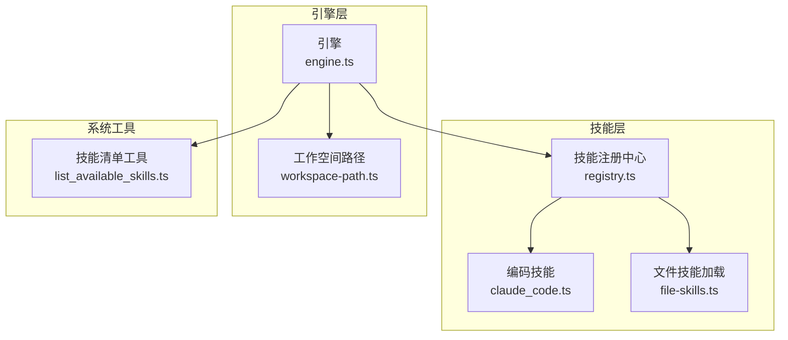
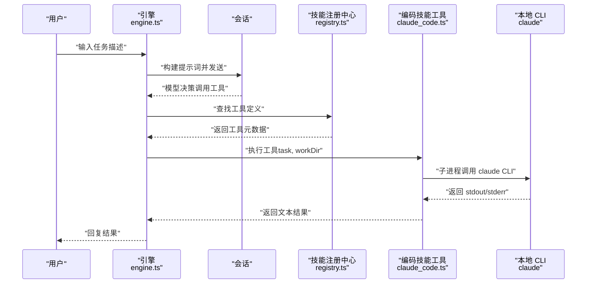
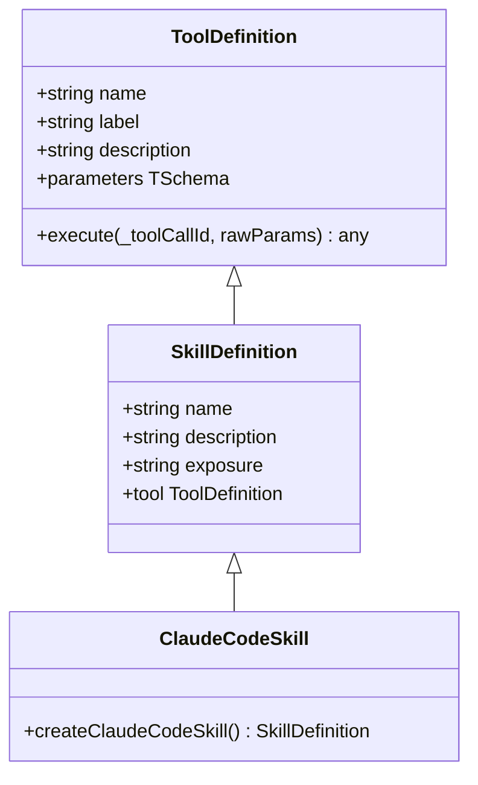
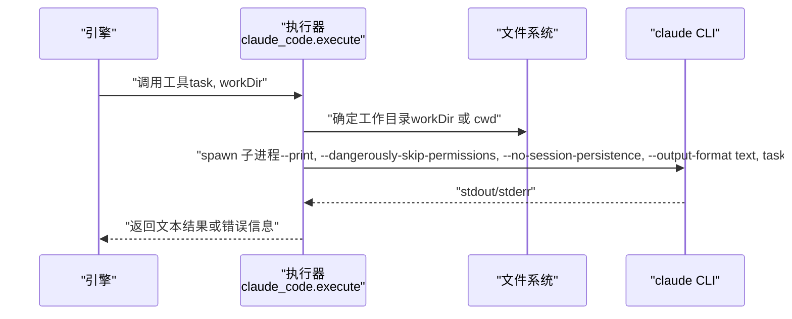
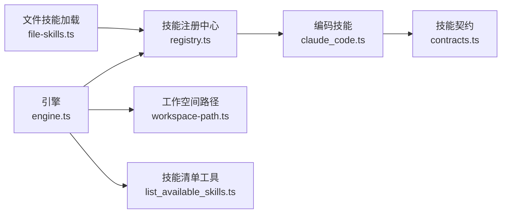

# 编码技能

<cite>
**本文档引用的文件**
- [claude_code.ts](file://src/skills/coding/claude_code.ts)
- [contracts.ts](file://src/skills/contracts.ts)
- [registry.ts](file://src/skills/registry.ts)
- [engine.ts](file://src/engine.ts)
- [workspace-path.ts](file://src/memory/workspace-path.ts)
- [file-skills.ts](file://src/skills/file-skills.ts)
- [list_available_skills.ts](file://src/skills/system/list_available_skills.ts)
- [package.json](file://package.json)
- [README.md](file://README.md)
- [getting-started.md](file://docs/getting-started.md)
</cite>

## 目录
1. [简介](#简介)
2. [项目结构](#项目结构)
3. [核心组件](#核心组件)
4. [架构总览](#架构总览)
5. [组件详解](#组件详解)
6. [依赖关系分析](#依赖关系分析)
7. [性能考量](#性能考量)
8. [故障排查指南](#故障排查指南)
9. [结论](#结论)
10. [附录](#附录)

## 简介
本文件面向 StupidClaw 的“编码技能”（claude_code），系统性阐述其代码生成与编辑能力，包括代码补全、错误修复、功能实现与代码优化等。文档解释编码技能的工作原理（代码上下文理解、编程语言支持范围、代码质量评估机制）、参数配置、代码模板与最佳实践，并提供在实际开发场景中的应用示例（快速原型开发、代码重构、技术咨询），同时涵盖性能、安全审查与代码规范遵循，以及如何扩展支持更多编程语言与集成更多开发工具。

## 项目结构
StupidClaw 采用模块化技能体系，编码技能作为“按需披露”的工具被注册到系统中，由引擎统一调度。核心结构要点：
- 编码技能定义位于 src/skills/coding/claude_code.ts，封装为 SkillDefinition，暴露 tool 参数与执行器。
- 技能注册中心 src/skills/registry.ts 将内置技能（含 claude_code）集中管理，区分 always 与 on_demand。
- 引擎 src/engine.ts 负责会话创建、工具注入、提示词构建与工具执行结果处理。
- 安全路径解析 src/memory/workspace-path.ts 限定工作空间，避免越权读写。
- 文件技能加载 src/skills/file-skills.ts 支持从项目与内置目录加载技能，形成“文件技能目录”。

图表来源
- [claude_code.ts](file://src/skills/coding/claude_code.ts)
- [registry.ts](file://src/skills/registry.ts)
- [engine.ts](file://src/engine.ts)
- [workspace-path.ts](file://src/memory/workspace-path.ts)
- [file-skills.ts](file://src/skills/file-skills.ts)
- [list_available_skills.ts](file://src/skills/system/list_available_skills.ts)

章节来源
- [README.md](file://README.md)
- [package.json](file://package.json)

## 核心组件
- 编码技能（claude_code）：以 SkillDefinition 形式暴露，参数包含 task（任务描述）与可选 workDir（目标项目目录绝对路径）。执行器通过子进程调用本地安装的 claude CLI，传入 --print、--dangerously-skip-permissions、--no-session-persistence、--output-format 等参数，限制超时与输出缓冲，捕获标准输出与错误输出，最终以文本形式返回结果。
- 技能注册中心：将 claude_code 与其他系统技能（如查询历史、更新资料、定时任务、天气、网络检索等）统一注册，按 exposure 区分 always 与 on_demand。
- 引擎：负责模型选择、会话创建、工具注入、提示词构建与工具执行事件记录，支持调试开关与错误归因。
- 工作空间路径：提供安全路径解析与目录校验，确保所有文件读写限制在 .stupidClaw 安全沙盒内。
- 文件技能加载：从项目与内置目录加载技能，形成“文件技能目录”，并与系统技能共同参与提示词构建。

章节来源
- [claude_code.ts](file://src/skills/coding/claude_code.ts)
- [registry.ts](file://src/skills/registry.ts)
- [engine.ts](file://src/engine.ts)
- [workspace-path.ts](file://src/memory/workspace-path.ts)
- [file-skills.ts](file://src/skills/file-skills.ts)

## 架构总览
编码技能在 StupidClaw 中的调用链路如下：用户输入经引擎构建提示词后，由会话订阅工具执行事件；当模型决定调用 claude_code 工具时，引擎将工具调用转发至编码技能执行器，执行器通过子进程调用本地 claude CLI 并返回结果。期间，引擎记录工具调用与结果，供后续对话使用。

图表来源
- [engine.ts](file://src/engine.ts)
- [registry.ts](file://src/skills/registry.ts)
- [claude_code.ts](file://src/skills/coding/claude_code.ts)

## 组件详解

### 编码技能（claude_code）类图

图表来源
- [claude_code.ts](file://src/skills/coding/claude_code.ts)
- [contracts.ts](file://src/skills/contracts.ts)

章节来源
- [claude_code.ts](file://src/skills/coding/claude_code.ts)
- [contracts.ts](file://src/skills/contracts.ts)

### 编码技能执行流程（序列图）

图表来源
- [claude_code.ts](file://src/skills/coding/claude_code.ts)

章节来源
- [claude_code.ts](file://src/skills/coding/claude_code.ts)

### 编码技能参数与行为
- 参数
  - task：要完成的编程任务，建议用自然语言描述得越具体越好。
  - workDir：目标项目目录的绝对路径，不填则使用当前工作目录。
- 行为
  - 通过子进程调用本地 claude CLI，设置超时与输出缓冲上限。
  - 捕获 ENOENT 错误并提示安装 claude CLI。
  - 捕获其他异常，拼接 stdout/stderr 输出，便于定位问题。
  - 返回文本结果，若无输出则提示“执行完毕，无输出”。

章节来源
- [claude_code.ts](file://src/skills/coding/claude_code.ts)

### 编码技能与系统集成点
- 技能注册：在 registry.ts 中注册 claude_code，使其成为 on_demand 技能，供引擎按需调用。
- 文件技能目录：通过 file-skills.ts 加载项目与内置技能，参与系统提示词构建。
- 工作空间约束：通过 workspace-path.ts 限制文件读写范围，保障安全。
- 技能清单：list_available_skills.ts 提供技能目录与使用指引，帮助用户理解 always 与 on_demand 的区别。

章节来源
- [registry.ts](file://src/skills/registry.ts)
- [file-skills.ts](file://src/skills/file-skills.ts)
- [workspace-path.ts](file://src/memory/workspace-path.ts)
- [list_available_skills.ts](file://src/skills/system/list_available_skills.ts)

### 编码技能工作原理
- 代码上下文理解：编码技能本身不直接解析项目上下文，而是将任务交由本地 claude CLI 处理。工作目录（workDir）用于指示 CLI 在何处进行读写。
- 编程语言支持范围：由本地安装的 claude CLI 支持的语言与工具决定，编码技能仅负责传递任务与目录。
- 代码质量评估机制：编码技能不内置质量评估逻辑，其输出即 CLI 的直接结果。建议结合项目内文件技能与历史记录进行二次校验。

章节来源
- [claude_code.ts](file://src/skills/coding/claude_code.ts)
- [engine.ts](file://src/engine.ts)

### 参数配置与最佳实践
- 参数
  - task：尽量具体，包含期望的文件、函数、模块或测试目标。
  - workDir：建议明确指向目标项目根目录，确保 CLI 能正确识别上下文。
- 最佳实践
  - 使用 on-demand 调用方式，避免不必要的工具暴露。
  - 在 workDir 中预先准备好 README、依赖清单与测试用例，提升 CLI 理解度。
  - 若 CLI 未安装，先安装 claude CLI 再调用编码技能。
  - 使用调试开关查看提示词与工具列表，辅助定位问题。

章节来源
- [claude_code.ts](file://src/skills/coding/claude_code.ts)
- [list_available_skills.ts](file://src/skills/system/list_available_skills.ts)
- [getting-started.md](file://docs/getting-started.md)

### 实际应用场景示例
- 快速原型开发：通过 task 描述原型需求，指定 workDir 为目标项目，让 CLI 生成初始代码骨架与依赖声明。
- 代码重构：在 task 中明确重构目标（如提取函数、重命名变量、拆分模块），CLI 基于上下文进行修改。
- 技术咨询：以“解释某段代码的作用/风险/替代方案”等形式提问，CLI 返回解释与建议，配合历史记录与文件技能进行交叉验证。

章节来源
- [engine.ts](file://src/engine.ts)
- [file-skills.ts](file://src/skills/file-skills.ts)

### 性能与安全
- 性能
  - 执行器设置了超时与输出缓冲上限，避免长时间阻塞与内存膨胀。
  - 建议在任务中明确最小必要上下文，减少 CLI 分析负担。
- 安全
  - 工作空间路径严格限制在 .stupidClaw 安全沙盒内，禁止绝对路径与路径穿越。
  - CLI 以 --dangerously-skip-permissions 运行，需确保本地环境可信。
  - 建议在受控环境中使用，避免在生产敏感目录直接执行 CLI。

章节来源
- [claude_code.ts](file://src/skills/coding/claude_code.ts)
- [workspace-path.ts](file://src/memory/workspace-path.ts)

### 代码规范与合规
- 编码技能不强制执行代码风格，建议结合项目内文件技能（如 lint、format）与历史记录进行一致性检查。
- 在 workDir 中维护统一的 .editorconfig、ESLint、Prettier 等配置，有助于 CLI 生成更符合团队规范的代码。

章节来源
- [file-skills.ts](file://src/skills/file-skills.ts)

### 扩展与集成
- 支持更多编程语言：通过安装与配置本地 claude CLI 的语言与工具链，即可扩展支持范围。
- 集成更多开发工具：可在 workDir 中预置脚手架、测试框架与 CI 配置，使 CLI 更高效地完成生成与修复任务。
- 新增技能：通过 file-skills.ts 从项目或内置目录加载新技能，丰富系统能力；或在 registry.ts 中注册新的 SkillDefinition。

章节来源
- [file-skills.ts](file://src/skills/file-skills.ts)
- [registry.ts](file://src/skills/registry.ts)

## 依赖关系分析
编码技能与其周边组件的依赖关系如下：

图表来源
- [claude_code.ts](file://src/skills/coding/claude_code.ts)
- [contracts.ts](file://src/skills/contracts.ts)
- [registry.ts](file://src/skills/registry.ts)
- [engine.ts](file://src/engine.ts)
- [workspace-path.ts](file://src/memory/workspace-path.ts)
- [file-skills.ts](file://src/skills/file-skills.ts)
- [list_available_skills.ts](file://src/skills/system/list_available_skills.ts)

章节来源
- [claude_code.ts](file://src/skills/coding/claude_code.ts)
- [registry.ts](file://src/skills/registry.ts)
- [engine.ts](file://src/engine.ts)

## 性能考量
- 子进程调用与 I/O：CLI 的执行时间取决于任务复杂度与工作目录规模，建议在 task 中限定范围。
- 超时与缓冲：执行器已设置超时与最大输出缓冲，避免资源耗尽。
- 会话复用：引擎按 chatId 复用会话，减少重复初始化成本。
- 调试开销：开启 DEBUG_PROMPT 会输出提示词与工具列表，便于排错但会增加日志开销。

章节来源
- [claude_code.ts](file://src/skills/coding/claude_code.ts)
- [engine.ts](file://src/engine.ts)

## 故障排查指南
- 未安装 claude CLI：执行器捕获 ENOENT 并提示安装本地 CLI。
- CLI 执行失败：捕获异常并将 stdout/stderr 拼接返回，便于定位问题。
- API Key 问题：引擎对模型调用错误进行归因，若提示缺少 API Key，检查 .env 中对应供应商密钥配置。
- 工作空间权限：确保 workDir 不涉及路径穿越或绝对路径，遵循安全路径规则。

章节来源
- [claude_code.ts](file://src/skills/coding/claude_code.ts)
- [engine.ts](file://src/engine.ts)
- [workspace-path.ts](file://src/memory/workspace-path.ts)

## 结论
编码技能（claude_code）通过本地 CLI 将自然语言任务转化为代码生成与编辑动作，结合 StupidClaw 的技能注册、引擎调度与安全工作空间，形成一套可控、可扩展的本地编码助手。建议在具体任务中明确上下文、限定工作范围，并结合文件技能与历史记录进行质量把关与规范遵循。

## 附录
- 快速开始与配置参考：参阅项目文档与初始化向导，了解模型选择、API Key 配置与启动流程。
- 项目边界与安全约束：严格限制在指定目录，避免数据库与向量化存储，确保代码完全可审计。

章节来源
- [README.md](file://README.md)
- [getting-started.md](file://docs/getting-started.md)