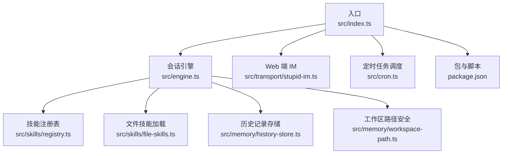
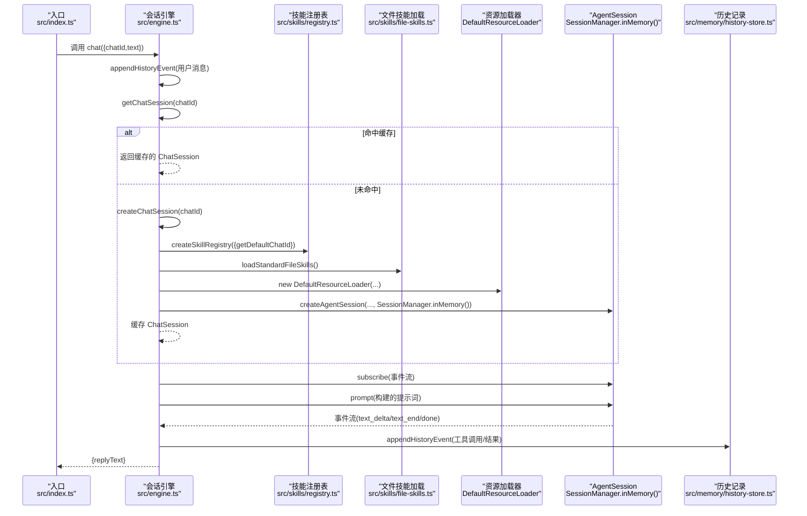
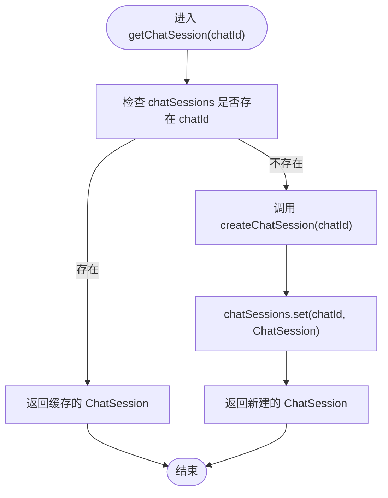
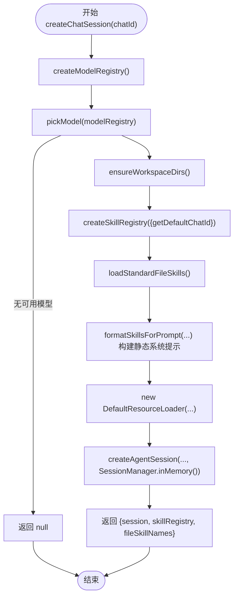
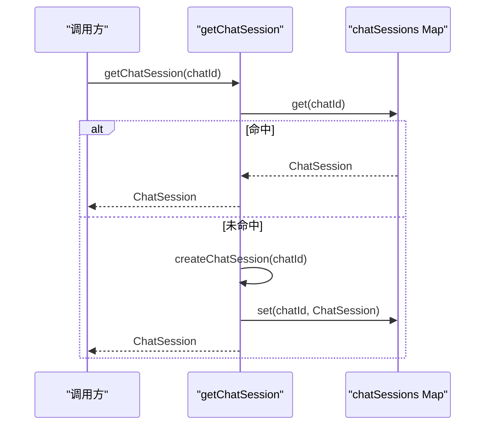
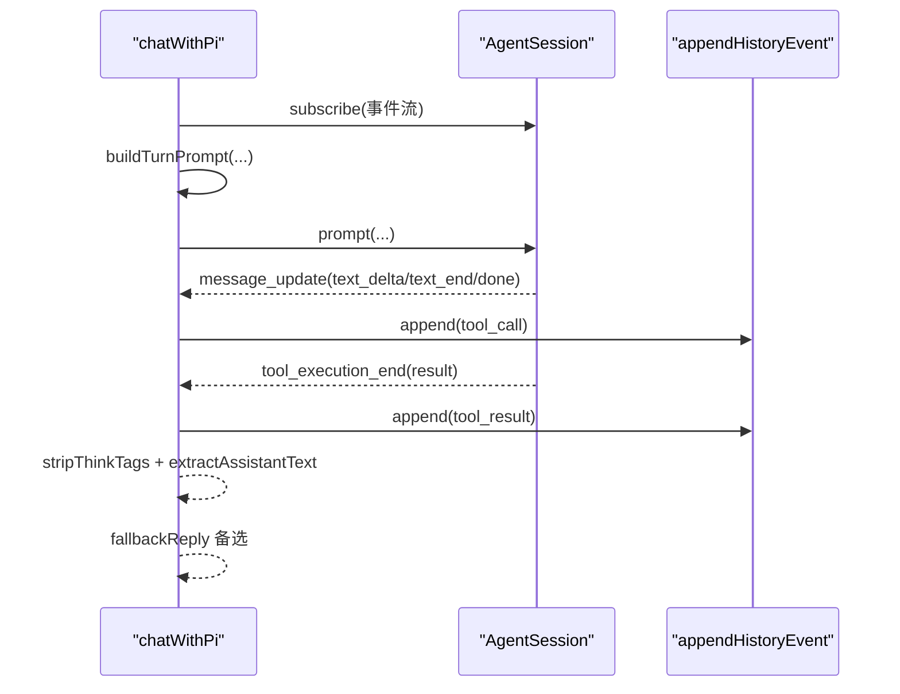
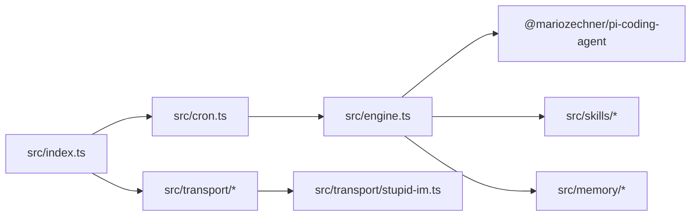
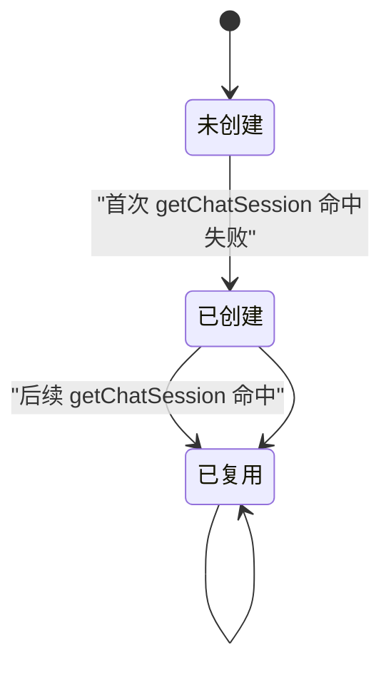

# 会话管理

<cite>
**本文引用的文件列表**
- [src/index.ts](file://src/index.ts)
- [src/engine.ts](file://src/engine.ts)
- [src/skills/registry.ts](file://src/skills/registry.ts)
- [src/skills/file-skills.ts](file://src/skills/file-skills.ts)
- [src/memory/history-store.ts](file://src/memory/history-store.ts)
- [src/memory/workspace-path.ts](file://src/memory/workspace-path.ts)
- [src/transport/stupid-im.ts](file://src/transport/stupid-im.ts)
- [src/cron.ts](file://src/cron.ts)
- [package.json](file://package.json)
</cite>

## 目录
1. [简介](#简介)
2. [项目结构](#项目结构)
3. [核心组件](#核心组件)
4. [架构总览](#架构总览)
5. [组件详解](#组件详解)
6. [依赖关系分析](#依赖关系分析)
7. [性能与内存优化](#性能与内存优化)
8. [故障排查指南](#故障排查指南)
9. [结论](#结论)
10. [附录](#附录)

## 简介
本文件面向 StupidClaw 的会话管理系统，系统性梳理会话生命周期管理（创建、复用、销毁）、chatSessions Map 的实现原理、createChatSession 与 getChatSession 的工作流程、会话状态管理、内存优化策略与并发访问控制，并提供配置示例、性能监控方法与常见问题排查指南。文档同时兼顾非技术读者的理解需求，采用渐进式讲解与可视化图示。

## 项目结构
围绕会话管理的关键模块与文件如下：
- 引导与入口：src/index.ts
- 会话引擎：src/engine.ts
- 技能注册表：src/skills/registry.ts
- 文件技能加载：src/skills/file-skills.ts
- 历史记录存储：src/memory/history-store.ts
- 工作区路径安全：src/memory/workspace-path.ts
- Web 端 IM：src/transport/stupid-im.ts
- 定时任务调度：src/cron.ts
- 包与脚本：package.json

图表来源
- [src/index.ts:112-216](file://src/index.ts#L112-L216)
- [src/engine.ts:392-475](file://src/engine.ts#L392-L475)
- [src/skills/registry.ts:23-54](file://src/skills/registry.ts#L23-L54)
- [src/skills/file-skills.ts:26-48](file://src/skills/file-skills.ts#L26-L48)
- [src/memory/history-store.ts:37-42](file://src/memory/history-store.ts#L37-L42)
- [src/memory/workspace-path.ts:32-41](file://src/memory/workspace-path.ts#L32-L41)
- [src/transport/stupid-im.ts:65-104](file://src/transport/stupid-im.ts#L65-L104)
- [src/cron.ts:251-264](file://src/cron.ts#L251-L264)
- [package.json:14-22](file://package.json#L14-L22)

章节来源
- [src/index.ts:112-216](file://src/index.ts#L112-L216)
- [src/engine.ts:392-475](file://src/engine.ts#L392-L475)

## 核心组件
- chatSessions Map：以 chatId 为键，缓存每个用户的 AgentSession 及其技能注册表与文件技能名称集合，实现跨消息的上下文复用与内存复用。
- createChatSession：负责模型注册表创建、技能注册表初始化、文件技能加载、资源加载器构建与 AgentSession 创建。
- getChatSession：基于 chatId 的缓存命中策略，实现会话复用；首次缺失时调用 createChatSession 并写入缓存。
- 会话状态管理：通过 AgentSession 的订阅事件流收集工具调用与回复文本，结合历史记录持久化。
- 内存优化：会话级缓存、工作区路径安全、历史记录按日追加写入，避免重复加载与越权访问。
- 并发访问控制：全局 Map 读写在单线程事件循环中进行，结合单实例锁避免多进程竞争；工具调用与模型请求由底层库处理并发。

章节来源
- [src/engine.ts:34-35](file://src/engine.ts#L34-L35)
- [src/engine.ts:392-475](file://src/engine.ts#L392-L475)
- [src/engine.ts:511-607](file://src/engine.ts#L511-L607)
- [src/memory/history-store.ts:37-42](file://src/memory/history-store.ts#L37-L42)
- [src/memory/workspace-path.ts:32-41](file://src/memory/workspace-path.ts#L32-L41)

## 架构总览
下图展示从入口到会话引擎、技能与文件技能加载、资源加载器、AgentSession 创建与历史记录写入的整体流程。

图表来源
- [src/index.ts:189-208](file://src/index.ts#L189-L208)
- [src/engine.ts:680-705](file://src/engine.ts#L680-L705)
- [src/engine.ts:461-475](file://src/engine.ts#L461-L475)
- [src/engine.ts:392-459](file://src/engine.ts#L392-L459)
- [src/skills/registry.ts:23-54](file://src/skills/registry.ts#L23-L54)
- [src/skills/file-skills.ts:26-48](file://src/skills/file-skills.ts#L26-L48)
- [src/memory/history-store.ts:37-42](file://src/memory/history-store.ts#L37-L42)

## 组件详解

### chatSessions Map 与会话缓存策略
- 数据结构：Map<string, ChatSession>，其中 ChatSession 包含 AgentSession、SkillRegistry 与文件技能名称数组。
- 命中策略：getChatSession(chatId) 先查缓存，命中则直接复用；未命中则创建新会话并写入缓存。
- 生命周期：当前实现未提供显式的会话销毁与超时清理逻辑，会话随进程存活而常驻；可通过外部手段（如进程重启）回收。
- 作用：避免每次消息都重建 AgentSession，降低模型调用与工具初始化开销，维持用户上下文连续性。

图表来源
- [src/engine.ts:461-475](file://src/engine.ts#L461-L475)

章节来源
- [src/engine.ts:34-35](file://src/engine.ts#L34-L35)
- [src/engine.ts:461-475](file://src/engine.ts#L461-L475)

### createChatSession 工作流程
- 模型注册表创建：createModelRegistry 基于环境变量与内置映射注册多个提供商，支持本地模型与自定义兼容接口。
- 模型选择：pickModel 依据 STUPID_MODEL 或默认策略选择可用模型。
- 技能注册表初始化：createSkillRegistry 创建基础技能与动态技能（如管理 Cron 任务），并暴露 always/on_demand 技能。
- 文件技能加载：loadStandardFileSkills 从项目与内置技能目录加载文件技能，去重后格式化为提示词。
- 资源加载器：DefaultResourceLoader 构建系统提示词（包含文件技能提示），并 reload。
- AgentSession 创建：createAgentSession 使用 SessionManager.inMemory() 创建内存会话，注入工具（编码工具）、自定义工具（技能）、模型与工作区路径。
- 错误处理：normalizeApiKeyError 将底层 API Key 错误标准化为更友好的提示。

图表来源
- [src/engine.ts:392-459](file://src/engine.ts#L392-L459)
- [src/skills/registry.ts:23-54](file://src/skills/registry.ts#L23-L54)
- [src/skills/file-skills.ts:26-48](file://src/skills/file-skills.ts#L26-L48)

章节来源
- [src/engine.ts:392-459](file://src/engine.ts#L392-L459)

### getChatSession 缓存与复用机制
- 命中优先：直接从 chatSessions Map 读取，避免重复初始化。
- 未命中创建：调用 createChatSession 并写入 Map，确保后续消息复用。
- 调试日志：命中与存储均有 debug 输出，便于观测缓存命中率与生命周期。

图表来源
- [src/engine.ts:461-475](file://src/engine.ts#L461-L475)

章节来源
- [src/engine.ts:461-475](file://src/engine.ts#L461-L475)

### 会话状态管理与事件流
- 事件订阅：chatWithPi 对 AgentSession 进行 subscribe，监听 message_update 与 tool_execution_* 事件，累积回复文本并记录工具调用与结果。
- 提示词构建：buildTurnPrompt 注入 runtime_context、profile 与用户消息，确保上下文稳定。
- 文本提取：stripThinkTags 与 extractAssistantText 用于清洗与提取最终回复文本。
- 历史记录：safeAppend 在工具调用前后写入历史事件，appendHistoryEvent 按日追加写入，避免重复写入与越权访问。

图表来源
- [src/engine.ts:511-607](file://src/engine.ts#L511-L607)
- [src/memory/history-store.ts:37-42](file://src/memory/history-store.ts#L37-L42)

章节来源
- [src/engine.ts:511-607](file://src/engine.ts#L511-L607)
- [src/memory/history-store.ts:37-42](file://src/memory/history-store.ts#L37-L42)

### 会话配置与环境变量
- 核心模型配置：STUPID_MODEL 支持 provider:model_id 格式，或兼容旧版 model_id（默认 minimax-cn/minimax）。
- 供应商密钥：OPENROUTER_API_KEY、MINIMAX_API_KEY、OLLAMA_BASE_URL、DEEPSEEK_API_KEY、MOONSHOT_API_KEY、DASHSCOPE_API_KEY、ZHIPU_API_KEY、CUSTOM_OPENAI_* 等。
- 运行模式：TELEGRAM_MODE=polling/webhook；Telegram Bot Token：TELEGRAM_BOT_TOKEN；网页端 IM：STUPID_IM_TOKEN；调试开关：DEBUG_STUPIDCLAW、DEBUG_PROMPT。
- 端口与服务：PORT；工作区根目录：.stupidClaw/workspace。

章节来源
- [src/engine.ts:196-244](file://src/engine.ts#L196-L244)
- [src/engine.ts:392-459](file://src/engine.ts#L392-L459)
- [src/index.ts:22-40](file://src/index.ts#L22-L40)

## 依赖关系分析
- 引擎依赖：@mariozechner/pi-coding-agent（AgentSession、ModelRegistry、SessionManager、DefaultResourceLoader）、本地文件系统与工作区路径安全。
- 技能依赖：技能注册表聚合内置与文件技能，形成统一工具集合。
- 传输依赖：Telegram 轮询与 Webhook（入口中启用）、StupidIM WebSocket。
- 定时依赖：cron 调度器通过 runSkill/runPrompt 回调引擎 chat。

图表来源
- [src/engine.ts:1-17](file://src/engine.ts#L1-L17)
- [src/index.ts:6-10](file://src/index.ts#L6-L10)
- [src/cron.ts:1-14](file://src/cron.ts#L1-L14)
- [src/transport/stupid-im.ts:1-7](file://src/transport/stupid-im.ts#L1-L7)

章节来源
- [src/engine.ts:1-17](file://src/engine.ts#L1-L17)
- [src/index.ts:6-10](file://src/index.ts#L6-L10)
- [src/cron.ts:1-14](file://src/cron.ts#L1-L14)
- [src/transport/stupid-im.ts:1-7](file://src/transport/stupid-im.ts#L1-L7)

## 性能与内存优化
- 会话复用：通过 chatSessions Map 实现跨消息复用，避免重复初始化 AgentSession 与工具，显著降低延迟与资源消耗。
- 资源加载：DefaultResourceLoader 仅在必要时 reload，静态系统提示一次性构建，减少重复 IO。
- 历史记录：按日追加写入，避免大文件读写与锁竞争；append-only 设计提升可靠性。
- 工作区路径安全：resolveSafePath 统一路径解析，拒绝绝对路径与 .. 跨越，避免越权访问与潜在性能风险。
- 并发控制：单实例锁确保同一时间只有一个进程运行，避免重复消费与资源竞争；工具调用与模型请求由底层库并发处理。
- 调试与可观测性：DEBUG_STUPIDCLAW 与 DEBUG_PROMPT 控制日志输出，便于定位性能瓶颈与异常。

章节来源
- [src/engine.ts:34-35](file://src/engine.ts#L34-L35)
- [src/engine.ts:461-475](file://src/engine.ts#L461-L475)
- [src/engine.ts:484-509](file://src/engine.ts#L484-L509)
- [src/memory/history-store.ts:37-42](file://src/memory/history-store.ts#L37-L42)
- [src/memory/workspace-path.ts:32-41](file://src/memory/workspace-path.ts#L32-L41)
- [src/index.ts:45-84](file://src/index.ts#L45-L84)

## 故障排查指南
- API Key 未配置或无效
  - 现象：模型调用失败，返回标准化错误提示。
  - 排查：检查 STUPID_MODEL 与对应 PROVIDER_API_KEY 是否匹配；确认 .env 配置正确。
  - 参考：normalizeApiKeyError 与 createModelRegistry 的密钥设置。
- 会话未创建或返回 null
  - 现象：chat 返回 fallbackReply。
  - 排查：确认 createChatSession 成功创建；检查模型可用性与工作区目录创建。
- 历史记录写入失败
  - 现象：append history failed 错误日志。
  - 排查：检查 .stupidClaw/history 目录权限与磁盘空间；确认路径安全解析。
- 单实例冲突
  - 现象：另一个轮询实例已在运行。
  - 排查：删除 .stupidClaw/polling.lock 后重启；或确保只运行一个实例。
- Web 端 IM 连接失败
  - 现象：WebSocket 连接被拒绝或无法接收消息。
  - 排查：确认 STUPID_IM_TOKEN 一致；检查 token 参数与 chatId 传递；查看 StupidIM 日志。

章节来源
- [src/engine.ts:162-186](file://src/engine.ts#L162-L186)
- [src/engine.ts:392-459](file://src/engine.ts#L392-L459)
- [src/memory/history-store.ts:37-42](file://src/memory/history-store.ts#L37-L42)
- [src/index.ts:45-84](file://src/index.ts#L45-L84)
- [src/transport/stupid-im.ts:65-104](file://src/transport/stupid-im.ts#L65-L104)

## 结论
StupidClaw 的会话管理以 chatSessions Map 为核心，结合 createChatSession 与 getChatSession 实现高效的会话生命周期管理。通过技能注册表与文件技能加载、资源加载器与 AgentSession 的组合，系统在保证上下文连续性的同时，实现了较低的初始化成本与良好的可扩展性。配合工作区路径安全、历史记录按日追加与单实例锁，系统在本地运行场景下具备较好的稳定性与可维护性。未来可在会话超时清理、并发访问控制细化与性能指标采集方面进一步增强。

## 附录

### 会话生命周期图（代码级）

图表来源
- [src/engine.ts:461-475](file://src/engine.ts#L461-L475)

### 配置示例（节选）
- 核心模型：STUPID_MODEL=openrouter:auto 或 openrouter:provider/model_id
- 供应商密钥：OPENROUTER_API_KEY=sk-or-...
- Telegram：TELEGRAM_BOT_TOKEN=123456789:ABC-DEF...
- 网页端 IM：STUPID_IM_TOKEN=随机密钥
- 调试：DEBUG_STUPIDCLAW=1、DEBUG_PROMPT=1
- 端口：PORT=8080

章节来源
- [src/engine.ts:196-244](file://src/engine.ts#L196-L244)
- [src/index.ts:22-40](file://src/index.ts#L22-L40)