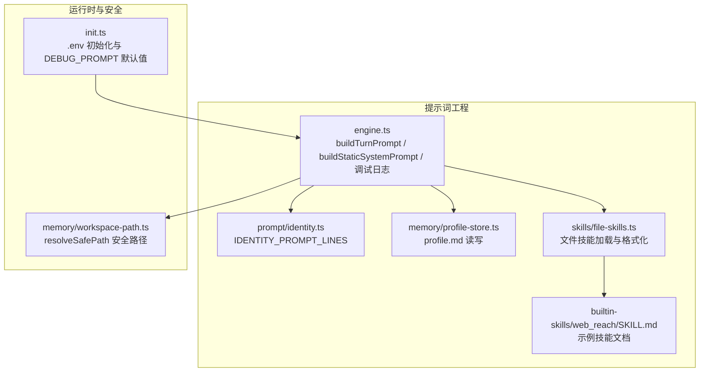
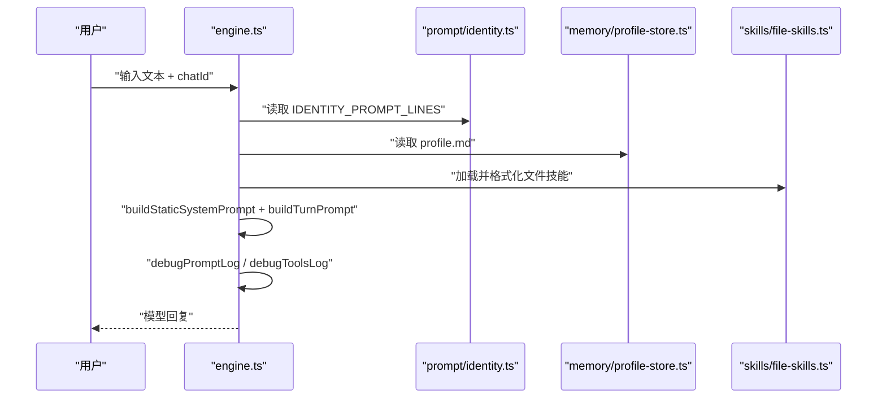
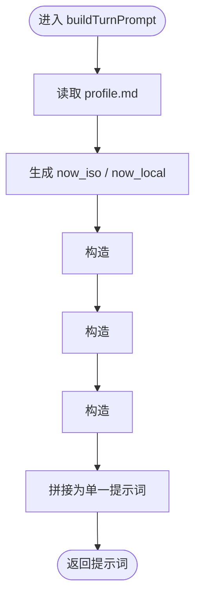
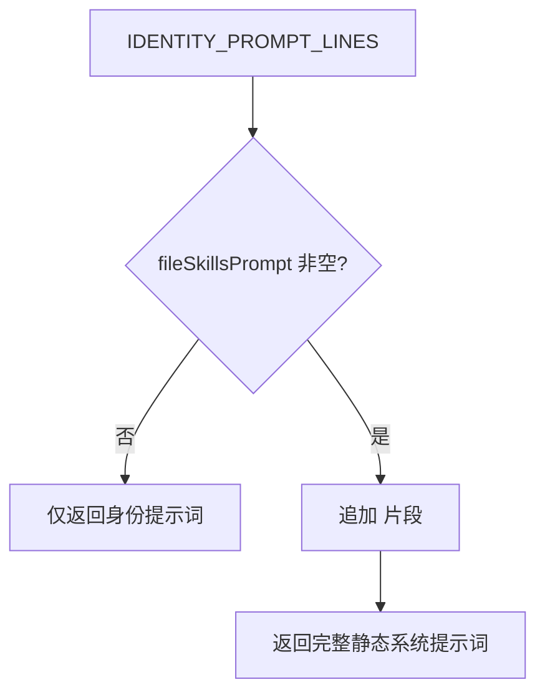
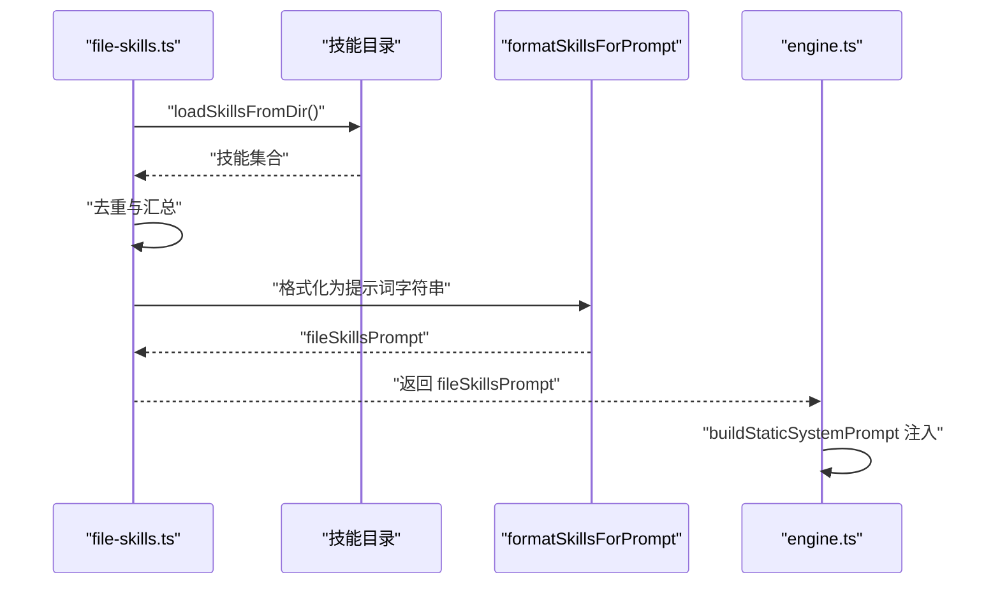
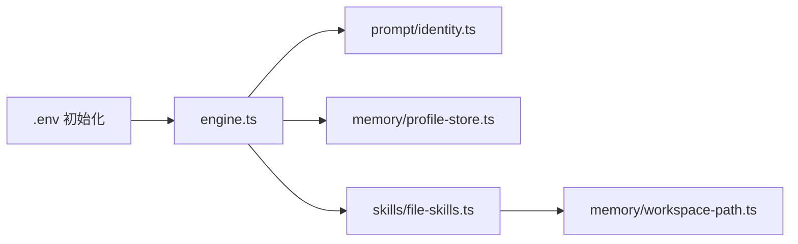

# 提示词工程

<cite>
**本文档引用的文件**
- [src/prompt/identity.ts](file://src/prompt/identity.ts)
- [src/engine.ts](file://src/engine.ts)
- [src/memory/profile-store.ts](file://src/memory/profile-store.ts)
- [src/skills/file-skills.ts](file://src/skills/file-skills.ts)
- [src/init.ts](file://src/init.ts)
- [src/memory/workspace-path.ts](file://src/memory/workspace-path.ts)
- [builtin-skills/web_reach/SKILL.md](file://builtin-skills/web_reach/SKILL.md)
- [StupidClaw-第4期-用profile做长期记忆让Agent记住你.md](file://StupidClaw-第4期-用profile做长期记忆让Agent记住你.md)
- [StupidClaw-第5期-安全沙盒PathJailing防止越权读写.md](file://StupidClaw-第5期-安全沙盒PathJailing防止越权读写.md)
- [README.md](file://README.md)
</cite>

## 目录
1. [简介](#简介)
2. [项目结构](#项目结构)
3. [核心组件](#核心组件)
4. [架构总览](#架构总览)
5. [详细组件分析](#详细组件分析)
6. [依赖关系分析](#依赖关系分析)
7. [性能考量](#性能考量)
8. [故障排查指南](#故障排查指南)
9. [结论](#结论)
10. [附录](#附录)

## 简介
本文件面向 StupidClaw 的提示词工程，系统化解析如下关键能力：
- 每回合对话提示词构建函数 buildTurnPrompt 的运行时上下文、长期记忆 profile.md 与用户消息的整合方式
- 静态系统提示词构建流程，包括 buildStaticSystemPrompt 与文件技能提示词的注入机制
- IDENTITY_PROMPT_LINES 的作用与身份设定的构建
- 提示词调试功能：DEBUG_PROMPT 环境变量的使用与提示词日志输出
- 提示词优化技巧、上下文管理策略、多模态内容处理与提示词安全性考虑
- 提示词模板示例与最佳实践指南

## 项目结构
提示词工程相关的关键模块分布于以下位置：
- 身份与系统提示词：src/prompt/identity.ts、src/engine.ts
- 长期记忆 profile.md：src/memory/profile-store.ts、src/memory/workspace-path.ts
- 文件技能提示词注入：src/skills/file-skills.ts、builtin-skills/web_reach/SKILL.md
- 调试与初始化：src/init.ts、src/engine.ts
- 安全边界：StupidClaw-第5期-安全沙盒PathJailing防止越权读写.md、README.md

图表来源
- [src/engine.ts:484-509](file://src/engine.ts#L484-L509)
- [src/engine.ts:188-194](file://src/engine.ts#L188-L194)
- [src/prompt/identity.ts:1-9](file://src/prompt/identity.ts#L1-L9)
- [src/memory/profile-store.ts:112-115](file://src/memory/profile-store.ts#L112-L115)
- [src/skills/file-skills.ts:50-56](file://src/skills/file-skills.ts#L50-L56)
- [src/memory/workspace-path.ts:32-35](file://src/memory/workspace-path.ts#L32-L35)
- [src/init.ts:218-218](file://src/init.ts#L218-L218)

章节来源
- [src/engine.ts:484-509](file://src/engine.ts#L484-L509)
- [src/engine.ts:188-194](file://src/engine.ts#L188-L194)
- [src/prompt/identity.ts:1-9](file://src/prompt/identity.ts#L1-L9)
- [src/memory/profile-store.ts:112-115](file://src/memory/profile-store.ts#L112-L115)
- [src/skills/file-skills.ts:50-56](file://src/skills/file-skills.ts#L50-L56)
- [src/memory/workspace-path.ts:32-35](file://src/memory/workspace-path.ts#L32-L35)
- [src/init.ts:218-218](file://src/init.ts#L218-L218)

## 核心组件
- 运行时每回合提示词构建：buildTurnPrompt
  - 负责将运行时上下文（chatId、当前时间）、长期记忆 profile.md 与用户消息整合为单一提示词字符串
  - 输出用于后续模型推理与工具调用
- 静态系统提示词构建：buildStaticSystemPrompt
  - 以 IDENTITY_PROMPT_LINES 为基础，按需注入文件技能提示词片段
  - 形成“身份 + 文件技能”的静态系统提示词
- 文件技能提示词注入：buildStandardFileSkillsPrompt
  - 加载本地与内置技能目录，去重后格式化为提示词片段
  - 在静态系统提示词中以 <file_skills> 包裹注入
- 身份设定：IDENTITY_PROMPT_LINES
  - 固定回答风格、任务优先级与技能调用约束
  - 明确 runtime_context 的使用方式与定时任务参数规范
- 调试功能：DEBUG_PROMPT
  - 控制是否打印每回合完整提示词与工具清单
  - 便于定位“技能未触发/未加载”的问题

章节来源
- [src/engine.ts:484-509](file://src/engine.ts#L484-L509)
- [src/engine.ts:188-194](file://src/engine.ts#L188-L194)
- [src/skills/file-skills.ts:50-56](file://src/skills/file-skills.ts#L50-L56)
- [src/prompt/identity.ts:1-9](file://src/prompt/identity.ts#L1-L9)
- [src/init.ts:218-218](file://src/init.ts#L218-L218)

## 架构总览
提示词工程在引擎层的调用链如下：

图表来源
- [src/engine.ts:484-509](file://src/engine.ts#L484-L509)
- [src/engine.ts:188-194](file://src/engine.ts#L188-L194)
- [src/prompt/identity.ts:1-9](file://src/prompt/identity.ts#L1-L9)
- [src/memory/profile-store.ts:112-115](file://src/memory/profile-store.ts#L112-L115)
- [src/skills/file-skills.ts:50-56](file://src/skills/file-skills.ts#L50-L56)

## 详细组件分析

### 组件一：每回合提示词构建 buildTurnPrompt
- 功能概述
  - 读取长期记忆 profile.md
  - 生成运行时上下文（chatId、ISO 时间、本地时间）
  - 将 runtime_context、profile 与用户消息按固定结构拼接为提示词
- 数据流与结构
  - 运行时上下文：以 <runtime_context>...</runtime_context> 包裹
  - 长期记忆：以 <profile>...</profile> 包裹
  - 用户消息：以 <user_message>...</user_message> 包裹
- 错误处理与健壮性
  - 读取 profile 失败时，异常被捕获并记录日志，不影响后续流程
- 性能与复杂度
  - 字符串拼接，时间复杂度 O(N)，N 为提示词总长度
  - 建议控制 profile 与历史长度，避免超出上下文上限

图表来源
- [src/engine.ts:484-509](file://src/engine.ts#L484-L509)
- [src/memory/profile-store.ts:112-115](file://src/memory/profile-store.ts#L112-L115)

章节来源
- [src/engine.ts:484-509](file://src/engine.ts#L484-L509)
- [src/memory/profile-store.ts:112-115](file://src/memory/profile-store.ts#L112-L115)

### 组件二：静态系统提示词构建 buildStaticSystemPrompt
- 功能概述
  - 以 IDENTITY_PROMPT_LINES 为基底，按需注入文件技能提示词片段
  - 片段以 <file_skills>...</file_skills> 包裹，便于模型识别与检索
- 注入条件
  - 当文件技能提示词非空时才注入，避免冗余
- 与文件技能加载的关系
  - 由 buildStandardFileSkillsPrompt 生成技能描述列表
  - 由 formatSkillsForPrompt 将技能集合格式化为提示词字符串

图表来源
- [src/engine.ts:188-194](file://src/engine.ts#L188-L194)
- [src/skills/file-skills.ts:50-56](file://src/skills/file-skills.ts#L50-L56)

章节来源
- [src/engine.ts:188-194](file://src/engine.ts#L188-L194)
- [src/skills/file-skills.ts:50-56](file://src/skills/file-skills.ts#L50-L56)

### 组件三：文件技能提示词注入机制
- 技能加载
  - 从项目 skills 与内置 builtin-skills 两处加载
  - 去重后汇总为技能集合
- 格式化
  - 使用统一格式化函数将技能集合转换为提示词字符串
- 注入时机
  - 在构建静态系统提示词时，作为独立片段注入
- 示例技能
  - builtin-skills/web_reach/SKILL.md 展示了技能的使用方式与注意事项，有助于模型在联网与多平台场景下正确调用

图表来源
- [src/skills/file-skills.ts:26-56](file://src/skills/file-skills.ts#L26-L56)
- [src/engine.ts:188-194](file://src/engine.ts#L188-L194)
- [builtin-skills/web_reach/SKILL.md:1-122](file://builtin-skills/web_reach/SKILL.md#L1-L122)

章节来源
- [src/skills/file-skills.ts:26-56](file://src/skills/file-skills.ts#L26-L56)
- [src/engine.ts:188-194](file://src/engine.ts#L188-L194)
- [builtin-skills/web_reach/SKILL.md:1-122](file://builtin-skills/web_reach/SKILL.md#L1-L122)

### 组件四：身份设定 IDENTITY_PROMPT_LINES
- 作用
  - 固定回答风格与工程化表达
  - 明确任务优先级（如定时任务）
  - 规范技能调用参数（如 chatId、skillNames）
- 与 runtime_context 的协同
  - 涉及定时任务时优先使用 runtime_context 中的 chatId 与时间
  - 避免重复索要相同信息，提升对话效率

章节来源
- [src/prompt/identity.ts:1-9](file://src/prompt/identity.ts#L1-L9)
- [src/engine.ts:484-509](file://src/engine.ts#L484-L509)

### 组件五：提示词调试功能
- DEBUG_PROMPT 环境变量
  - 默认值由初始化脚本写入 .env（DEBUG_PROMPT=1）
  - 开启后打印每回合完整提示词与工具清单
- 日志输出
  - debugPromptLog：打印提示词
  - debugToolsLog：打印会话工具、自定义工具与文件技能清单
- 用途
  - 快速定位“技能未触发/未加载”的问题
  - 辅助验证 profile 与文件技能是否正确注入

章节来源
- [src/init.ts:218-218](file://src/init.ts#L218-L218)
- [src/engine.ts:65-73](file://src/engine.ts#L65-L73)
- [src/engine.ts:122-142](file://src/engine.ts#L122-L142)

## 依赖关系分析
- 组件耦合
  - engine.ts 依赖 identity.ts（身份）、profile-store.ts（长期记忆）、file-skills.ts（文件技能）
  - file-skills.ts 依赖 workspace-path.ts（安全路径解析）
- 外部依赖
  - .env 中的 DEBUG_PROMPT 控制调试输出
  - README.md 与文档强调运行边界与安全原则

图表来源
- [src/engine.ts:484-509](file://src/engine.ts#L484-L509)
- [src/prompt/identity.ts:1-9](file://src/prompt/identity.ts#L1-L9)
- [src/memory/profile-store.ts:112-115](file://src/memory/profile-store.ts#L112-L115)
- [src/skills/file-skills.ts:50-56](file://src/skills/file-skills.ts#L50-L56)
- [src/memory/workspace-path.ts:32-35](file://src/memory/workspace-path.ts#L32-L35)
- [src/init.ts:218-218](file://src/init.ts#L218-L218)

章节来源
- [src/engine.ts:484-509](file://src/engine.ts#L484-L509)
- [src/prompt/identity.ts:1-9](file://src/prompt/identity.ts#L1-L9)
- [src/memory/profile-store.ts:112-115](file://src/memory/profile-store.ts#L112-L115)
- [src/skills/file-skills.ts:50-56](file://src/skills/file-skills.ts#L50-L56)
- [src/memory/workspace-path.ts:32-35](file://src/memory/workspace-path.ts#L32-L35)
- [src/init.ts:218-218](file://src/init.ts#L218-L218)

## 性能考量
- 上下文长度控制
  - 建议定期清理 profile 与历史，避免提示词过长导致 Token 溢出
- 文件技能规模管理
  - 仅注入必要技能，避免过多技能片段造成上下文膨胀
- 调试日志成本
  - DEBUG_PROMPT=1 会增加 I/O 与 CPU 开销，生产环境建议关闭

## 故障排查指南
- 提示词未生效
  - 检查 DEBUG_PROMPT 是否开启，确认提示词日志输出
  - 核对 buildStaticSystemPrompt 是否成功注入 <file_skills> 片段
- 技能未触发
  - 使用 debugToolsLog 确认会话工具、自定义工具与文件技能清单
  - 检查技能名称与参数是否符合预期
- 安全相关问题
  - 若出现路径越界报错，检查 resolveSafePath 的调用与 workspace-path.ts 的规则
  - 确保所有文件落点均通过安全路径解析

章节来源
- [src/engine.ts:65-73](file://src/engine.ts#L65-L73)
- [src/engine.ts:122-142](file://src/engine.ts#L122-L142)
- [src/memory/workspace-path.ts:32-35](file://src/memory/workspace-path.ts#L32-L35)
- [StupidClaw-第5期-安全沙盒PathJailing防止越权读写.md:59-66](file://StupidClaw-第5期-安全沙盒PathJailing防止越权读写.md#L59-L66)

## 结论
StupidClaw 的提示词工程通过“身份 + 长期记忆 + 文件技能 + 运行时上下文”的组合，形成稳定可控的系统提示词与每回合提示词。配合调试开关与安全路径解析，既保证了工程可维护性，也确保了运行安全。

## 附录

### 提示词模板示例（结构化说明）
- 静态系统提示词
  - 身份设定（IDENTITY_PROMPT_LINES）
  - 文件技能片段（<file_skills>...</file_skills>，可选）
- 每回合提示词
  - 运行时上下文（<runtime_context>...</runtime_context>）
  - 长期记忆（<profile>...</profile>）
  - 用户消息（<user_message>...</user_message>）

章节来源
- [src/engine.ts:188-194](file://src/engine.ts#L188-L194)
- [src/engine.ts:484-509](file://src/engine.ts#L484-L509)

### 最佳实践指南
- 身份与风格
  - 以 IDENTITY_PROMPT_LINES 固化回答风格，避免模型漂移
- 上下文管理
  - 控制 profile 与历史长度，优先保留稳定事实
  - 仅注入必要的文件技能，减少 Token 消耗
- 多模态内容
  - 对于图片/文件等多模态输入，遵循“传引用/传内容”的区分策略，避免将大体积内容直接塞入提示词
- 安全性
  - 严格使用 resolveSafePath，杜绝绝对路径与路径穿越
  - 限制模型对工作区外文件的操作意图

章节来源
- [src/prompt/identity.ts:1-9](file://src/prompt/identity.ts#L1-L9)
- [src/memory/profile-store.ts:80-101](file://src/memory/profile-store.ts#L80-L101)
- [src/skills/file-skills.ts:50-56](file://src/skills/file-skills.ts#L50-L56)
- [src/memory/workspace-path.ts:32-35](file://src/memory/workspace-path.ts#L32-L35)
- [StupidClaw-第5期-安全沙盒PathJailing防止越权读写.md:59-66](file://StupidClaw-第5期-安全沙盒PathJailing防止越权读写.md#L59-L66)
- [README.md:15-21](file://README.md#L15-L21)