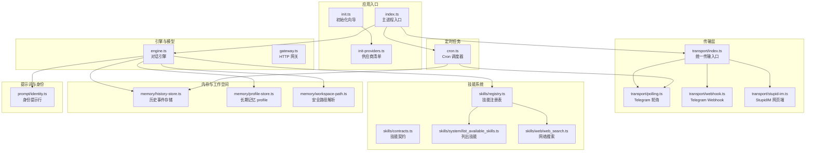
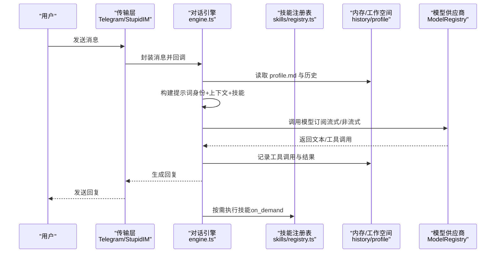
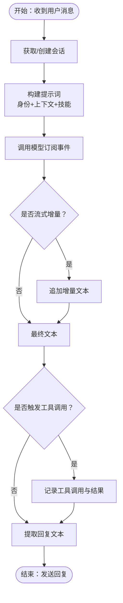
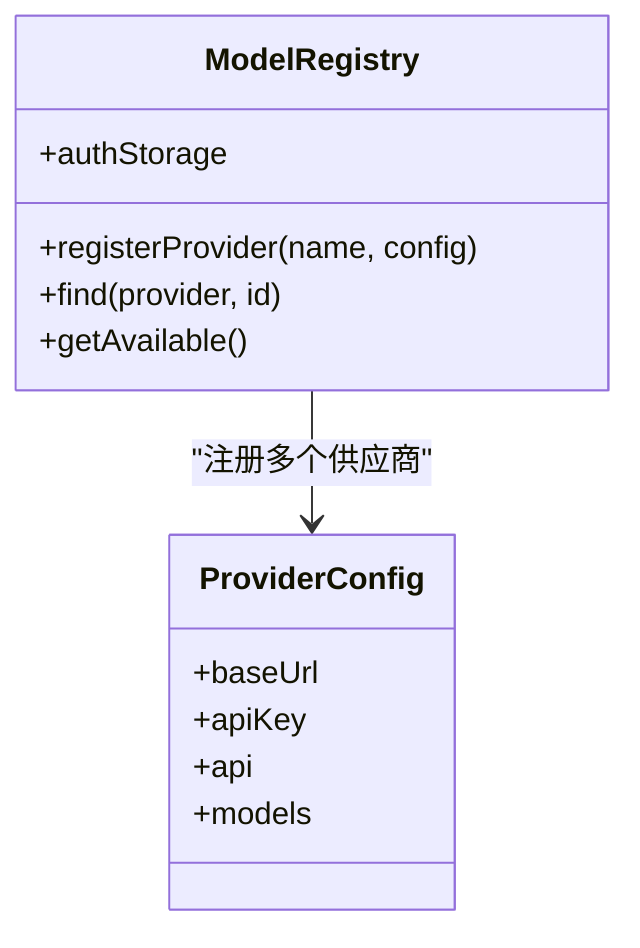
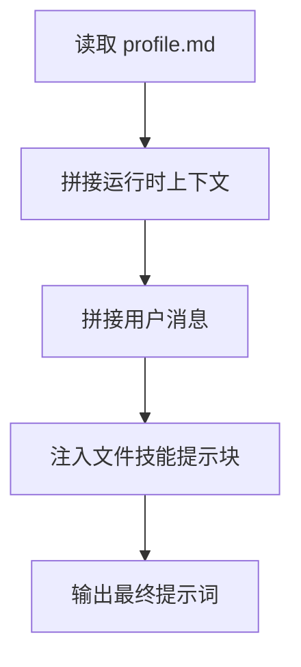
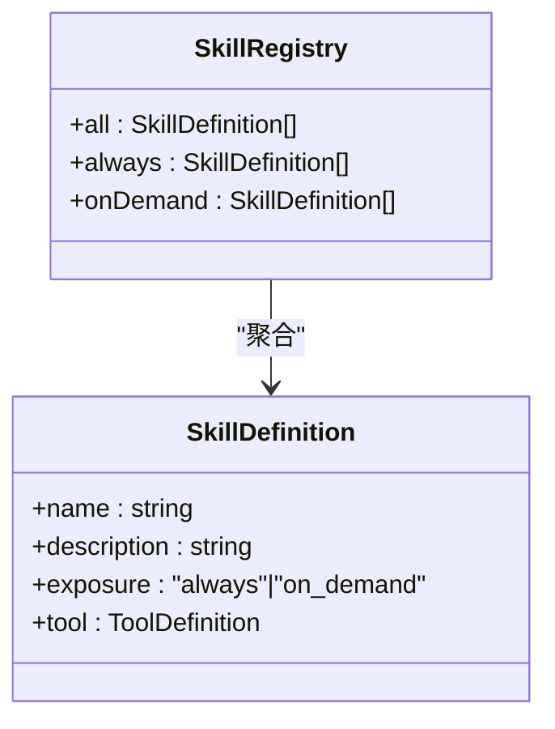
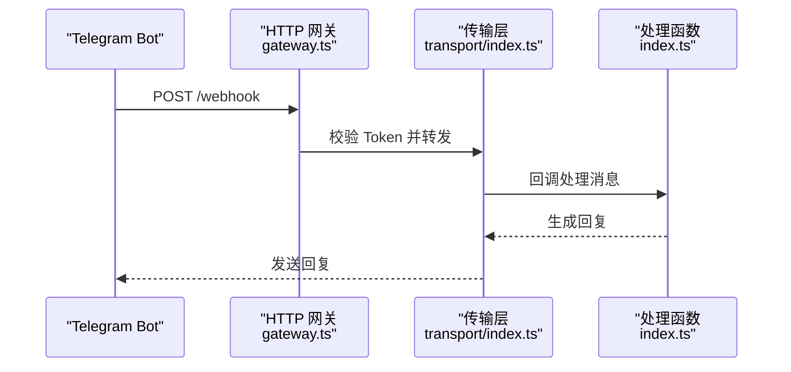
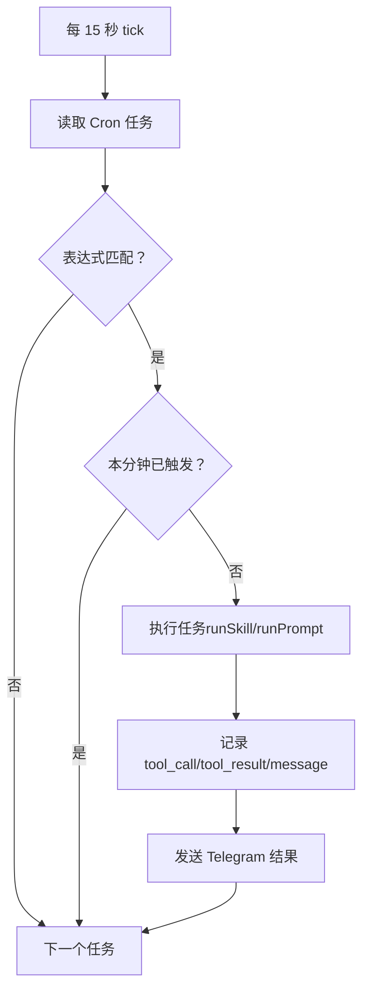
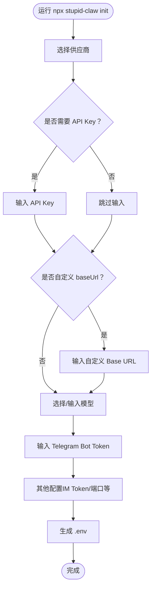
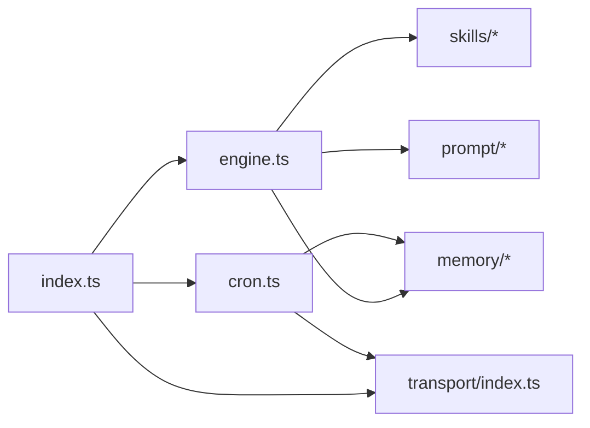

# 智能对话引擎

<cite>
**本文档引用的文件**
- [engine.ts](file://src/engine.ts)
- [index.ts](file://src/index.ts)
- [init.ts](file://src/init.ts)
- [init-providers.ts](file://src/init-providers.ts)
- [gateway.ts](file://src/gateway.ts)
- [transport/index.ts](file://src/transport/index.ts)
- [transport/polling.ts](file://src/transport/polling.ts)
- [transport/webhook.ts](file://src/transport/webhook.ts)
- [transport/stupid-im.ts](file://src/transport/stupid-im.ts)
- [skills/registry.ts](file://src/skills/registry.ts)
- [skills/contracts.ts](file://src/skills/contracts.ts)
- [skills/system/list_available_skills.ts](file://src/skills/system/list_available_skills.ts)
- [skills/web/web_search.ts](file://src/skills/web/web_search.ts)
- [memory/history-store.ts](file://src/memory/history-store.ts)
- [memory/profile-store.ts](file://src/memory/profile-store.ts)
- [memory/workspace-path.ts](file://src/memory/workspace-path.ts)
- [prompt/identity.ts](file://src/prompt/identity.ts)
- [cron.ts](file://src/cron.ts)
- [package.json](file://package.json)
- [README.md](file://README.md)
</cite>

## 目录
1. [简介](#简介)
2. [项目结构](#项目结构)
3. [核心组件](#核心组件)
4. [架构总览](#架构总览)
5. [详细组件分析](#详细组件分析)
6. [依赖关系分析](#依赖关系分析)
7. [性能考虑](#性能考虑)
8. [故障排除指南](#故障排除指南)
9. [结论](#结论)
10. [附录](#附录)

## 简介
本文件为 StupidClaw 智能对话引擎的综合技术文档，面向希望理解并使用该引擎进行智能对话与自动化任务的开发者与运维人员。文档重点涵盖以下方面：
- 会话管理：如何创建、复用与持久化用户会话状态
- 模型调用机制：如何选择与注册多供应商模型，如何处理 API Key 与错误
- 提示词构建系统：静态身份提示、动态运行时上下文、文件技能注入
- 技能系统协作：内置技能、按需披露、工具执行与历史记录
- 传输层集成：Telegram 轮询/Webhook、StupidIM 网页端
- 定时任务：Cron 表达式解析与触发
- 配置示例、性能优化建议与常见问题解决方案

## 项目结构
StupidClaw 采用模块化组织方式，核心入口负责初始化、加载配置、启动传输层与定时任务；引擎负责会话与模型交互；技能系统提供可扩展的工具集；内存与工作空间保障数据持久化与沙盒安全。

**图表来源**
- [index.ts:112-216](file://src/index.ts#L112-L216)
- [engine.ts:392-475](file://src/engine.ts#L392-L475)
- [transport/index.ts:47-71](file://src/transport/index.ts#L47-L71)
- [skills/registry.ts:23-55](file://src/skills/registry.ts#L23-L55)
- [memory/history-store.ts:37-83](file://src/memory/history-store.ts#L37-L83)
- [memory/profile-store.ts:112-132](file://src/memory/profile-store.ts#L112-L132)
- [prompt/identity.ts:1-9](file://src/prompt/identity.ts#L1-L9)
- [cron.ts:251-265](file://src/cron.ts#L251-L265)

**章节来源**
- [README.md:22-52](file://README.md#L22-L52)
- [package.json:14-39](file://package.json#L14-L39)

## 核心组件
- 对话引擎（engine.ts）
  - 会话生命周期管理：按 chatId 复用 AgentSession，避免重复创建
  - 模型注册与选择：通过 ModelRegistry 注册多供应商模型，支持兜底策略
  - 提示词构建：静态身份提示 + 动态运行时上下文 + 文件技能注入
  - 错误处理：规范化 API Key 缺失/错误提示，降级回复
- 技能系统（skills/registry.ts）
  - 内置技能：系统时间查询、历史检索、更新 profile、技能目录、网络搜索、天气查询、代码生成等
  - 暴露级别：always（始终可用）、on_demand（按需调用）
  - 工具执行：统一 ToolDefinition 接口，参数校验与执行
- 传输层（transport/index.ts）
  - 支持 Telegram 轮询与 Webhook，以及 StupidIM 网页端
  - 统一消息封装与回调处理
- 内存与工作空间（memory/*）
  - 历史事件 JSONL 存储，按日期分片
  - profile.md 长期记忆，三段式结构（稳定事实/偏好/约束）
  - 安全路径解析，限制 AI 仅在 .stupidClaw 目录内读写
- 定时任务（cron.ts）
  - Cron 表达式解析与分钟粒度去重触发
  - 支持技能调用与 prompt 执行两种任务类型
- 初始化向导（init.ts + init-providers.ts）
  - 交互式选择供应商与模型，生成 .env 配置
  - 支持自定义 OpenAI/Anthropic 兼容接口

**章节来源**
- [engine.ts:392-475](file://src/engine.ts#L392-L475)
- [skills/registry.ts:23-55](file://src/skills/registry.ts#L23-L55)
- [transport/index.ts:47-71](file://src/transport/index.ts#L47-L71)
- [memory/history-store.ts:37-83](file://src/memory/history-store.ts#L37-L83)
- [memory/profile-store.ts:112-132](file://src/memory/profile-store.ts#L112-L132)
- [cron.ts:251-265](file://src/cron.ts#L251-L265)
- [init.ts:224-339](file://src/init.ts#L224-L339)
- [init-providers.ts:23-180](file://src/init-providers.ts#L23-L180)

## 架构总览
StupidClaw 的整体架构围绕“引擎 + 传输层 + 技能系统 + 内存与工作空间”展开，形成闭环的消息处理与执行链路。

**图表来源**
- [engine.ts:511-607](file://src/engine.ts#L511-L607)
- [engine.ts:484-509](file://src/engine.ts#L484-L509)
- [memory/history-store.ts:37-42](file://src/memory/history-store.ts#L37-L42)
- [memory/profile-store.ts:112-115](file://src/memory/profile-store.ts#L112-L115)
- [skills/registry.ts:23-55](file://src/skills/registry.ts#L23-L55)

## 详细组件分析

### 会话管理与模型调用机制
- 会话创建与复用
  - 按 chatId 缓存 ChatSession，避免重复初始化
  - 使用 in-memory SessionManager 保持会话状态
- 模型注册与选择
  - 通过 createModelRegistry 动态注册供应商（含本地 Ollama/LM Studio 与自定义兼容接口）
  - pickModel 支持 STUPID_MODEL=provider:model_id 或回退到 minimax-cn 默认模型
  - API Key 管理：AuthStorage.create + setRuntimeApiKey，兼容 MINIMAX_API_KEY 透传至 minimax-cn
- 提示词构建
  - buildStaticSystemPrompt 注入文件技能提示块
  - buildTurnPrompt 注入 runtime_context、profile 与用户消息
- 错误处理与降级
  - normalizeApiKeyError 将缺 Key 场景转化为可读提示
  - fallbackReply 提供兜底回复
  - stripThinkTags 清理思考标签，确保输出整洁

**图表来源**
- [engine.ts:511-607](file://src/engine.ts#L511-L607)
- [engine.ts:484-509](file://src/engine.ts#L484-L509)
- [engine.ts:578-590](file://src/engine.ts#L578-L590)

**章节来源**
- [engine.ts:392-475](file://src/engine.ts#L392-L475)
- [engine.ts:196-244](file://src/engine.ts#L196-L244)
- [engine.ts:188-194](file://src/engine.ts#L188-L194)
- [engine.ts:511-607](file://src/engine.ts#L511-L607)

### 模型注册表与供应商支持
- 支持的供应商与模型
  - MiniMax（minimax-cn/minimax）、DeepSeek、Kimi（Moonshot AI）、阿里 DashScope、智谱 bigmodel、OpenAI、Anthropic、Google Gemini、Groq、xAI、OpenRouter、Ollama、LM Studio、自定义 OpenAI/Anthropic 兼容接口
- 注册流程
  - createModelRegistry 动态注册，必要时设置 runtime API Key
  - 本地模型（Ollama/LM Studio）无需 API Key，自动注入
  - 自定义模型通过 STUPID_MODEL=provider:model_id 指定
- 环境变量映射
  - PROVIDER_ENV_KEY_MAP 统一映射各供应商 API Key 环境变量名

**图表来源**
- [engine.ts:246-383](file://src/engine.ts#L246-L383)
- [engine.ts:39-57](file://src/engine.ts#L39-L57)

**章节来源**
- [engine.ts:246-383](file://src/engine.ts#L246-L383)
- [init-providers.ts:23-180](file://src/init-providers.ts#L23-L180)
- [engine.ts:39-57](file://src/engine.ts#L39-L57)

### 提示词构建系统
- 静态身份提示
  - IDENTITY_PROMPT_LINES 定义回答风格、任务优先级与技能使用规范
- 动态运行时上下文
  - buildTurnPrompt 注入 chat_id、ISO 时间、本地时间、profile 与用户消息
- 文件技能注入
  - loadStandardFileSkills + formatSkillsForPrompt 将文件技能转换为提示词片段
- 调试开关
  - DEBUG_PROMPT 输出完整提示词，DEBUG_ENGINE 输出运行时配置

**图表来源**
- [engine.ts:484-509](file://src/engine.ts#L484-L509)
- [engine.ts:188-194](file://src/engine.ts#L188-L194)
- [prompt/identity.ts:1-9](file://src/prompt/identity.ts#L1-L9)

**章节来源**
- [engine.ts:484-509](file://src/engine.ts#L484-L509)
- [engine.ts:188-194](file://src/engine.ts#L188-L194)
- [prompt/identity.ts:1-9](file://src/prompt/identity.ts#L1-L9)

### 技能系统与工具协作
- 技能注册表
  - createSkillRegistry 组合系统技能、文件技能元数据与内置工具
  - exposure 控制技能可见性：always（始终）、on_demand（按需）
- 技能契约
  - SkillDefinition 统一 ToolDefinition 接口，参数 Schema 校验
- 典型技能
  - list_available_skills：列出所有技能及其暴露级别
  - web_search：Brave 搜索 API，返回标题、链接与摘要
- 执行与历史
  - engine.ts 在工具执行期间记录 tool_call/tool_result，便于审计与回溯

**图表来源**
- [skills/registry.ts:13-55](file://src/skills/registry.ts#L13-L55)
- [skills/contracts.ts:16-20](file://src/skills/contracts.ts#L16-L20)
- [skills/system/list_available_skills.ts:4-40](file://src/skills/system/list_available_skills.ts#L4-L40)
- [skills/web/web_search.ts:16-95](file://src/skills/web/web_search.ts#L16-L95)

**章节来源**
- [skills/registry.ts:23-55](file://src/skills/registry.ts#L23-L55)
- [skills/contracts.ts:16-20](file://src/skills/contracts.ts#L16-L20)
- [skills/system/list_available_skills.ts:4-40](file://src/skills/system/list_available_skills.ts#L4-L40)
- [skills/web/web_search.ts:16-95](file://src/skills/web/web_search.ts#L16-L95)

### 传输层与消息闭环
- 传输入口
  - startTransport 根据 TELEGRAM_MODE 选择轮询或 Webhook，同时支持 StupidIM
- 轮询模式
  - runPollingMode 循环拉取更新，逐条回调处理
- Webhook 模式
  - runWebhookMode 提供 HTTP 入口，配合网关校验
- 网关
  - startGateway 提供通用 HTTP 网关，支持 Secret Token 校验

**图表来源**
- [gateway.ts:27-79](file://src/gateway.ts#L27-L79)
- [transport/index.ts:47-71](file://src/transport/index.ts#L47-L71)
- [index.ts:189-208](file://src/index.ts#L189-L208)

**章节来源**
- [transport/index.ts:19-71](file://src/transport/index.ts#L19-L71)
- [gateway.ts:27-79](file://src/gateway.ts#L27-L79)
- [index.ts:189-208](file://src/index.ts#L189-L208)

### 定时任务与主动执行
- Cron 表达式解析
  - isCronExprMatch 支持分钟/小时/日/月/周五段表达式
- 触发策略
  - 按分钟粒度去重，避免重复触发
  - 支持两类任务：runSkill（直接调用技能）与 runPrompt（构造提示后对话）
- 执行与记录
  - triggerJob 统一执行并发送 Telegram 消息
  - appendHistoryEvent 记录工具调用、结果与最终消息

**图表来源**
- [cron.ts:171-265](file://src/cron.ts#L171-L265)
- [cron.ts:131-145](file://src/cron.ts#L131-L145)
- [memory/history-store.ts:37-42](file://src/memory/history-store.ts#L37-L42)

**章节来源**
- [cron.ts:85-109](file://src/cron.ts#L85-L109)
- [cron.ts:171-265](file://src/cron.ts#L171-L265)

### 初始化向导与配置示例
- 初始化流程
  - 选择供应商 → 输入 API Key（部分供应商无需）→ 选择/输入模型 → 配置 Telegram Token → 其他参数 → 生成 .env
- 供应商清单
  - PROVIDERS 包含静态模型与 baseUrl/apiType/isCustom 等元信息
- 配置要点
  - STUPID_MODEL=provider:model_id
  - 对应供应商 API Key 环境变量
  - TELEGRAM_BOT_TOKEN（可选，留空仅启用 StupidIM）
  - STUPID_IM_TOKEN（网页端访问密钥）

**图表来源**
- [init.ts:224-339](file://src/init.ts#L224-L339)
- [init-providers.ts:23-180](file://src/init-providers.ts#L23-L180)

**章节来源**
- [init.ts:224-339](file://src/init.ts#L224-L339)
- [init-providers.ts:23-180](file://src/init-providers.ts#L23-L180)

## 依赖关系分析
- 外部依赖
  - @mariozechner/pi-coding-agent：AgentSession、ModelRegistry、工具与资源加载
  - @mariozechner/pi-ai：Schema 类型与工具参数定义
  - dotenv：.env 加载
  - ws：WebSocket（网页端 IM）
- 内部模块耦合
  - index.ts 作为唯一入口，协调传输、引擎、定时任务与技能注册
  - engine.ts 依赖 memory、skills、prompt 与外部模型供应商
  - cron.ts 依赖 transport 与 memory，形成闭环

**图表来源**
- [index.ts:112-216](file://src/index.ts#L112-L216)
- [engine.ts:1-20](file://src/engine.ts#L1-L20)

**章节来源**
- [package.json:30-39](file://package.json#L30-L39)
- [index.ts:112-216](file://src/index.ts#L112-L216)

## 性能考虑
- 会话复用
  - 使用 Map 按 chatId 缓存 ChatSession，减少初始化开销
- 流式输出
  - 订阅 message_update 事件，优先拼接 text_delta，避免重复拼接 text_end
- 提示词精简
  - 仅注入必要上下文与文件技能片段，避免冗余
- Cron 触发频率
  - 15 秒 tick，分钟级去重，平衡实时性与资源占用
- I/O 优化
  - 历史按日分片 JSONL 追加写入，避免大文件随机写
- 本地模型
  - Ollama/LM Studio 无需网络往返，降低延迟

[本节为通用指导，无需特定文件来源]

## 故障排除指南
- API Key 缺失/错误
  - 现象：抛出包含 No API key found 的错误
  - 处理：根据 normalizeApiKeyError 提示检查 .env 中对应供应商 Key，或确认 STUPID_MODEL 的 provider/model_id 拼写
- 供应商不可用
  - 现象：pickModel 无法匹配可用模型
  - 处理：检查 PROVIDER_ENV_KEY_MAP 对应 Key 是否配置，或改用可用模型
- Telegram 未配置
  - 现象：仅启动 StupidIM 网页端
  - 处理：配置 TELEGRAM_BOT_TOKEN 或留空仅使用网页端
- Cron 任务未触发
  - 现象：任务表达式匹配但未执行
  - 处理：确认 Cron 表达式格式，检查分钟级去重逻辑与 lastTriggeredAt 更新
- 网关鉴权失败
  - 现象：HTTP 401 Unauthorized
  - 处理：核对 X-Telegram-Bot-API-Secret-Token 请求头与网关配置

**章节来源**
- [engine.ts:162-186](file://src/engine.ts#L162-L186)
- [engine.ts:196-244](file://src/engine.ts#L196-L244)
- [index.ts:117-120](file://src/index.ts#L117-L120)
- [cron.ts:171-265](file://src/cron.ts#L171-L265)
- [gateway.ts:46-53](file://src/gateway.ts#L46-L53)

## 结论
StupidClaw 通过清晰的模块划分与稳健的工程实践，实现了“极简本地 Agent”的目标：以文件系统为唯一持久化介质，严格沙盒限制，提供多供应商模型接入、可扩展技能系统、稳定的会话与历史管理，以及主动触发的定时任务能力。对于希望在本地可控环境中部署智能对话与自动化任务的团队与个人，StupidClaw 提供了低门槛、高可维护性的方案。

[本节为总结性内容，无需特定文件来源]

## 附录

### 关键配置项速查
- STUPID_MODEL：模型选择，格式为 provider:model_id
- 各供应商 API Key 环境变量：参考 PROVIDER_ENV_KEY_MAP
- TELEGRAM_BOT_TOKEN：Telegram Bot Token（可选）
- TELEGRAM_MODE：polling 或 webhook
- STUPID_IM_TOKEN：网页端 IM 访问密钥
- PORT：服务端口
- DEBUG_STUPIDCLAW / DEBUG_PROMPT：调试开关

**章节来源**
- [engine.ts:39-57](file://src/engine.ts#L39-L57)
- [init.ts:184-222](file://src/init.ts#L184-L222)