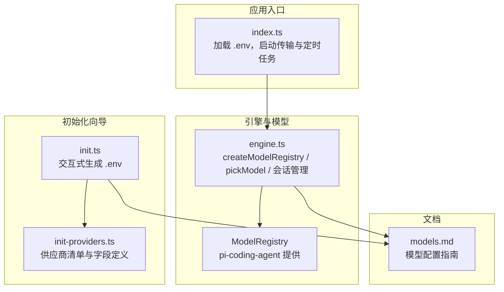
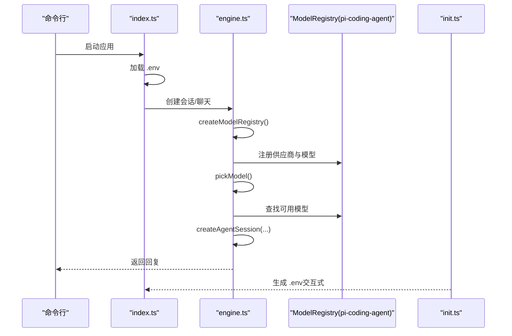
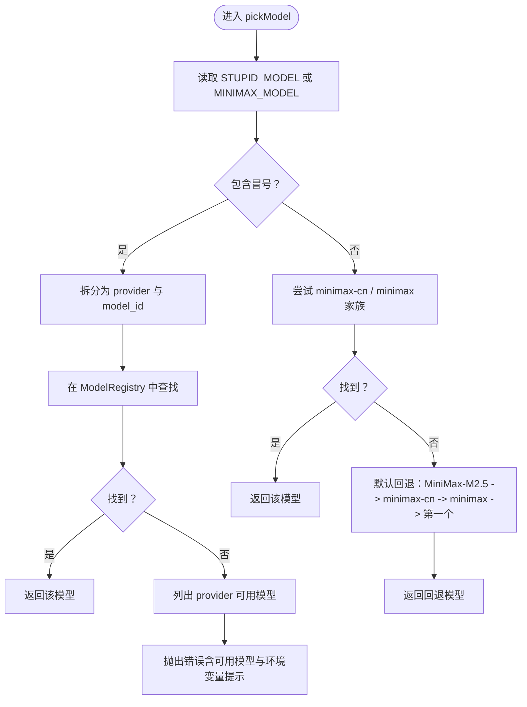
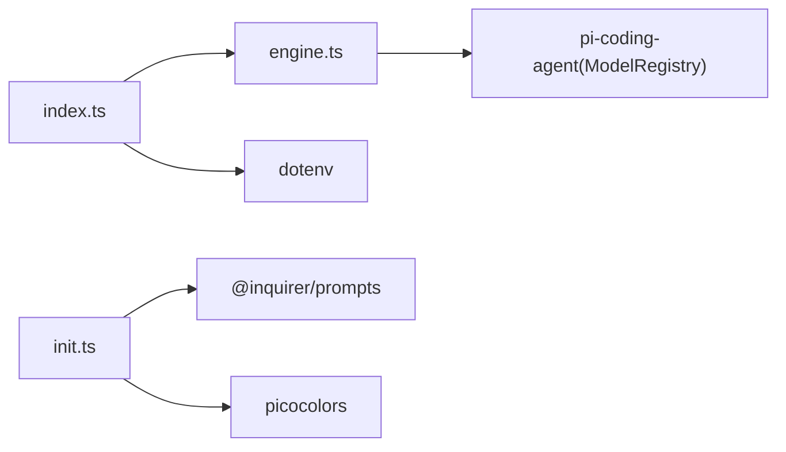

# 模型集成

<cite>
**本文档引用的文件**
- [engine.ts](file://src/engine.ts)
- [init-providers.ts](file://src/init-providers.ts)
- [init.ts](file://src/init.ts)
- [index.ts](file://src/index.ts)
- [models.md](file://docs/models.md)
- [package.json](file://package.json)
</cite>

## 目录
1. [简介](#简介)
2. [项目结构](#项目结构)
3. [核心组件](#核心组件)
4. [架构总览](#架构总览)
5. [详细组件分析](#详细组件分析)
6. [依赖关系分析](#依赖关系分析)
7. [性能考量](#性能考量)
8. [故障排查指南](#故障排查指南)
9. [结论](#结论)
10. [附录](#附录)

## 简介
本文件面向 StupidClaw 的模型集成系统，系统基于 pi-mono 底座，提供统一的模型注册与选择能力。文档重点涵盖：
- createModelRegistry 的注册流程与扩展点，包括原生支持与自定义扩展
- pickModel 的模型选择逻辑，含环境变量、默认回退与错误处理
- 支持的供应商与配置方法（OpenAI、Anthropic、DeepSeek、Kimi、DashScope、智谱、Groq、xAI、OpenRouter、MiniMax、Google Gemini、HuggingFace、Bedrock、Azure OpenAI、Vertex AI 等）
- 自定义模型配置（Ollama、LM Studio、自定义 OpenAI/Anthropic 兼容接口）
- 模型性能对比、成本计算、上下文窗口限制与令牌使用优化建议

## 项目结构
与模型集成相关的关键文件与职责：
- engine.ts：模型注册、模型选择、会话创建、错误归一化与调试日志
- init-providers.ts：初始化向导的供应商清单与字段定义
- init.ts：交互式初始化向导，生成 .env 并写入必要配置
- index.ts：应用入口，加载 .env、启动传输层与定时任务
- models.md：官方模型配置与使用指南
- package.json：依赖声明，包含 @mariozechner/pi-coding-agent 与 @mariozechner/pi-ai

图表来源
- [engine.ts:1-706](file://src/engine.ts#L1-L706)
- [init.ts:1-339](file://src/init.ts#L1-L339)
- [init-providers.ts:1-180](file://src/init-providers.ts#L1-L180)
- [models.md:1-281](file://docs/models.md#L1-L281)
- [index.ts:1-216](file://src/index.ts#L1-L216)

章节来源
- [engine.ts:1-706](file://src/engine.ts#L1-L706)
- [init.ts:1-339](file://src/init.ts#L1-L339)
- [init-providers.ts:1-180](file://src/init-providers.ts#L1-L180)
- [models.md:1-281](file://docs/models.md#L1-L281)
- [index.ts:1-216](file://src/index.ts#L1-L216)

## 核心组件
- createModelRegistry：根据环境变量动态注册供应商与模型，支持本地与自定义兼容接口
- pickModel：解析 STUPID_MODEL/旧 MINIMAX_MODEL，进行精确匹配与默认回退
- 初始化向导：提供交互式选择供应商、模型与自定义 Base URL 的能力
- 错误归一化：将底层 API Key 缺失等错误转换为更友好的提示

章节来源
- [engine.ts:246-383](file://src/engine.ts#L246-L383)
- [engine.ts:196-244](file://src/engine.ts#L196-L244)
- [init.ts:224-339](file://src/init.ts#L224-L339)
- [engine.ts:162-186](file://src/engine.ts#L162-L186)

## 架构总览
模型集成的整体流程：
- 应用启动时加载 .env
- 初始化向导可生成 .env，包含 STUPID_MODEL 与各供应商 API Key
- 引擎创建 ModelRegistry，按环境变量注册供应商
- pickModel 依据配置选择具体模型
- 创建 Agent 会话，发起对话并处理工具调用与历史记录

图表来源
- [index.ts:112-209](file://src/index.ts#L112-L209)
- [engine.ts:392-459](file://src/engine.ts#L392-L459)
- [engine.ts:246-383](file://src/engine.ts#L246-L383)
- [engine.ts:196-244](file://src/engine.ts#L196-L244)
- [init.ts:224-339](file://src/init.ts#L224-L339)

## 详细组件分析

### createModelRegistry：模型注册表配置与扩展
- 动态注册原生支持的供应商（OpenAI、Anthropic、Google Gemini、Groq、xAI、OpenRouter、HuggingFace、MiniMax、MiniMax-CN 等）
- 扩展支持的供应商（DeepSeek、Kimi、DashScope、智谱）
- 本地模型（Ollama、LM Studio）与自定义兼容接口（custom-openai、custom-anthropic）
- 供应商与 API Key 的映射与复用（如 MiniMax-CN 与 MINIMAX_API_KEY 的互备）

关键实现要点
- 通过 AuthStorage 设置运行时 API Key
- 逐条件判断环境变量，满足即注册对应供应商
- 本地与自定义接口通过 STUPID_MODEL 中的 provider:model_id 提取模型 ID
- 注册时设置模型元数据（如 contextWindow、maxTokens、cost 等）

章节来源
- [engine.ts:246-383](file://src/engine.ts#L246-L383)

### pickModel：模型选择逻辑
- 优先读取 STUPID_MODEL；若包含冒号，按 provider:model_id 精确匹配
- 若未包含冒号，兼容旧逻辑：尝试在 minimax-cn/minimax 家族中查找
- 若未命中，按优先级回退：MiniMax-M2.5 -> minimax-cn -> minimax -> 第一个可用模型
- 匹配失败时抛出明确错误，包含可用模型列表与环境变量提示

图表来源
- [engine.ts:196-244](file://src/engine.ts#L196-L244)

章节来源
- [engine.ts:196-244](file://src/engine.ts#L196-L244)

### 初始化向导：供应商与模型选择
- 供应商清单来自 init-providers.ts，包含 envKey、baseUrl、apiType、isCustom 等字段
- 交互式引导用户输入 API Key、自定义 Base URL、选择模型
- 生成 .env，包含 STUPID_MODEL 与对应供应商的 API Key
- OpenRouter 提供优先级推荐与“手动输入 model_id”选项

章节来源
- [init-providers.ts:1-180](file://src/init-providers.ts#L1-L180)
- [init.ts:224-339](file://src/init.ts#L224-L339)

### 错误处理与调试
- normalizeApiKeyError：将底层 API Key 缺失错误转换为更清晰的提示，包含当前配置与缺失的环境变量
- debugLog/debugPromptLog：可开启调试输出，便于定位问题
- fallbackReply：当模型调用失败时返回兜底回复

章节来源
- [engine.ts:162-186](file://src/engine.ts#L162-L186)
- [engine.ts:154-156](file://src/engine.ts#L154-L156)
- [engine.ts:39-63](file://src/engine.ts#L39-L63)

## 依赖关系分析
- 引擎依赖 pi-coding-agent 的 ModelRegistry 与会话管理
- 初始化向导依赖 @inquirer/prompts 与 picocolors
- 应用入口依赖 dotenv 加载 .env

图表来源
- [index.ts:1-216](file://src/index.ts#L1-L216)
- [engine.ts:1-17](file://src/engine.ts#L1-L17)
- [init.ts:1-6](file://src/init.ts#L1-L6)
- [package.json:30-37](file://package.json#L30-L37)

章节来源
- [package.json:30-37](file://package.json#L30-L37)
- [engine.ts:1-17](file://src/engine.ts#L1-L17)
- [index.ts:1-11](file://src/index.ts#L1-L11)
- [init.ts:1-6](file://src/init.ts#L1-L6)

## 性能考量
- 上下文窗口与最大输出令牌
  - 不同模型的 contextWindow 与 maxTokens 在注册时已设定，可在 models.md 中查阅
  - 建议在 STUPID_MODEL 中选择具备更大上下文窗口的模型以减少截断
- 成本计算
  - 注册时已为部分模型设置 cost 字段，便于估算
  - 实际计费以各供应商官方定价为准
- 令牌使用优化建议
  - 控制每轮输入长度，避免超出 contextWindow
  - 合理使用工具调用与历史记录，减少冗余内容
  - 对于本地模型（Ollama/LM Studio），注意本地资源占用与响应延迟

章节来源
- [engine.ts:291-337](file://src/engine.ts#L291-L337)
- [models.md:1-281](file://docs/models.md#L1-L281)

## 故障排查指南
常见问题与解决思路
- API Key 未配置或拼写错误
  - 症状：抛出 API Key 缺失错误
  - 处理：检查 .env 中对应供应商的环境变量是否正确
- STUPID_MODEL 与可用模型不匹配
  - 症状：提示无法匹配可用模型，给出可用列表
  - 处理：核对 provider/model_id 拼写，或切换为可用模型之一
- 本地模型无法连接
  - 症状：Ollama/LM Studio 无法访问
  - 处理：确认本地服务运行状态与 baseUrl 配置
- 自定义兼容接口无法通信
  - 症状：custom-openai/custom-anthropic 无法请求
  - 处理：检查 CUSTOM_*_BASE_URL 与 CUSTOM_*_API_KEY，确保服务可达

章节来源
- [engine.ts:162-186](file://src/engine.ts#L162-L186)
- [engine.ts:200-235](file://src/engine.ts#L200-L235)
- [engine.ts:261-289](file://src/engine.ts#L261-L289)
- [engine.ts:354-380](file://src/engine.ts#L354-L380)

## 结论
StupidClaw 的模型集成系统通过 createModelRegistry 与 pickModel 实现了灵活的供应商与模型选择，既支持原生云端供应商，又允许本地与自定义兼容接口无缝接入。配合初始化向导与完善的文档，用户可以快速完成配置并获得一致的模型体验。建议在生产环境中结合上下文窗口与成本预算，合理选择模型，并通过调试日志与错误提示快速定位问题。

## 附录

### 支持的供应商与配置方法
- 原生支持（pi-mono 底座）
  - OpenAI、Anthropic、Google Gemini、Groq、xAI、OpenRouter、HuggingFace、MiniMax、MiniMax-CN
- StupidClaw 扩展支持
  - DeepSeek、Kimi、DashScope、智谱
- 本地模型
  - Ollama、LM Studio（通过 models.json 注册）
- 自定义兼容接口
  - custom-openai（OpenAI 兼容）、custom-anthropic（Anthropic 兼容）

章节来源
- [models.md:35-100](file://docs/models.md#L35-L100)
- [models.md:155-281](file://docs/models.md#L155-L281)
- [engine.ts:261-380](file://src/engine.ts#L261-L380)

### 环境变量与 .env 配置
- STUPID_MODEL：选择模型的主配置，格式为 provider:model_id
- 各供应商 API Key：如 OPENAI_API_KEY、ANTHROPIC_API_KEY、DEEPSEEK_API_KEY、MOONSHOT_API_KEY、DASHSCOPE_API_KEY、ZHIPU_API_KEY、GROQ_API_KEY、XAI_API_KEY、OPENROUTER_API_KEY、HF_TOKEN、MINIMAX_API_KEY、MINIMAX_CN_API_KEY
- 本地与自定义接口
  - Ollama/LM Studio：OLLAMA_BASE_URL、LMSTUDIO_BASE_URL
  - 自定义 OpenAI/Anthropic：CUSTOM_OPENAI_BASE_URL/CUSTOM_OPENAI_API_KEY、CUSTOM_ANTHROPIC_BASE_URL/CUSTOM_ANTHROPIC_API_KEY

章节来源
- [models.md:9-32](file://docs/models.md#L9-L32)
- [models.md:66-100](file://docs/models.md#L66-L100)
- [models.md:221-281](file://docs/models.md#L221-L281)
- [engine.ts:39-57](file://src/engine.ts#L39-L57)

### 模型选择与回退策略
- 优先级：STUPID_MODEL（精确匹配） -> 旧 MINIMAX_MODEL 兼容 -> 默认回退（MiniMax-M2.5 -> minimax-cn -> minimax -> 第一个可用）
- 匹配失败时，返回可用模型列表与环境变量提示，便于快速修复

章节来源
- [engine.ts:196-244](file://src/engine.ts#L196-L244)