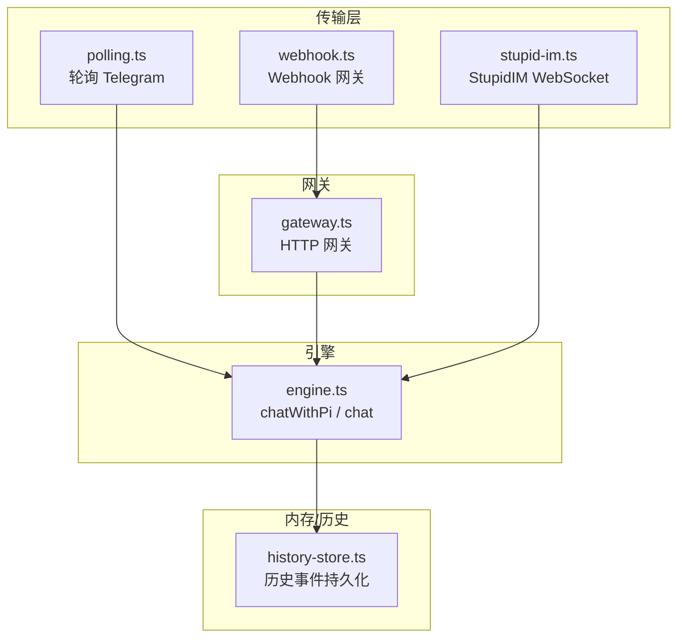
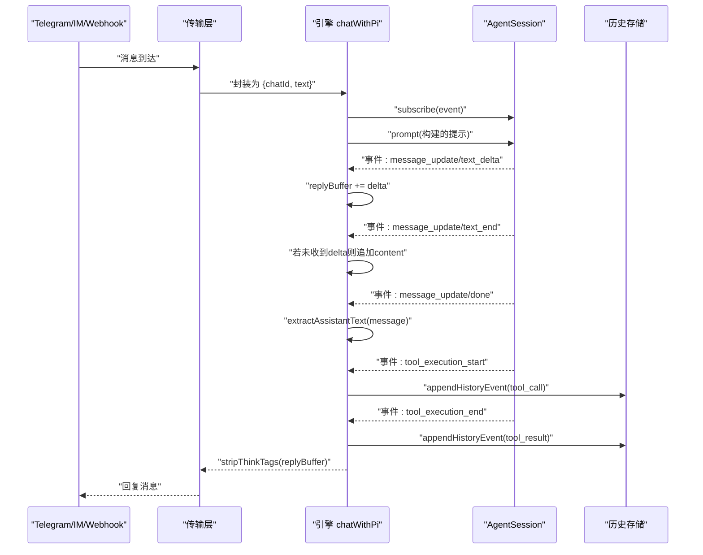
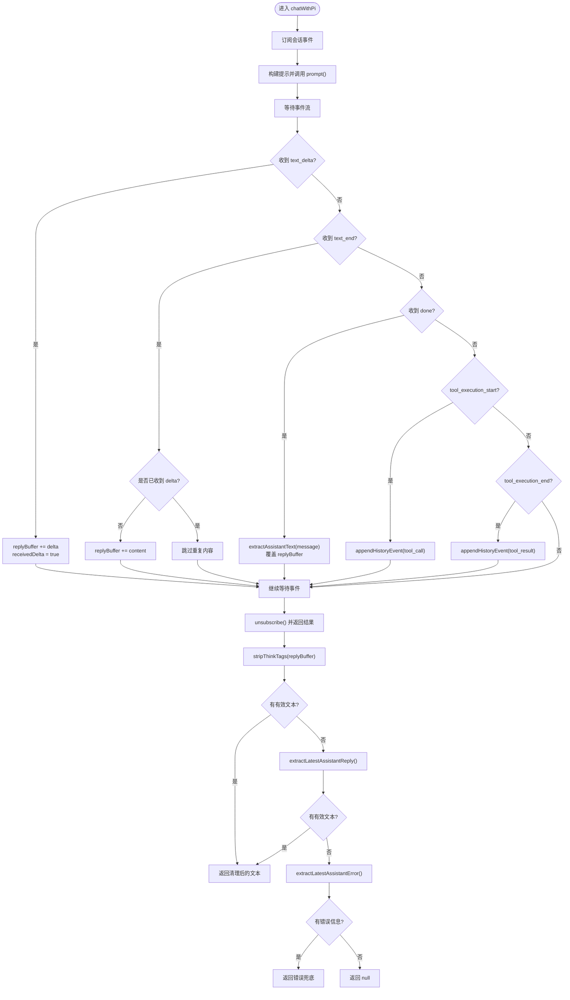
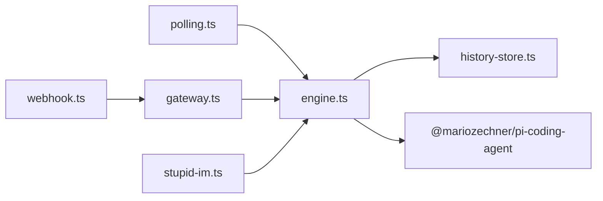

# 流式响应处理

<cite>
**本文引用的文件列表**
- [engine.ts](file://src/engine.ts)
- [index.ts](file://src/index.ts)
- [history-store.ts](file://src/memory/history-store.ts)
- [polling.ts](file://src/transport/polling.ts)
- [webhook.ts](file://src/transport/webhook.ts)
- [stupid-im.ts](file://src/transport/stupid-im.ts)
- [gateway.ts](file://src/gateway.ts)
- [package.json](file://package.json)
</cite>

## 目录
1. [简介](#简介)
2. [项目结构](#项目结构)
3. [核心组件](#核心组件)
4. [架构总览](#架构总览)
5. [详细组件分析](#详细组件分析)
6. [依赖关系分析](#依赖关系分析)
7. [性能考量](#性能考量)
8. [故障排查指南](#故障排查指南)
9. [结论](#结论)

## 简介
本文档围绕 StupidClaw 的流式响应处理系统，聚焦 chatWithPi 函数的事件订阅、消息更新与响应缓冲机制，深入解析 message_update 事件中 text_delta、text_end 与 done 的区别与处理策略；阐述 replyBuffer 的构建与去重逻辑，确保不会重复拼接相同内容；文档化工具执行事件 tool_execution_start 与 tool_execution_end 的监听与历史存储；详解响应提取逻辑，包括 extractAssistantText 的多格式内容解析与 stripThinkTags 的标签清理；最后给出性能优化、错误恢复与调试方法。

## 项目结构
StupidClaw 的流式处理位于引擎层（engine.ts），通过会话订阅事件驱动输出；传输层负责接收外部消息（轮询/Webhook/StupidIM），并将消息转发至引擎；历史存储模块负责事件持久化。

图表来源
- [polling.ts:1-243](file://src/transport/polling.ts#L1-L243)
- [webhook.ts:1-86](file://src/transport/webhook.ts#L1-L86)
- [stupid-im.ts:1-105](file://src/transport/stupid-im.ts#L1-L105)
- [gateway.ts:1-79](file://src/gateway.ts#L1-L79)
- [engine.ts:511-705](file://src/engine.ts#L511-L705)
- [history-store.ts:1-83](file://src/memory/history-store.ts#L1-L83)

章节来源
- [index.ts:112-209](file://src/index.ts#L112-L209)
- [engine.ts:511-705](file://src/engine.ts#L511-L705)
- [history-store.ts:1-83](file://src/memory/history-store.ts#L1-L83)
- [polling.ts:1-243](file://src/transport/polling.ts#L1-L243)
- [webhook.ts:1-86](file://src/transport/webhook.ts#L1-L86)
- [stupid-im.ts:1-105](file://src/transport/stupid-im.ts#L1-L105)
- [gateway.ts:1-79](file://src/gateway.ts#L1-L79)

## 核心组件
- 引擎 chatWithPi：负责订阅会话事件、构建 replyBuffer、处理工具执行事件、最终提取并清理响应文本。
- 历史存储 appendHistoryEvent：将工具调用与结果写入历史文件，便于审计与回放。
- 传输层：轮询、Webhook、StupidIM 三种入口，统一转换为引擎输入。
- 响应提取与清理：extractAssistantText 多格式解析、stripThinkTags 标签清理、fallback 回退策略。

章节来源
- [engine.ts:511-705](file://src/engine.ts#L511-L705)
- [history-store.ts:37-42](file://src/memory/history-store.ts#L37-L42)
- [polling.ts:215-242](file://src/transport/polling.ts#L215-L242)
- [webhook.ts:71-84](file://src/transport/webhook.ts#L71-L84)
- [stupid-im.ts:76-98](file://src/transport/stupid-im.ts#L76-L98)

## 架构总览
下图展示从外部消息到引擎处理再到历史记录的关键路径与事件流转。

图表来源
- [engine.ts:511-607](file://src/engine.ts#L511-L607)
- [engine.ts:550-575](file://src/engine.ts#L550-L575)
- [engine.ts:640-678](file://src/engine.ts#L640-L678)
- [engine.ts:591-606](file://src/engine.ts#L591-L606)
- [history-store.ts:37-42](file://src/memory/history-store.ts#L37-L42)
- [polling.ts:215-242](file://src/transport/polling.ts#L215-L242)
- [webhook.ts:71-84](file://src/transport/webhook.ts#L71-L84)
- [stupid-im.ts:76-98](file://src/transport/stupid-im.ts#L76-L98)

## 详细组件分析

### chatWithPi 的流式响应处理机制
- 事件订阅：通过 session.subscribe 订阅事件，根据事件类型分支处理。
- 响应缓冲 replyBuffer：累积增量文本，避免重复拼接。
- 工具执行事件：记录工具调用开始与结束，写入历史。
- 最终提取：优先使用流式增量文本，其次从会话状态提取，最后兜底错误信息。

图表来源
- [engine.ts:511-607](file://src/engine.ts#L511-L607)
- [engine.ts:550-575](file://src/engine.ts#L550-L575)
- [engine.ts:609-638](file://src/engine.ts#L609-L638)
- [engine.ts:640-678](file://src/engine.ts#L640-L678)
- [engine.ts:591-606](file://src/engine.ts#L591-L606)

章节来源
- [engine.ts:511-607](file://src/engine.ts#L511-L607)

### message_update 事件处理逻辑
- text_delta：增量文本，直接拼接到 replyBuffer，并标记 receivedDelta。
- text_end：完整文本。若此前已收到 delta，则不再追加，避免重复。
- done：最终消息体。使用 extractAssistantText 提取文本后覆盖 replyBuffer，确保最终一致性。

章节来源
- [engine.ts:520-549](file://src/engine.ts#L520-L549)

### replyBuffer 的构建与去重
- 使用 receivedDelta 标记是否已收到增量文本，避免在 text_end 再次追加导致重复。
- done 事件中以 extractAssistantText 的结果覆盖 replyBuffer，确保最终文本的完整性与正确性。

章节来源
- [engine.ts:517-549](file://src/engine.ts#L517-L549)

### 工具执行事件的监听与历史存储
- tool_execution_start：记录工具名称与参数，写入历史事件 tool_call。
- tool_execution_end：记录工具结果与错误标志，写入历史事件 tool_result。
- 历史事件采用 JSONL 追加写入，按日期分文件，便于查询与审计。

章节来源
- [engine.ts:550-575](file://src/engine.ts#L550-L575)
- [history-store.ts:37-42](file://src/memory/history-store.ts#L37-L42)

### 响应提取与清理
- extractAssistantText：支持字符串与数组两种内容格式，从 text/content/value 字段抽取文本并拼接。
- stripThinkTags：移除思考标签包裹的内容，仅保留对外可见的正文。
- fallbackReply：当无有效文本时提供兜底回复。

章节来源
- [engine.ts:640-678](file://src/engine.ts#L640-L678)
- [engine.ts:158-160](file://src/engine.ts#L158-L160)
- [engine.ts:154-156](file://src/engine.ts#L154-L156)

### 传输层与入口
- 轮询模式：周期拉取 Telegram 更新，逐条投递至引擎。
- Webhook 模式：设置 Telegram Webhook，HTTP 网关接收回调并转交引擎。
- StupidIM：WebSocket 接入，提供网页端交互，同样转交引擎处理。
- 网关 gateway.ts：通用 HTTP 网关，支持可选 Secret Token 校验。

章节来源
- [polling.ts:52-89](file://src/transport/polling.ts#L52-L89)
- [webhook.ts:41-84](file://src/transport/webhook.ts#L41-L84)
- [stupid-im.ts:24-104](file://src/transport/stupid-im.ts#L24-L104)
- [gateway.ts:27-78](file://src/gateway.ts#L27-L78)

## 依赖关系分析
- 引擎依赖会话（AgentSession）提供的事件流，依赖历史存储模块进行事件持久化。
- 传输层与网关解耦，支持多种入口，统一走引擎处理。
- 依赖 @mariozechner/pi-coding-agent 提供会话与事件模型。

图表来源
- [engine.ts:1-11](file://src/engine.ts#L1-L11)
- [polling.ts:1-5](file://src/transport/polling.ts#L1-L5)
- [webhook.ts:1-3](file://src/transport/webhook.ts#L1-L3)
- [stupid-im.ts:1-6](file://src/transport/stupid-im.ts#L1-L6)
- [gateway.ts:1-14](file://src/gateway.ts#L1-L14)
- [history-store.ts:1-3](file://src/memory/history-store.ts#L1-L3)

章节来源
- [package.json:30-37](file://package.json#L30-L37)
- [engine.ts:1-11](file://src/engine.ts#L1-L11)

## 性能考量
- 事件去重：通过 receivedDelta 避免 text_end 重复拼接，减少字符串拼接开销。
- 增量拼接：仅在收到 text_delta 时累积，降低中间态内存占用。
- 历史写入：异步追加写入，避免阻塞主事件流。
- 文本清理：stripThinkTags 在最终阶段一次性执行，避免多次正则扫描。
- 传输层分片：Telegram 发送按长度切片，必要时回退纯文本，提升成功率与稳定性。

章节来源
- [engine.ts:517-549](file://src/engine.ts#L517-L549)
- [engine.ts:591-606](file://src/engine.ts#L591-L606)
- [history-store.ts:37-42](file://src/memory/history-store.ts#L37-L42)
- [polling.ts:144-176](file://src/transport/polling.ts#L144-L176)
- [polling.ts:215-242](file://src/transport/polling.ts#L215-L242)

## 故障排查指南
- API Key 错误：normalizeApiKeyError 将常见“未配置 API Key”错误规范化，提示检查 .env 与 provider 配置。
- 会话状态异常：extractLatestAssistantError 从会话状态中提取最近的错误信息，优先识别 API Key 相关错误并给出明确提示。
- 历史写入失败：safeAppend 捕获 appendHistoryEvent 异常并记录错误日志，不影响主流程。
- Webhook 配置：检查 TELEGRAM_WEBHOOK_URL、PORT、可选 SECRET_TOKEN；确认网关路径与端口一致。
- 轮询冲突：Telegram 409 冲突时自动禁用 Webhook 再拉取更新，避免重复消费。

章节来源
- [engine.ts:162-186](file://src/engine.ts#L162-L186)
- [engine.ts:620-638](file://src/engine.ts#L620-L638)
- [engine.ts:477-482](file://src/engine.ts#L477-L482)
- [webhook.ts:41-57](file://src/transport/webhook.ts#L41-L57)
- [polling.ts:21-34](file://src/transport/polling.ts#L21-L34)

## 结论
StupidClaw 的流式响应处理以事件驱动为核心，通过 chatWithPi 实现对 text_delta/text_end/done 的差异化处理与去重，结合工具执行事件的历史记录，形成完整的可观测闭环。响应提取与清理确保对外输出的整洁性，配合传输层的多入口与健壮的错误恢复机制，满足生产级的稳定性与可维护性需求。