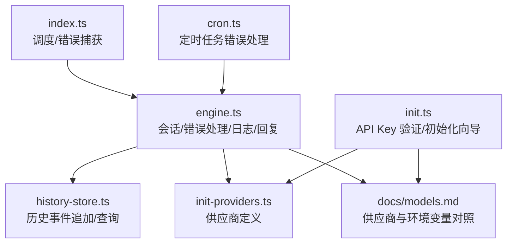
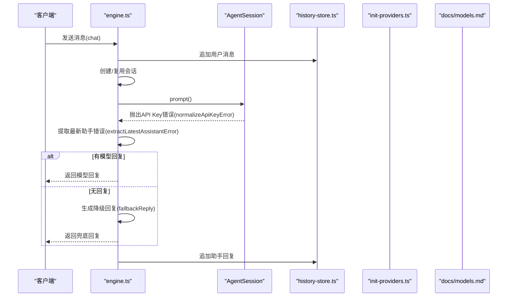
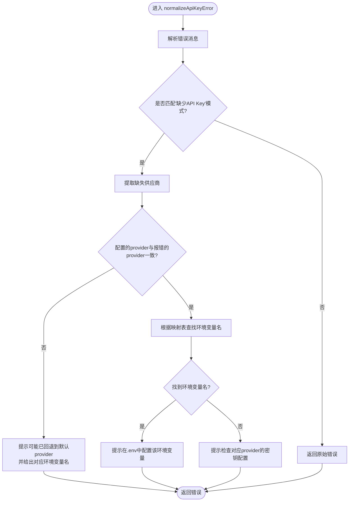
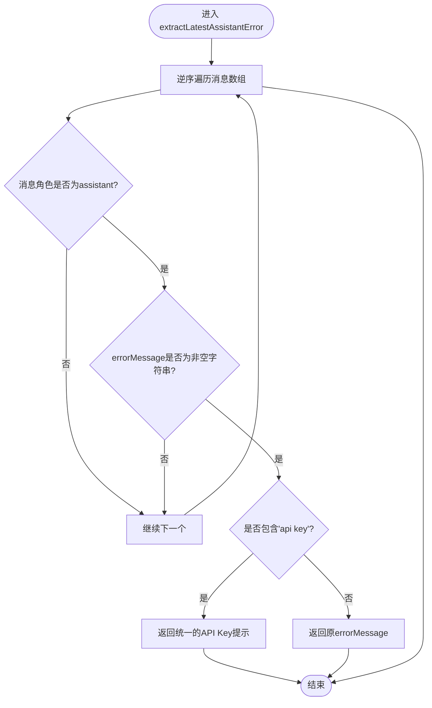
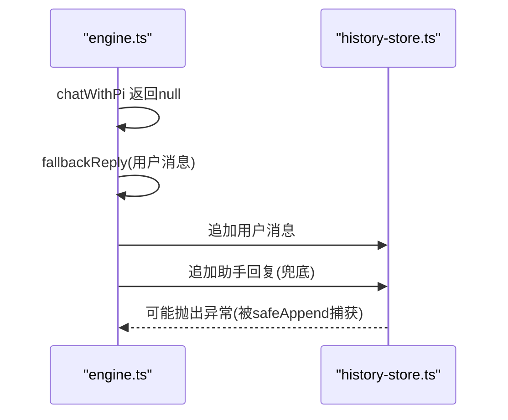
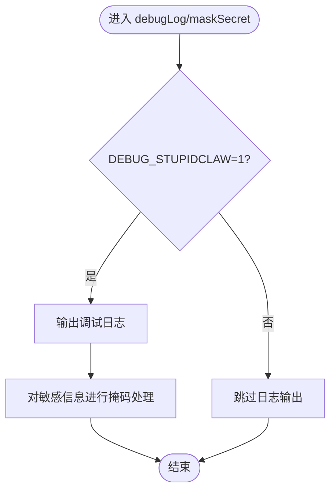
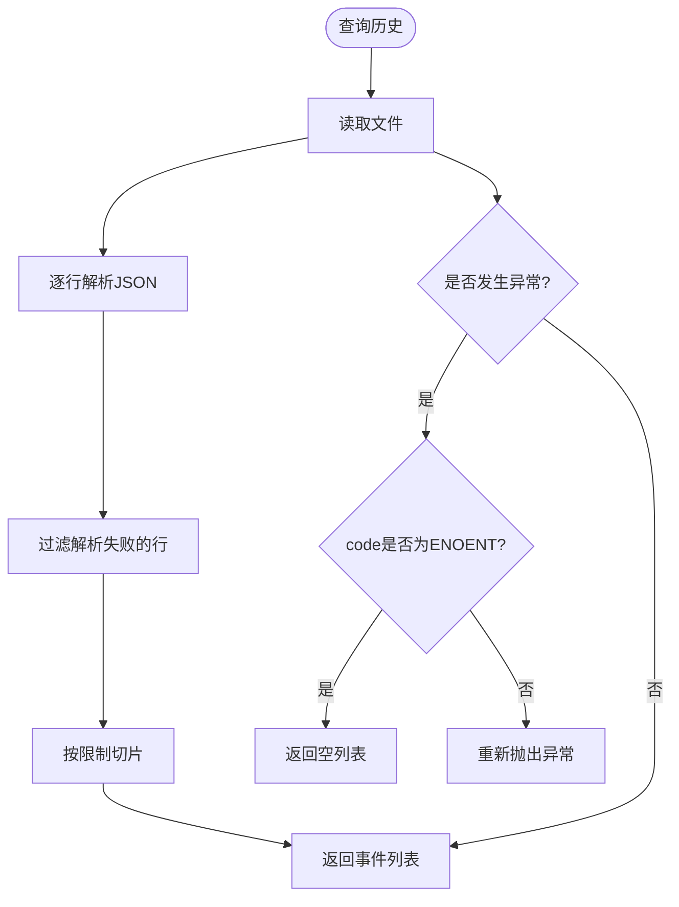
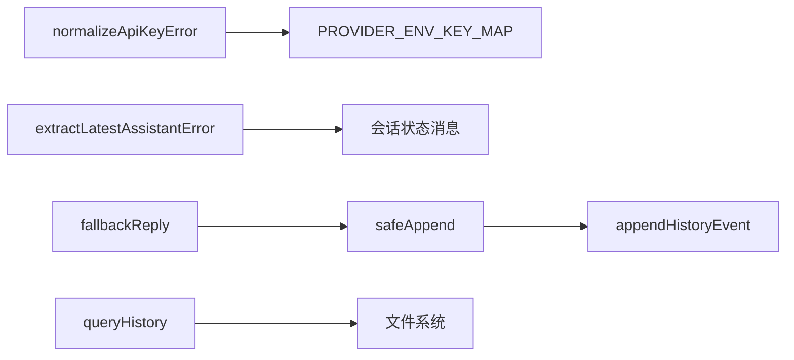

# 错误处理与恢复

<cite>
**本文引用的文件列表**
- [engine.ts](file://src/engine.ts)
- [history-store.ts](file://src/memory/history-store.ts)
- [init.ts](file://src/init.ts)
- [init-providers.ts](file://src/init-providers.ts)
- [models.md](file://docs/models.md)
- [index.ts](file://src/index.ts)
- [cron.ts](file://src/cron.ts)
</cite>

## 目录
1. [简介](#简介)
2. [项目结构与关键模块](#项目结构与关键模块)
3. [核心组件](#核心组件)
4. [架构总览](#架构总览)
5. [详细组件分析](#详细组件分析)
6. [依赖关系分析](#依赖关系分析)
7. [性能考量](#性能考量)
8. [故障排除指南](#故障排除指南)
9. [结论](#结论)
10. [附录](#附录)

## 简介
本文件聚焦 StupidClaw 的错误处理与恢复机制，围绕以下关键能力进行系统化文档化：
- normalizeApiKeyError：API 密钥错误的识别与用户友好提示生成，覆盖多供应商场景与回退逻辑。
- extractLatestAssistantError：从会话状态中提取最新助手错误信息，包含消息状态检查与错误信息解析。
- fallbackReply：降级回复机制与聊天记录异常处理。
- 错误日志记录策略：debugLog 条件日志输出与敏感信息掩码处理。
- 常见错误场景、故障排除、API 密钥配置验证与系统稳定性保障。
- 错误监控与告警最佳实践。

## 项目结构与关键模块
- 引擎与会话管理：负责模型选择、会话创建、消息订阅与回复提取。
- 历史存储：负责历史事件的追加与查询，具备对缺失文件的健壮性处理。
- 初始化与配置：提供 API Key 验证、供应商映射与环境变量配置。
- 文档与模型清单：提供供应商与环境变量对照，便于配置与排障。

图表来源
- [engine.ts:1-706](file://src/engine.ts#L1-L706)
- [history-store.ts:1-83](file://src/memory/history-store.ts#L1-L83)
- [init.ts:1-264](file://src/init.ts#L1-L264)
- [init-providers.ts:1-21](file://src/init-providers.ts#L1-L21)
- [models.md:55-281](file://docs/models.md#L55-L281)
- [index.ts:125-187](file://src/index.ts#L125-L187)
- [cron.ts:248-264](file://src/cron.ts#L248-L264)

章节来源
- [engine.ts:1-706](file://src/engine.ts#L1-L706)
- [history-store.ts:1-83](file://src/memory/history-store.ts#L1-L83)
- [init.ts:1-264](file://src/init.ts#L1-L264)
- [init-providers.ts:1-21](file://src/init-providers.ts#L1-L21)
- [models.md:55-281](file://docs/models.md#L55-L281)
- [index.ts:125-187](file://src/index.ts#L125-L187)
- [cron.ts:248-264](file://src/cron.ts#L248-L264)

## 核心组件
- normalizeApiKeyError：将底层供应商报错标准化为用户可理解的提示，结合当前配置与供应商映射，给出明确的修复建议。
- extractLatestAssistantError：从会话状态中逆序查找最近的助手错误信息，优先识别与 API Key 相关的错误并转换为用户提示。
- fallbackReply：当模型返回为空时，提供兜底回复，确保用户体验连续性。
- debugLog/maskSecret：条件日志输出与敏感信息掩码，避免泄露密钥等敏感数据。
- safeAppend：历史事件追加的异常捕获与静默处理，保证聊天记录持久化不影响主流程。
- 历史查询健壮性：对缺失文件的异常进行分类处理，避免中断。

章节来源
- [engine.ts:59-186](file://src/engine.ts#L59-L186)
- [engine.ts:609-638](file://src/engine.ts#L609-L638)
- [engine.ts:154-156](file://src/engine.ts#L154-L156)
- [engine.ts:477-482](file://src/engine.ts#L477-L482)
- [history-store.ts:50-82](file://src/memory/history-store.ts#L50-L82)

## 架构总览
下图展示错误处理与恢复在系统中的位置与交互：

图表来源
- [engine.ts:680-705](file://src/engine.ts#L680-L705)
- [engine.ts:511-607](file://src/engine.ts#L511-L607)
- [engine.ts:620-638](file://src/engine.ts#L620-L638)
- [engine.ts:162-186](file://src/engine.ts#L162-L186)
- [history-store.ts:37-42](file://src/memory/history-store.ts#L37-L42)

## 详细组件分析

### normalizeApiKeyError：API 密钥错误规范化
- 功能概述
  - 识别底层供应商报文中“缺少 API Key”的模式，提取缺失的供应商标识。
  - 结合当前配置（如 STUPID_MODEL）判断是否存在“配置与实际报错不一致”的回退场景。
  - 依据供应商映射表生成用户可理解的提示，指导用户在 .env 中配置正确的环境变量。
- 关键实现要点
  - 正则匹配“缺少某供应商 API Key”的报文，提取供应商名。
  - 若配置的 provider 与报错的 provider 不一致，提示可能已回退到默认 provider，并给出对应的环境变量名。
  - 若能从映射表找到对应环境变量名，直接提示配置项；否则提示检查对应 provider 的密钥配置。
- 用户提示策略
  - 面向非技术用户的提示语句，强调“在哪里配置”和“如何检查”，避免技术术语。
  - 对于“配置与实际报错不一致”的场景，提供“可能已回退”的解释，帮助用户定位问题来源。

图表来源
- [engine.ts:162-186](file://src/engine.ts#L162-L186)
- [engine.ts:39-57](file://src/engine.ts#L39-L57)

章节来源
- [engine.ts:162-186](file://src/engine.ts#L162-L186)
- [engine.ts:39-57](file://src/engine.ts#L39-L57)

### extractLatestAssistantError：错误提取逻辑
- 功能概述
  - 从会话状态的消息数组中逆序查找最近的助手错误信息。
  - 对“API Key”关键词进行特殊处理，统一转换为用户可理解的提示。
  - 若未找到错误信息，返回空字符串，交由上层逻辑决定后续处理。
- 关键实现要点
  - 仅在角色为“assistant”的消息中查找。
  - 仅接受非空字符串的 errorMessage 字段。
  - 对包含“api key”的错误信息进行统一替换，提升一致性与可读性。
- 与上层协作
  - 在模型无直接回复时，若提取到错误信息，将错误包装为“模型调用失败：...”返回给用户。

图表来源
- [engine.ts:620-638](file://src/engine.ts#L620-L638)

章节来源
- [engine.ts:620-638](file://src/engine.ts#L620-L638)

### fallbackReply：降级回复机制与聊天记录异常处理
- 功能概述
  - 当模型未能返回有效回复时，生成兜底回复，确保用户得到响应。
  - 通过 safeAppend 将用户与助手消息追加到历史记录，异常被捕获并静默记录，避免影响主流程。
- 关键实现要点
  - 兜底回复格式固定，包含用户原始消息摘要，便于用户感知系统仍在处理。
  - 历史事件追加失败时，仅打印错误日志，不抛出异常，保证稳定性。
- 与上层协作
  - 在 chatWithPi 返回 null 时，fallbackReply 被调用，随后历史记录追加助手回复。

图表来源
- [engine.ts:680-705](file://src/engine.ts#L680-L705)
- [engine.ts:477-482](file://src/engine.ts#L477-L482)
- [history-store.ts:37-42](file://src/memory/history-store.ts#L37-L42)

章节来源
- [engine.ts:154-156](file://src/engine.ts#L154-L156)
- [engine.ts:477-482](file://src/engine.ts#L477-L482)
- [engine.ts:680-705](file://src/engine.ts#L680-L705)

### 错误日志记录策略：debugLog 与敏感信息掩码
- debugLog 条件日志输出
  - 通过环境变量开关控制日志输出，避免在生产环境中产生过多噪声。
  - 仅在调试模式下输出引擎与提示词相关日志，便于定位问题。
- 敏感信息掩码
  - 对密钥类信息进行掩码处理，仅显示前后有限字符，避免泄露。
  - 在日志中出现密钥时，统一使用掩码版本，降低安全风险。

图表来源
- [engine.ts:59-63](file://src/engine.ts#L59-L63)
- [engine.ts:144-152](file://src/engine.ts#L144-L152)

章节来源
- [engine.ts:59-63](file://src/engine.ts#L59-L63)
- [engine.ts:144-152](file://src/engine.ts#L144-L152)

### 历史存储的健壮性与异常处理
- 历史事件追加
  - 追加操作在 safeAppend 中被包裹，异常被捕获并记录，不中断主流程。
- 历史事件查询
  - 对不存在的文件（ENOENT）进行特殊处理，返回空列表而非抛出异常。
  - 对解析失败的行进行过滤，避免单条记录损坏影响整体查询结果。

图表来源
- [history-store.ts:50-82](file://src/memory/history-store.ts#L50-L82)

章节来源
- [history-store.ts:37-42](file://src/memory/history-store.ts#L37-L42)
- [history-store.ts:50-82](file://src/memory/history-store.ts#L50-L82)

## 依赖关系分析
- normalizeApiKeyError 依赖供应商映射表 PROVIDER_ENV_KEY_MAP，用于将供应商名映射到对应的环境变量名。
- extractLatestAssistantError 依赖会话状态中的消息结构，要求 errorMessage 字段为字符串。
- fallbackReply 与 safeAppend 共同保证在无模型回复时的用户体验与历史记录完整性。
- 历史存储模块对文件系统异常进行分类处理，增强系统稳定性。

图表来源
- [engine.ts:39-57](file://src/engine.ts#L39-L57)
- [engine.ts:620-638](file://src/engine.ts#L620-L638)
- [engine.ts:154-156](file://src/engine.ts#L154-L156)
- [engine.ts:477-482](file://src/engine.ts#L477-L482)
- [history-store.ts:37-42](file://src/memory/history-store.ts#L37-L42)
- [history-store.ts:50-82](file://src/memory/history-store.ts#L50-L82)

章节来源
- [engine.ts:39-57](file://src/engine.ts#L39-L57)
- [engine.ts:620-638](file://src/engine.ts#L620-L638)
- [engine.ts:154-156](file://src/engine.ts#L154-L156)
- [engine.ts:477-482](file://src/engine.ts#L477-L482)
- [history-store.ts:37-42](file://src/memory/history-store.ts#L37-L42)
- [history-store.ts:50-82](file://src/memory/history-store.ts#L50-L82)

## 性能考量
- 日志输出按需开启：通过环境变量控制，避免在高并发场景下产生大量日志 IO。
- 历史记录追加采用异步追加，异常被捕获，不影响主流程吞吐。
- 错误提取与回复生成均为轻量级字符串处理，开销可忽略。

## 故障排除指南
- API 密钥未配置或错误
  - 症状：模型调用失败，返回“缺少 API Key”的提示。
  - 排查：检查 .env 中对应供应商的环境变量是否正确配置，参考供应商与环境变量对照文档。
  - 处理：根据 normalizeApiKeyError 的提示，在 .env 中补全或修正密钥。
- 配置与实际报错不一致
  - 症状：提示“当前 STUPID_MODEL=...，但运行时提示缺少 X 的 API Key”，可能已回退到默认 provider。
  - 排查：确认 STUPID_MODEL 的 provider/model_id 拼写是否正确，检查对应环境变量是否配置。
- 供应商映射缺失
  - 症状：提示“检查对应 provider 的密钥配置”，但未给出具体环境变量名。
  - 排查：确认供应商是否在映射表中，或使用自定义兼容接口时的环境变量命名是否规范。
- 历史记录异常
  - 症状：历史查询返回空列表或部分记录丢失。
  - 排查：确认历史文件是否存在，解析失败的行会被过滤；若文件不存在，系统会返回空列表。
- 定时任务错误
  - 症状：定时任务执行失败，控制台输出错误信息。
  - 排查：检查定时任务调度器的日志输出，确认任务参数与技能配置正确。

章节来源
- [engine.ts:162-186](file://src/engine.ts#L162-L186)
- [models.md:55-281](file://docs/models.md#L55-L281)
- [history-store.ts:72-82](file://src/memory/history-store.ts#L72-L82)
- [cron.ts:248-264](file://src/cron.ts#L248-L264)

## 结论
StupidClaw 的错误处理与恢复机制以“用户可理解的提示 + 系统稳健性”为核心目标：
- normalizeApiKeyError 将底层供应商报错转化为可操作的用户提示，覆盖多供应商与回退场景。
- extractLatestAssistantError 从会话状态中提取错误信息，统一错误提示风格。
- fallbackReply 与 safeAppend 保证在无回复时的用户体验与历史记录完整性。
- debugLog 与 maskSecret 提供可控的日志输出与敏感信息掩码，兼顾可观测性与安全性。
- 历史存储与查询对异常进行分类处理，提升系统稳定性。

## 附录

### API 密钥配置验证与最佳实践
- 使用初始化向导：通过交互式向导输入 API Key，自动写入 .env 并进行基本校验。
- 供应商与环境变量对照：参考文档中的供应商列表与环境变量映射，确保配置正确。
- 自定义兼容接口：通过初始化向导或本地模型配置文件注册自定义接口，注意环境变量命名规范。

章节来源
- [init.ts:58-66](file://src/init.ts#L58-L66)
- [init.ts:224-264](file://src/init.ts#L224-L264)
- [init-providers.ts:3-19](file://src/init-providers.ts#L3-L19)
- [models.md:55-281](file://docs/models.md#L55-L281)

### 错误监控与告警最佳实践
- 开启调试日志：在开发与问题排查阶段设置调试开关，收集必要日志。
- 分级告警：对 API Key 缺失、模型不可用等关键错误设置告警，通知运维人员。
- 历史记录审计：定期检查历史文件完整性，确保异常可追溯。
- 定时任务监控：对定时任务的执行结果进行监控，及时发现并修复任务配置问题。