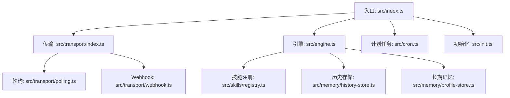
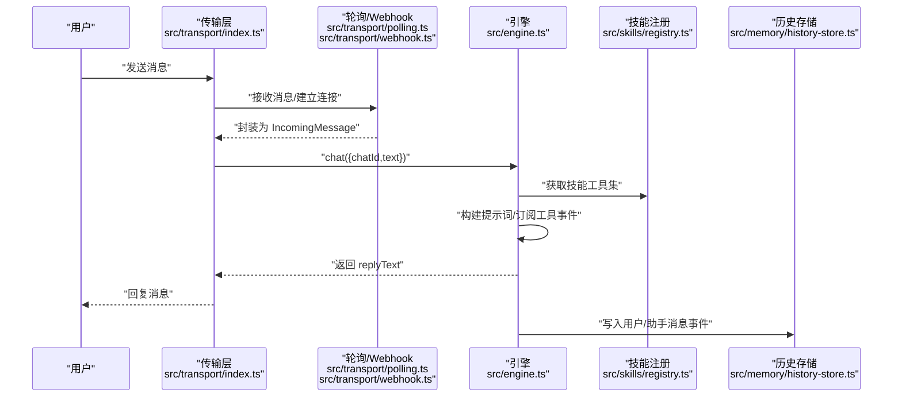
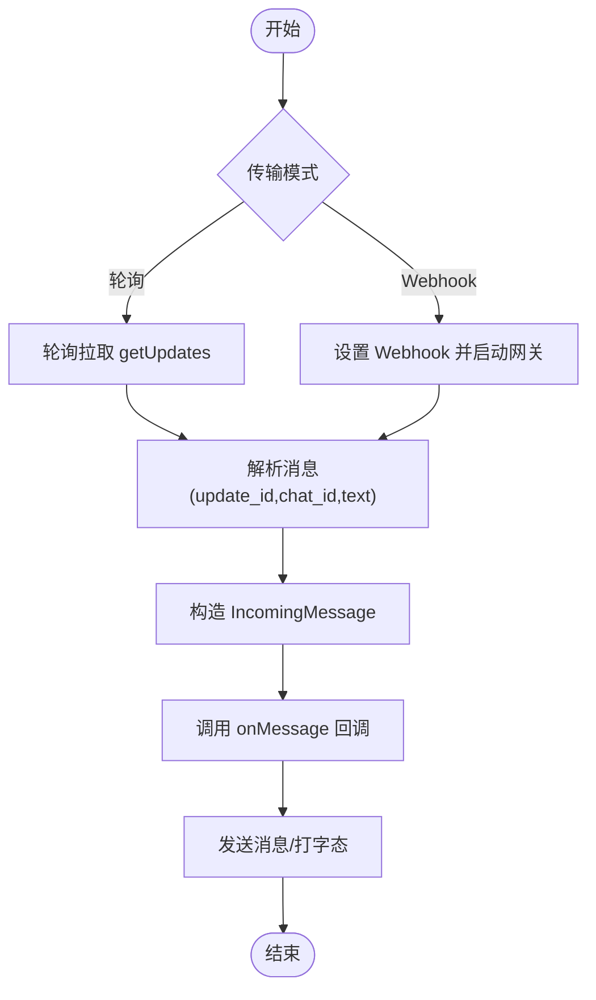
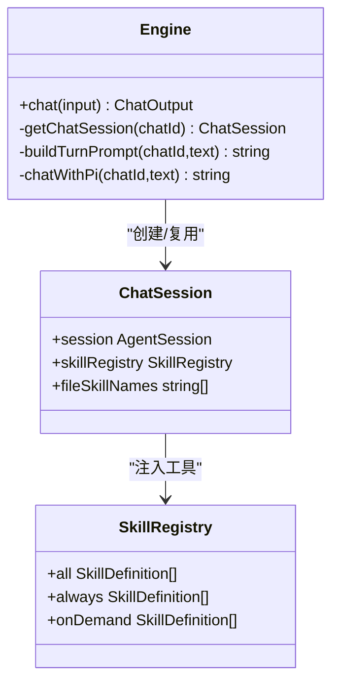
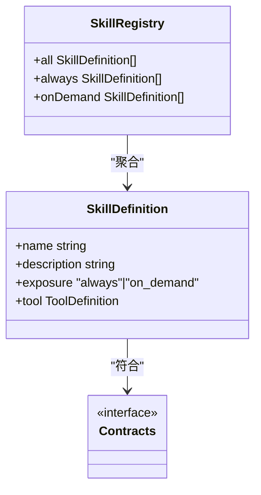
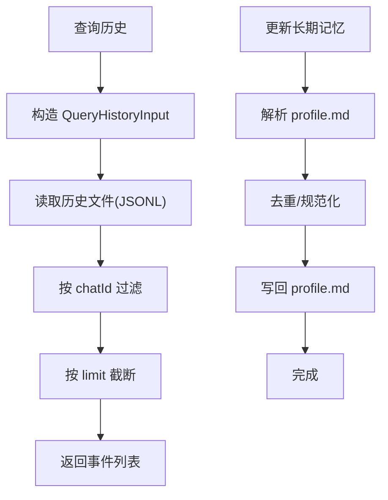
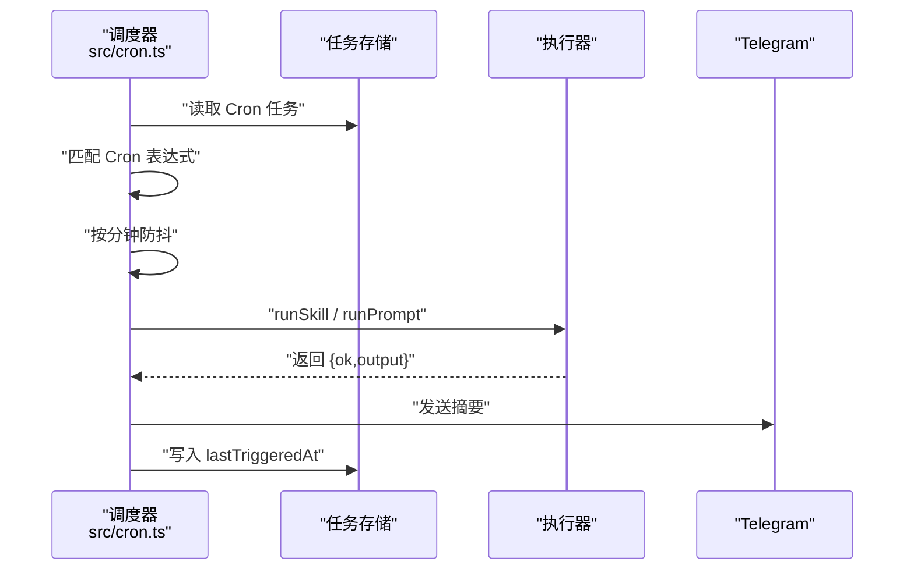
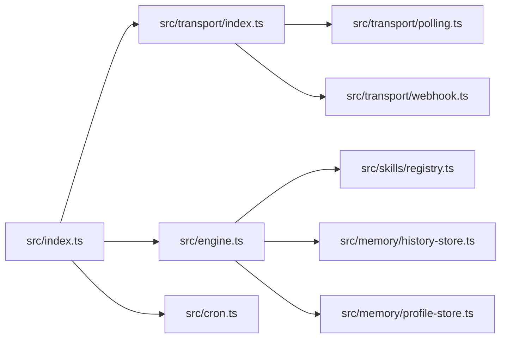

# 核心功能

<cite>
**本文档引用的文件**
- [src/index.ts](file://src/index.ts)
- [src/engine.ts](file://src/engine.ts)
- [src/transport/index.ts](file://src/transport/index.ts)
- [src/transport/polling.ts](file://src/transport/polling.ts)
- [src/transport/webhook.ts](file://src/transport/webhook.ts)
- [src/skills/registry.ts](file://src/skills/registry.ts)
- [src/skills/contracts.ts](file://src/skills/contracts.ts)
- [src/skills/system/list_available_skills.ts](file://src/skills/system/list_available_skills.ts)
- [src/skills/memory/query_history.ts](file://src/skills/memory/query_history.ts)
- [src/memory/history-store.ts](file://src/memory/history-store.ts)
- [src/memory/profile-store.ts](file://src/memory/profile-store.ts)
- [src/cron.ts](file://src/cron.ts)
- [src/init.ts](file://src/init.ts)
- [package.json](file://package.json)
- [README.md](file://README.md)
</cite>

## 目录
1. [简介](#简介)
2. [项目结构](#项目结构)
3. [核心组件](#核心组件)
4. [架构总览](#架构总览)
5. [详细组件分析](#详细组件分析)
6. [依赖分析](#依赖分析)
7. [性能考虑](#性能考虑)
8. [故障排除指南](#故障排除指南)
9. [结论](#结论)
10. [附录](#附录)

## 简介
本文件面向 StupidClaw 的核心功能模块，系统性梳理并解释四大模块：消息传输系统、智能对话引擎、技能系统、内存管理系统。文档不仅阐述各模块的职责、实现原理与使用方式，还深入分析模块间协作关系与数据流，并提供扩展点与自定义选项，帮助开发者快速理解与高效使用。

## 项目结构
StupidClaw 采用“入口控制 + 分层模块”的组织方式：
- 入口层：负责初始化、锁文件、信号钩子、环境加载与主流程编排
- 传输层：封装 Telegram 轮询与 Webhook，统一消息接入与回复
- 引擎层：会话管理、模型选择、提示词构建、工具订阅与历史记录
- 技能层：技能注册表、工具定义与暴露策略
- 内存层：历史记录与长期记忆（profile）持久化
- 计划任务层：基于 Cron 的定时触发与执行

图表来源
- [src/index.ts:112-209](file://src/index.ts#L112-L209)
- [src/transport/index.ts:47-71](file://src/transport/index.ts#L47-L71)
- [src/engine.ts:392-475](file://src/engine.ts#L392-L475)
- [src/skills/registry.ts:23-54](file://src/skills/registry.ts#L23-L54)
- [src/memory/history-store.ts:37-42](file://src/memory/history-store.ts#L37-L42)
- [src/memory/profile-store.ts:112-115](file://src/memory/profile-store.ts#L112-L115)
- [src/cron.ts:251-265](file://src/cron.ts#L251-L265)
- [src/init.ts:224-339](file://src/init.ts#L224-L339)

章节来源
- [README.md:22-52](file://README.md#L22-L52)
- [package.json:14-22](file://package.json#L14-L22)

## 核心组件
- 消息传输系统：统一接入 Telegram 轮询与 Webhook，提供消息解析、分片发送、Markdown 到 HTML 的转换、打字态通知等能力
- 智能对话引擎：会话生命周期管理、模型选择与认证、系统提示词构建、工具订阅与历史记录、错误归一化
- 技能系统：技能注册表聚合内置与文件型技能，按“always/on-demand”暴露策略注入到会话工具集
- 内存管理系统：历史记录按日写入 JSONL，长期记忆以 Markdown 结构化存储，支持查询与更新

章节来源
- [src/transport/index.ts:19-71](file://src/transport/index.ts#L19-L71)
- [src/engine.ts:392-706](file://src/engine.ts#L392-L706)
- [src/skills/registry.ts:23-54](file://src/skills/registry.ts#L23-L54)
- [src/memory/history-store.ts:37-82](file://src/memory/history-store.ts#L37-L82)
- [src/memory/profile-store.ts:112-131](file://src/memory/profile-store.ts#L112-L131)

## 架构总览
StupidClaw 的运行时主循环如下：
- 入口初始化：加载 .env、确保工作空间、注册进程信号钩子
- 启动传输层：根据 TELEGRAM_MODE 选择轮询或 Webhook
- 启动计划任务：周期性扫描 Cron 任务并触发执行
- 消息回调：进入 onMessage 回调后，调用引擎 chat 生成回复并回复用户

图表来源
- [src/index.ts:189-208](file://src/index.ts#L189-L208)
- [src/transport/index.ts:47-71](file://src/transport/index.ts#L47-L71)
- [src/transport/polling.ts:52-89](file://src/transport/polling.ts#L52-L89)
- [src/transport/webhook.ts:41-85](file://src/transport/webhook.ts#L41-L85)
- [src/engine.ts:680-705](file://src/engine.ts#L680-L705)
- [src/skills/registry.ts:23-54](file://src/skills/registry.ts#L23-L54)
- [src/memory/history-store.ts:37-42](file://src/memory/history-store.ts#L37-L42)

## 详细组件分析

### 消息传输系统
- 功能职责
  - 轮询模式：拉取 Telegram 更新，处理消息文本与 chatId，发送分片消息与打字态
  - Webhook 模式：设置 Webhook，启动网关监听，接收推送并转发到 onMessage
  - 统一抽象：对外提供 IncomingMessage 接口，屏蔽底层差异
- 实现要点
  - 轮询：维护 offset，避免重复消费；异常时短暂休眠重试
  - Webhook：校验 TELEGRAM_WEBHOOK_URL/PORT/secretToken；设置允许的更新类型
  - 消息发送：优先 HTML 模式，失败时回退纯文本；按 Telegram 最大长度切片
  - Markdown 转换：保护代码块，转义 HTML 特殊字符，还原代码块
- 使用方式
  - 轮询：设置 TELEGRAM_MODE=polling，提供 TELEGRAM_BOT_TOKEN
  - Webhook：设置 TELEGRAM_MODE=webhook，提供 TELEGRAM_WEBHOOK_URL、PORT、可选 secret_token
- 扩展点
  - 新增传输协议：实现 MessageHandler 并在 startTransport 中接入
  - 自定义网关：通过 gateway 层扩展路径与鉴权

图表来源
- [src/transport/index.ts:19-71](file://src/transport/index.ts#L19-L71)
- [src/transport/polling.ts:52-89](file://src/transport/polling.ts#L52-L89)
- [src/transport/webhook.ts:41-85](file://src/transport/webhook.ts#L41-L85)

章节来源
- [src/transport/index.ts:19-71](file://src/transport/index.ts#L19-L71)
- [src/transport/polling.ts:52-243](file://src/transport/polling.ts#L52-L243)
- [src/transport/webhook.ts:41-86](file://src/transport/webhook.ts#L41-L86)

### 智能对话引擎
- 功能职责
  - 会话管理：按 chatId 复用 AgentSession，避免重复初始化
  - 模型选择：从多种提供商中挑选可用模型，支持自定义 OpenAI/Anthropic 兼容接口
  - 提示词构建：拼接运行时上下文、长期记忆 profile、用户消息
  - 工具订阅：订阅工具调用开始/结束事件，写入历史
  - 错误归一化：将 API Key 缺失等错误转换为更友好的提示
- 实现要点
  - 会话缓存：Map<chatId, ChatSession>
  - 模型注册：动态注册多个提供商，支持本地 Ollama/LM Studio 与云端 DeepSeek/Kimi/DashScope/BigModel/OpenRouter 等
  - 提示词：静态系统提示 + 文件型技能提示 + 运行时上下文 + profile + 用户消息
  - 输出提取：优先 text_delta，其次 text_end，最后从会话状态提取
- 使用方式
  - 直接调用 chat({chatId,text}) 获取 replyText
  - 通过 startTransport 注册消息回调，实现消息闭环
- 扩展点
  - 自定义模型：通过环境变量注册自定义提供商与模型
  - 自定义系统提示：通过资源加载器覆盖系统提示模板

图表来源
- [src/engine.ts:19-32](file://src/engine.ts#L19-L32)
- [src/engine.ts:392-475](file://src/engine.ts#L392-L475)
- [src/skills/registry.ts:13-17](file://src/skills/registry.ts#L13-L17)

章节来源
- [src/engine.ts:19-706](file://src/engine.ts#L19-L706)

### 技能系统
- 功能职责
  - 技能注册表：聚合内置技能与文件型技能，区分 always/on-demand 暴露级别
  - 工具定义：基于 ToolDefinition，声明参数 Schema 与执行逻辑
  - 目录能力：提供“列出可用技能”能力，辅助用户按需调用
- 实现要点
  - 注册表：createSkillRegistry 返回 all/always/onDemand 三类集合
  - 工具元数据：SkillMeta 包含 name/description/exposure
  - 列表技能：返回技能清单与使用指引
- 使用方式
  - 在会话中通过工具调用触发技能执行
  - 使用 list_available_skills 查看技能目录
- 扩展点
  - 新增技能：实现 ToolDefinition 并加入注册表
  - 文件型技能：通过文件系统扫描与格式化注入

图表来源
- [src/skills/contracts.ts:6-19](file://src/skills/contracts.ts#L6-L19)
- [src/skills/registry.ts:23-54](file://src/skills/registry.ts#L23-L54)

章节来源
- [src/skills/registry.ts:1-55](file://src/skills/registry.ts#L1-L55)
- [src/skills/contracts.ts:1-20](file://src/skills/contracts.ts#L1-L20)
- [src/skills/system/list_available_skills.ts:4-40](file://src/skills/system/list_available_skills.ts#L4-L40)

### 内存管理系统
- 功能职责
  - 历史记录：按日写入 JSONL，支持查询与限制条数
  - 长期记忆：以 Markdown 结构化存储 stable_facts/preferences/constraints
- 实现要点
  - 历史存储：HistoryEvent 结构化事件，按日期分文件
  - 查询接口：支持按 chatId/date/limit 查询
  - 长期记忆：ProfileStore 解析/写入 profile.md，去重与规范化
- 使用方式
  - 通过 query_history 技能查询历史
  - 通过 update_profile 技能更新长期记忆
- 扩展点
  - 新增查询维度：扩展 QueryHistoryInput
  - 新增记忆段落：在 ProfileData 中新增字段并在解析/渲染中处理

图表来源
- [src/memory/history-store.ts:44-82](file://src/memory/history-store.ts#L44-L82)
- [src/memory/profile-store.ts:112-131](file://src/memory/profile-store.ts#L112-L131)

章节来源
- [src/memory/history-store.ts:1-83](file://src/memory/history-store.ts#L1-L83)
- [src/memory/profile-store.ts:1-132](file://src/memory/profile-store.ts#L1-L132)
- [src/skills/memory/query_history.ts:1-57](file://src/skills/memory/query_history.ts#L1-L57)

### 计划任务系统
- 功能职责
  - Cron 解析：支持分钟/小时/日/月/周五段表达式
  - 触发执行：按分钟粒度防抖，调用技能或执行提示词
  - 结果上报：通过 Telegram 发送执行结果摘要
- 实现要点
  - 表达式匹配：对每个字段进行解析与范围校验
  - 防抖：同一分钟内仅触发一次
  - 执行器：runSkill/runPrompt 由外部注入，支持技能与提示词两种模式
- 使用方式
  - 配置 Cron 任务并通过管理技能创建/删除
  - 任务触发后自动发送结果摘要
- 扩展点
  - 自定义执行器：实现 CronExecutor 接口以适配不同场景

图表来源
- [src/cron.ts:85-265](file://src/cron.ts#L85-L265)

章节来源
- [src/cron.ts:1-265](file://src/cron.ts#L1-L265)

## 依赖分析
- 外部依赖
  - @mariozechner/pi-coding-agent：会话、工具、模型注册与资源加载
  - @mariozechner/pi-ai：Schema 与工具定义
  - ws：WebSocket 支持（用于网关）
  - dotenv：.env 加载
- 内部耦合
  - 入口依赖传输、引擎、技能注册表、计划任务
  - 引擎依赖技能注册表、历史存储、长期记忆
  - 传输层依赖轮询/Webhook 与网关

图表来源
- [src/index.ts:112-209](file://src/index.ts#L112-L209)
- [src/engine.ts:392-475](file://src/engine.ts#L392-L475)
- [src/transport/index.ts:47-71](file://src/transport/index.ts#L47-L71)
- [src/cron.ts:251-265](file://src/cron.ts#L251-L265)

章节来源
- [package.json:30-37](file://package.json#L30-L37)

## 性能考虑
- 传输层
  - 轮询：timeout 设置为 30 秒，异常时 1 秒退避，避免频繁请求
  - Webhook：设置 allowed_updates 为 message，减少无关事件
  - 消息分片：按最大长度切片，优先 HTML 模式，失败回退纯文本
- 引擎层
  - 会话复用：按 chatId 缓存 AgentSession，降低初始化开销
  - 工具订阅：仅在必要时订阅事件，避免冗余 IO
  - 模型选择：优先 minimax-cn，兜底可用模型，减少失败重试
- 计划任务
  - 15 秒轮询间隔，分钟级防抖，避免重复触发
  - 执行前写入 lastTriggeredAt，防止跨轮询窗口重复触发

## 故障排除指南
- API Key 缺失
  - 现象：模型调用失败，提示缺少 API Key
  - 处理：根据 PROVIDER_ENV_KEY_MAP 检查对应环境变量是否配置
  - 参考：normalizeApiKeyError 与 PROVIDER_ENV_KEY_MAP
- Telegram 轮询冲突
  - 现象：409 冲突
  - 处理：自动禁用 Webhook 后重试
  - 参考：disableWebhook 与 fetchUpdatesOnce
- Webhook 配置错误
  - 现象：缺少 TELEGRAM_WEBHOOK_URL/PORT 或校验失败
  - 处理：检查环境变量与端口合法性
  - 参考：runWebhookMode
- 历史查询异常
  - 现象：文件不存在或解析失败
  - 处理：捕获 ENOENT 返回空数组，其他错误抛出
  - 参考：queryHistory
- 长期记忆写入失败
  - 现象：profile.md 写入失败
  - 处理：确保工作空间目录可写
  - 参考：ensureProfileFile 与 toMarkdown

章节来源
- [src/engine.ts:162-186](file://src/engine.ts#L162-L186)
- [src/transport/polling.ts:21-34](file://src/transport/polling.ts#L21-L34)
- [src/transport/webhook.ts:41-57](file://src/transport/webhook.ts#L41-L57)
- [src/memory/history-store.ts:72-82](file://src/memory/history-store.ts#L72-L82)
- [src/memory/profile-store.ts:103-110](file://src/memory/profile-store.ts#L103-L110)

## 结论
StupidClaw 通过清晰的分层设计与稳健的实现，将消息传输、对话引擎、技能系统与内存管理有机结合，既满足日常使用，又为扩展与定制提供了充分空间。建议在生产环境中优先使用 Webhook 模式以降低延迟，合理配置模型与 API Key，并利用长期记忆与历史记录提升用户体验。

## 附录
- 快速启动
  - 使用 npx 一键启动，首次运行会生成 .env 提示
  - 源码运行：安装依赖后复制 .env.example 为 .env，填写必要配置
- 初始化向导
  - 提供交互式初始化，支持多家提供商与模型选择
- 目录与边界
  - 默认仅读写 .stupidClaw 目录，不引入数据库与向量库

章节来源
- [README.md:54-95](file://README.md#L54-L95)
- [src/init.ts:224-339](file://src/init.ts#L224-L339)