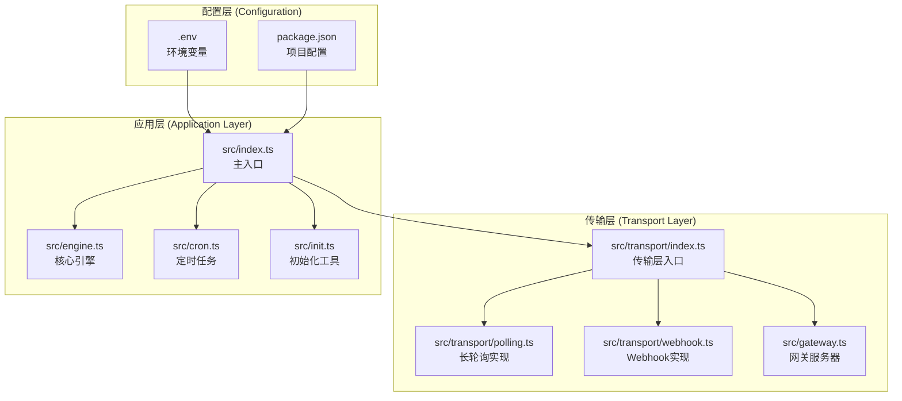
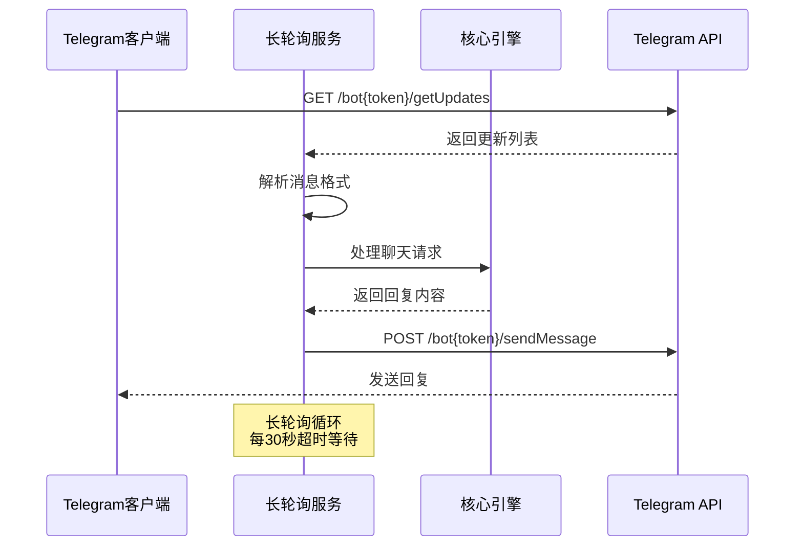
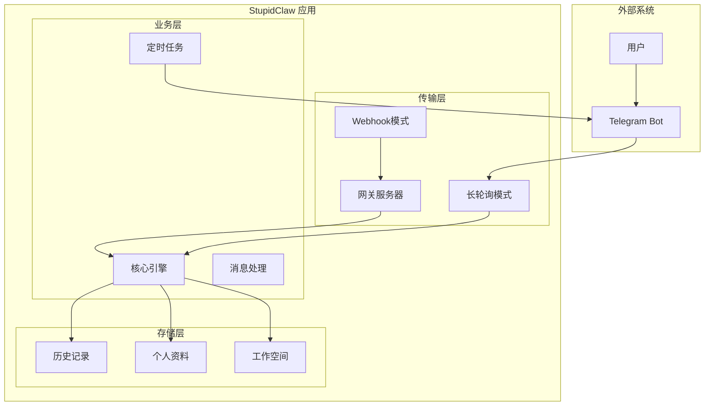
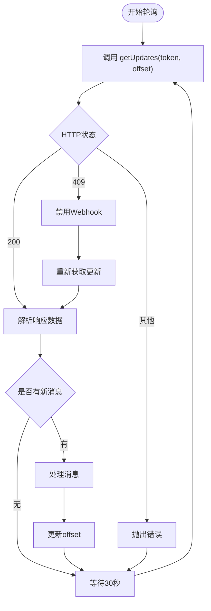
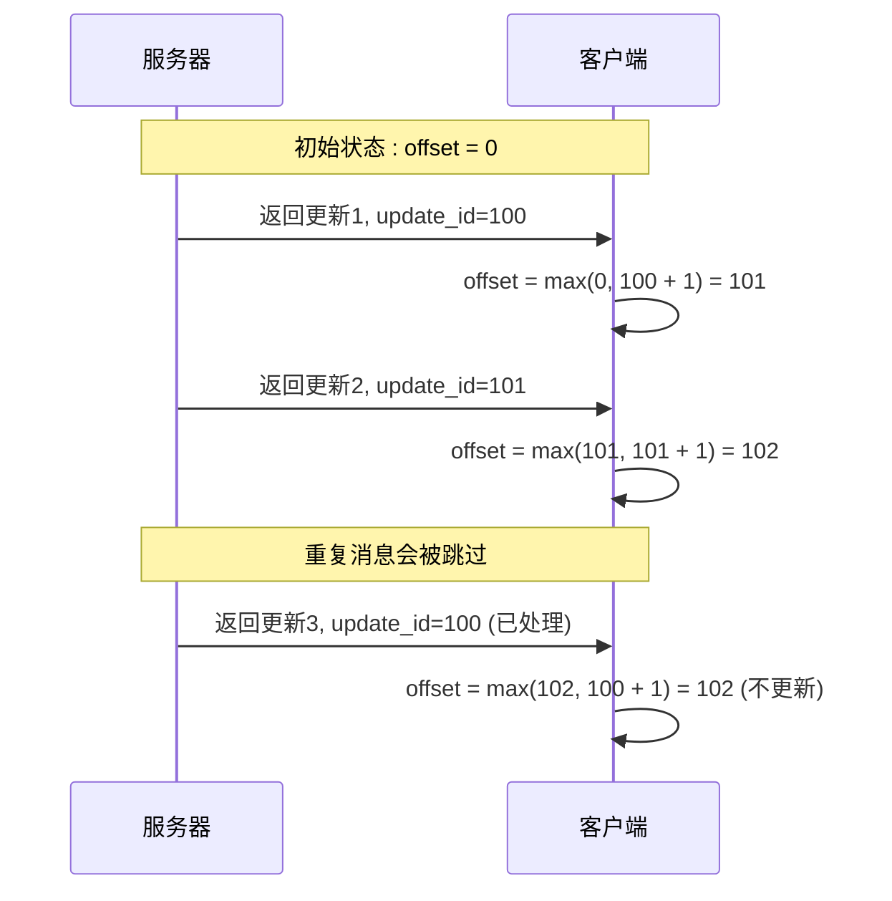
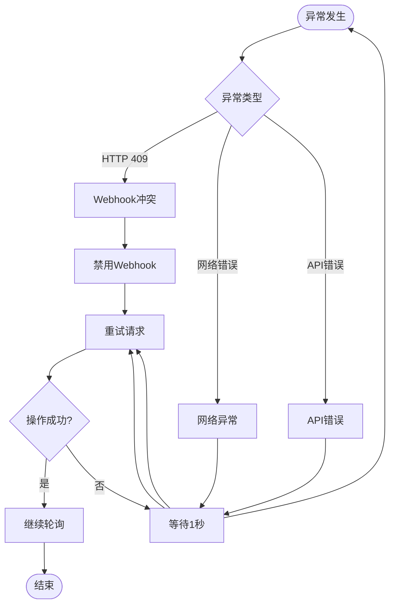
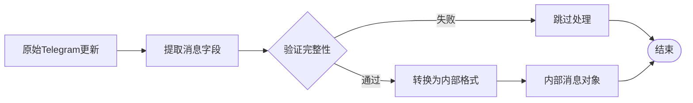
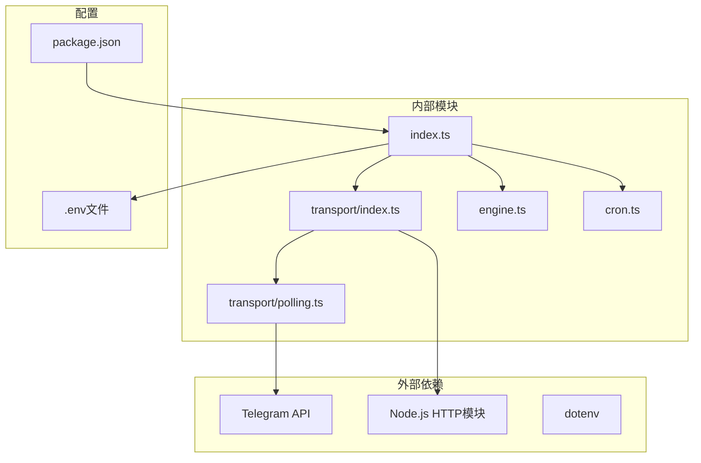

# Polling 长轮询模式

<cite>
**本文档引用的文件**
- [src/transport/polling.ts](file://src/transport/polling.ts)
- [src/transport/index.ts](file://src/transport/index.ts)
- [src/index.ts](file://src/index.ts)
- [src/engine.ts](file://src/engine.ts)
- [src/cron.ts](file://src/cron.ts)
- [src/gateway.ts](file://src/gateway.ts)
- [src/init.ts](file://src/init.ts)
- [package.json](file://package.json)
- [README.md](file://README.md)
</cite>

## 目录
1. [简介](#简介)
2. [项目结构](#项目结构)
3. [核心组件](#核心组件)
4. [架构概览](#架构概览)
5. [详细组件分析](#详细组件分析)
6. [依赖关系分析](#依赖关系分析)
7. [性能考虑](#性能考虑)
8. [故障排除指南](#故障排除指南)
9. [结论](#结论)
10. [附录](#附录)

## 简介

StupidClaw 的 Polling 长轮询模式是该项目的核心通信机制，用于与 Telegram Bot API 进行实时消息交互。该模式通过持续轮询 Telegram 的 `getUpdates` API 来获取用户消息，实现了类似 Webhook 的功能，但不需要外部服务器或公网 IP。

长轮询模式的主要优势包括：
- 实现简单，无需额外的服务器配置
- 兼容性好，适用于各种网络环境
- 调试方便，便于开发者理解和维护
- 自动处理 Webhook 冲突和重连机制

## 项目结构

StupidClaw 采用模块化的架构设计，Polling 长轮询模式主要涉及以下关键文件：



**图表来源**
- [src/transport/index.ts:1-71](file://src/transport/index.ts#L1-L71)
- [src/transport/polling.ts:1-243](file://src/transport/polling.ts#L1-L243)
- [src/index.ts:1-216](file://src/index.ts#L1-L216)

**章节来源**
- [src/transport/index.ts:1-71](file://src/transport/index.ts#L1-L71)
- [src/transport/polling.ts:1-243](file://src/transport/polling.ts#L1-L243)
- [src/index.ts:1-216](file://src/index.ts#L1-L216)

## 核心组件

### 1. 长轮询核心实现

长轮询模式的核心实现位于 `src/transport/polling.ts` 文件中，包含以下关键组件：

#### TelegramMessage 接口
```typescript
interface TelegramMessage {
  updateId: number;
  chatId: string;
  text: string;
}
```

#### TelegramUpdate 接口
```typescript
interface TelegramUpdate {
  update_id: number;
  message?: {
    chat?: { id: number | string };
    text?: string;
  };
}
```

#### getUpdates 函数
这是长轮询的核心函数，负责与 Telegram API 交互：

**章节来源**
- [src/transport/polling.ts:1-89](file://src/transport/polling.ts#L1-L89)

### 2. 传输层入口

`src/transport/index.ts` 提供了统一的传输层接口，支持多种传输模式：

#### runPollingMode 函数
实现长轮询模式的核心逻辑，包含完整的错误处理和重连机制。

#### startTransport 函数
根据配置选择合适的传输模式（polling 或 webhook）。

**章节来源**
- [src/transport/index.ts:19-70](file://src/transport/index.ts#L19-L70)

### 3. 主入口集成

`src/index.ts` 负责启动整个应用，包括长轮询模式的初始化：

#### 单实例锁机制
防止多个长轮询进程同时运行。

#### 信号处理
优雅处理进程退出和中断信号。

**章节来源**
- [src/index.ts:45-84](file://src/index.ts#L45-L84)

## 架构概览

StupidClaw 的长轮询架构采用分层设计，确保了良好的可维护性和扩展性：



**图表来源**
- [src/transport/polling.ts:36-89](file://src/transport/polling.ts#L36-L89)
- [src/transport/index.ts:19-45](file://src/transport/index.ts#L19-L45)

### 系统架构图



**图表来源**
- [src/transport/index.ts:47-70](file://src/transport/index.ts#L47-L70)
- [src/engine.ts:1-706](file://src/engine.ts#L1-L706)

## 详细组件分析

### 长轮询实现机制

#### getUpdates 函数详解

长轮询的核心实现具有以下特点：

1. **HTTP 请求构建**：使用 `fetch` 发送 POST 请求到 Telegram API
2. **参数配置**：
   - `offset`: 控制从哪个更新开始获取
   - `timeout`: 设置最长等待时间为30秒
   - `allowed_updates`: 仅接收消息类型的更新
3. **错误处理**：自动处理 409 冲突状态并禁用 Webhook



**图表来源**
- [src/transport/polling.ts:52-89](file://src/transport/polling.ts#L52-L89)

**章节来源**
- [src/transport/polling.ts:36-89](file://src/transport/polling.ts#L36-L89)

### 消息去重逻辑

长轮询模式通过 `offset` 参数实现天然的消息去重：

#### Offset 管理机制



**图表来源**
- [src/transport/index.ts:23-38](file://src/transport/index.ts#L23-L38)

### 错误处理和重连机制

#### 异常处理流程



**图表来源**
- [src/transport/index.ts:39-44](file://src/transport/index.ts#L39-L44)

**章节来源**
- [src/transport/index.ts:39-44](file://src/transport/index.ts#L39-L44)

### 消息格式规范

#### Telegram 消息格式

长轮询模式支持的标准消息格式：

| 字段 | 类型 | 必需 | 描述 |
|------|------|------|------|
| update_id | number | 是 | 更新的唯一标识符 |
| message.chat.id | number/string | 是 | 聊天会话的唯一标识符 |
| message.text | string | 是 | 用户发送的文本内容 |

#### 消息处理流程



**图表来源**
- [src/transport/polling.ts:75-89](file://src/transport/polling.ts#L75-L89)

**章节来源**
- [src/transport/polling.ts:1-89](file://src/transport/polling.ts#L1-L89)

### 性能优化策略

#### 消息分片和格式转换

长轮询模式实现了智能的消息处理优化：

1. **Markdown 到 HTML 转换**：将 Markdown 格式转换为 Telegram 支持的 HTML
2. **消息长度控制**：自动分割超过 4096 字符的消息
3. **HTML 解析降级**：当 HTML 解析失败时自动回退到纯文本

**章节来源**
- [src/transport/polling.ts:92-242](file://src/transport/polling.ts#L92-L242)

## 依赖关系分析

### 组件依赖图



**图表来源**
- [src/index.ts:1-216](file://src/index.ts#L1-L216)
- [src/transport/index.ts:1-71](file://src/transport/index.ts#L1-L71)
- [src/transport/polling.ts:1-243](file://src/transport/polling.ts#L1-L243)

### 关键依赖关系

1. **主入口依赖**：`src/index.ts` 依赖所有核心模块
2. **传输层抽象**：`src/transport/index.ts` 提供统一接口
3. **API 交互**：`src/transport/polling.ts` 直接与 Telegram API 通信
4. **业务逻辑**：`src/engine.ts` 处理核心聊天逻辑

**章节来源**
- [src/index.ts:1-216](file://src/index.ts#L1-L216)
- [src/transport/index.ts:1-71](file://src/transport/index.ts#L1-L71)
- [src/transport/polling.ts:1-243](file://src/transport/polling.ts#L1-L243)

## 性能考虑

### 轮询间隔优化

长轮询模式的关键性能参数：

| 参数 | 默认值 | 说明 | 优化建议 |
|------|--------|------|----------|
| timeout | 30秒 | 最长等待时间 | 根据网络状况调整 |
| allowed_updates | ["message"] | 仅接收消息类型 | 减少不必要的更新 |
| offset 管理 | 自动递增 | 防止重复处理 | 确保原子性更新 |

### 内存和资源管理

1. **单实例锁**：防止多个轮询进程竞争资源
2. **信号处理**：优雅处理进程退出
3. **错误恢复**：自动重连和状态恢复

### 并发处理

长轮询模式采用串行处理方式，确保：
- 消息处理的原子性
- 避免并发冲突
- 简化状态管理

## 故障排除指南

### 常见问题诊断

#### 1. Webhook 冲突问题

**症状**：出现 HTTP 409 状态码

**解决方案**：
- 自动禁用现有 Webhook
- 重新建立长轮询连接
- 检查是否存在其他运行实例

#### 2. 网络连接问题

**症状**：频繁的网络错误和重连

**解决方案**：
- 检查网络连接稳定性
- 调整超时参数
- 添加重试延迟

#### 3. API 限流问题

**症状**：请求被拒绝或响应缓慢

**解决方案**：
- 实施指数退避策略
- 监控 API 使用情况
- 考虑升级 API 访问权限

### 调试技巧

#### 日志级别控制

通过环境变量控制调试输出：
- `DEBUG_STUPIDCLAW=1`：启用详细调试信息
- `DEBUG_PROMPT=1`：显示完整的提示词内容

#### 性能监控

建议监控的关键指标：
- 轮询成功率
- 消息处理延迟
- API 调用频率
- 内存使用情况

**章节来源**
- [src/engine.ts:59-73](file://src/engine.ts#L59-L73)
- [src/index.ts:117-120](file://src/index.ts#L117-L120)

## 结论

StupidClaw 的 Polling 长轮询模式是一个设计精良的实时通信解决方案，具有以下优势：

1. **实现简洁**：基于标准的 HTTP 轮询协议，易于理解和维护
2. **兼容性强**：无需公网 IP 或反向代理，适用于各种网络环境
3. **可靠性高**：完善的错误处理和重连机制
4. **性能优化**：智能的消息处理和资源管理策略

该模式特别适合小型部署场景和开发测试环境，为用户提供了一个稳定可靠的 Telegram Bot 通信基础。

## 附录

### 配置示例

#### 基本配置文件 (.env)

```env
# 核心模型配置
STUPID_MODEL=minimax:MiniMax-M2.5
MINIMAX_API_KEY=your_api_key_here

# Telegram 配置
TELEGRAM_BOT_TOKEN=your_telegram_bot_token
TELEGRAM_MODE=polling

# 网页端 IM 配置
STUPID_IM_TOKEN=your_im_token

# 调试配置
DEBUG_STUPIDCLAW=0
DEBUG_PROMPT=1
PORT=8080
```

#### 初始化向导配置

使用 `npx stupid-claw init` 命令启动交互式配置向导，自动填充必要的配置项。

**章节来源**
- [src/init.ts:184-222](file://src/init.ts#L184-L222)
- [src/init.ts:224-338](file://src/init.ts#L224-L338)

### 部署注意事项

#### 生产环境部署

1. **环境隔离**：使用独立的 .env 文件管理不同环境配置
2. **监控设置**：配置日志监控和告警机制
3. **备份策略**：定期备份配置文件和重要数据
4. **安全加固**：限制 API 密钥权限和访问范围

#### 开发环境配置

1. **调试模式**：启用详细日志输出
2. **测试数据**：准备测试用的 Telegram 账号和群组
3. **版本控制**：使用 .gitignore 排除敏感配置文件
4. **自动化测试**：编写单元测试和集成测试

### API 参考

#### Telegram API 端点

| 功能 | 端点 | 方法 | 参数 |
|------|------|------|------|
| 获取更新 | `/bot{token}/getUpdates` | POST | offset, timeout, allowed_updates |
| 发送消息 | `/bot{token}/sendMessage` | POST | chat_id, text, parse_mode |
| 发送输入状态 | `/bot{token}/sendChatAction` | POST | chat_id, action |

**章节来源**
- [src/transport/polling.ts:17-19](file://src/transport/polling.ts#L17-L19)
- [src/transport/polling.ts:36-49](file://src/transport/polling.ts#L36-L49)
- [src/transport/polling.ts:185-194](file://src/transport/polling.ts#L185-L194)