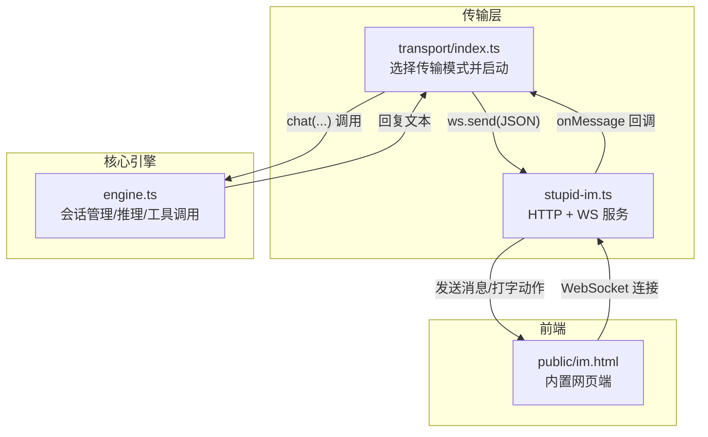
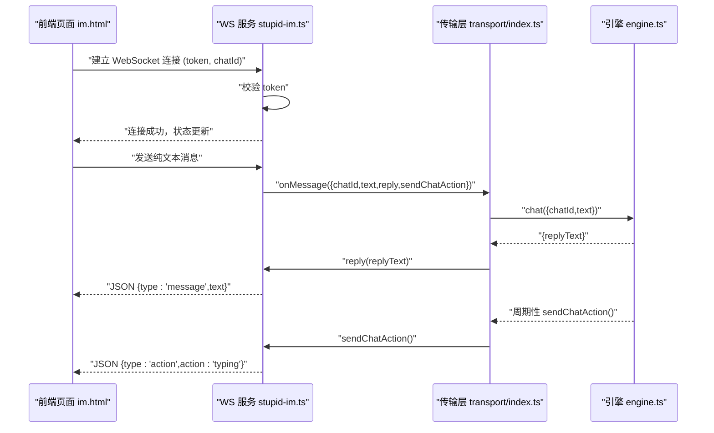
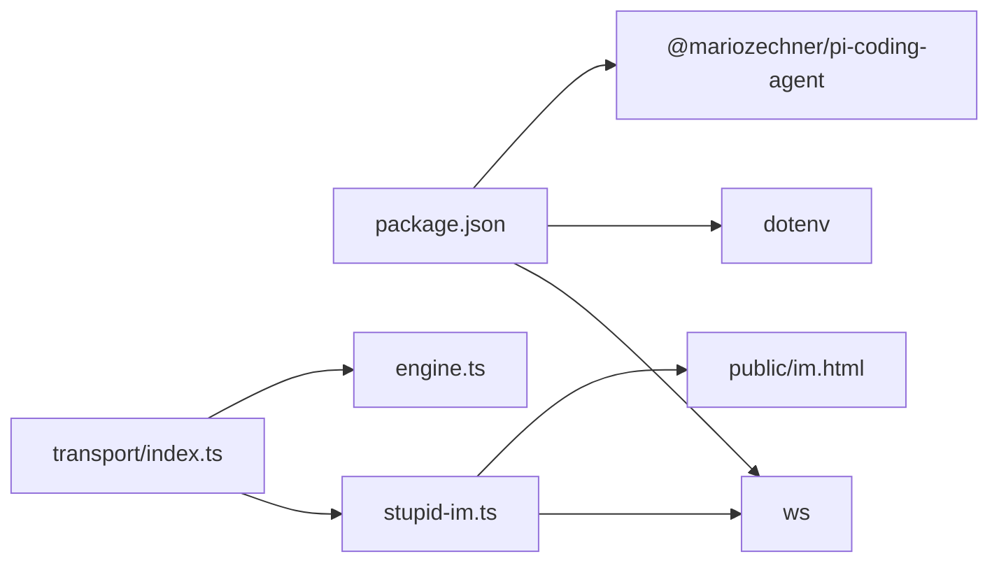

# StupidIM WebSocket 通信模式

<cite>
**本文引用的文件列表**
- [stupid-im.ts](file://src/transport/stupid-im.ts)
- [index.ts](file://src/index.ts)
- [transport/index.ts](file://src/transport/index.ts)
- [engine.ts](file://src/engine.ts)
- [im.html](file://public/im.html)
- [init.ts](file://src/init.ts)
- [package.json](file://package.json)
- [README.md](file://README.md)
</cite>

## 目录
1. [简介](#简介)
2. [项目结构](#项目结构)
3. [核心组件](#核心组件)
4. [架构总览](#架构总览)
5. [详细组件分析](#详细组件分析)
6. [依赖关系分析](#依赖关系分析)
7. [性能考量](#性能考量)
8. [故障排查指南](#故障排查指南)
9. [结论](#结论)
10. [附录](#附录)

## 简介
本文件面向 StupidClaw 的 StupidIM WebSocket 通信模式，系统性阐述其 WebSocket 连接建立、消息格式、心跳机制、认证流程、消息路由与状态管理，并给出前后端集成示例、跨域处理建议、与核心引擎的对接方式、消息格式规范、本地开发调试方法，以及连接监控、错误处理与性能优化建议。目标是帮助开发者在本地快速搭建并稳定运行 StupidIM 网页端即时通讯能力。

## 项目结构
StupidIM 位于传输层模块中，通过独立的 WebSocket 服务器承载网页端交互，同时与核心引擎进行消息路由与回复。关键文件与职责如下：
- 传输层入口：负责根据环境变量选择启动 StupidIM 并分发消息
- StupidIM 实现：提供 HTTP 页面与 WebSocket 服务，实现认证与消息转发
- 引擎：接收来自传输层的消息，执行推理与工具调用，返回文本回复
- 前端页面：内置网页端，提供连接配置、状态指示、消息展示与发送

图表来源
- [transport/index.ts:47-71](file://src/transport/index.ts#L47-L71)
- [stupid-im.ts:24-104](file://src/transport/stupid-im.ts#L24-L104)
- [engine.ts:680-706](file://src/engine.ts#L680-L706)
- [im.html:364-407](file://public/im.html#L364-L407)

章节来源
- [transport/index.ts:47-71](file://src/transport/index.ts#L47-L71)
- [stupid-im.ts:24-104](file://src/transport/stupid-im.ts#L24-L104)
- [engine.ts:680-706](file://src/engine.ts#L680-L706)
- [im.html:364-407](file://public/im.html#L364-L407)

## 核心组件
- 传输层选择器：根据环境变量决定是否启动 StupidIM，并在 Telegram 未配置时默认启用网页端 IM
- StupidIM 服务：提供静态页面与 WebSocket 服务，实现 token 认证、消息转发与错误日志
- 引擎：维护会话、构建提示、调用模型与工具，返回最终文本
- 前端页面：内置聊天界面，支持连接配置、状态指示、打字动画与消息发送

章节来源
- [transport/index.ts:47-71](file://src/transport/index.ts#L47-L71)
- [stupid-im.ts:24-104](file://src/transport/stupid-im.ts#L24-L104)
- [engine.ts:680-706](file://src/engine.ts#L680-L706)
- [im.html:246-407](file://public/im.html#L246-L407)

## 架构总览
StupidIM 的整体数据流如下：
- 前端页面加载后，读取 URL 参数（token、chatId、wsUrl），建立 WebSocket 连接
- 服务端校验 token，建立会话标识 chatId
- 前端发送纯文本消息，服务端将其转交传输层回调
- 传输层回调调用引擎 chat(...)，引擎执行推理与工具调用
- 引擎返回文本，传输层通过 WebSocket 发送 JSON 消息（type=message）
- 引擎可周期性发送“打字”动作（type=action），前端展示打字动画

图表来源
- [stupid-im.ts:65-98](file://src/transport/stupid-im.ts#L65-L98)
- [transport/index.ts:189-208](file://src/transport/index.ts#L189-L208)
- [engine.ts:680-706](file://src/engine.ts#L680-L706)
- [im.html:373-385](file://public/im.html#L373-L385)

## 详细组件分析

### 传输层选择与启动
- 依据环境变量 STUPID_IM_TOKEN 决定是否启动 StupidIM
- 若未配置 TELEGRAM_BOT_TOKEN，则默认启用 StupidIM
- 支持两种部署形态：依附现有 HTTP 服务器或独立 HTTP 服务器
- 启动后打印可点击的网页端链接，便于本地调试

章节来源
- [transport/index.ts:47-71](file://src/transport/index.ts#L47-L71)
- [index.ts:189-208](file://src/index.ts#L189-L208)

### StupidIM 服务端实现
- HTTP 静态页面：提供内置网页端，路径为 “/” 或 “/im”
- WebSocket 服务：统一在同一 HTTP 服务器上提供
- 认证机制：要求连接 URL 参数包含 token，否则关闭连接（4001）
- 消息处理：将收到的纯文本封装为 IncomingMessage，调用 onMessage 回调
- 回复机制：通过 reply 回调将 JSON 文本消息发送给前端
- 打字动作：通过 sendChatAction 回调发送 JSON 动作消息
- 错误处理：记录连接错误与消息处理异常

章节来源
- [stupid-im.ts:11-22](file://src/transport/stupid-im.ts#L11-L22)
- [stupid-im.ts:24-50](file://src/transport/stupid-im.ts#L24-L50)
- [stupid-im.ts:65-103](file://src/transport/stupid-im.ts#L65-L103)

### 引擎与消息路由
- chat 输入：chatId、text
- chat 输出：replyText
- 会话管理：按 chatId 维护会话，避免重复创建
- 推理与工具：构建提示、订阅事件流、记录历史、处理错误
- 返回策略：优先使用流式文本，其次使用最终文本，最后回退

章节来源
- [engine.ts:19-26](file://src/engine.ts#L19-L26)
- [engine.ts:392-475](file://src/engine.ts#L392-L475)
- [engine.ts:511-607](file://src/engine.ts#L511-L607)
- [engine.ts:680-706](file://src/engine.ts#L680-L706)

### 前端页面与消息格式
- 连接参数：token、chatId、wsUrl（从 URL 查询参数读取）
- 连接流程：输入参数后建立 WebSocket，连接成功后禁用设置层
- 消息发送：发送纯文本；收到 JSON 后区分 type=message 与 type=action
- 打字动画：收到 action:typing 后显示，超时自动隐藏
- 断线处理：根据 close code 展示不同错误提示

章节来源
- [im.html:282-298](file://public/im.html#L282-L298)
- [im.html:340-407](file://public/im.html#L340-L407)
- [im.html:373-385](file://public/im.html#L373-L385)

### 消息格式规范
- 前端发送：纯文本字符串
- 服务端转发：对象形式（由传输层封装为 IncomingMessage）
- 服务端回复：JSON 字符串，包含 type 与 text
- 打字动作：JSON 字符串，包含 type 与 action

章节来源
- [stupid-im.ts:84-94](file://src/transport/stupid-im.ts#L84-L94)
- [im.html:373-385](file://public/im.html#L373-L385)

### 心跳机制说明
- 当前实现未内置 WebSocket 心跳（ping/pong）处理
- 前端通过周期性发送“打字”动作模拟“在线”状态，提升交互体验
- 若需要标准心跳，可在服务端监听 ping/pong 并自动 pong

章节来源
- [transport/index.ts:189-208](file://src/transport/index.ts#L189-L208)
- [stupid-im.ts:89-93](file://src/transport/stupid-im.ts#L89-L93)

### 配置与环境变量
- STUPID_IM_TOKEN：网页端访问密钥，用于 WebSocket 认证
- PORT：服务端口，默认 8080 或 8787
- STUPID_MODEL：模型选择，如 provider:model_id
- API Key：对应供应商的密钥环境变量
- TELEGRAM_BOT_TOKEN：若未配置，将默认启用 StupidIM 网页端

章节来源
- [init.ts:191-221](file://src/init.ts#L191-L221)
- [index.ts:28-40](file://src/index.ts#L28-L40)
- [README.md:82-86](file://README.md#L82-L86)

## 依赖关系分析
- 传输层依赖 ws（WebSocket）、dotenv（环境变量）、@mariozechner/pi-coding-agent（引擎）
- StupidIM 服务依赖 ws 与 Node 内置 HTTP 服务器
- 前端页面为静态资源，通过 WebSocket 与服务端通信

图表来源
- [package.json:30-37](file://package.json#L30-L37)
- [transport/index.ts:1-13](file://src/transport/index.ts#L1-L13)
- [stupid-im.ts:1-6](file://src/transport/stupid-im.ts#L1-L6)

章节来源
- [package.json:30-37](file://package.json#L30-L37)
- [transport/index.ts:1-13](file://src/transport/index.ts#L1-L13)
- [stupid-im.ts:1-6](file://src/transport/stupid-im.ts#L1-L6)

## 性能考量
- 会话复用：按 chatId 复用引擎会话，减少初始化开销
- 流式输出：优先使用流式文本增量，降低首屏延迟
- 打字动画：周期性发送“打字”动作，避免前端长时间无响应
- 资源隔离：前端静态资源与 WebSocket 服务在同一端口，减少跨域与代理复杂度
- 日志控制：生产环境建议关闭 DEBUG_PROMPT，避免大文本日志影响性能

章节来源
- [engine.ts:461-475](file://src/engine.ts#L461-L475)
- [engine.ts:511-590](file://src/engine.ts#L511-L590)
- [transport/index.ts:189-208](file://src/transport/index.ts#L189-L208)

## 故障排查指南
- 无法连接
  - 检查 STUPID_IM_TOKEN 是否正确配置
  - 确认前端 URL 参数（token、chatId、wsUrl）是否完整
  - 查看服务端日志中的连接错误与消息处理异常
- 认证失败
  - 服务端返回 4001 表示 token 不匹配
  - 前端断开时会提示“认证失败：Token 错误 (4001)”
- 连接断开
  - 根据 close code 判断原因，前端会显示相应提示
- 无回复
  - 确认引擎已正确返回 replyText
  - 检查网络与端口可达性
- 打字动画不出现
  - 确认引擎周期性调用 sendChatAction
  - 检查前端对 action:typing 的处理

章节来源
- [stupid-im.ts:65-103](file://src/transport/stupid-im.ts#L65-L103)
- [im.html:394-407](file://public/im.html#L394-L407)
- [transport/index.ts:189-208](file://src/transport/index.ts#L189-L208)

## 结论
StupidIM 通过轻量的 WebSocket 通道实现了网页端与核心引擎的实时交互，具备简洁的认证、清晰的消息格式与良好的扩展性。结合会话复用与流式输出，能够在本地开发环境下提供流畅的对话体验。建议在生产环境中补充标准心跳与更完善的错误恢复策略，并合理配置日志级别以保证性能与可观测性。

## 附录

### 使用示例（前后端集成）

- 启动与配置
  - 使用初始化向导生成 .env，填写 STUPID_MODEL 与对应 API Key，设置 STUPID_IM_TOKEN 与 PORT
  - 启动后在终端看到可点击的网页端链接，直接打开即可

- 前端页面集成要点
  - 从 URL 读取 token、chatId、wsUrl 参数
  - 建立 WebSocket 连接后禁用设置层，启用输入框
  - 发送纯文本消息，接收 JSON 消息并区分类型

- 后端服务配置
  - 通过环境变量 STUPID_IM_TOKEN 控制是否启用 StupidIM
  - 通过 PORT 设置服务端口
  - 未配置 TELEGRAM_BOT_TOKEN 时默认启用 StupidIM

- 跨域处理
  - StupidIM 采用同源策略（同一端口的静态页面与 WebSocket），无需额外跨域配置
  - 若部署在不同域名/端口，需在服务端增加 CORS 头或反向代理

- 与核心引擎集成
  - 传输层回调 chat(...)，引擎返回 replyText
  - 引擎可周期性调用 sendChatAction，前端展示打字动画

章节来源
- [init.ts:191-221](file://src/init.ts#L191-L221)
- [index.ts:189-208](file://src/index.ts#L189-L208)
- [transport/index.ts:47-71](file://src/transport/index.ts#L47-L71)
- [stupid-im.ts:65-98](file://src/transport/stupid-im.ts#L65-L98)
- [engine.ts:680-706](file://src/engine.ts#L680-L706)
- [im.html:282-407](file://public/im.html#L282-L407)