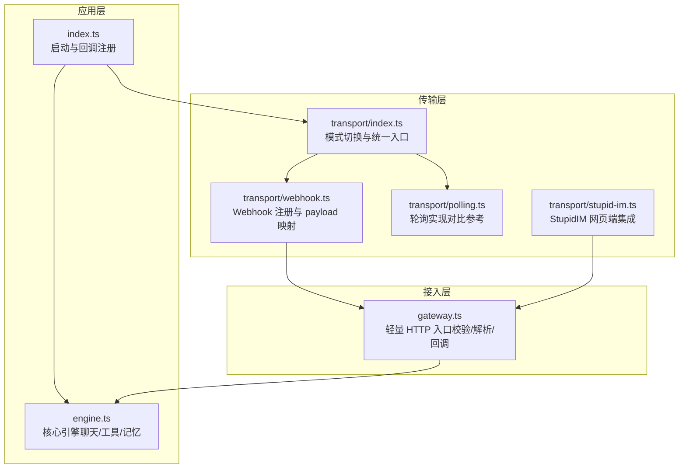
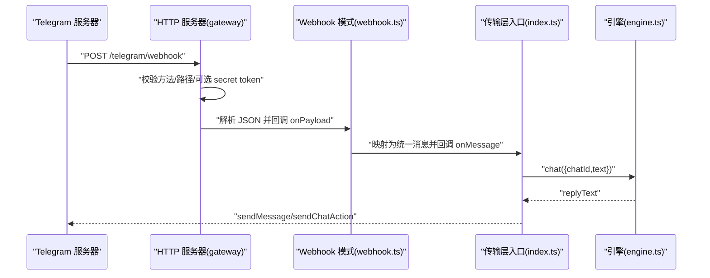
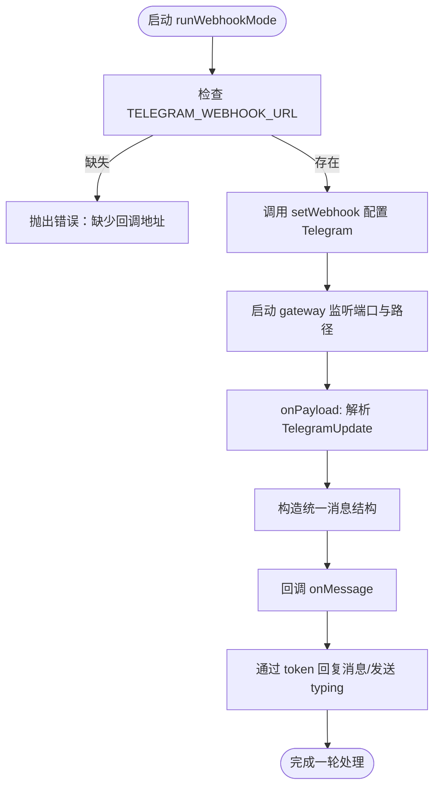
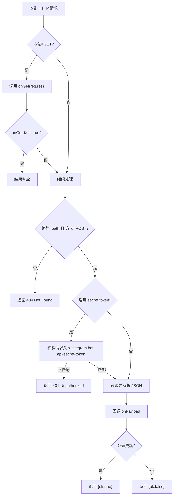
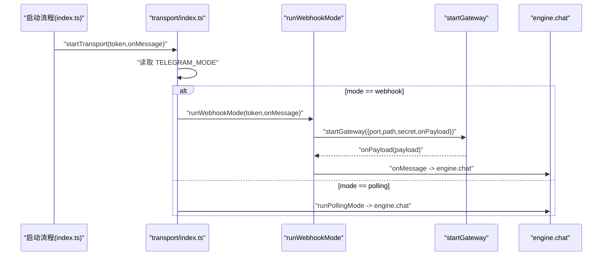
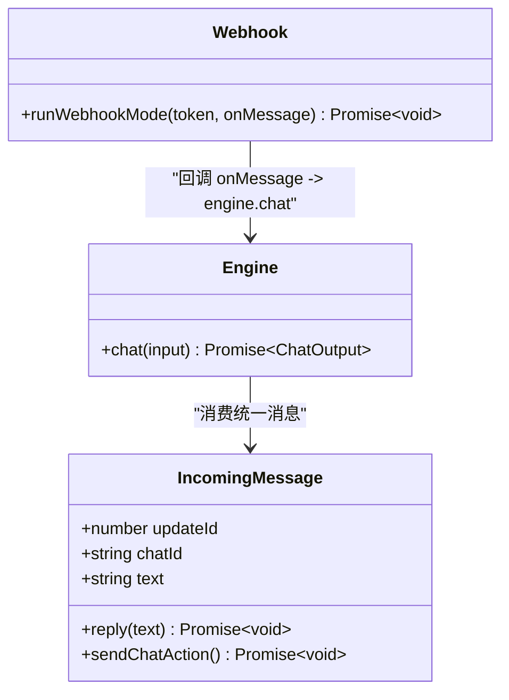
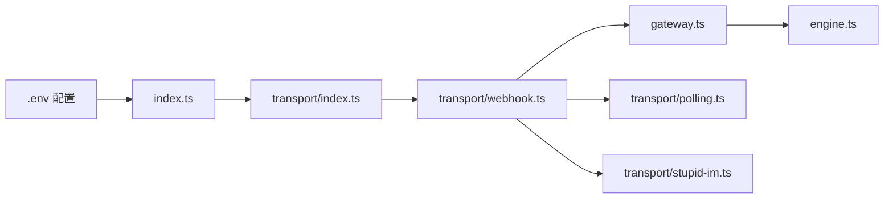

# Webhook HTTP 接收模式

<cite>
**本文档引用的文件**
- [src/transport/webhook.ts](file://src/transport/webhook.ts)
- [src/gateway.ts](file://src/gateway.ts)
- [src/transport/index.ts](file://src/transport/index.ts)
- [src/transport/polling.ts](file://src/transport/polling.ts)
- [src/index.ts](file://src/index.ts)
- [src/engine.ts](file://src/engine.ts)
- [src/transport/stupid-im.ts](file://src/transport/stupid-im.ts)
- [.env.example](file://.env.example)
- [StupidClaw-第2期-从Polling升级到Webhook.md](file://StupidClaw-第2期-从Polling升级到Webhook.md)
- [docs/troubleshooting.md](file://docs/troubleshooting.md)
- [package.json](file://package.json)
</cite>

## 目录
1. [简介](#简介)
2. [项目结构](#项目结构)
3. [核心组件](#核心组件)
4. [架构总览](#架构总览)
5. [详细组件分析](#详细组件分析)
6. [依赖关系分析](#依赖关系分析)
7. [性能考量](#性能考量)
8. [故障排查指南](#故障排查指南)
9. [结论](#结论)
10. [附录](#附录)

## 简介
本文件面向希望在 StupidClaw 中启用 Telegram Webhook 模式的用户与运维人员，系统性阐述 Webhook HTTP 接收模式的工作原理、实现机制与部署策略。内容涵盖：
- HTTP 服务器搭建与 URL 配置
- SSL 证书与公网可达性要求
- 消息接收流程、验证机制与并发处理
- 与核心引擎的集成方式、消息格式规范
- 云服务环境下的部署建议、安全防护与故障排查

## 项目结构
Webhook 模式的关键代码位于 transport 层与 gateway 层，通过统一的消息回调接口与引擎解耦，保证业务层不受传输层影响。

**图表来源**
- [src/transport/index.ts:47-71](file://src/transport/index.ts#L47-L71)
- [src/transport/webhook.ts:41-85](file://src/transport/webhook.ts#L41-L85)
- [src/gateway.ts:27-79](file://src/gateway.ts#L27-L79)
- [src/index.ts:189-208](file://src/index.ts#L189-L208)
- [src/engine.ts:680-706](file://src/engine.ts#L680-L706)
- [src/transport/stupid-im.ts:32-104](file://src/transport/stupid-im.ts#L32-L104)

**章节来源**
- [src/transport/index.ts:47-71](file://src/transport/index.ts#L47-L71)
- [src/transport/webhook.ts:41-85](file://src/transport/webhook.ts#L41-L85)
- [src/gateway.ts:27-79](file://src/gateway.ts#L27-L79)
- [src/index.ts:189-208](file://src/index.ts#L189-L208)
- [src/engine.ts:680-706](file://src/engine.ts#L680-L706)
- [src/transport/stupid-im.ts:32-104](file://src/transport/stupid-im.ts#L32-L104)

## 核心组件
- 传输层入口：根据 TELEGRAM_MODE 选择 polling 或 webhook，并注册统一消息回调。
- Webhook 模式：启动时调用 Telegram setWebhook，随后通过 gateway 接收回调并映射为统一消息结构。
- Gateway：校验 HTTP 方法与路径、可选的 secret token、解析 JSON 并回调业务层。
- 引擎：接收统一消息，执行聊天与工具调用，写入历史与记忆。
- StupidIM：可选的网页端 IM，与现有 HTTP 服务器集成。

**章节来源**
- [src/transport/index.ts:47-71](file://src/transport/index.ts#L47-L71)
- [src/transport/webhook.ts:41-85](file://src/transport/webhook.ts#L41-L85)
- [src/gateway.ts:27-79](file://src/gateway.ts#L27-L79)
- [src/engine.ts:680-706](file://src/engine.ts#L680-L706)
- [src/transport/stupid-im.ts:32-104](file://src/transport/stupid-im.ts#L32-L104)

## 架构总览
Webhook 模式的核心流程：应用启动 → setWebhook → Gateway 接收回调 → 映射为统一消息 → 引擎处理 → Telegram 回复。

**图表来源**
- [src/transport/webhook.ts:57-84](file://src/transport/webhook.ts#L57-L84)
- [src/gateway.ts:30-65](file://src/gateway.ts#L30-L65)
- [src/transport/index.ts:19-45](file://src/transport/index.ts#L19-L45)
- [src/index.ts:189-208](file://src/index.ts#L189-L208)
- [src/engine.ts:680-706](file://src/engine.ts#L680-L706)

## 详细组件分析

### Webhook 模式实现（transport/webhook.ts）
- 环境变量
  - TELEGRAM_WEBHOOK_URL：公网 HTTPS 回调地址（必填）
  - TELEGRAM_WEBHOOK_SECRET：可选 secret token，用于校验请求来源
  - TELEGRAM_WEBHOOK_PATH：默认 /telegram/webhook
  - PORT：服务端口，默认 8787
- 启动流程
  - 校验 TELEGRAM_WEBHOOK_URL 存在
  - 调用 Telegram setWebhook，配置 url、secret_token、allowed_updates
  - 启动 gateway，监听指定 path 与端口
  - onPayload：从 TelegramUpdate 提取消息文本与 chat_id，构造统一消息并回调 onMessage
  - onGet：转发到 StupidIM 请求处理
  - onServerCreated：若配置 STUPID_IM_TOKEN，则启动 StupidIM 并绑定到现有 HTTP 服务器

**图表来源**
- [src/transport/webhook.ts:41-85](file://src/transport/webhook.ts#L41-L85)

**章节来源**
- [src/transport/webhook.ts:41-85](file://src/transport/webhook.ts#L41-L85)
- [.env.example:57-61](file://.env.example#L57-L61)

### Gateway 接入层（gateway.ts）
- 功能职责
  - 校验 HTTP 方法与路径（仅接受 POST 到 path）
  - 可选 secret token 校验（请求头 x-telegram-bot-api-secret-token）
  - 读取原始请求体并解析 JSON
  - 回调 onPayload，返回 { ok: true/false }
  - GET 请求可交由 onGet 处理（用于 StupidIM）
- 并发与错误处理
  - 每个请求独立处理，异常返回 400
  - 404 用于非 GET/POST 或路径不匹配
  - 401 用于 secret token 不匹配

**图表来源**
- [src/gateway.ts:27-79](file://src/gateway.ts#L27-L79)

**章节来源**
- [src/gateway.ts:27-79](file://src/gateway.ts#L27-L79)

### 传输层统一入口（transport/index.ts）
- 根据 TELEGRAM_MODE 选择 runWebhookMode 或 runPollingMode
- 注册统一消息回调 onMessage，负责发送 typing 与回复
- 与 StupidIM 的集成：若配置 STUPID_IM_TOKEN，则启动 StupidIM 并绑定到现有 HTTP 服务器

**图表来源**
- [src/transport/index.ts:47-71](file://src/transport/index.ts#L47-L71)
- [src/index.ts:189-208](file://src/index.ts#L189-L208)

**章节来源**
- [src/transport/index.ts:47-71](file://src/transport/index.ts#L47-L71)
- [src/index.ts:189-208](file://src/index.ts#L189-L208)

### 引擎与消息格式（engine.ts 与 transport/webhook.ts）
- 统一消息结构
  - chatId: string
  - text: string
  - reply(text): Promise<void>
  - sendChatAction(): Promise<void>
- 引擎职责
  - chat(input): 执行聊天与工具调用，返回 replyText
  - 写入历史事件，支持工具执行开始/结束事件记录
- Webhook 映射
  - 从 TelegramUpdate.message.chat.id 与 text 构造统一消息
  - 通过 token 调用 Telegram API 回复与 typing 状态

**图表来源**
- [src/transport/webhook.ts:71-84](file://src/transport/webhook.ts#L71-L84)
- [src/engine.ts:19-26](file://src/engine.ts#L19-L26)
- [src/engine.ts:680-706](file://src/engine.ts#L680-L706)

**章节来源**
- [src/transport/webhook.ts:71-84](file://src/transport/webhook.ts#L71-L84)
- [src/engine.ts:19-26](file://src/engine.ts#L19-L26)
- [src/engine.ts:680-706](file://src/engine.ts#L680-L706)

### 与 StupidIM 的集成（transport/stupid-im.ts）
- 可选功能：在现有 HTTP 服务器上启动 StupidIM，或独立启动 HTTP 服务器
- WebSocket 认证：通过 URL 参数 token 校验
- 与 Webhook 并行：当 onGet 返回 false 时，继续走 Telegram 回调

**章节来源**
- [src/transport/stupid-im.ts:32-104](file://src/transport/stupid-im.ts#L32-L104)
- [src/transport/webhook.ts:62-64](file://src/transport/webhook.ts#L62-L64)

## 依赖关系分析
- 外部依赖
  - Telegram Bot API：setWebhook/deleteWebhook/getUpdates/sendMessage/sendChatAction
  - Node.js HTTP 服务器：用于 gateway
  - WebSocket（StupidIM）：用于网页端 IM
- 内部模块耦合
  - transport/index.ts 仅依赖 transport/webhook.ts 与 transport/polling.ts
  - gateway.ts 与 transport/webhook.ts 通过 onPayload/onGet 解耦
  - index.ts 仅依赖 transport/index.ts 与 engine.ts

**图表来源**
- [src/index.ts:189-208](file://src/index.ts#L189-L208)
- [src/transport/index.ts:47-71](file://src/transport/index.ts#L47-L71)
- [src/transport/webhook.ts:41-85](file://src/transport/webhook.ts#L41-L85)
- [src/gateway.ts:27-79](file://src/gateway.ts#L27-L79)
- [src/engine.ts:680-706](file://src/engine.ts#L680-L706)
- [src/transport/stupid-im.ts:32-104](file://src/transport/stupid-im.ts#L32-L104)

**章节来源**
- [src/index.ts:189-208](file://src/index.ts#L189-L208)
- [src/transport/index.ts:47-71](file://src/transport/index.ts#L47-L71)
- [src/transport/webhook.ts:41-85](file://src/transport/webhook.ts#L41-L85)
- [src/gateway.ts:27-79](file://src/gateway.ts#L27-L79)
- [src/engine.ts:680-706](file://src/engine.ts#L680-L706)
- [src/transport/stupid-im.ts:32-104](file://src/transport/stupid-im.ts#L32-L104)

## 性能考量
- 并发处理
  - gateway 对每个请求独立处理，无全局锁；适合高并发场景
  - 引擎内部按 chatId 维度管理会话，避免跨会话干扰
- 资源占用
  - Webhook 模式无需长轮询连接，降低 Telegram 侧连接压力
  - StupidIM 使用 WebSocket，消息延迟低
- 可扩展性
  - 通过 TELEGRAM_WEBHOOK_PATH 可在同一服务器上部署多个实例
  - 可结合反向代理（如 Nginx/Traefik）实现多实例负载均衡

[本节为通用指导，不涉及具体文件分析]

## 故障排查指南
- 启动即崩溃
  - 缺少 TELEGRAM_BOT_TOKEN：检查 .env 配置
  - 重复启动（锁文件）：删除 .stupidClaw/polling.lock 后重启
- Polling 409 冲突
  - 同一 Bot 仅允许一个 getUpdates 连接；若曾使用 Webhook，需 deleteWebhook
- Webhook 收不到消息
  - TELEGRAM_WEBHOOK_URL 必须为公网 HTTPS 地址
  - SSL 证书有效；可通过 curl 验证 getWebhookInfo
  - 确认 PORT 与监听端口一致；PATH 正确
  - 从 Webhook 切回 Polling：设置 TELEGRAM_MODE=polling
- API Key 问题
  - 引擎会根据配置回退到“收到：...”或给出明确提示
- 云服务部署
  - 使用反向代理（Nginx/Traefik）终止 TLS，后端监听 8080/8787
  - 防火墙开放公网端口；内网仅暴露 127.0.0.1

**章节来源**
- [docs/troubleshooting.md:53-114](file://docs/troubleshooting.md#L53-L114)
- [docs/troubleshooting.md:88-113](file://docs/troubleshooting.md#L88-L113)

## 结论
Webhook 模式通过 gateway 与 transport 的清晰分层，实现了与业务层的解耦，既满足公网部署需求，又保持了代码结构的简洁与可维护性。配合 StupidIM 的网页端能力，可在不同环境下灵活选择接入方式。

[本节为总结性内容，不涉及具体文件分析]

## 附录

### 配置清单（Webhook 模式）
- 必填项
  - TELEGRAM_BOT_TOKEN：BotFather 提供
  - TELEGRAM_MODE=webhook
  - TELEGRAM_WEBHOOK_URL=https://your.domain/telegram/webhook
- 可选项
  - TELEGRAM_WEBHOOK_SECRET：用于请求头校验
  - TELEGRAM_WEBHOOK_PATH：默认 /telegram/webhook
  - PORT：默认 8787
  - STUPID_IM_TOKEN：启用 StupidIM 网页端
- 示例（来自 .env.example）
  - STUPID_MODEL、各供应商 API Key
  - DEBUG_STUPIDCLAW、DEBUG_PROMPT

**章节来源**
- [.env.example:54-69](file://.env.example#L54-L69)
- [StupidClaw-第2期-从Polling升级到Webhook.md:98-108](file://StupidClaw-第2期-从Polling升级到Webhook.md#L98-L108)

### 云服务部署策略（HTTPS/反向代理/负载均衡）
- 终止 TLS
  - 使用 Nginx/Traefik/Cloudflare 等在边缘终止 HTTPS，后端监听 127.0.0.1:8080/8787
- 健康检查
  - 可在 gateway 上增加 /health 接口（当前未内置，可按需扩展）
- 负载均衡
  - 多实例部署：通过反向代理分发请求；注意 Telegram 回调仅指向单一 URL
  - 若需多实例，建议使用应用层队列或外部状态共享

**章节来源**
- [docs/troubleshooting.md:88-113](file://docs/troubleshooting.md#L88-L113)
- [src/gateway.ts:27-79](file://src/gateway.ts#L27-L79)

### 与核心引擎的集成要点
- 传输层只负责“消息归一化”，引擎负责“业务处理”
- Webhook 与 Polling 对引擎透明，无需修改 engine.chat()

**章节来源**
- [StupidClaw-第2期-从Polling升级到Webhook.md:71-95](file://StupidClaw-第2期-从Polling升级到Webhook.md#L71-L95)
- [src/engine.ts:680-706](file://src/engine.ts#L680-L706)