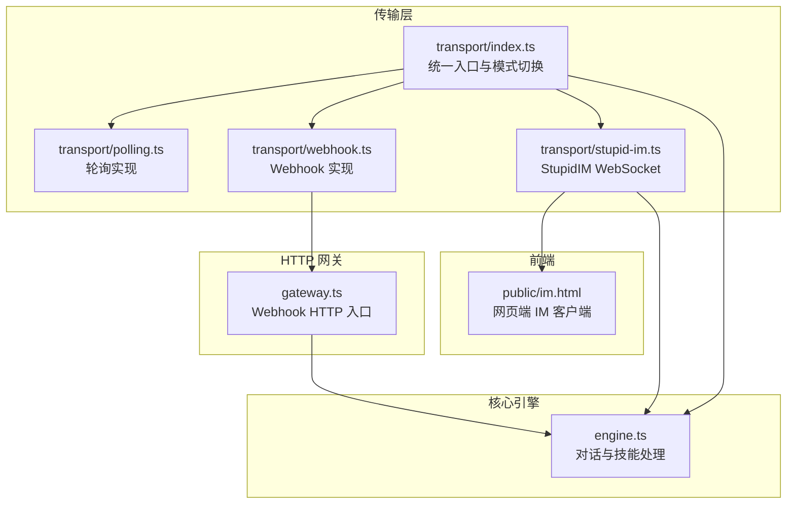
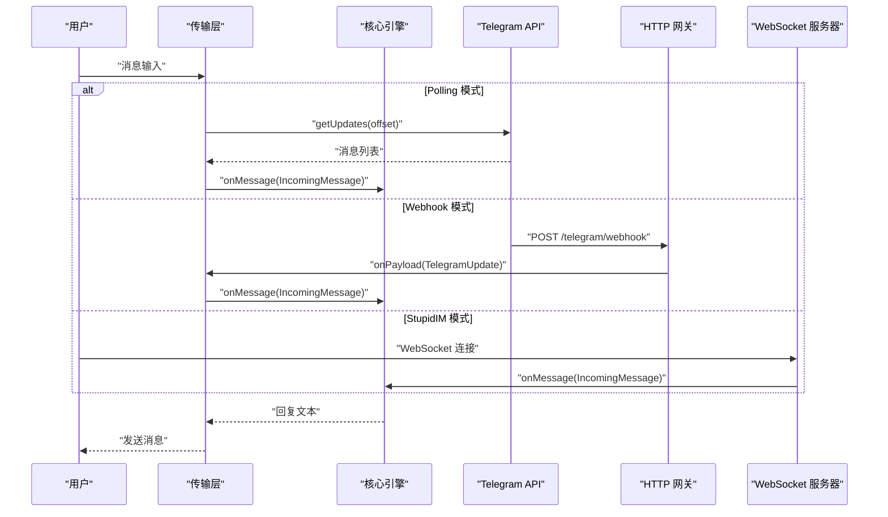
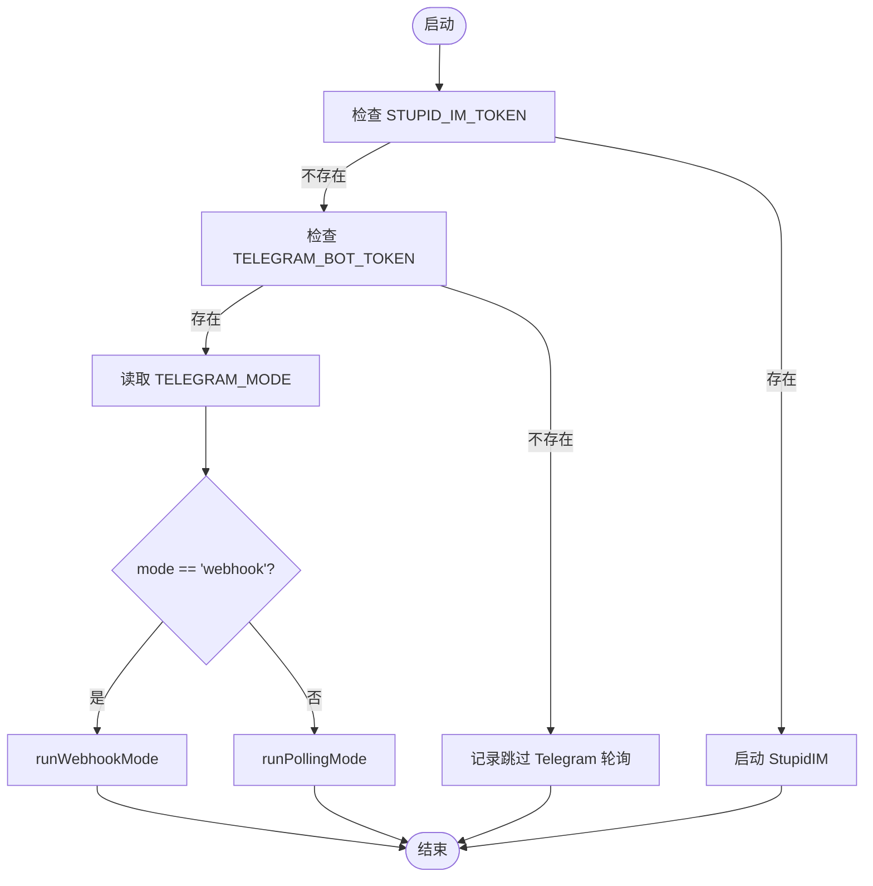
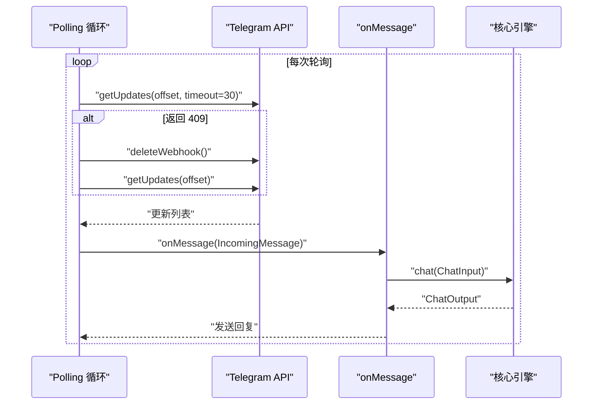
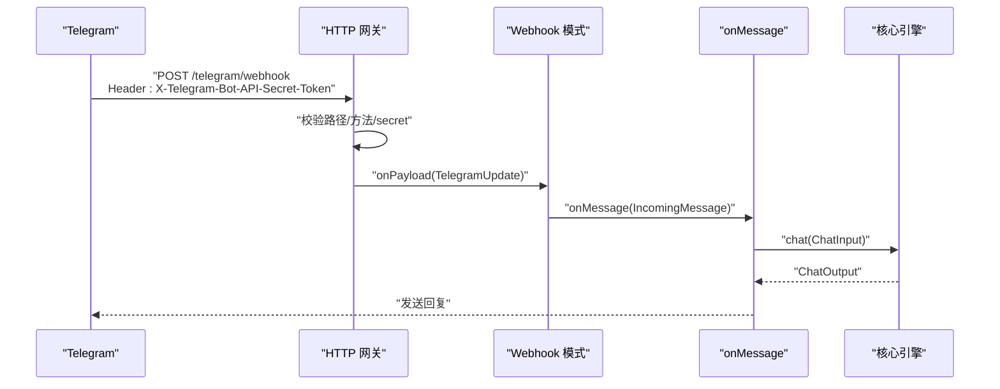
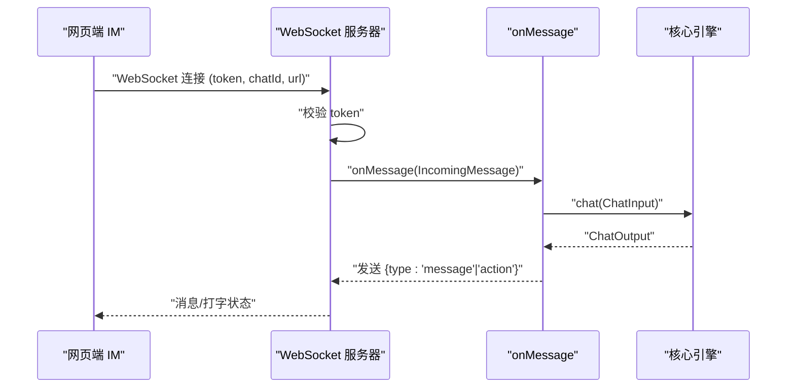
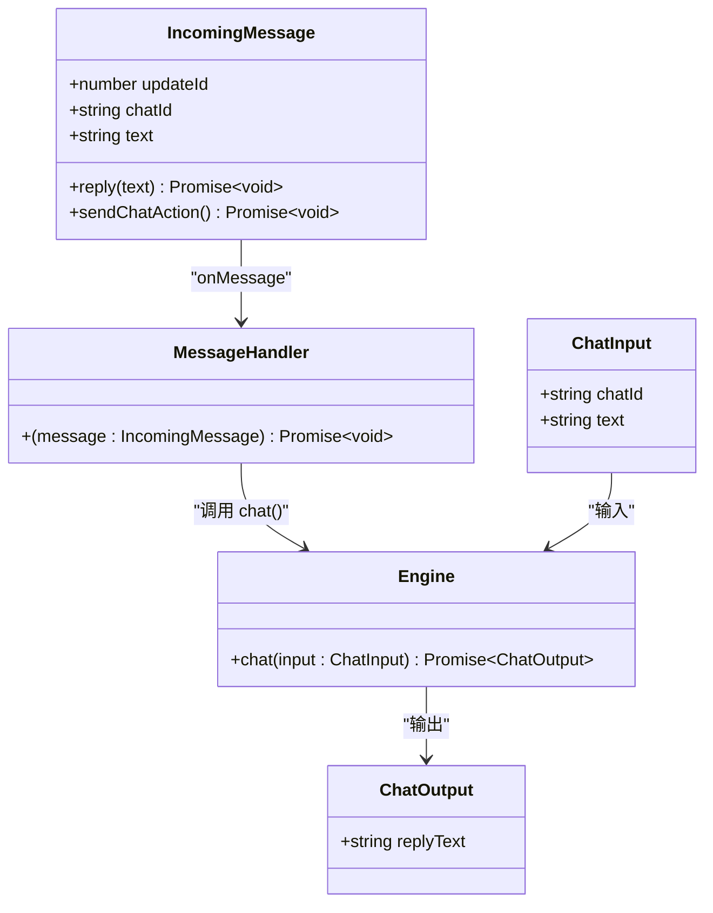
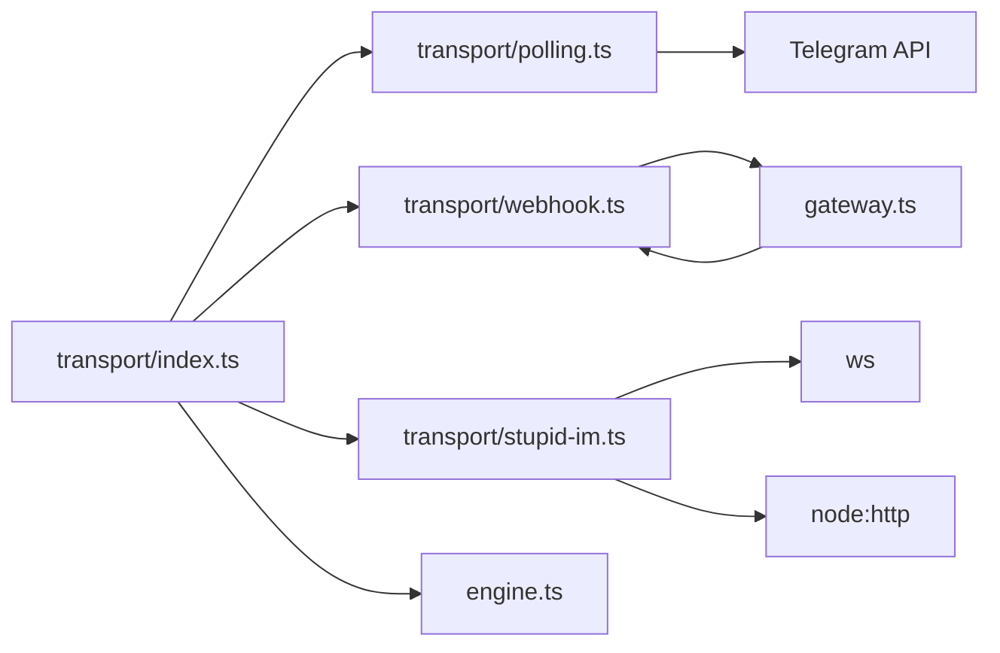

# 消息传输系统

<cite>
**本文档引用的文件**
- [src/transport/index.ts](file://src/transport/index.ts)
- [src/transport/polling.ts](file://src/transport/polling.ts)
- [src/transport/webhook.ts](file://src/transport/webhook.ts)
- [src/transport/stupid-im.ts](file://src/transport/stupid-im.ts)
- [src/gateway.ts](file://src/gateway.ts)
- [src/engine.ts](file://src/engine.ts)
- [src/init.ts](file://src/init.ts)
- [public/im.html](file://public/im.html)
- [package.json](file://package.json)
- [README.md](file://README.md)
</cite>

## 目录
1. [简介](#简介)
2. [项目结构](#项目结构)
3. [核心组件](#核心组件)
4. [架构总览](#架构总览)
5. [详细组件分析](#详细组件分析)
6. [依赖关系分析](#依赖关系分析)
7. [性能考虑](#性能考虑)
8. [故障排查指南](#故障排查指南)
9. [结论](#结论)
10. [附录](#附录)

## 简介
本文件面向 StupidClaw 的消息传输系统，系统性阐述传输层的架构设计与三种消息接收模式：Polling 长轮询模式、Webhook HTTP 接收模式、StupidIM WebSocket 通信模式。文档将从实现原理、配置方法、使用场景、与核心引擎的集成方式、消息格式规范、错误处理机制、性能优化策略等方面进行深入说明，并提供配置示例与故障排查指南，帮助开发者选择合适的传输方式并正确配置。

## 项目结构
传输层位于 src/transport 目录，包含统一入口、轮询实现、Webhook 实现与 StupidIM WebSocket 实现。核心引擎位于 src/engine.ts，负责对话处理与技能调用。HTTP 网关位于 src/gateway.ts，用于 Webhook 模式的请求接入。网页端 IM 客户端位于 public/im.html，配合 StupidIM WebSocket 服务端使用。

图表来源
- [src/transport/index.ts:1-71](file://src/transport/index.ts#L1-L71)
- [src/transport/polling.ts:1-243](file://src/transport/polling.ts#L1-L243)
- [src/transport/webhook.ts:1-86](file://src/transport/webhook.ts#L1-L86)
- [src/transport/stupid-im.ts:1-105](file://src/transport/stupid-im.ts#L1-L105)
- [src/gateway.ts:1-79](file://src/gateway.ts#L1-L79)
- [src/engine.ts:1-706](file://src/engine.ts#L1-L706)
- [public/im.html:1-428](file://public/im.html#L1-L428)

章节来源
- [src/transport/index.ts:1-71](file://src/transport/index.ts#L1-L71)
- [src/transport/polling.ts:1-243](file://src/transport/polling.ts#L1-L243)
- [src/transport/webhook.ts:1-86](file://src/transport/webhook.ts#L1-L86)
- [src/transport/stupid-im.ts:1-105](file://src/transport/stupid-im.ts#L1-L105)
- [src/gateway.ts:1-79](file://src/gateway.ts#L1-L79)
- [src/engine.ts:1-706](file://src/engine.ts#L1-L706)
- [public/im.html:1-428](file://public/im.html#L1-L428)

## 核心组件
- 统一入口与模式切换：根据 TELEGRAM_MODE 选择 Polling 或 Webhook；同时支持 StupidIM WebSocket。
- 轮询实现：周期性拉取 Telegram 更新，处理消息并调用引擎。
- Webhook 实现：注册 Telegram Webhook，通过 HTTP 网关接收更新并转发给引擎。
- StupidIM WebSocket：提供网页端 IM，通过 WebSocket 与引擎交互。
- HTTP 网关：校验请求、解析 JSON、回调业务处理函数。
- 核心引擎：接收统一消息结构，执行对话与技能处理。

章节来源
- [src/transport/index.ts:47-70](file://src/transport/index.ts#L47-L70)
- [src/transport/polling.ts:52-89](file://src/transport/polling.ts#L52-L89)
- [src/transport/webhook.ts:41-85](file://src/transport/webhook.ts#L41-L85)
- [src/transport/stupid-im.ts:24-105](file://src/transport/stupid-im.ts#L24-L105)
- [src/gateway.ts:27-79](file://src/gateway.ts#L27-L79)
- [src/engine.ts:680-706](file://src/engine.ts#L680-L706)

## 架构总览
传输层通过统一入口抽象不同消息来源，确保核心引擎的处理逻辑保持不变。Polling 与 Webhook 通过 Telegram API 产生统一的消息结构，StupidIM 通过 WebSocket 直接传递消息。HTTP 网关在 Webhook 模式下负责请求校验与解析。

图表来源
- [src/transport/index.ts:19-70](file://src/transport/index.ts#L19-L70)
- [src/transport/polling.ts:52-89](file://src/transport/polling.ts#L52-L89)
- [src/transport/webhook.ts:41-85](file://src/transport/webhook.ts#L41-L85)
- [src/transport/stupid-im.ts:65-103](file://src/transport/stupid-im.ts#L65-L103)
- [src/gateway.ts:27-79](file://src/gateway.ts#L27-L79)
- [src/engine.ts:680-706](file://src/engine.ts#L680-L706)

## 详细组件分析

### 统一入口与模式切换
- 功能：根据 TELEGRAM_MODE 切换 Polling 或 Webhook；若配置 STUPID_IM_TOKEN，则启动 StupidIM WebSocket 服务。
- 关键点：统一消息结构 IncomingMessage，包含 chatId、text、reply、sendChatAction；异常重试与睡眠控制。

图表来源
- [src/transport/index.ts:47-70](file://src/transport/index.ts#L47-L70)

章节来源
- [src/transport/index.ts:47-70](file://src/transport/index.ts#L47-L70)

### 轮询模式（Polling）
- 实现原理：循环调用 Telegram getUpdates，设置 offset 避免重复消息；遇到 409 冲突时禁用 Webhook 后重试。
- 消息处理：将 TelegramUpdate 映射为 IncomingMessage，调用 onMessage；offset 基于 update_id 更新。
- 回复与状态：支持 sendChatAction 发送“正在输入”状态；sendMessage 支持 Markdown 到 HTML 转换与分片发送。
- 错误处理：捕获异常并等待 1 秒后重试；409 冲突自动降级禁用 Webhook。

图表来源
- [src/transport/polling.ts:52-89](file://src/transport/polling.ts#L52-L89)
- [src/transport/polling.ts:215-242](file://src/transport/polling.ts#L215-L242)
- [src/transport/index.ts:19-45](file://src/transport/index.ts#L19-L45)

章节来源
- [src/transport/polling.ts:17-89](file://src/transport/polling.ts#L17-L89)
- [src/transport/polling.ts:202-242](file://src/transport/polling.ts#L202-L242)
- [src/transport/index.ts:19-45](file://src/transport/index.ts#L19-L45)

### Webhook HTTP 接收模式
- 实现原理：启动 HTTP 服务器，调用 Telegram setWebhook 注册回调地址；HTTP 网关校验路径、方法与可选 secret token，解析 JSON 后回调 onPayload。
- 消息处理：将 TelegramUpdate 映射为 IncomingMessage，调用 onMessage；同时支持 StupidIM 请求处理。
- 配置要点：TELEGRAM_WEBHOOK_URL、TELEGRAM_WEBHOOK_SECRET、TELEGRAM_WEBHOOK_PATH、PORT；需要公网可达。
- 错误处理：校验失败返回 401/404；解析失败返回 400；回调异常返回 400。

图表来源
- [src/transport/webhook.ts:41-85](file://src/transport/webhook.ts#L41-L85)
- [src/gateway.ts:27-79](file://src/gateway.ts#L27-L79)

章节来源
- [src/transport/webhook.ts:19-85](file://src/transport/webhook.ts#L19-L85)
- [src/gateway.ts:27-79](file://src/gateway.ts#L27-L79)

### StupidIM WebSocket 通信模式
- 实现原理：启动 WebSocket 服务器，支持两种启动方式：独立 HTTP 服务器或附加到现有 HTTP 服务器；客户端通过 URL 参数 token、chatId、url 认证与连接。
- 消息处理：连接建立后监听 message 事件，将文本封装为 IncomingMessage，调用 onMessage；支持发送“正在输入”与消息类型。
- 前端客户端：public/im.html 提供网页端 IM，支持连接配置、消息展示与打字指示器。
- 安全：URL 参数 token 校验，错误码 4001 表示认证失败。

图表来源
- [src/transport/stupid-im.ts:24-105](file://src/transport/stupid-im.ts#L24-L105)
- [public/im.html:278-428](file://public/im.html#L278-L428)

章节来源
- [src/transport/stupid-im.ts:11-105](file://src/transport/stupid-im.ts#L11-L105)
- [public/im.html:240-428](file://public/im.html#L240-L428)

### 与核心引擎的集成
- 统一消息模型：IncomingMessage 包含 chatId、text、reply、sendChatAction；engine.chat 接收 ChatInput，返回 ChatOutput。
- 生命周期：传输层负责消息来源与网络细节，引擎负责对话与技能执行；两者通过 onMessage 回调解耦。
- 输出格式：engine.chat 返回 replyText，传输层负责发送至 Telegram 或 WebSocket。

图表来源
- [src/transport/index.ts:5-13](file://src/transport/index.ts#L5-L13)
- [src/engine.ts:19-26](file://src/engine.ts#L19-L26)
- [src/engine.ts:680-706](file://src/engine.ts#L680-L706)

章节来源
- [src/transport/index.ts:5-13](file://src/transport/index.ts#L5-L13)
- [src/engine.ts:19-26](file://src/engine.ts#L19-L26)
- [src/engine.ts:680-706](file://src/engine.ts#L680-L706)

## 依赖关系分析
- 传输层依赖：polling.ts 依赖 Telegram API；webhook.ts 依赖 gateway.ts；stupid-im.ts 依赖 ws 与 node:http。
- 核心引擎：独立于传输层，通过统一消息接口与传输层交互。
- 前端依赖：public/im.html 依赖 WebSocket 服务器与样式脚本。

图表来源
- [src/transport/polling.ts:15-19](file://src/transport/polling.ts#L15-L19)
- [src/transport/webhook.ts:1-3](file://src/transport/webhook.ts#L1-L3)
- [src/transport/stupid-im.ts:1-6](file://src/transport/stupid-im.ts#L1-L6)
- [src/gateway.ts:1-5](file://src/gateway.ts#L1-L5)
- [src/transport/index.ts:1-3](file://src/transport/index.ts#L1-L3)

章节来源
- [src/transport/polling.ts:15-19](file://src/transport/polling.ts#L15-L19)
- [src/transport/webhook.ts:1-3](file://src/transport/webhook.ts#L1-L3)
- [src/transport/stupid-im.ts:1-6](file://src/transport/stupid-im.ts#L1-L6)
- [src/gateway.ts:1-5](file://src/gateway.ts#L1-L5)
- [src/transport/index.ts:1-3](file://src/transport/index.ts#L1-L3)

## 性能考虑
- 轮询模式
  - 轮询间隔：timeout 设置为 30 秒，减少空闲轮询次数。
  - 错误重试：异常时等待 1 秒，避免频繁请求。
  - 消息分片：超过最大长度时拆分为多段发送，提升成功率。
- Webhook 模式
  - 依赖外部 HTTP 服务器，需保证端口可达与防火墙开放。
  - 使用可选 secret token 防止伪造请求。
- StupidIM 模式
  - WebSocket 连接轻量，适合本地或内网使用。
  - 打字指示器异步发送，避免阻塞主线程。

章节来源
- [src/transport/polling.ts:36-50](file://src/transport/polling.ts#L36-L50)
- [src/transport/polling.ts:144-176](file://src/transport/polling.ts#L144-L176)
- [src/transport/webhook.ts:45-57](file://src/transport/webhook.ts#L45-L57)
- [src/transport/stupid-im.ts:65-103](file://src/transport/stupid-im.ts#L65-L103)

## 故障排查指南
- 环境变量配置
  - TELEGRAM_MODE：polling 或 webhook。
  - TELEGRAM_BOT_TOKEN：Telegram Bot Token。
  - TELEGRAM_WEBHOOK_URL：公网可访问的回调地址。
  - TELEGRAM_WEBHOOK_SECRET：可选，用于校验请求。
  - TELEGRAM_WEBHOOK_PATH：默认 /telegram/webhook。
  - PORT：服务端口，默认 8787。
  - STUPID_IM_TOKEN：StupidIM 访问密钥。
- 常见问题
  - 轮询 409 冲突：系统自动禁用 Webhook 后重试；若仍失败，检查 Telegram Bot 设置。
  - Webhook 401/404：检查路径、方法与 secret token；确认回调地址可达。
  - WebSocket 认证失败：检查 token 参数；错误码 4001 表示认证失败。
  - 发送失败：sendMessage 会尝试 HTML 模式，失败后回退纯文本；检查 Telegram API 返回状态。
- 调试建议
  - 设置 DEBUG_STUPIDCLAW=1 查看传输层调试日志。
  - 设置 DEBUG_PROMPT=1 查看提示词调试日志。

章节来源
- [src/transport/webhook.ts:45-57](file://src/transport/webhook.ts#L45-L57)
- [src/transport/stupid-im.ts:65-71](file://src/transport/stupid-im.ts#L65-L71)
- [src/transport/polling.ts:215-242](file://src/transport/polling.ts#L215-L242)
- [src/engine.ts:35-37](file://src/engine.ts#L35-L37)
- [src/engine.ts:65-73](file://src/engine.ts#L65-L73)

## 结论
StupidClaw 的传输层通过统一入口与模式切换，实现了对 Polling、Webhook 与 StupidIM 的无缝集成。核心引擎保持不变，业务逻辑与传输层解耦，便于扩展与维护。开发者可根据部署环境与需求选择合适的传输方式，并通过环境变量灵活配置。

## 附录

### 配置示例
- 环境变量
  - TELEGRAM_MODE=polling
  - TELEGRAM_BOT_TOKEN=你的 Telegram Bot Token
  - TELEGRAM_WEBHOOK_URL=https://yourdomain.com/telegram/webhook
  - TELEGRAM_WEBHOOK_SECRET=your_webhook_secret
  - TELEGRAM_WEBHOOK_PATH=/telegram/webhook
  - PORT=8787
  - STUPID_IM_TOKEN=your_stupid_im_token
- 初始化向导
  - 使用初始化脚本生成 .env，包含模型配置、Telegram Token、StupidIM Token 与端口等。

章节来源
- [src/init.ts:184-222](file://src/init.ts#L184-L222)
- [src/init.ts:224-339](file://src/init.ts#L224-L339)

### 使用场景
- Polling：本地开发、无公网 IP、快速验证。
- Webhook：生产部署、公网可达、低延迟响应。
- StupidIM：本地调试、网页端交互、无需 Telegram Bot。

章节来源
- [README.md:15-21](file://README.md#L15-L21)
- [src/transport/index.ts:61-69](file://src/transport/index.ts#L61-L69)