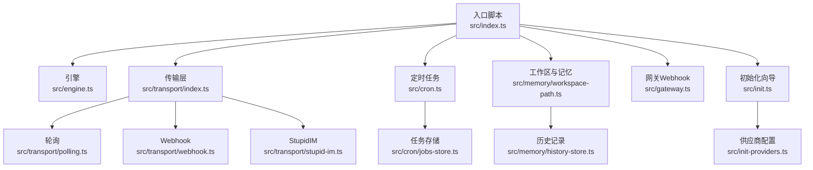
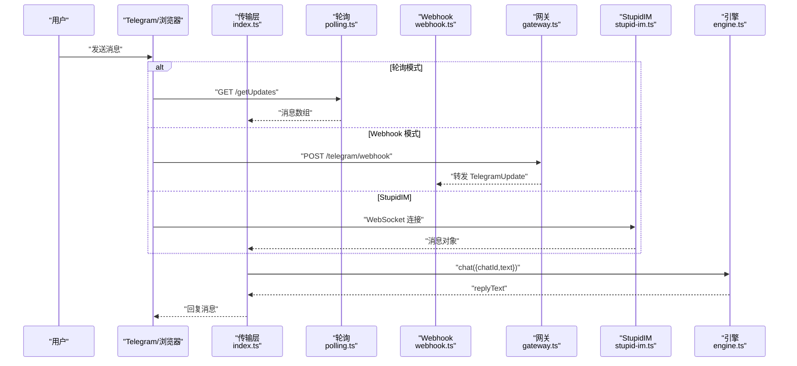
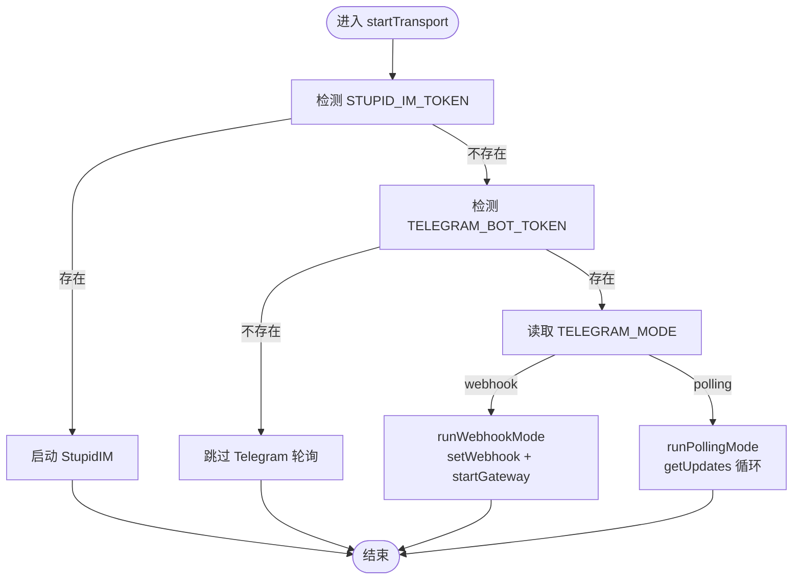
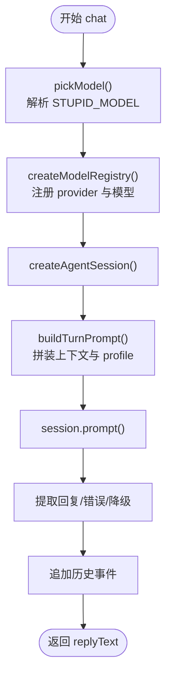
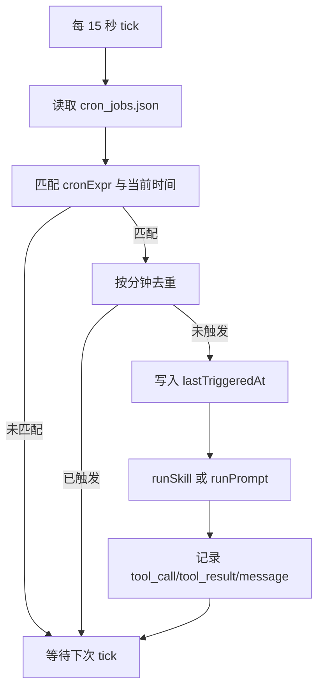
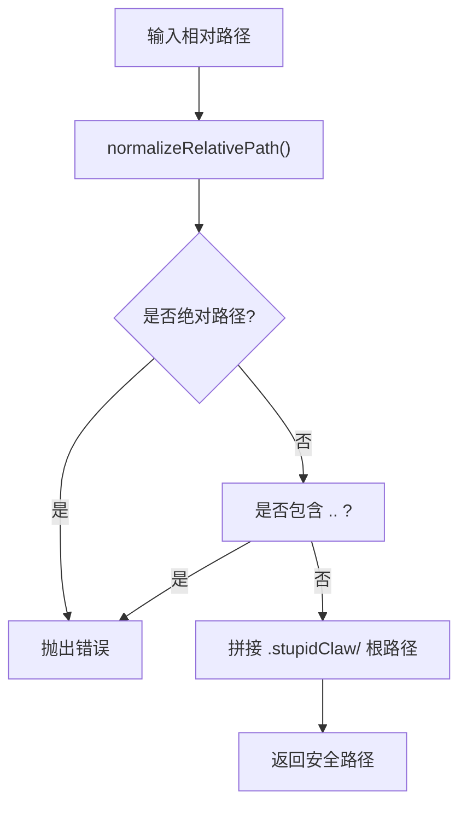
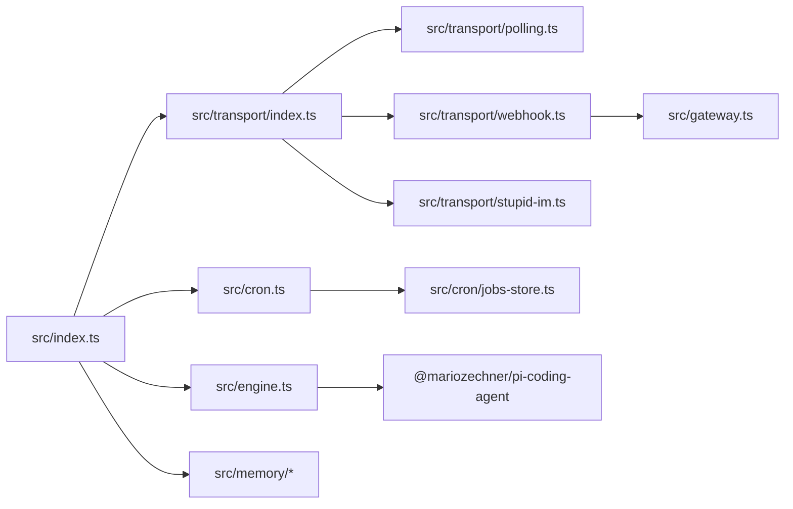

# 故障排查

<cite>
**本文引用的文件**   
- [README.md](file://README.md)
- [install.sh](file://install.sh)
- [package.json](file://package.json)
- [src/index.ts](file://src/index.ts)
- [src/init.ts](file://src/init.ts)
- [src/engine.ts](file://src/engine.ts)
- [src/init-providers.ts](file://src/init-providers.ts)
- [src/transport/index.ts](file://src/transport/index.ts)
- [src/transport/polling.ts](file://src/transport/polling.ts)
- [src/transport/webhook.ts](file://src/transport/webhook.ts)
- [src/transport/stupid-im.ts](file://src/transport/stupid-im.ts)
- [src/gateway.ts](file://src/gateway.ts)
- [src/cron.ts](file://src/cron.ts)
- [src/cron/jobs-store.ts](file://src/cron/jobs-store.ts)
- [src/memory/workspace-path.ts](file://src/memory/workspace-path.ts)
- [src/memory/history-store.ts](file://src/memory/history-store.ts)
- [docs/getting-started.md](file://docs/getting-started.md)
- [docs/troubleshooting.md](file://docs/troubleshooting.md)
</cite>

## 目录
1. [简介](#简介)
2. [项目结构](#项目结构)
3. [核心组件](#核心组件)
4. [架构总览](#架构总览)
5. [详细组件分析](#详细组件分析)
6. [依赖关系分析](#依赖关系分析)
7. [性能注意事项](#性能注意事项)
8. [故障排查指南](#故障排查指南)
9. [结论](#结论)
10. [附录](#附录)

## 简介
本指南面向 StupidClaw 用户与运维人员，提供系统化的故障排查流程与解决方案，覆盖安装失败、环境配置错误、模型连接问题、消息传输异常、Webhook 与 Polling 互斥、Cron 定时任务未触发、技能调用失败、历史与记忆持久化等问题。文档同时给出错误日志分析方法、网络连通性测试、API Key 验证技巧，并针对不同部署方式（npx、源码、打包可执行）提供特定问题定位建议。

## 项目结构
StupidClaw 采用“入口脚本 + 引擎 + 传输层 + 定时任务 + 记忆与工作区”的分层组织。核心入口负责加载 .env、初始化工作区、注册单实例锁、启动传输层与定时任务；引擎负责模型选择、会话管理、提示词构建与调用；传输层负责 Telegram 轮询/Webhook 与 StupidIM 网页端；定时任务模块负责基于 cron 表达式的周期性触发；记忆模块负责历史事件与 profile 的持久化。

图表来源
- [src/index.ts:112-216](file://src/index.ts#L112-L216)
- [src/engine.ts:392-475](file://src/engine.ts#L392-L475)
- [src/transport/index.ts:47-71](file://src/transport/index.ts#L47-L71)
- [src/transport/polling.ts:52-89](file://src/transport/polling.ts#L52-L89)
- [src/transport/webhook.ts:41-86](file://src/transport/webhook.ts#L41-L86)
- [src/transport/stupid-im.ts:24-105](file://src/transport/stupid-im.ts#L24-L105)
- [src/cron.ts:251-265](file://src/cron.ts#L251-L265)
- [src/cron/jobs-store.ts:124-142](file://src/cron/jobs-store.ts#L124-L142)
- [src/memory/workspace-path.ts:37-42](file://src/memory/workspace-path.ts#L37-L42)
- [src/memory/history-store.ts:37-83](file://src/memory/history-store.ts#L37-L83)
- [src/gateway.ts:27-79](file://src/gateway.ts#L27-L79)
- [src/init.ts:224-339](file://src/init.ts#L224-L339)
- [src/init-providers.ts:23-180](file://src/init-providers.ts#L23-L180)

章节来源
- [README.md:22-52](file://README.md#L22-L52)
- [src/index.ts:112-216](file://src/index.ts#L112-L216)

## 核心组件
- 入口与生命周期
  - 加载 .env（支持 --config 指定路径）
  - 单实例锁（polling.lock）防止并发冲突
  - 注册信号处理器，优雅退出
- 引擎与模型
  - 动态选择模型（支持 provider:model_id 与兼容旧格式）
  - API Key 错误归一化与提示
  - 构建系统提示词与工具集
- 传输层
  - Polling：长轮询拉取消息，自动 deleteWebhook 兼容 409 冲突
  - Webhook：注册回调、校验密钥、HTTP 网关接收推送
  - StupidIM：WebSocket 网页端，支持 token 校验
- 定时任务
  - 15 秒 tick，解析 cron 表达式，去重触发，记录历史
- 记忆与工作区
  - PathJailing 限制在 .stupidClaw 目录
  - 历史事件 JSONL 追加，按日期分文件
  - Profile 持久化

章节来源
- [src/index.ts:22-84](file://src/index.ts#L22-L84)
- [src/engine.ts:196-244](file://src/engine.ts#L196-L244)
- [src/engine.ts:461-475](file://src/engine.ts#L461-L475)
- [src/transport/index.ts:47-71](file://src/transport/index.ts#L47-L71)
- [src/transport/polling.ts:52-89](file://src/transport/polling.ts#L52-L89)
- [src/transport/webhook.ts:41-86](file://src/transport/webhook.ts#L41-L86)
- [src/cron.ts:251-265](file://src/cron.ts#L251-L265)
- [src/memory/workspace-path.ts:32-42](file://src/memory/workspace-path.ts#L32-L42)
- [src/memory/history-store.ts:37-83](file://src/memory/history-store.ts#L37-L83)

## 架构总览
下面的序列图展示了从用户消息到模型回复的关键路径，涵盖轮询、Webhook、StupidIM 三种接入方式。

图表来源
- [src/transport/index.ts:47-71](file://src/transport/index.ts#L47-L71)
- [src/transport/polling.ts:52-89](file://src/transport/polling.ts#L52-L89)
- [src/transport/webhook.ts:57-84](file://src/transport/webhook.ts#L57-L84)
- [src/gateway.ts:27-79](file://src/gateway.ts#L27-L79)
- [src/transport/stupid-im.ts:65-104](file://src/transport/stupid-im.ts#L65-L104)
- [src/engine.ts:680-706](file://src/engine.ts#L680-L706)

## 详细组件分析

### 组件 A：消息传输层（轮询/ Webhook / StupidIM）
- 轮询（Polling）
  - 自动 deleteWebhook 兼容 409 冲突
  - 超时与重试、错误日志输出
- Webhook
  - setWebhook 注册回调，支持 secret_token
  - 网关 startGateway 校验 X-Telegram-Bot-API-Secret-Token
  - 支持 GET /im 透传到 StupidIM
- StupidIM
  - WebSocket 服务，URL 参数 token 校验
  - 自动打印可点击链接，便于本地调试

图表来源
- [src/transport/index.ts:47-71](file://src/transport/index.ts#L47-L71)
- [src/transport/webhook.ts:41-86](file://src/transport/webhook.ts#L41-L86)
- [src/transport/polling.ts:52-89](file://src/transport/polling.ts#L52-L89)
- [src/transport/stupid-im.ts:24-105](file://src/transport/stupid-im.ts#L24-L105)

章节来源
- [src/transport/index.ts:47-71](file://src/transport/index.ts#L47-L71)
- [src/transport/polling.ts:21-89](file://src/transport/polling.ts#L21-L89)
- [src/transport/webhook.ts:19-86](file://src/transport/webhook.ts#L19-L86)
- [src/transport/stupid-im.ts:24-105](file://src/transport/stupid-im.ts#L24-L105)

### 组件 B：引擎与模型选择
- 模型选择策略
  - 优先按 STUPID_MODEL=provider:model_id 匹配
  - 兼容旧格式（纯 model_id）尝试 minimax-cn/minimax
  - 默认兜底：优先 minimax-cn，否则 minimax，否则第一个可用
- API Key 归一化
  - 将“缺少某 provider API Key”转换为明确提示，包含环境变量名与 provider 映射
- 提示词与工具
  - 构建静态系统提示词，注入文件技能
  - 调试开关 DEBUG_STUPIDCLAW/DEBUG_PROMPT 输出运行时配置与完整 prompt

图表来源
- [src/engine.ts:196-244](file://src/engine.ts#L196-L244)
- [src/engine.ts:392-475](file://src/engine.ts#L392-L475)
- [src/engine.ts:484-509](file://src/engine.ts#L484-L509)
- [src/engine.ts:511-607](file://src/engine.ts#L511-L607)
- [src/engine.ts:680-706](file://src/engine.ts#L680-L706)

章节来源
- [src/engine.ts:196-244](file://src/engine.ts#L196-L244)
- [src/engine.ts:461-475](file://src/engine.ts#L461-L475)
- [src/engine.ts:511-607](file://src/engine.ts#L511-L607)
- [src/engine.ts:680-706](file://src/engine.ts#L680-L706)

### 组件 C：定时任务（Cron）
- 表达式解析
  - 5 段 cron（分 时 日 月 周），支持 *、范围、步进、逗号组合
- 去重与记录
  - 按分钟粒度去重，避免长时间 LLM 调用导致重复触发
  - 触发前后记录 tool_call/tool_result/message
- 执行器
  - runSkill：直接调用已注册工具（不走 LLM）
  - runPrompt：构造任务 prompt，交由 LLM 执行

图表来源
- [src/cron.ts:171-265](file://src/cron.ts#L171-L265)
- [src/cron/jobs-store.ts:124-142](file://src/cron/jobs-store.ts#L124-L142)

章节来源
- [src/cron.ts:85-109](file://src/cron.ts#L85-L109)
- [src/cron.ts:171-265](file://src/cron.ts#L171-L265)
- [src/cron/jobs-store.ts:124-142](file://src/cron/jobs-store.ts#L124-L142)

### 组件 D：工作区与安全沙盒
- PathJailing
  - 严格禁止绝对路径、.. 路径穿越
  - 限定操作范围在 .stupidClaw/ 下
- 历史与 Profile
  - 历史按日期文件追加 JSONL
  - Profile 持久化在 .stupidClaw/profile.md

图表来源
- [src/memory/workspace-path.ts:6-35](file://src/memory/workspace-path.ts#L6-L35)

章节来源
- [src/memory/workspace-path.ts:6-42](file://src/memory/workspace-path.ts#L6-L42)
- [src/memory/history-store.ts:37-83](file://src/memory/history-store.ts#L37-L83)

## 依赖关系分析
- 入口依赖 dotenv、engine、transport、cron、memory、skills/registry
- 传输层依赖 polling/webhook/stupid-im
- 引擎依赖 pi-coding-agent、ModelRegistry、SessionManager、工具集
- Cron 依赖 jobs-store 与传输层发送通知
- 网关依赖 HTTP Server 与 secret token 校验

图表来源
- [src/index.ts:8-10](file://src/index.ts#L8-L10)
- [src/engine.ts:1-17](file://src/engine.ts#L1-L17)
- [src/transport/index.ts:1-3](file://src/transport/index.ts#L1-L3)
- [src/transport/webhook.ts:1](file://src/transport/webhook.ts#L1)
- [src/gateway.ts:1-5](file://src/gateway.ts#L1-L5)
- [src/cron.ts:1-4](file://src/cron.ts#L1-L4)
- [src/cron/jobs-store.ts:1-2](file://src/cron/jobs-store.ts#L1-L2)

章节来源
- [src/index.ts:8-10](file://src/index.ts#L8-L10)
- [src/engine.ts:1-17](file://src/engine.ts#L1-L17)
- [src/transport/index.ts:1-3](file://src/transport/index.ts#L1-L3)
- [src/transport/webhook.ts:1](file://src/transport/webhook.ts#L1)
- [src/gateway.ts:1-5](file://src/gateway.ts#L1-L5)
- [src/cron.ts:1-4](file://src/cron.ts#L1-L4)
- [src/cron/jobs-store.ts:1-2](file://src/cron/jobs-store.ts#L1-L2)

## 性能注意事项
- 轮询模式
  - 轮询间隔与超时参数影响延迟与资源占用
  - 避免多实例同时轮询，减少 409 冲突与资源浪费
- Webhook 模式
  - 需公网 HTTPS 与有效证书，避免频繁失败重试
  - 端口与 PATH 配置需与 setWebhook 一致
- 引擎
  - 开启 DEBUG_PROMPT 会输出完整 prompt，影响 IO
  - 大模型调用耗时较长时，注意 Cron 去重与历史写入频率
- StupidIM
  - WebSocket 连接数与消息吞吐需结合前端页面规模评估

[本节为通用指导，无需列出章节来源]

## 故障排查指南

### 一、安装与环境问题
- 现象：安装脚本报错或无法启动
  - 检查 Node.js 版本（推荐 v20+），pnpm 是否安装
  - 使用自动化安装脚本 install.sh，自动处理依赖与 .env 初始化
  - 若 npx 运行，确认包可访问且 .env 可被加载
- 现象：首次运行提示缺少配置
  - 使用初始化向导生成 .env，或手动复制 .env.example 并填写必要字段
  - 使用 npx stupid-claw init 快速生成配置

章节来源
- [install.sh:17-68](file://install.sh#L17-L68)
- [docs/getting-started.md:40-94](file://docs/getting-started.md#L40-L94)
- [src/init.ts:224-339](file://src/init.ts#L224-L339)

### 二、模型连接问题
- 现象：启动后无回复或回显用户输入
  - 可能为 API Key 未配置，引擎会回退为“收到：...”
  - 开启 DEBUG_STUPIDCLAW 查看 selectedProvider/selectedModelId
  - 检查 STUPID_MODEL 格式与对应供应商 API Key 是否正确
- 现象：模型调用失败
  - 关注 normalizeApiKeyError 的归一化提示，确认环境变量名与 provider 映射
  - 检查供应商余额与配额状态

章节来源
- [docs/troubleshooting.md:33-50](file://docs/troubleshooting.md#L33-L50)
- [src/engine.ts:162-186](file://src/engine.ts#L162-L186)
- [src/engine.ts:453-455](file://src/engine.ts#L453-L455)

### 三、消息传输异常（轮询/ Webhook / StupidIM）
- 轮询（Polling）
  - 现象：HTTP 409 冲突
    - 原因：同一 Bot 同时存在轮询与 Webhook，或多实例
    - 解决：关闭其他实例，或切换到 Webhook 并删除旧轮询
  - 现象：无消息
    - 检查 TELEGRAM_BOT_TOKEN 是否正确
    - 查看日志中是否有 [ok] chatId=... 更新
- Webhook
  - 现象：收不到消息
    - 检查 TELEGRAM_WEBHOOK_URL 是否为公网 HTTPS，证书有效
    - 校验 PORT 与实际监听端口一致
    - 使用 getWebhookInfo 验证 last_error_message 是否为空
- StupidIM
  - 现象：无法连接或无回复
    - 确认 STUPID_IM_TOKEN 与 URL token 一致
    - 浏览器控制台网络面板查看 WS 连接状态

章节来源
- [docs/troubleshooting.md:53-114](file://docs/troubleshooting.md#L53-L114)
- [src/transport/polling.ts:52-89](file://src/transport/polling.ts#L52-L89)
- [src/transport/webhook.ts:41-86](file://src/transport/webhook.ts#L41-L86)
- [src/transport/stupid-im.ts:65-104](file://src/transport/stupid-im.ts#L65-L104)

### 四、Cron 定时任务未触发
- 检查 .stupidClaw/cron_jobs.json 是否存在、enabled 是否为 true
- 校验 cronExpr 格式（5 段表达式），注意系统时区
- 查看当日历史文件 .stupidClaw/history/YY-MM-DD.jsonl 是否有触发记录
- 开启 DEBUG_STUPIDCLAW 观察调度器日志

章节来源
- [docs/troubleshooting.md:116-145](file://docs/troubleshooting.md#L116-L145)
- [src/cron.ts:171-265](file://src/cron.ts#L171-L265)
- [src/cron/jobs-store.ts:124-142](file://src/cron/jobs-store.ts#L124-L142)
- [src/memory/history-store.ts:37-83](file://src/memory/history-store.ts#L37-L83)

### 五、技能（Skill）调用失败
- 现象：模型声称执行了但未生效
  - 使用 list_available_skills 确认技能已注册
  - 开启 DEBUG_PROMPT=1 查看完整 prompt，确认工具描述与参数
  - 文件类技能仅限 .stupidClaw/ 目录，禁止 ../src/ 或绝对路径

章节来源
- [docs/troubleshooting.md:147-159](file://docs/troubleshooting.md#L147-L159)
- [src/engine.ts:580-581](file://src/engine.ts#L580-L581)

### 六、历史与记忆持久化
- Profile 保存在 .stupidClaw/profile.md，不在 git 追踪内
- 历史事件按日期写入 .stupidClaw/history/YYYY-MM-DD.jsonl
- 若清空 .stupidClaw/ 目录，profile 与历史会丢失

章节来源
- [docs/troubleshooting.md:161-169](file://docs/troubleshooting.md#L161-L169)
- [src/memory/history-store.ts:37-83](file://src/memory/history-store.ts#L37-L83)

### 七、单实例锁与并发冲突
- 现象：提示“另一个轮询实例已在运行”
  - 原因：.stupidClaw/polling.lock 存在
  - 解决：删除锁文件或正常退出（Ctrl+C/SIGTERM）后自动清理

章节来源
- [src/index.ts:45-84](file://src/index.ts#L45-L84)
- [docs/troubleshooting.md:17-30](file://docs/troubleshooting.md#L17-L30)

### 八、环境变量速查与验证
- 必填项：至少配置 STUPID_MODEL 与对应供应商 API Key
- 可选项：TELEGRAM_BOT_TOKEN、TELEGRAM_MODE、TELEGRAM_WEBHOOK_URL、PORT、STUPID_IM_TOKEN、DEBUG_STUPIDCLAW、DEBUG_PROMPT
- 验证方法：启动后观察 [boot] 输出，确认 StupidIM 与 Telegram 轮询/ Webhook 启动日志

章节来源
- [docs/troubleshooting.md:171-194](file://docs/troubleshooting.md#L171-L194)
- [docs/getting-started.md:97-113](file://docs/getting-started.md#L97-L113)

### 九、网络连通性与 API Key 验证技巧
- 使用 curl 验证 Webhook 设置
  - curl "https://api.telegram.org/bot<TOKEN>/getWebhookInfo"
- 检查端口与防火墙
  - 确认 PORT 与实际监听一致，公网可达
- API Key 有效性
  - 引擎会将“缺少 API Key”错误归一化为明确提示，优先检查对应环境变量

章节来源
- [docs/troubleshooting.md:98-113](file://docs/troubleshooting.md#L98-L113)
- [src/engine.ts:162-186](file://src/engine.ts#L162-L186)

### 十、不同部署方式的特定问题
- npx 运行
  - 首次运行会提示缺少配置，按提示生成 .env
  - 可通过 --config 指定非默认目录下的 .env
- 源码运行
  - pnpm install 后，确保 Node.js v20+，按需配置 .env
- 打包可执行
  - 使用 pnpm run build:exe 生成独立二进制，与 .env 放在同一目录即可运行

章节来源
- [docs/getting-started.md:42-56](file://docs/getting-started.md#L42-L56)
- [docs/getting-started.md:138-153](file://docs/getting-started.md#L138-L153)
- [package.json:14-22](file://package.json#L14-L22)

### 十一、问题反馈与报告机制
- 收集信息
  - 环境变量摘要（STUPID_MODEL、TELEGRAM_MODE、PORT 等）
  - 最近日志片段（含 [error]/[fatal]/[debug]）
  - 重现步骤与期望行为
- 提交渠道
  - 参考项目 README 中的“问题反馈”入口（如 Issues）

章节来源
- [README.md:1-14](file://README.md#L1-L14)

## 结论
通过本指南，您可以系统地定位 StupidClaw 的常见问题：从环境与安装、模型连接、消息传输、定时任务到技能与持久化。建议在排查过程中逐步启用调试日志、核对配置文件、验证网络连通性，并结合不同部署方式的特点进行针对性修复。若问题仍未解决，可按“问题反馈与报告机制”收集信息提交支持。

[本节为总结，无需列出章节来源]

## 附录

### A. 常见错误与提示对照
- 缺少 TELEGRAM_BOT_TOKEN：启动即崩溃，需填写 Bot token
- 重复启动（锁文件）：删除 .stupidClaw/polling.lock 或正常退出
- 轮询 409 冲突：确保仅一个轮询实例或删除 Webhook
- Webhook 无法访问：公网 HTTPS、有效证书、端口与 PATH 一致
- API Key 未配置：引擎回显用户输入，需补全对应环境变量
- 技能调用失败：确认技能注册、参数与沙盒路径

章节来源
- [docs/troubleshooting.md:5-194](file://docs/troubleshooting.md#L5-L194)

### B. 初始化向导与供应商配置
- 使用 npx stupid-claw init 快速生成 .env
- 支持多家供应商与本地模型（Ollama/LM Studio/custom OpenAI/Anthropic）
- 自定义 Base URL 与模型 ID 输入

章节来源
- [src/init.ts:224-339](file://src/init.ts#L224-L339)
- [src/init-providers.ts:23-180](file://src/init-providers.ts#L23-L180)