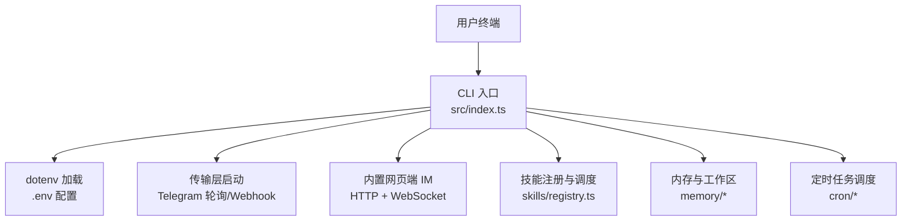
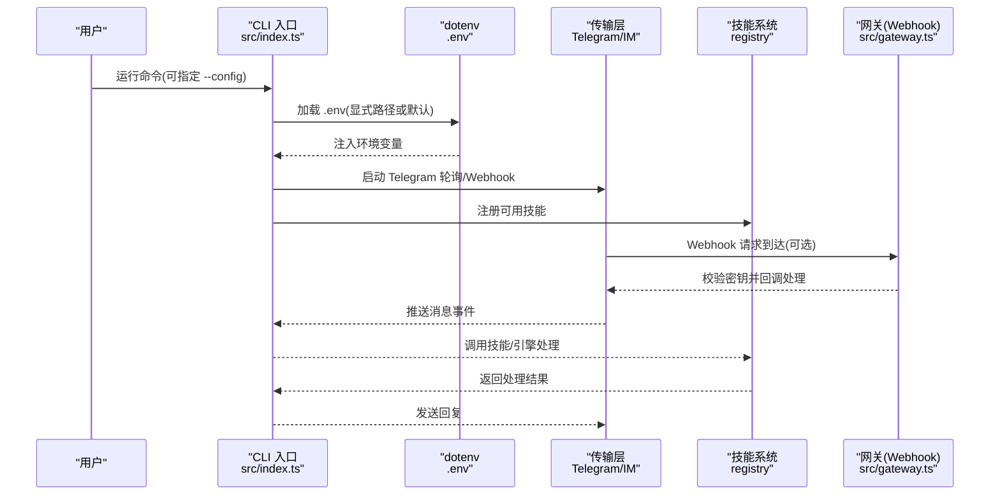
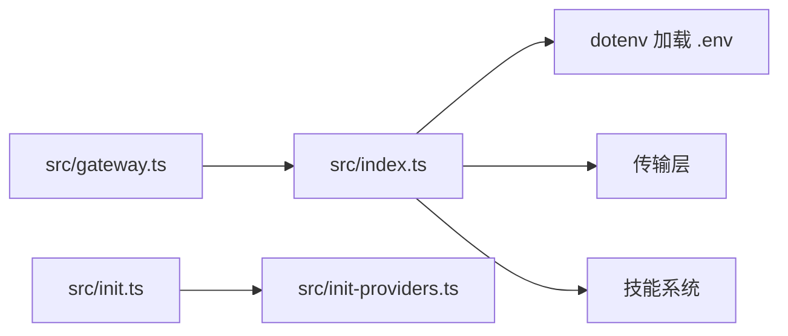

# 环境配置

<cite>
**本文引用的文件**
- [package.json](file://package.json)
- [README.md](file://README.md)
- [install.sh](file://install.sh)
- [src/index.ts](file://src/index.ts)
- [src/init.ts](file://src/init.ts)
- [src/init-providers.ts](file://src/init-providers.ts)
- [src/gateway.ts](file://src/gateway.ts)
- [docs/getting-started.md](file://docs/getting-started.md)
- [docs/models.md](file://docs/models.md)
</cite>

## 目录
1. [简介](#简介)
2. [项目结构](#项目结构)
3. [核心组件](#核心组件)
4. [架构总览](#架构总览)
5. [详细组件分析](#详细组件分析)
6. [依赖关系分析](#依赖关系分析)
7. [性能考虑](#性能考虑)
8. [故障排查指南](#故障排查指南)
9. [结论](#结论)
10. [附录](#附录)

## 简介
本指南面向 StupidClaw 的使用者与维护者，提供从零开始的环境准备、依赖安装、.env 配置、模型与供应商选择、Telegram Bot 与网页端 IM 设置、以及配置验证与常见问题排查的完整流程。重点涵盖：
- Node.js 版本要求与 pnpm 安装
- 项目依赖与构建脚本
- .env 配置项与优先级覆盖
- 不同 AI 供应商的配置示例与最佳实践
- 配置验证方法与错误定位思路

## 项目结构
StupidClaw 采用“极简本地 Agent”理念，核心入口为 CLI，通过 dotenv 加载 .env 并启动传输层（Telegram 轮询/Webhook 与内置网页端 IM）。初始化向导负责生成 .env 并提示填写必要凭据。

图表来源
- [src/index.ts:12-40](file://src/index.ts#L12-L40)
- [src/index.ts:112-209](file://src/index.ts#L112-L209)

章节来源
- [README.md:22-52](file://README.md#L22-L52)
- [package.json:14-22](file://package.json#L14-L22)

## 核心组件
- CLI 入口与配置加载
  - 支持通过命令行参数指定 .env 路径，默认读取项目根目录 .env
  - 若未找到 .env，给出友好提示并引导使用初始化向导
- 初始化向导
  - 交互式选择供应商、输入 API Key、选择模型、配置 Telegram 与网页端 IM、端口等
  - 自动生成 .env 内容并写入磁盘
- 供应商与模型注册
  - 供应商列表与模型映射集中定义，便于扩展与统一管理
- 传输网关
  - Webhook 模式下的 HTTP 服务，校验密钥并解析请求体

章节来源
- [src/index.ts:12-40](file://src/index.ts#L12-L40)
- [src/index.ts:117-120](file://src/index.ts#L117-L120)
- [src/init.ts:224-338](file://src/init.ts#L224-L338)
- [src/init-providers.ts:23-180](file://src/init-providers.ts#L23-L180)
- [src/gateway.ts:27-78](file://src/gateway.ts#L27-L78)

## 架构总览
下图展示 .env 配置在启动阶段的加载与使用路径，以及与传输层、技能系统的关系。

图表来源
- [src/index.ts:22-40](file://src/index.ts#L22-L40)
- [src/index.ts:117-209](file://src/index.ts#L117-L209)
- [src/gateway.ts:27-78](file://src/gateway.ts#L27-L78)

## 详细组件分析

### 环境准备与依赖安装
- Node.js 版本要求
  - 推荐使用 v20+，脚本会检查版本并给出警告
- pnpm 安装与依赖
  - 自动安装 pnpm，再执行依赖安装
  - 一键安装脚本会生成 .env（若不存在）并提示填写
- 项目脚本
  - 提供开发、构建、测试、类型检查、打包可执行文件等常用脚本

章节来源
- [install.sh:17-46](file://install.sh#L17-L46)
- [install.sh:52-59](file://install.sh#L52-L59)
- [package.json:14-22](file://package.json#L14-L22)

### .env 配置文件结构与参数说明
- 核心模型配置
  - STUPID_MODEL：格式为 provider:model_id，决定使用的供应商与具体模型
- 供应商密钥
  - 按供应商填写对应的 API Key 环境变量（如 OPENAI_API_KEY、ANTHROPIC_API_KEY 等）
  - 部分供应商支持自定义 Base URL（如 Ollama、LM Studio、自定义兼容接口）
- Telegram 配置
  - TELEGRAM_BOT_TOKEN：从 BotFather 获取
  - TELEGRAM_MODE：当前固定为轮询模式
- 网页端 IM 配置
  - STUPID_IM_TOKEN：网页端访问密钥（初始化向导会生成默认值）
- 调试与服务端口
  - PORT：服务监听端口（默认 8080）
  - DEBUG_STUPIDCLAW、DEBUG_PROMPT：调试开关

章节来源
- [src/init.ts:184-222](file://src/init.ts#L184-L222)
- [docs/getting-started.md:68-93](file://docs/getting-started.md#L68-L93)

### 供应商与模型选择
- 供应商列表与模型映射
  - 供应商包括 OpenAI、Anthropic、Google、Groq、OpenRouter、MiniMax、DeepSeek、Kimi、DashScope、BigModel 等
  - 部分供应商提供多个模型选项，部分供应商为兼容接口（如自定义 OpenAI/Anthropic 兼容）
- 模型选择策略
  - 初始化向导会根据供应商提供模型列表进行筛选与排序，优先推荐 Agent 友好或国产高性价比模型
  - 支持手动输入 model_id（高级）

章节来源
- [src/init-providers.ts:23-180](file://src/init-providers.ts#L23-L180)
- [src/init.ts:136-182](file://src/init.ts#L136-L182)

### Telegram Bot 设置
- 获取 Token
  - 通过 BotFather 创建机器人并获取 Token
- 配置与启动
  - 填写 TELEGRAM_BOT_TOKEN 后，Telegram 轮询与定时任务会启用
  - 未配置时，系统会给出警告，但仍可使用网页端 IM

章节来源
- [docs/getting-started.md:13-20](file://docs/getting-started.md#L13-L20)
- [src/index.ts:117-120](file://src/index.ts#L117-L120)

### 网页端 IM（StupidIM）设置
- 启动后在终端输出访问链接，按住 Command/Ctrl 点击打开
- 通过 STUPID_IM_TOKEN 控制访问权限
- 未配置 Telegram 时可仅使用网页端 IM

章节来源
- [docs/getting-started.md:115-135](file://docs/getting-started.md#L115-L135)

### Webhook 与网关
- Webhook 模式下，服务端会监听指定端口与路径
- 校验请求头中的密钥，解析 JSON 负载并回调处理函数
- 与 Telegram Webhook 集成时，可通过网关接收推送

章节来源
- [src/gateway.ts:27-78](file://src/gateway.ts#L27-L78)

### 配置验证与优先级
- 配置加载顺序
  - CLI 支持通过 --config 指定 .env 路径；否则默认读取项目根目录 .env
  - 若指定路径不存在，会报错；若默认 .env 不存在，给出警告并提示使用初始化向导
- 环境变量覆盖规则
  - dotenv.config 会将 .env 中的键值注入到 process.env
  - 若命令行传入 --config，则优先使用该路径的 .env
  - 未找到 .env 时，系统会提示初始化向导，避免直接崩溃
- 常见验证点
  - STUPID_MODEL 是否正确（provider:model_id）
  - 对应供应商 API Key 是否填写
  - TELEGRAM_BOT_TOKEN 是否有效
  - PORT 是否可写（权限与占用）

章节来源
- [src/index.ts:22-40](file://src/index.ts#L22-L40)
- [src/index.ts:224-338](file://src/init.ts#L224-L338)

### 不同 AI 供应商的配置示例与最佳实践
- 云端供应商
  - 填写 STUPID_MODEL=provider:model_id 与对应 API Key 即可
  - 示例覆盖 OpenAI、Anthropic、Google、Groq、OpenRouter、MiniMax、DeepSeek、Kimi、DashScope、BigModel 等
- 本地模型（Ollama/LM Studio/vLLM）
  - 通过 ~/.pi/agent/models.json 注册，.env 中选择 provider:model_id
  - Ollama/LM Studio 默认 Base URL 已在初始化向导中预设
- 自定义兼容接口
  - 通过初始化向导选择“自定义 OpenAI/Anthropic 兼容接口”，输入 Base URL 与 API Key
  - 或通过 models.json 精细控制模型元数据

章节来源
- [docs/models.md:35-101](file://docs/models.md#L35-L101)
- [docs/models.md:155-227](file://docs/models.md#L155-L227)
- [docs/models.md:231-281](file://docs/models.md#L231-L281)
- [src/init-providers.ts:145-180](file://src/init-providers.ts#L145-L180)

### 配置错误的常见原因分析
- 缺少 .env 或路径错误
  - 使用 --config 指定不存在的路径会导致报错
  - 默认 .env 不存在时会给出警告，建议使用初始化向导
- STUPID_MODEL 格式错误
  - 必须为 provider:model_id，且 provider 与模型 ID 需与供应商一致
- API Key 为空或无效
  - 初始化向导会对 API Key 进行非空校验
  - 云端供应商需确保网络可达与配额充足
- Telegram 配置问题
  - TELEGRAM_BOT_TOKEN 为空时，Telegram 轮询与定时任务不会启动
  - Webhook 模式需确保外网可访问与密钥匹配
- 端口冲突
  - PORT 被占用或权限不足会导致服务无法启动

章节来源
- [src/index.ts:22-40](file://src/index.ts#L22-L40)
- [src/init.ts:58-66](file://src/init.ts#L58-L66)
- [src/gateway.ts:46-53](file://src/gateway.ts#L46-L53)

## 依赖关系分析
- CLI 入口依赖 dotenv 加载 .env，随后启动传输层与技能系统
- 初始化向导依赖供应商定义与模型选择逻辑
- 网关模块为 Webhook 模式提供 HTTP 服务与请求校验

图表来源
- [src/index.ts:22-40](file://src/index.ts#L22-L40)
- [src/init.ts:224-338](file://src/init.ts#L224-L338)
- [src/init-providers.ts:23-180](file://src/init-providers.ts#L23-L180)
- [src/gateway.ts:27-78](file://src/gateway.ts#L27-L78)

章节来源
- [src/index.ts:12-40](file://src/index.ts#L12-L40)
- [src/init.ts:224-338](file://src/init.ts#L224-L338)
- [src/init-providers.ts:23-180](file://src/init-providers.ts#L23-L180)
- [src/gateway.ts:27-78](file://src/gateway.ts#L27-L78)

## 性能考虑
- 本地模型（Ollama/LM Studio）延迟与吞吐取决于本机硬件与模型规模
- 云端供应商的响应时间受网络与并发影响，建议在稳定网络环境下使用
- Webhook 模式相比轮询具有更低的延迟，但需要稳定的外网访问与正确的密钥配置

## 故障排查指南
- 启动时报“未检测到 .env”
  - 使用初始化向导生成 .env，或通过 --config 指定正确路径
- Telegram 无法收到消息
  - 检查 TELEGRAM_BOT_TOKEN 是否正确
  - 若使用 Webhook，确认密钥与端口配置
- 模型调用失败
  - 确认 STUPID_MODEL 与 API Key 是否匹配
  - 检查供应商配额与网络连通性
- 端口占用或权限不足
  - 更换 PORT 或以管理员权限运行
- 网页端 IM 无法访问
  - 检查 STUPID_IM_TOKEN 与浏览器控制台是否有跨域或证书问题

章节来源
- [src/index.ts:22-40](file://src/index.ts#L22-L40)
- [src/gateway.ts:46-53](file://src/gateway.ts#L46-L53)

## 结论
通过本指南，您可以在本地快速完成 StupidClaw 的环境准备与配置，选择合适的 AI 供应商与模型，并根据需要启用 Telegram 或网页端 IM。建议优先使用初始化向导生成 .env，结合本文档的验证与排错步骤，确保配置正确、运行稳定。

## 附录
- 快速开始步骤
  - 安装 Node.js（推荐 v20+）与 pnpm
  - 克隆仓库并安装依赖
  - 复制 .env.example 为 .env，填写必要配置
  - 运行 pnpm dev 启动
- 参考文档
  - 快速上手指南与模型配置指南

章节来源
- [README.md:58-94](file://README.md#L58-L94)
- [docs/getting-started.md:40-104](file://docs/getting-started.md#L40-L104)