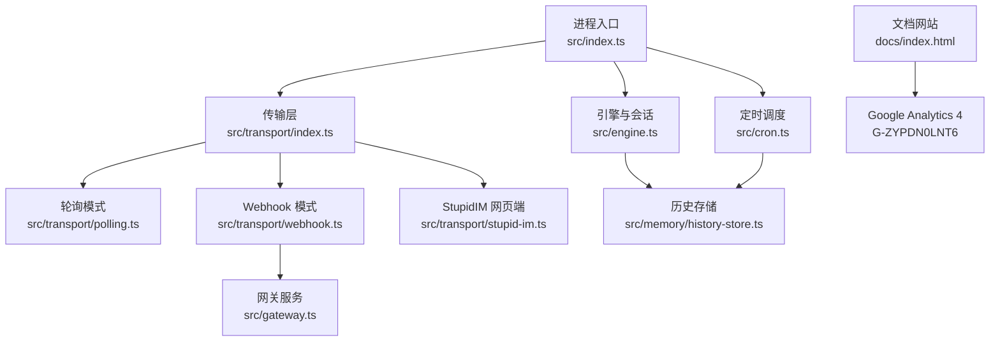
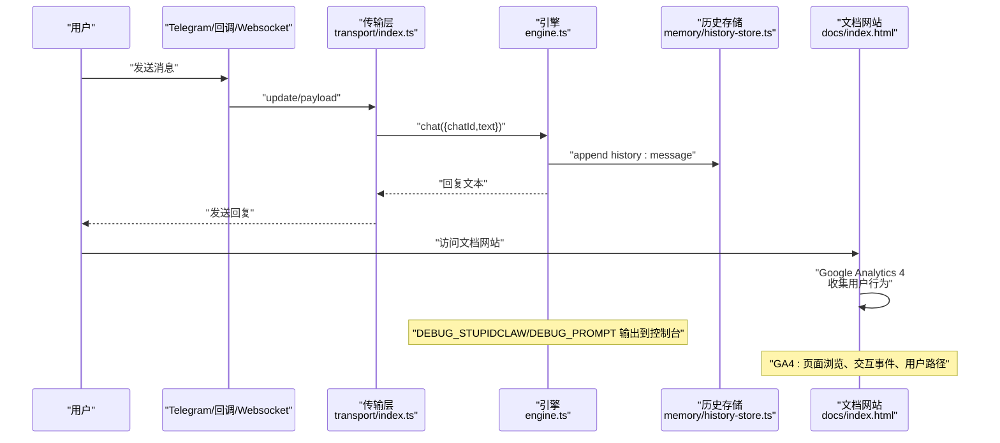
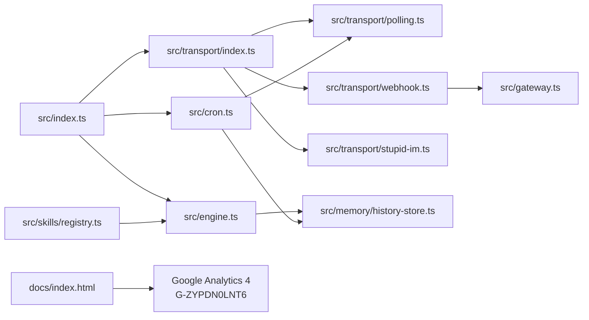

# 监控与日志

<cite>
**本文引用的文件**   
- [src/index.ts](file://src/index.ts)
- [src/engine.ts](file://src/engine.ts)
- [src/transport/index.ts](file://src/transport/index.ts)
- [src/transport/polling.ts](file://src/transport/polling.ts)
- [src/transport/webhook.ts](file://src/transport/webhook.ts)
- [src/transport/stupid-im.ts](file://src/transport/stupid-im.ts)
- [src/gateway.ts](file://src/gateway.ts)
- [src/cron.ts](file://src/cron.ts)
- [src/memory/history-store.ts](file://src/memory/history-store.ts)
- [src/skills/registry.ts](file://src/skills/registry.ts)
- [package.json](file://package.json)
- [README.md](file://README.md)
- [docs/troubleshooting.md](file://docs/troubleshooting.md)
- [docs/index.html](file://docs/index.html)
</cite>

## 更新摘要
**变更内容**   
- 新增用户行为分析章节，介绍Google Analytics 4集成对监控系统的增强作用
- 更新日志记录机制，补充文档网站用户交互数据的收集与分析
- 增强实时监控方案，加入用户行为指标监控
- 更新故障排查指南，包含Google Analytics相关的诊断方法

## 目录
1. [简介](#简介)
2. [项目结构](#项目结构)
3. [核心组件](#核心组件)
4. [架构总览](#架构总览)
5. [详细组件分析](#详细组件分析)
6. [依赖关系分析](#依赖关系分析)
7. [性能考量](#性能考量)
8. [故障排查指南](#故障排查指南)
9. [结论](#结论)
10. [附录](#附录)

## 简介
本指南面向 StupidClaw 的运维与开发团队，系统性介绍其日志记录机制、实时监控方案、问题诊断与性能分析方法，并给出日志轮转与存储空间管理的运维建议及告警配置思路。StupidClaw 采用"文件系统 + 环境变量"的极简设计，日志与历史数据均落盘至运行时目录，便于离线分析与审计。**新增**：文档网站集成Google Analytics 4，为监控系统提供额外的用户行为分析能力，增强对用户交互模式的洞察。

## 项目结构
- 运行时根目录：.stupidClaw（由入口脚本创建），包含：
  - profile.md：长期记忆
  - cron_jobs.json：定时任务配置
  - history/YYYY-MM-DD.jsonl：消息与工具调用历史（JSONL）
- 进程日志：标准输出/标准错误（控制台），用于运行态观测与排障
- 配置来源：.env（可通过命令行 --config 指定）
- **新增**：文档网站日志：Google Analytics 4跟踪代码，收集用户行为数据

**图表来源**
- [src/index.ts:112-216](file://src/index.ts#L112-L216)
- [src/transport/index.ts:47-71](file://src/transport/index.ts#L47-L71)
- [src/transport/polling.ts:52-89](file://src/transport/polling.ts#L52-L89)
- [src/transport/webhook.ts:41-86](file://src/transport/webhook.ts#L41-L86)
- [src/transport/stupid-im.ts:24-105](file://src/transport/stupid-im.ts#L24-L105)
- [src/engine.ts:680-706](file://src/engine.ts#L680-L706)
- [src/memory/history-store.ts:37-42](file://src/memory/history-store.ts#L37-L42)
- [src/cron.ts:251-265](file://src/cron.ts#L251-L265)
- [src/gateway.ts:27-79](file://src/gateway.ts#L27-L79)
- [docs/index.html:971-979](file://docs/index.html#L971-L979)

**章节来源**
- [README.md:22-52](file://README.md#L22-L52)
- [src/index.ts:42-43](file://src/index.ts#L42-L43)
- [docs/index.html:971-979](file://docs/index.html#L971-L979)

## 核心组件
- 进程入口与生命周期
  - 单实例锁文件：.stupidClaw/polling.lock，避免重复启动
  - 信号钩子：SIGINT/SIGTERM 清理锁文件并优雅退出
  - 初始化与配置加载：支持 --config 指定 .env 路径
- 引擎与日志
  - 调试开关：DEBUG_STUPIDCLAW、DEBUG_PROMPT 控制引擎与提示词调试输出
  - 历史事件：统一写入 history/YYYY-MM-DD.jsonl，包含 message/tool_call/tool_result
- 传输层
  - 轮询模式：周期拉取 Telegram 更新，异常时重试
  - Webhook 模式：注册回调、校验密钥、HTTP 网关接收推送
  - StupidIM：WebSocket + 内置 HTTP 服务，支持网页端对话
- 定时调度
  - 15 秒周期扫描任务，命中后写入历史并发送通知
- **新增**：文档网站分析
  - Google Analytics 4：收集用户访问行为、页面浏览、交互事件等数据

**章节来源**
- [src/index.ts:45-84](file://src/index.ts#L45-L84)
- [src/engine.ts:59-73](file://src/engine.ts#L59-L73)
- [src/engine.ts:680-706](file://src/engine.ts#L680-L706)
- [src/transport/index.ts:47-71](file://src/transport/index.ts#L47-L71)
- [src/transport/webhook.ts:41-86](file://src/transport/webhook.ts#L41-L86)
- [src/transport/stupid-im.ts:24-105](file://src/transport/stupid-im.ts#L24-L105)
- [src/cron.ts:251-265](file://src/cron.ts#L251-L265)
- [docs/index.html:971-979](file://docs/index.html#L971-L979)

## 架构总览
下图展示消息从 Telegram/Webhook/StupidIM 到引擎与历史存储的关键流转，以及日志输出位置。**更新**：新增文档网站用户行为分析流程。

**图表来源**
- [src/transport/index.ts:47-71](file://src/transport/index.ts#L47-L71)
- [src/engine.ts:680-706](file://src/engine.ts#L680-L706)
- [src/memory/history-store.ts:37-42](file://src/memory/history-store.ts#L37-L42)
- [docs/index.html:971-979](file://docs/index.html#L971-L979)

## 详细组件分析

### 日志记录机制与格式规范
- 日志输出位置
  - 控制台：标准输出/标准错误，用于运行态观测与排障
  - 文件：.stupidClaw/history/YYYY-MM-DD.jsonl，按天切分
  - **新增**：文档网站：Google Analytics 4 收集用户行为数据
- 日志级别与开关
  - 调试引擎：DEBUG_STUPIDCLAW=1
  - 调试提示词：DEBUG_PROMPT=1
  - 传输层与调度器：使用统一的控制台输出风格
- 日志格式
  - 时间戳：history 事件字段 ts（ISO 8601）
  - 结构化事件：message/tool_call/tool_result，便于解析与统计
  - 控制台日志：统一前缀，如 [ok]/[error]/[cron]/[boot] 等
  - **新增**：GA4 数据：页面浏览、用户会话、交互事件、用户属性

**章节来源**
- [src/engine.ts:59-73](file://src/engine.ts#L59-L73)
- [src/engine.ts:680-706](file://src/engine.ts#L680-L706)
- [src/memory/history-store.ts:8-18](file://src/memory/history-store.ts#L8-L18)
- [src/memory/history-store.ts:37-42](file://src/memory/history-store.ts#L37-L42)
- [src/transport/index.ts:24-44](file://src/transport/index.ts#L24-L44)
- [src/cron.ts:224-246](file://src/cron.ts#L224-L246)
- [docs/index.html:971-979](file://docs/index.html#L971-L979)

### 实时监控方案
- 消息处理统计
  - 指标：每日消息总数、平均响应时长（可结合历史事件与业务埋点）
  - 数据来源：history/YYYY-MM-DD.jsonl 中 type=message 的事件计数
- 模型调用次数
  - 指标：按工具名聚合 tool_call 次数
  - 数据来源：history/YYYY-MM-DD.jsonl 中 type=tool_call 的事件
- 错误率监控
  - 指标：tool_result isError=true 的比例
  - 数据来源：history/YYYY-MM-DD.jsonl 中 type=tool_result 的事件
- 传输层健康
  - 指标：Telegram 轮询/发送成功率、Webhook 回调状态
  - 数据来源：控制台输出中的 [error] 与 [warn] 日志
- 定时任务健康
  - 指标：任务触发次数、失败次数、平均耗时
  - 数据来源：控制台 [cron] 输出与 history 中 tool_call/tool_result
- **新增**：用户行为监控
  - 指标：页面浏览量、用户会话时长、功能使用率、文档访问路径
  - 数据来源：Google Analytics 4（GA4）收集的用户交互数据
  - 配置：G-ZYPDN0LNT6 测量 ID

**章节来源**
- [src/memory/history-store.ts:8-18](file://src/memory/history-store.ts#L8-L18)
- [src/cron.ts:224-246](file://src/cron.ts#L224-L246)
- [src/transport/polling.ts:39-43](file://src/transport/polling.ts#L39-L43)
- [docs/index.html:971-979](file://docs/index.html#L971-L979)

### 问题诊断与性能分析
- 启动与锁冲突
  - 现象：提示"另一个轮询实例已在运行"
  - 处理：删除 .stupidClaw/polling.lock 后重启
- API Key 与模型选择
  - 现象：无回复或回显输入
  - 处理：开启 DEBUG_STUPIDCLAW 查看 selectedProvider/selectedModelId
- Telegram 409 冲突
  - 现象：轮询报错 HTTP 409
  - 处理：确保仅一个轮询实例，必要时 deleteWebhook
- Webhook 收不到消息
  - 现象：回调未触发
  - 处理：核对 TELEGRAM_WEBHOOK_URL、证书、端口与 getWebhookInfo 返回
- Cron 未触发
  - 现象：未按计划执行
  - 处理：检查 cron_jobs.json、cronExpr、DEBUG_STUPIDCLAW 输出与历史文件
- **新增**：文档网站诊断
  - GA4 配置检查：验证测量 ID G-ZYPDN0LNT6 是否正确加载
  - 用户行为分析：通过 GA4 控制台查看页面浏览、用户会话、交互事件
  - 数据准确性：确认跟踪代码未被广告拦截器阻止

**章节来源**
- [docs/troubleshooting.md:17-30](file://docs/troubleshooting.md#L17-L30)
- [docs/troubleshooting.md:47-50](file://docs/troubleshooting.md#L47-L50)
- [docs/troubleshooting.md:53-85](file://docs/troubleshooting.md#L53-L85)
- [docs/troubleshooting.md:88-113](file://docs/troubleshooting.md#L88-L113)
- [docs/troubleshooting.md:116-144](file://docs/troubleshooting.md#L116-L144)
- [docs/index.html:971-979](file://docs/index.html#L971-L979)

### 日志轮转与存储空间管理
- 历史文件按日切分，天然具备轮转特性
- 建议策略
  - 保留策略：按业务需要保留 N 天（如 30 天），到期删除
  - 压缩归档：对历史文件进行压缩归档，降低磁盘占用
  - 监控配额：设置磁盘使用阈值告警，提前清理
  - 备份：定期备份 .stupidClaw/profile.md 与关键历史文件
- 运维脚本建议
  - 定时任务：清理过期历史文件、检查磁盘使用
  - 备份脚本：周期性复制 .stupidClaw 下重要文件
- **新增**：文档网站数据分析
  - GA4 数据保留：根据隐私政策设置数据保留期限
  - 用户数据保护：确保符合 GDPR 等隐私法规要求

**章节来源**
- [src/memory/history-store.ts:22-31](file://src/memory/history-store.ts#L22-L31)
- [README.md:46-51](file://README.md#L46-L51)
- [docs/index.html:971-979](file://docs/index.html#L971-L979)

### 监控告警配置建议
- 告警维度
  - 传输层：轮询/发送失败率、Webhook 回调失败、409 冲突
  - 引擎：模型调用失败率、API Key 未配置导致的降级
  - 定时任务：触发失败率、重复触发（分钟粒度去重）
  - 存储：历史文件增长速率、磁盘使用率
  - **新增**：用户行为：文档网站访问量异常、用户会话质量下降
- 告警阈值示例
  - 失败率 > 5% 持续 5 分钟
  - 历史文件新增字节数 < 期望值的 10% 持续 1 小时（可能停止工作）
  - **新增**：文档网站：页面浏览量骤降 30%、用户会话时长异常缩短
- 告警通道
  - 邮件/IM 通知，结合日志定位与自动化修复（如重启轮询实例）
  - **新增**：GA4 数据异常告警，通过 Google Cloud Monitoring 集成

**章节来源**
- [src/cron.ts:251-265](file://src/cron.ts#L251-L265)
- [src/transport/polling.ts:39-43](file://src/transport/polling.ts#L39-L43)
- [src/transport/webhook.ts:41-86](file://src/transport/webhook.ts#L41-L86)
- [docs/index.html:971-979](file://docs/index.html#L971-L979)

### 日志分析工具使用方法
- JSONL 解析
  - 使用 jq 或 Python 脚本按日期筛选与聚合
  - 示例：统计某日 tool_call 数量、失败比例
- 可视化
  - 将历史事件导入可视化平台（如 Grafana + Loki/InfluxDB）
  - 关键图表：消息趋势、工具调用分布、错误率曲线
- 审计与合规
  - 通过历史文件进行行为审计，确保仅在 .stupidClaw 沙盒内操作
- **新增**：用户行为分析
  - GA4 数据导出：通过 Google Analytics API 导出用户行为数据
  - 用户画像分析：基于页面浏览、功能使用构建用户画像
  - 转化漏斗分析：分析从文档访问到实际使用的转化路径

**章节来源**
- [src/memory/history-store.ts:50-82](file://src/memory/history-store.ts#L50-L82)
- [docs/index.html:971-979](file://docs/index.html#L971-L979)

## 依赖关系分析
- 组件耦合
  - engine.ts 依赖 history-store.ts 写入历史
  - transport/* 依赖 gateway.ts（Webhook 模式）
  - cron.ts 依赖 transport/polling.ts 与 history-store.ts
  - skills/registry.ts 为引擎注入工具集
- 外部依赖
  - Telegram API、HTTP/WebSocket 服务、文件系统
  - **新增**：Google Analytics 4 服务，用于用户行为分析
- **更新**：文档网站依赖
  - GA4 SDK：gtag.js
  - Google Analytics 4：G-ZYPDN0LNT6 测量 ID

**图表来源**
- [src/index.ts:112-216](file://src/index.ts#L112-L216)
- [src/transport/index.ts:47-71](file://src/transport/index.ts#L47-L71)
- [src/transport/webhook.ts:41-86](file://src/transport/webhook.ts#L41-L86)
- [src/transport/stupid-im.ts:24-105](file://src/transport/stupid-im.ts#L24-L105)
- [src/engine.ts:680-706](file://src/engine.ts#L680-L706)
- [src/memory/history-store.ts:37-42](file://src/memory/history-store.ts#L37-L42)
- [src/cron.ts:251-265](file://src/cron.ts#L251-L265)
- [src/skills/registry.ts:23-55](file://src/skills/registry.ts#L23-L55)
- [docs/index.html:971-979](file://docs/index.html#L971-L979)

## 性能考量
- 轮询与 Webhook
  - 轮询：简单可靠，CPU 占用低，延迟略高
  - Webhook：低延迟，需公网与证书，资源占用略高
- 历史写入
  - JSONL 追加写入，I/O 负载可控；建议定期清理与归档
- 调试日志
  - DEBUG_STUPIDCLAW/DEBUG_PROMPT 会显著增加输出，生产环境建议关闭
- **新增**：GA4 性能影响
  - 轻量级跟踪：gtag.js 轻量级，对页面性能影响最小
  - 异步加载：跟踪代码异步加载，不影响页面渲染
  - 数据处理：GA4 在服务器端处理数据，客户端仅发送轻量级事件

**章节来源**
- [src/transport/index.ts:47-71](file://src/transport/index.ts#L47-L71)
- [src/engine.ts:59-73](file://src/engine.ts#L59-L73)
- [docs/index.html:971-979](file://docs/index.html#L971-L979)

## 故障排查指南
- 启动即崩溃
  - 缺少 TELEGRAM_BOT_TOKEN 或重复启动
- 轮询冲突（409）
  - 多实例或 Webhook 未清除
- Webhook 收不到消息
  - 校验公网地址、证书、端口与 getWebhookInfo
- Cron 未触发
  - 检查任务配置、表达式与时区
- 技能调用失败
  - 确认技能注册与参数、路径越界
- **新增**：文档网站问题
  - GA4 未加载：检查网络连接和广告拦截器设置
  - 数据不准确：验证测量 ID 配置和跟踪代码版本
  - 用户行为异常：通过 GA4 控制台检查数据流状态

**章节来源**
- [docs/troubleshooting.md:5-50](file://docs/troubleshooting.md#L5-L50)
- [docs/troubleshooting.md:53-144](file://docs/troubleshooting.md#L53-L144)
- [docs/index.html:971-979](file://docs/index.html#L971-L979)

## 结论
StupidClaw 的日志与监控体系以"文件落盘 + 控制台输出"为核心，配合历史事件的结构化存储，能够满足日常运维与问题诊断需求。**更新**：新增的 Google Analytics 4 集成为监控系统提供了强大的用户行为分析能力，使我们能够更好地理解用户如何与文档网站交互，优化用户体验。通过合理的轮转与告警策略，以及用户行为数据的综合分析，可在保证可观测性的前提下，维持较低的运维成本。

## 附录
- 环境变量速查
  - STUPID_MODEL、TELEGRAM_BOT_TOKEN、各供应商 API Key、TELEGRAM_MODE、TELEGRAM_WEBHOOK_URL、TELEGRAM_WEBHOOK_SECRET、PORT、STUPID_IM_TOKEN、DEBUG_STUPIDCLAW、DEBUG_PROMPT
- 命令参考
  - npx stupid-claw、pnpm dev、pnpm test、pnpm typecheck
- **新增**：GA4 配置信息
  - 测量 ID：G-ZYPDN0LNT6
  - 跟踪代码：gtag.js
  - 集成方式：异步加载，页面底部嵌入

**章节来源**
- [docs/troubleshooting.md:171-194](file://docs/troubleshooting.md#L171-L194)
- [package.json:14-22](file://package.json#L14-L22)
- [docs/index.html:971-979](file://docs/index.html#L971-L979)