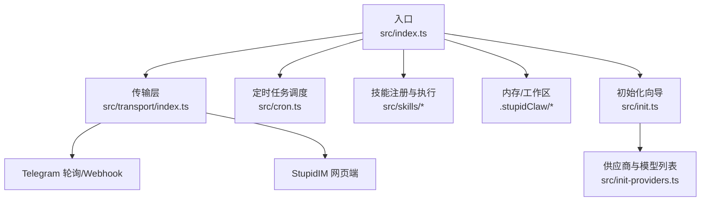
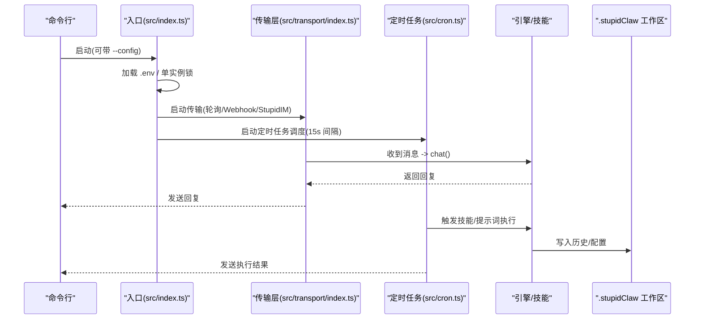
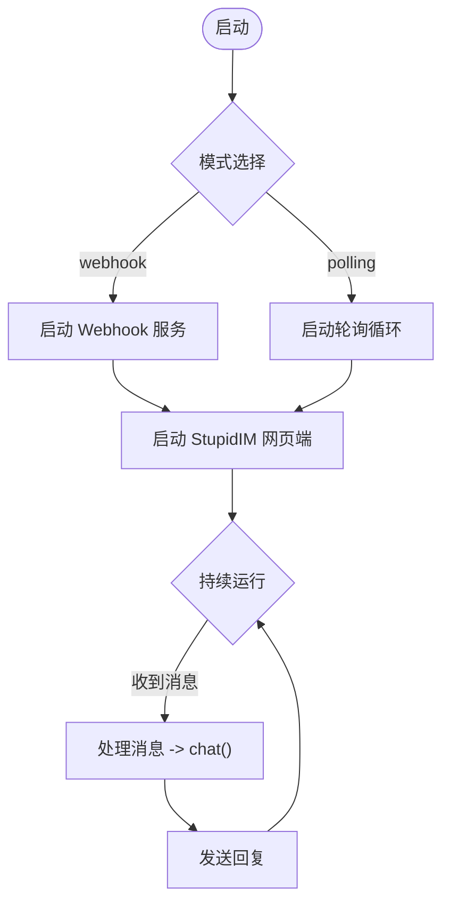
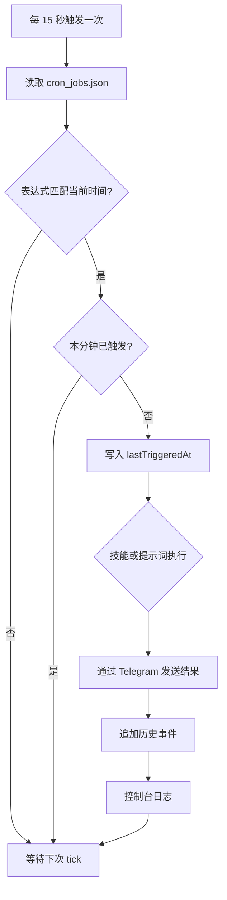
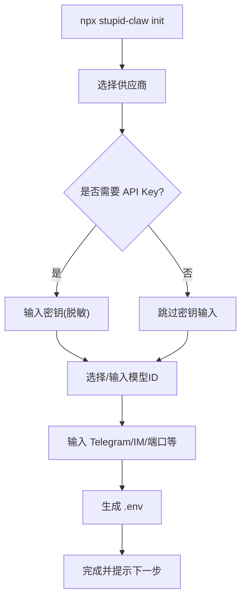
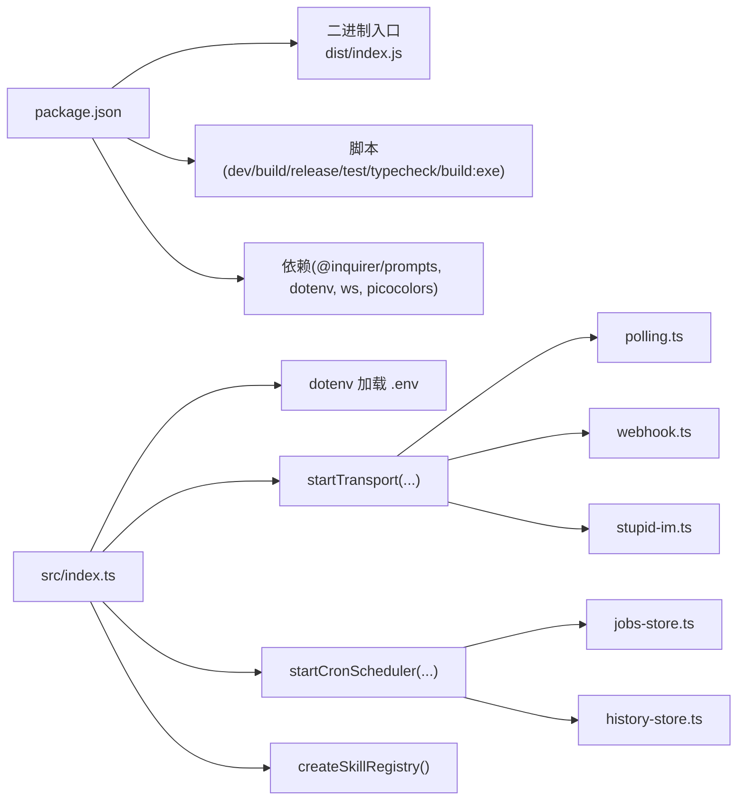

# 部署与运维

<cite>
**本文引用的文件**
- [package.json](file://package.json)
- [install.sh](file://install.sh)
- [README.md](file://README.md)
- [src/index.ts](file://src/index.ts)
- [src/init.ts](file://src/init.ts)
- [src/init-providers.ts](file://src/init-providers.ts)
- [src/transport/index.ts](file://src/transport/index.ts)
- [src/cron.ts](file://src/cron.ts)
- [tsconfig.json](file://tsconfig.json)
- [scripts/watch-resources.sh](file://scripts/watch-resources.sh)
- [docs/getting-started.md](file://docs/getting-started.md)
- [docs/troubleshooting.md](file://docs/troubleshooting.md)
- [docs/models.md](file://docs/models.md)
</cite>

## 目录
1. [简介](#简介)
2. [项目结构](#项目结构)
3. [核心组件](#核心组件)
4. [架构总览](#架构总览)
5. [详细组件分析](#详细组件分析)
6. [依赖关系分析](#依赖关系分析)
7. [性能考量](#性能考量)
8. [故障排查指南](#故障排查指南)
9. [结论](#结论)
10. [附录](#附录)

## 简介
本指南面向系统管理员与运维工程师，提供 StupidClaw 的部署与运维全栈方案。内容涵盖多种部署方式（npx 快速部署、源码安装部署、打包为独立可执行文件）、环境配置（Node.js 版本、依赖安装、环境变量）、传输层与定时任务机制、监控与日志管理、故障排查、最佳实践（备份、升级、性能优化）以及资源管理与服务监控方法。

## 项目结构
StupidClaw 采用模块化组织，入口位于 src/index.ts，核心能力包括：
- 传输层：支持 Telegram 轮询与 Webhook，以及内置网页端 IM（StupidIM）
- 定时任务：基于标准 cron 表达式的计划任务调度
- 配置初始化：交互式初始化 .env，支持多种供应商与模型
- 工作区与沙盒：受限于 .stupidClaw 目录进行文件读写

**图表来源**
- [src/index.ts:112-216](file://src/index.ts#L112-L216)
- [src/transport/index.ts:47-71](file://src/transport/index.ts#L47-L71)
- [src/cron.ts:251-265](file://src/cron.ts#L251-L265)
- [src/init.ts:224-339](file://src/init.ts#L224-L339)
- [src/init-providers.ts:23-180](file://src/init-providers.ts#L23-L180)

**章节来源**
- [README.md:22-52](file://README.md#L22-L52)
- [src/index.ts:112-216](file://src/index.ts#L112-L216)
- [src/transport/index.ts:47-71](file://src/transport/index.ts#L47-L71)
- [src/cron.ts:251-265](file://src/cron.ts#L251-L265)
- [src/init.ts:224-339](file://src/init.ts#L224-L339)
- [src/init-providers.ts:23-180](file://src/init-providers.ts#L23-L180)

## 核心组件
- 入口与生命周期
  - 单实例锁文件机制，避免重复运行
  - 优雅退出钩子，清理锁文件
  - 加载 .env 配置，支持 --config 指定路径
- 传输层
  - 支持 polling 与 webhook 两种模式
  - StupidIM 网页端作为替代交互入口
- 定时任务
  - 标准 5 段 cron 表达式解析与分钟粒度防抖
  - 任务执行结果通过 Telegram 发送回执
- 初始化向导
  - 交互式选择供应商、模型、端口、密钥等
  - 生成 .env 并打印下一步操作提示

**章节来源**
- [src/index.ts:45-84](file://src/index.ts#L45-L84)
- [src/index.ts:112-216](file://src/index.ts#L112-L216)
- [src/transport/index.ts:47-71](file://src/transport/index.ts#L47-L71)
- [src/cron.ts:85-109](file://src/cron.ts#L85-L109)
- [src/cron.ts:171-249](file://src/cron.ts#L171-L249)
- [src/init.ts:224-339](file://src/init.ts#L224-L339)

## 架构总览
StupidClaw 的运行时由“入口 -> 传输层 -> 引擎/技能 -> 内存/工作区”构成。入口负责加载配置、单实例约束、启动传输与定时任务；传输层负责消息接收与回执；定时任务周期性触发技能或提示词执行；工作区用于持久化记忆与任务元数据。

**图表来源**
- [src/index.ts:112-216](file://src/index.ts#L112-L216)
- [src/transport/index.ts:47-71](file://src/transport/index.ts#L47-L71)
- [src/cron.ts:251-265](file://src/cron.ts#L251-L265)

## 详细组件分析

### 部署方式与环境配置

- npx 快速部署
  - 无需克隆源码，直接在任意目录运行
  - 首次运行会提示缺少配置，可通过 init 子命令生成 .env
  - 支持通过 --config 指定配置文件路径
  - 适合临时测试与快速体验

- 源码安装部署
  - 安装 Node.js（推荐 v20+）与 pnpm
  - 安装依赖后复制 .env.example 为 .env
  - 至少填写 STUPID_MODEL 与对应供应商 API Key
  - 启动后可使用 StupidIM 网页端或 Telegram Bot

- 打包为独立可执行文件（Bun）
  - 使用 pnpm run build:exe 生成 dist/stupidclaw
  - 将 .env 与可执行文件置于同一目录即可运行
  - 适合无 Node.js 环境的服务器或分发场景

- Docker 部署（建议）
  - 基于 Node.js 20+ 镜像
  - 复制构建产物与 .env 至镜像
  - 暴露端口并挂载 .stupidClaw 目录实现持久化
  - 使用 systemd 或容器编排管理生命周期与健康检查

- 环境变量配置要点
  - STUPID_MODEL：供应商:模型ID
  - TELEGRAM_BOT_TOKEN：可选，不填则仅可用 StupidIM
  - TELEGRAM_MODE：polling（默认）或 webhook
  - PORT：服务端口，默认 8080
  - STUPID_IM_TOKEN：网页端访问密钥
  - DEBUG_STUPIDCLAW / DEBUG_PROMPT：调试日志开关

**章节来源**
- [README.md:58-94](file://README.md#L58-L94)
- [docs/getting-started.md:42-153](file://docs/getting-started.md#L42-L153)
- [package.json:14-22](file://package.json#L14-L22)
- [src/index.ts:22-40](file://src/index.ts#L22-L40)
- [docs/troubleshooting.md:171-194](file://docs/troubleshooting.md#L171-L194)

### 传输层与 Webhook/Polling 机制

**图表来源**
- [src/transport/index.ts:47-71](file://src/transport/index.ts#L47-L71)

**章节来源**
- [src/transport/index.ts:19-71](file://src/transport/index.ts#L19-L71)
- [docs/troubleshooting.md:88-114](file://docs/troubleshooting.md#L88-L114)

### 定时任务调度与执行

**图表来源**
- [src/cron.ts:171-249](file://src/cron.ts#L171-L249)

**章节来源**
- [src/cron.ts:85-109](file://src/cron.ts#L85-L109)
- [src/cron.ts:171-249](file://src/cron.ts#L171-L249)

### 初始化向导与供应商配置

**图表来源**
- [src/init.ts:224-339](file://src/init.ts#L224-L339)
- [src/init-providers.ts:23-180](file://src/init-providers.ts#L23-L180)

**章节来源**
- [src/init.ts:224-339](file://src/init.ts#L224-L339)
- [src/init-providers.ts:23-180](file://src/init-providers.ts#L23-L180)
- [docs/models.md:55-230](file://docs/models.md#L55-L230)

## 依赖关系分析

**图表来源**
- [package.json:14-38](file://package.json#L14-L38)
- [src/index.ts:1-11](file://src/index.ts#L1-L11)
- [src/transport/index.ts:1-3](file://src/transport/index.ts#L1-L3)
- [src/cron.ts:1-4](file://src/cron.ts#L1-L4)

**章节来源**
- [package.json:14-38](file://package.json#L14-L38)
- [src/index.ts:1-11](file://src/index.ts#L1-L11)
- [src/transport/index.ts:1-3](file://src/transport/index.ts#L1-L3)
- [src/cron.ts:1-4](file://src/cron.ts#L1-L4)

## 性能考量
- 轮询间隔与并发
  - 定时任务调度间隔为 15 秒，避免频繁 IO 与网络请求
  - 轮询模式下，offset 增量推进，减少重复消息处理
- 资源监控
  - 使用脚本 watch-resources.sh 监控 RSS/VSZ/CPU/MEM
  - 建议在生产环境配合 systemd 或容器编排设置资源上限
- 日志与调试
  - DEBUG_STUPIDCLAW 与 DEBUG_PROMPT 可开启详细日志
  - 建议结合日志采集（如 systemd-journald、Fluent Bit）统一收集

**章节来源**
- [src/cron.ts:251-265](file://src/cron.ts#L251-L265)
- [scripts/watch-resources.sh:1-30](file://scripts/watch-resources.sh#L1-L30)
- [docs/troubleshooting.md:171-194](file://docs/troubleshooting.md#L171-L194)

## 故障排查指南
- 启动即崩溃
  - 缺少 TELEGRAM_BOT_TOKEN：复制 .env.example 生成 .env 并填写
  - 重复启动：删除 .stupidClaw/polling.lock 后重启
- Bot 无回复
  - 检查日志中是否出现 [ok] 条目；若无，检查 API Key 与余额
  - 开启 DEBUG_STUPIDCLAW 查看引擎选择的 provider/model
- Telegram Polling 409 冲突
  - 确保仅有一个轮询实例；如曾用 Webhook，先 deleteWebhook
  - 清理残留进程后重试
- Webhook 模式无效
  - 确保 TELEGRAM_WEBHOOK_URL 为公网 HTTPS 地址，证书有效
  - 校验 PORT 与实际监听一致，使用 getWebhookInfo 检查
- 定时任务未触发
  - 检查 cron_jobs.json enabled 与 cronExpr 格式
  - 确认系统时区与预期一致；查看当日 history 文件
- 技能调用失败
  - 使用 list_available_skills 确认技能注册
  - 参数需满足工具描述；文件类技能仅限 .stupidClaw 目录
- Profile 记忆丢失
  - profile.md 不在 git 追踪范围，清空 .stupidClaw 会丢失
  - 建议定期备份该文件

**章节来源**
- [docs/troubleshooting.md:5-194](file://docs/troubleshooting.md#L5-L194)
- [src/index.ts:117-120](file://src/index.ts#L117-L120)

## 结论
StupidClaw 提供轻量、可控、可扩展的本地 Agent 运行方案。通过 npx 快速体验、源码部署与打包可执行文件三种方式，结合 .env 初始化向导与完善的故障排查文档，能够满足从个人开发到生产运维的多样化需求。建议在生产环境中配合容器化、资源监控与日志采集体系，确保稳定性与可观测性。

## 附录

### 环境与依赖安装
- Node.js：推荐 v20+
- 包管理：pnpm
- 安装脚本：install.sh 会自动检测并安装 Node.js、pnpm，并初始化 .env

**章节来源**
- [install.sh:17-68](file://install.sh#L17-L68)
- [docs/getting-started.md:57-94](file://docs/getting-started.md#L57-L94)

### 配置文件模板与字段说明
- .env 字段速查：STUPID_MODEL、TELEGRAM_BOT_TOKEN、各供应商 API Key、TELEGRAM_MODE、PORT、STUPID_IM_TOKEN、DEBUG_STUPIDCLAW、DEBUG_PROMPT
- 供应商与模型：init 向导支持多家供应商与本地模型（Ollama/LM Studio/vLLM）

**章节来源**
- [docs/troubleshooting.md:171-194](file://docs/troubleshooting.md#L171-L194)
- [src/init-providers.ts:23-180](file://src/init-providers.ts#L23-L180)
- [docs/models.md:55-230](file://docs/models.md#L55-L230)