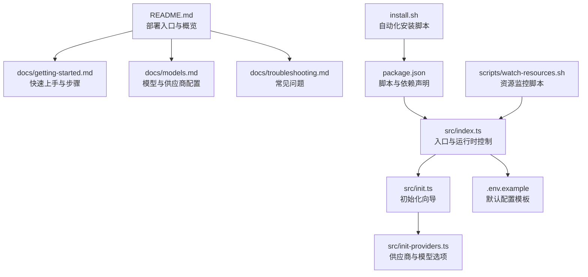
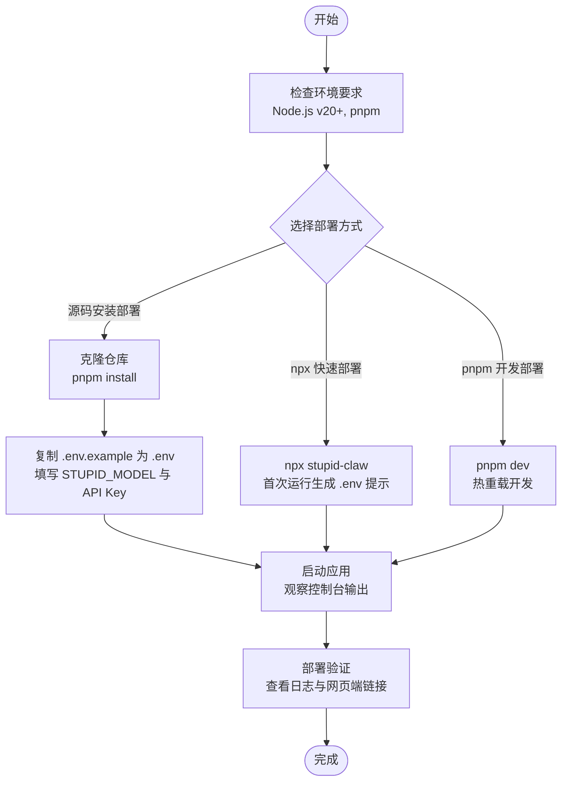
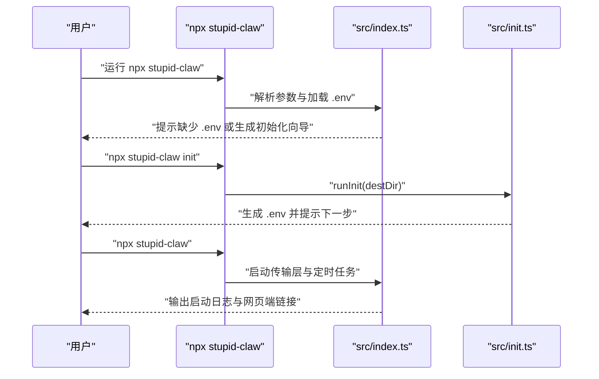
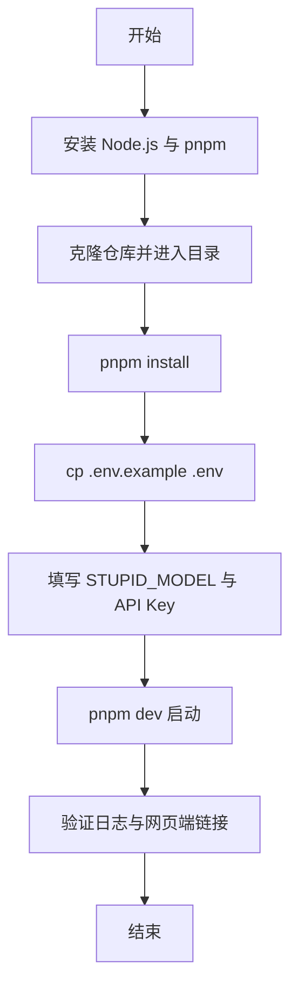
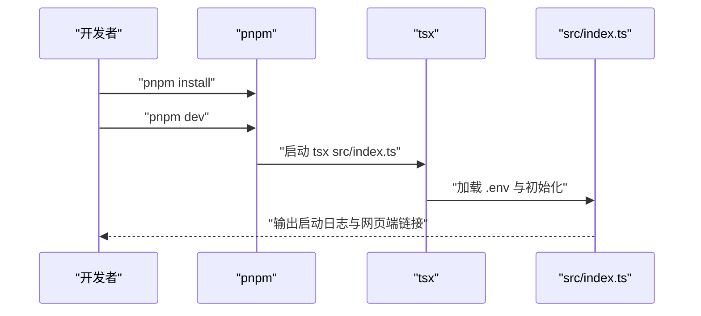
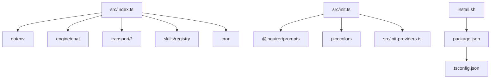

# 部署方式

<cite>
**本文引用的文件**
- [README.md](file://README.md)
- [docs/getting-started.md](file://docs/getting-started.md)
- [docs/models.md](file://docs/models.md)
- [docs/troubleshooting.md](file://docs/troubleshooting.md)
- [package.json](file://package.json)
- [install.sh](file://install.sh)
- [scripts/watch-resources.sh](file://scripts/watch-resources.sh)
- [src/index.ts](file://src/index.ts)
- [src/init.ts](file://src/init.ts)
- [src/init-providers.ts](file://src/init-providers.ts)
- [.env.example](file://.env.example)
- [tsconfig.json](file://tsconfig.json)
</cite>

## 目录
1. [简介](#简介)
2. [项目结构](#项目结构)
3. [核心组件](#核心组件)
4. [架构总览](#架构总览)
5. [详细组件分析](#详细组件分析)
6. [依赖关系分析](#依赖关系分析)
7. [性能考虑](#性能考虑)
8. [故障排查指南](#故障排查指南)
9. [结论](#结论)
10. [附录](#附录)

## 简介
本指南面向不同技术背景的用户，提供 StupidClaw 的三种主要部署方式的完整说明：npx 快速部署、源码安装部署、pnpm 开发部署。文档涵盖适用场景、优缺点、环境要求、依赖安装与验证、配置文件生成、部署验证方法以及常见问题的解决方案。

## 项目结构
StupidClaw 是一个基于 TypeScript 的极简本地 Agent 项目，采用模块化设计，核心入口为 src/index.ts，提供命令行参数解析、配置加载、单实例锁、工作空间初始化、传输层启动与技能调度等功能。项目通过 package.json 定义构建与开发脚本，支持打包为独立可执行文件。

图表来源
- [README.md:54-95](file://README.md#L54-L95)
- [docs/getting-started.md:1-153](file://docs/getting-started.md#L1-L153)
- [package.json:14-22](file://package.json#L14-L22)
- [src/index.ts:112-216](file://src/index.ts#L112-L216)
- [src/init.ts:224-339](file://src/init.ts#L224-L339)
- [src/init-providers.ts:23-180](file://src/init-providers.ts#L23-L180)
- [.env.example:1-69](file://.env.example#L1-L69)
- [install.sh:14-68](file://install.sh#L14-L68)
- [scripts/watch-resources.sh:1-30](file://scripts/watch-resources.sh#L1-L30)

章节来源
- [README.md:22-52](file://README.md#L22-L52)
- [package.json:14-22](file://package.json#L14-L22)

## 核心组件
- 入口与运行时控制：负责解析命令行参数、加载 .env、单实例锁、工作空间初始化、传输层启动、定时任务调度与消息处理。
- 初始化向导：交互式引导用户选择供应商、模型、API Key、Telegram Token、网页端密钥与端口，并生成 .env。
- 供应商与模型选项：集中管理支持的供应商、模型与自定义接口配置。
- 配置模板：提供 .env.example 作为初始配置参考。
- 构建与开发脚本：定义 dev、build、test、typecheck、build:exe 等脚本。
- 自动化安装脚本：自动检测并安装 Node.js、pnpm，安装依赖，生成 .env 并提示启动方式。

章节来源
- [src/index.ts:112-216](file://src/index.ts#L112-L216)
- [src/init.ts:224-339](file://src/init.ts#L224-L339)
- [src/init-providers.ts:23-180](file://src/init-providers.ts#L23-L180)
- [.env.example:1-69](file://.env.example#L1-L69)
- [package.json:14-22](file://package.json#L14-L22)
- [install.sh:14-68](file://install.sh#L14-L68)

## 架构总览
下图展示三种部署方式的总体流程与关键节点，帮助理解从环境准备到启动验证的全链路。

图表来源
- [README.md:58-95](file://README.md#L58-L95)
- [docs/getting-started.md:42-104](file://docs/getting-started.md#L42-L104)
- [package.json:14-22](file://package.json#L14-L22)
- [install.sh:17-68](file://install.sh#L17-L68)

## 详细组件分析

### npx 快速部署
- 适用场景
  - 无需克隆源码，快速试用或临时部署。
  - 适合仅需体验功能、不进行二次开发的用户。
- 优点
  - 零本地安装成本，跨平台通用。
  - 首次运行会提示生成 .env，便于快速上手。
- 缺点
  - 无法直接修改源码与技能。
  - 依赖网络获取最新版本。
- 关键步骤
  - 确保本地已安装 Node.js（推荐 v20+）。
  - 在任意目录运行 npx stupid-claw。
  - 首次运行会提示缺少配置，可通过 npx stupid-claw init 生成 .env 或手动创建并填写必要字段。
  - 指定配置文件运行：npx stupid-claw --config ~/my-stupid-config.env。
- 部署验证
  - 观察控制台输出，确认 StupidIM 与 Telegram 轮询启动信息。
  - 若未配置 Telegram，可通过网页端 IM 进行对话验证。

图表来源
- [README.md:58-66](file://README.md#L58-L66)
- [docs/getting-started.md:42-55](file://docs/getting-started.md#L42-L55)
- [src/index.ts:12-40](file://src/index.ts#L12-L40)
- [src/init.ts:224-339](file://src/init.ts#L224-L339)

章节来源
- [README.md:58-66](file://README.md#L58-L66)
- [docs/getting-started.md:42-55](file://docs/getting-started.md#L42-L55)
- [src/index.ts:12-40](file://src/index.ts#L12-L40)
- [src/init.ts:224-339](file://src/init.ts#L224-L339)

### 源码安装部署
- 适用场景
  - 需要修改源码、扩展技能或进行深入定制的开发者。
  - 需要稳定版本与可控依赖的生产或测试环境。
- 优点
  - 可直接编辑源码与技能，便于二次开发。
  - 依赖与版本完全可控。
- 缺点
  - 需要克隆仓库与安装依赖，初始成本较高。
- 关键步骤
  - 环境要求：Node.js（推荐 v20+）、pnpm。
  - 克隆仓库并进入目录。
  - 安装依赖：pnpm install。
  - 生成 .env：cp .env.example .env，至少填写 STUPID_MODEL 与对应供应商 API Key。
  - 启动：pnpm dev。
- 部署验证
  - 控制台输出包含 StupidIM 与 Telegram 轮询启动信息。
  - 若未配置 Telegram，可通过网页端 IM 进行对话验证。
  - 可使用 scripts/watch-resources.sh 监控进程资源占用。

图表来源
- [docs/getting-started.md:57-104](file://docs/getting-started.md#L57-L104)
- [install.sh:17-68](file://install.sh#L17-L68)
- [scripts/watch-resources.sh:7-27](file://scripts/watch-resources.sh#L7-L27)

章节来源
- [docs/getting-started.md:57-104](file://docs/getting-started.md#L57-L104)
- [install.sh:17-68](file://install.sh#L17-L68)
- [scripts/watch-resources.sh:7-27](file://scripts/watch-resources.sh#L7-L27)

### pnpm 开发部署
- 适用场景
  - 日常开发与调试，需要热重载与快速迭代。
- 优点
  - 开发体验流畅，热重载提升效率。
  - 与 TypeScript 集成良好，支持类型检查与测试。
- 缺点
  - 仅适用于开发阶段，不适合生产直接部署。
- 关键步骤
  - 安装依赖：pnpm install。
  - 生成 .env：cp .env.example .env，填写必要配置。
  - 启动：pnpm dev。
  - 调试：可设置 DEBUG_STUPIDCLAW、DEBUG_PROMPT 等环境变量。
- 部署验证
  - 观察控制台输出，确认启动成功与网页端链接。
  - 使用 scripts/watch-resources.sh 监控资源占用。

图表来源
- [package.json:14-16](file://package.json#L14-L16)
- [src/index.ts:112-216](file://src/index.ts#L112-L216)

章节来源
- [package.json:14-16](file://package.json#L14-L16)
- [src/index.ts:112-216](file://src/index.ts#L112-L216)

### 配置文件生成与验证
- .env.example 提供默认配置模板，包含模型选择、供应商密钥、Telegram 与网页端配置、调试与端口等。
- 初始化向导会根据用户选择生成 .env，覆盖常用配置项，减少手工填写错误。
- 配置验证要点
  - 至少填写 STUPID_MODEL 与对应供应商 API Key。
  - TELEGRAM_BOT_TOKEN 可选，未填写时仅能使用网页端 IM。
  - PORT 默认 8080，可按需调整。
  - 可启用 DEBUG_STUPIDCLAW 与 DEBUG_PROMPT 进行调试。

章节来源
- [.env.example:1-69](file://.env.example#L1-L69)
- [src/init.ts:184-222](file://src/init.ts#L184-L222)
- [src/init.ts:224-339](file://src/init.ts#L224-L339)

### 环境要求检查
- Node.js：推荐 v20+，自动化安装脚本会检测并提示安装。
- pnpm：自动化安装脚本会检测并全局安装 pnpm。
- TypeScript：项目使用 TypeScript，编译配置在 tsconfig.json 中定义。

章节来源
- [install.sh:17-46](file://install.sh#L17-L46)
- [tsconfig.json:1-19](file://tsconfig.json#L1-L19)

### 依赖安装验证
- 使用 pnpm install 安装项目依赖。
- 可通过 pnpm test 与 pnpm typecheck 验证测试与类型检查。
- 构建产物输出至 dist 目录，可通过 pnpm run build:exe 生成独立可执行文件。

章节来源
- [package.json:14-22](file://package.json#L14-L22)
- [install.sh:48-50](file://install.sh#L48-L50)

### 部署验证方法
- 控制台输出验证：确认 StupidIM 与 Telegram 轮询启动信息。
- 网页端 IM 验证：根据控制台输出的链接，使用浏览器连接并进行对话。
- 资源监控：使用 scripts/watch-resources.sh 监控进程资源占用。
- 打包验证：通过 pnpm run build:exe 生成独立可执行文件，放置 .env 同目录直接运行。

章节来源
- [docs/getting-started.md:105-135](file://docs/getting-started.md#L105-L135)
- [scripts/watch-resources.sh:12-27](file://scripts/watch-resources.sh#L12-L27)
- [docs/getting-started.md:138-152](file://docs/getting-started.md#L138-L152)

## 依赖关系分析
- 入口依赖：src/index.ts 依赖 dotenv 加载 .env，依赖 engine/chat、transport、skills/registry、cron 等模块。
- 初始化向导：src/init.ts 依赖 @inquirer/prompts 与 picocolors，依赖 src/init-providers.ts 提供的供应商与模型选项。
- 包管理：package.json 定义脚本与依赖，tsconfig.json 定义编译选项。
- 自动化安装：install.sh 负责环境检测与依赖安装。

图表来源
- [src/index.ts:1-11](file://src/index.ts#L1-L11)
- [src/init.ts:1-7](file://src/init.ts#L1-L7)
- [src/init-providers.ts:1-19](file://src/init-providers.ts#L1-L19)
- [package.json:14-22](file://package.json#L14-L22)
- [tsconfig.json:1-19](file://tsconfig.json#L1-L19)
- [install.sh:14-68](file://install.sh#L14-L68)

章节来源
- [src/index.ts:1-11](file://src/index.ts#L1-L11)
- [src/init.ts:1-7](file://src/init.ts#L1-L7)
- [src/init-providers.ts:1-19](file://src/init-providers.ts#L1-L19)
- [package.json:14-22](file://package.json#L14-L22)
- [tsconfig.json:1-19](file://tsconfig.json#L1-L19)
- [install.sh:14-68](file://install.sh#L14-L68)

## 性能考虑
- 资源监控：使用 scripts/watch-resources.sh 监控进程内存、CPU 占用，及时发现异常。
- 启动优化：首次运行建议使用 npx 方式快速验证，避免不必要的本地依赖安装。
- 生产部署：可使用 pnpm run build:exe 生成独立可执行文件，减少运行时依赖。

章节来源
- [scripts/watch-resources.sh:12-27](file://scripts/watch-resources.sh#L12-L27)
- [docs/getting-started.md:138-152](file://docs/getting-started.md#L138-L152)

## 故障排查指南
- 启动即崩溃
  - 缺少 TELEGRAM_BOT_TOKEN：复制 .env.example 为 .env 并填写 BotFather 给的 Token。
  - 重复启动（lock 文件残留）：删除 .stupidClaw/polling.lock 后重启。
- Bot 收到消息但无回复
  - 检查 STUPID_MODEL 对应的 API Key 是否填写且账户有余额。
  - 开启 DEBUG_STUPIDCLAW 与 DEBUG_PROMPT 查看详细日志。
- Telegram Polling 报错 HTTP 409
  - 原因：同一 Bot 同时存在多个 getUpdates 连接。
  - 解决：关闭其他实例、清除 Webhook 或查杀残留进程。
- Webhook 模式收不到消息
  - 确保 TELEGRAM_WEBHOOK_URL 为公网 HTTPS 地址，证书有效，PORT 与实际监听一致。
- Cron 定时任务未触发
  - 检查 .stupidClaw/cron_jobs.json 中 enabled 与 cronExpr 格式。
- 技能调用失败
  - 确认技能已注册，参数格式正确，文件类技能仅限操作 .stupidClaw/ 目录。
- Profile 记忆丢失
  - profile 保存在 .stupidClaw/profile.md，清空 .stupidClaw/ 目录会导致丢失。

章节来源
- [docs/troubleshooting.md:5-30](file://docs/troubleshooting.md#L5-L30)
- [docs/troubleshooting.md:33-85](file://docs/troubleshooting.md#L33-L85)
- [docs/troubleshooting.md:88-113](file://docs/troubleshooting.md#L88-L113)
- [docs/troubleshooting.md:116-144](file://docs/troubleshooting.md#L116-L144)
- [docs/troubleshooting.md:147-159](file://docs/troubleshooting.md#L147-L159)
- [docs/troubleshooting.md:161-168](file://docs/troubleshooting.md#L161-L168)

## 结论
- npx 快速部署适合快速试用与临时部署，零安装成本，首次运行即提示生成 .env。
- 源码安装部署适合需要定制与二次开发的场景，依赖与版本可控，适合生产或测试环境。
- pnpm 开发部署适合日常开发与调试，热重载与类型检查提升开发效率。
- 建议在部署前完成环境要求检查、依赖安装验证与配置文件生成，并通过控制台输出与网页端 IM 进行部署验证。

## 附录
- 模型与供应商配置参考：docs/models.md 提供完整的供应商列表、配置格式与本地模型接入方法。
- 快速上手步骤：docs/getting-started.md 提供凭证获取、初始化与启动的详细步骤。
- 常见问题：docs/troubleshooting.md 提供启动、通信、Webhook、Cron、技能与 Profile 等问题的排查方法。

章节来源
- [docs/models.md:1-281](file://docs/models.md#L1-L281)
- [docs/getting-started.md:1-153](file://docs/getting-started.md#L1-L153)
- [docs/troubleshooting.md:1-194](file://docs/troubleshooting.md#L1-L194)