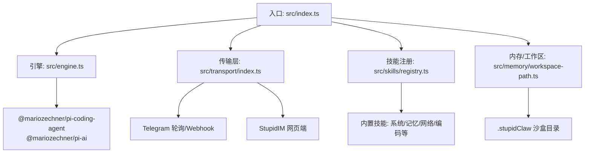
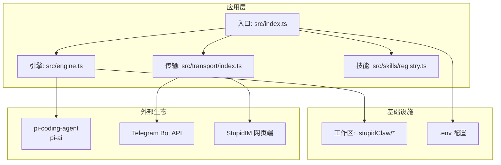
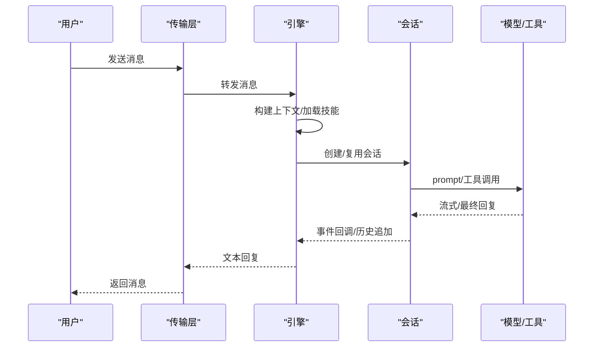
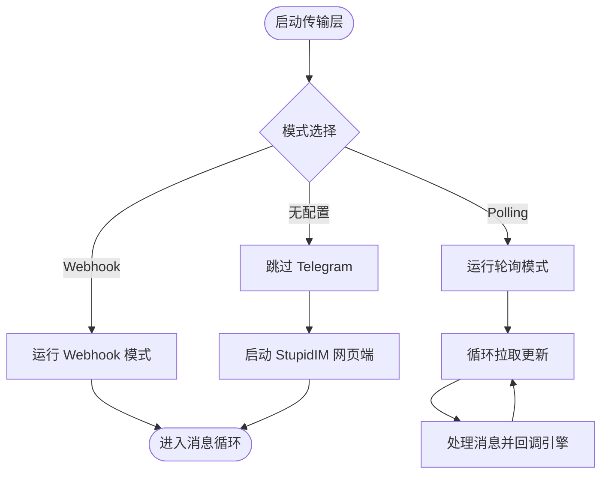
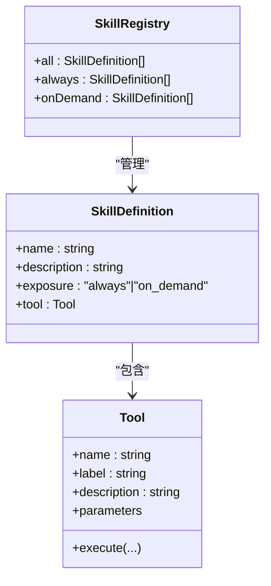
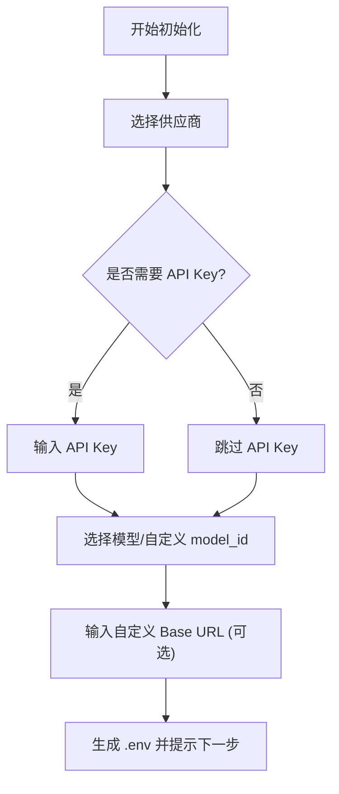
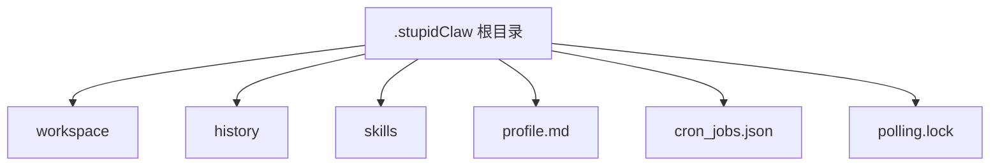
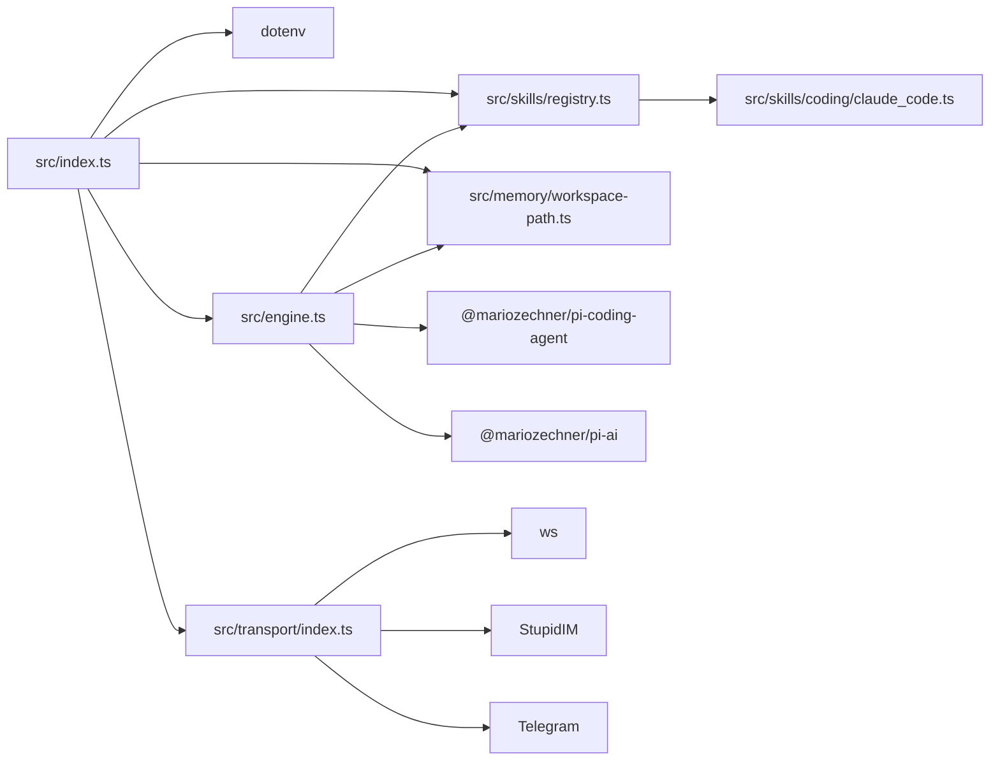

# 技术栈

<cite>
**本文引用的文件**
- [package.json](file://package.json)
- [tsconfig.json](file://tsconfig.json)
- [README.md](file://README.md)
- [src/index.ts](file://src/index.ts)
- [src/init.ts](file://src/init.ts)
- [src/engine.ts](file://src/engine.ts)
- [src/init-providers.ts](file://src/init-providers.ts)
- [src/transport/index.ts](file://src/transport/index.ts)
- [src/skills/registry.ts](file://src/skills/registry.ts)
- [src/skills/coding/claude_code.ts](file://src/skills/coding/claude_code.ts)
- [src/memory/workspace-path.ts](file://src/memory/workspace-path.ts)
- [docs/getting-started.md](file://docs/getting-started.md)
- [install.sh](file://install.sh)
</cite>

## 目录
1. [简介](#简介)
2. [项目结构](#项目结构)
3. [核心组件](#核心组件)
4. [架构总览](#架构总览)
5. [详细组件分析](#详细组件分析)
6. [依赖关系分析](#依赖关系分析)
7. [性能考量](#性能考量)
8. [故障排查指南](#故障排查指南)
9. [结论](#结论)
10. [附录](#附录)

## 简介
本技术栈文档面向 StupidClaw 项目，系统性阐述其技术选型与实现原理，重点包括：
- TypeScript 作为主要开发语言的优势与实践
- Node.js 运行时环境的选择与版本建议
- 关键依赖库 @mariozechner/pi-coding-agent 与 @mariozechner/pi-ai 的作用与意义
- 编译配置、构建工具与开发环境要求
- 技术选型原则与取舍考量
- 为开发者提供可操作的技术背景与落地建议

## 项目结构
StupidClaw 采用“功能域 + 层次化”的组织方式，核心入口位于 src/index.ts，围绕引擎、传输层、技能系统、内存与工作区管理等模块展开。项目还提供了初始化向导、文档与自动化安装脚本，便于快速上手与部署。

图表来源
- [src/index.ts:1-216](file://src/index.ts#L1-L216)
- [src/engine.ts:1-706](file://src/engine.ts#L1-L706)
- [src/transport/index.ts:1-71](file://src/transport/index.ts#L1-L71)
- [src/skills/registry.ts:1-55](file://src/skills/registry.ts#L1-L55)
- [src/memory/workspace-path.ts:1-42](file://src/memory/workspace-path.ts#L1-L42)

章节来源
- [README.md:1-95](file://README.md#L1-L95)
- [src/index.ts:1-216](file://src/index.ts#L1-L216)
- [docs/getting-started.md:1-153](file://docs/getting-started.md#L1-L153)

## 核心组件
- 入口与生命周期管理：负责解析配置、单实例锁、信号处理、初始化工作区与传输层启动。
- 引擎与会话：封装 @mariozechner/pi-coding-agent 与 @mariozechner/pi-ai，构建 Agent 会话、工具集与系统提示词，处理模型选择、鉴权与对话流。
- 传输层：统一抽象 Telegram 轮询与 Webhook，以及内置 StupidIM 网页端，屏蔽不同 IM 的差异。
- 技能系统：集中注册与暴露内置技能，支持按需披露策略，并与文件系统技能联动。
- 内存与工作区：以 .stupidClaw 为沙盒根，严格限制读写范围，保障安全与可控。

章节来源
- [src/index.ts:112-216](file://src/index.ts#L112-L216)
- [src/engine.ts:392-475](file://src/engine.ts#L392-L475)
- [src/transport/index.ts:47-71](file://src/transport/index.ts#L47-L71)
- [src/skills/registry.ts:23-55](file://src/skills/registry.ts#L23-L55)
- [src/memory/workspace-path.ts:32-42](file://src/memory/workspace-path.ts#L32-L42)

## 架构总览
StupidClaw 的整体架构围绕“极简本地 Agent”理念设计，强调：
- 以文件系统为唯一持久化介质，避免数据库与向量库的复杂性
- 以 pi-mono 生态为核心，借助 @mariozechner/pi-coding-agent 与 @mariozechner/pi-ai 实现智能体能力
- 通过传输层适配 Telegram 与 StupidIM，兼顾公网与内网场景
- 通过工作区沙盒与路径校验，确保安全隔离

图表来源
- [src/index.ts:1-216](file://src/index.ts#L1-L216)
- [src/engine.ts:1-706](file://src/engine.ts#L1-L706)
- [src/transport/index.ts:1-71](file://src/transport/index.ts#L1-L71)
- [src/skills/registry.ts:1-55](file://src/skills/registry.ts#L1-L55)
- [src/memory/workspace-path.ts:1-42](file://src/memory/workspace-path.ts#L1-L42)

## 详细组件分析

### TypeScript 与编译配置
- 语言与模块：ES2022 目标、ESNext 模块、Bundler 解析器，启用严格模式与 DOM 类型，便于在 Node 环境中进行 Web/IM 交互。
- 输出与类型：dist 目录、声明文件、SourceMap、移除注释，提升调试与分发质量。
- 开发体验：配合 tsx 与 bun，实现热重载与快速迭代。

章节来源
- [tsconfig.json:1-19](file://tsconfig.json#L1-L19)
- [package.json:14-22](file://package.json#L14-L22)

### Node.js 运行时与环境要求
- 版本建议：推荐 Node.js v20+，脚本与文档均明确要求。
- 包管理：pnpm 作为首选包管理器，提升安装效率与磁盘占用。
- 可执行打包：可选使用 bun 将入口编译为独立二进制，便于分发。

章节来源
- [docs/getting-started.md:58-67](file://docs/getting-started.md#L58-L67)
- [install.sh:36-40](file://install.sh#L36-L40)
- [package.json:21](file://package.json#L21)

### 核心依赖库与作用
- @mariozechner/pi-coding-agent：提供 Agent 会话、工具集（含代码能力）、资源加载器与会话管理，是引擎能力的核心来源。
- @mariozechner/pi-ai：提供类型系统与工具参数校验能力，支撑技能参数定义与执行。
- dotenv：加载 .env 配置，统一密钥与参数管理。
- ws：WebSocket 支持，用于 StupidIM 网页端通信。
- @inquirer/prompts：交互式初始化向导，简化配置流程。
- picocolors：终端彩色输出，改善可观测性。

章节来源
- [package.json:30-37](file://package.json#L30-L37)
- [src/engine.ts:1-17](file://src/engine.ts#L1-L17)
- [src/skills/coding/claude_code.ts:1-4](file://src/skills/coding/claude_code.ts#L1-L4)

### 引擎与会话管理
- 模型选择：支持多种供应商与模型，具备兜底策略与错误归一化，便于在不同环境间切换。
- 工具与技能：结合内置技能与文件系统技能，形成可扩展的能力矩阵。
- 事件订阅：对会话事件进行订阅，记录工具调用与结果，便于调试与审计。
- 上下文构建：整合 profile、时间戳、聊天标识与用户消息，形成稳定的对话上下文。

图表来源
- [src/engine.ts:484-509](file://src/engine.ts#L484-L509)
- [src/engine.ts:511-607](file://src/engine.ts#L511-L607)
- [src/transport/index.ts:19-45](file://src/transport/index.ts#L19-L45)

章节来源
- [src/engine.ts:196-244](file://src/engine.ts#L196-L244)
- [src/engine.ts:422-459](file://src/engine.ts#L422-L459)
- [src/engine.ts:680-705](file://src/engine.ts#L680-L705)

### 传输层与 IM 适配
- 轮询模式：周期性拉取 Telegram 更新，适用于无公网或受限网络环境。
- Webhook 模式：接收外部推送，降低延迟与轮询开销。
- StupidIM：内置网页端 IM，通过 WebSocket 与前端页面交互，便于无梯子或快速验证。

图表来源
- [src/transport/index.ts:47-71](file://src/transport/index.ts#L47-L71)
- [src/transport/index.ts:19-45](file://src/transport/index.ts#L19-L45)

章节来源
- [src/transport/index.ts:1-71](file://src/transport/index.ts#L1-L71)

### 技能系统与按需披露
- 注册中心：集中创建与分类技能，区分 always 与 on-demand，减少不必要的暴露。
- 内置能力：系统时间查询、历史检索/更新、天气查询、网络搜索、代码能力等。
- 文件系统技能：与资源加载器联动，形成“文件即工具”的能力边界。

图表来源
- [src/skills/registry.ts:13-55](file://src/skills/registry.ts#L13-L55)

章节来源
- [src/skills/registry.ts:23-55](file://src/skills/registry.ts#L23-L55)

### 初始化向导与供应商适配
- 交互式配置：通过 @inquirer/prompts 与 picocolors，引导用户选择供应商、模型与基础配置。
- 供应商映射：内置 PROVIDERS 列表，覆盖多家国内外供应商，支持本地模型与自定义兼容接口。
- 错误提示：针对 API Key 缺失与模型不匹配给出明确指引。

图表来源
- [src/init.ts:224-339](file://src/init.ts#L224-L339)
- [src/init-providers.ts:23-180](file://src/init-providers.ts#L23-L180)

章节来源
- [src/init.ts:1-339](file://src/init.ts#L1-L339)
- [src/init-providers.ts:1-180](file://src/init-providers.ts#L1-L180)

### 工作区与安全沙盒
- 沙盒根：.stupidClaw 作为工作区根目录，所有读写限定在此范围内。
- 路径校验：禁止绝对路径、路径穿越与空路径，确保安全隔离。
- 目录约定：自动创建 workspace、history、skills 等子目录，支撑长期记忆与工具执行。

图表来源
- [src/memory/workspace-path.ts:32-42](file://src/memory/workspace-path.ts#L32-L42)

章节来源
- [src/memory/workspace-path.ts:1-42](file://src/memory/workspace-path.ts#L1-L42)

### 代码能力与 Claude Code 集成
- 能力定义：通过 @mariozechner/pi-ai 的 Type 系统定义参数，保证类型安全与可执行性。
- 执行机制：调用本地安装的 claude CLI，支持超时与缓冲区限制，捕获错误并返回结构化输出。
- 权限与安全：使用危险跳过权限标志与无会话持久化，结合工作区沙盒，降低风险。

章节来源
- [src/skills/coding/claude_code.ts:1-99](file://src/skills/coding/claude_code.ts#L1-L99)

## 依赖关系分析
- 入口依赖：dotenv、engine、transport、skills、memory、cron。
- 引擎依赖：pi-coding-agent、pi-ai、技能与文件系统工具、资源加载器。
- 传输层依赖：Telegram 轮询/回调与 StupidIM。
- 技能系统依赖：各类技能工厂函数与文件系统元数据。
- 工作区依赖：路径校验与目录创建。

图表来源
- [src/index.ts:1-11](file://src/index.ts#L1-L11)
- [src/engine.ts:1-17](file://src/engine.ts#L1-L17)
- [src/transport/index.ts:1-3](file://src/transport/index.ts#L1-L3)
- [src/skills/registry.ts:1-11](file://src/skills/registry.ts#L1-L11)
- [src/skills/coding/claude_code.ts:1-4](file://src/skills/coding/claude_code.ts#L1-L4)

章节来源
- [src/index.ts:1-216](file://src/index.ts#L1-L216)
- [src/engine.ts:1-706](file://src/engine.ts#L1-L706)
- [src/transport/index.ts:1-71](file://src/transport/index.ts#L1-L71)
- [src/skills/registry.ts:1-55](file://src/skills/registry.ts#L1-L55)
- [src/skills/coding/claude_code.ts:1-99](file://src/skills/coding/claude_code.ts#L1-L99)

## 性能考量
- 模型选择与兜底：在配置缺失或不可用时自动回退，减少失败率与等待时间。
- 会话复用：按 chatId 复用会话，降低初始化成本。
- 流式输出：优先使用流式增量，减少首字节延迟。
- 资源加载：通过资源加载器按需加载，避免冗余资源。
- 传输优化：Webhook 模式相较轮询显著降低轮询开销；StupidIM 适合内网或无公网场景。

章节来源
- [src/engine.ts:461-475](file://src/engine.ts#L461-L475)
- [src/engine.ts:511-590](file://src/engine.ts#L511-L590)
- [src/transport/index.ts:61-69](file://src/transport/index.ts#L61-L69)

## 故障排查指南
- 缺少 .env 或密钥：入口会提示初始化与配置项，参考初始化向导与文档。
- API Key 错误：引擎对常见错误进行归一化，提示检查密钥与模型拼写。
- Telegram 无法连接：检查 TELEGRAM_BOT_TOKEN 与模式（polling/webhook），确认网络可达性。
- Claude Code 未安装：根据技能返回提示安装本地 CLI。
- 工作区权限问题：确保 .stupidClaw 目录可读写，避免路径穿越与绝对路径。

章节来源
- [src/index.ts:28-40](file://src/index.ts#L28-L40)
- [src/engine.ts:162-186](file://src/engine.ts#L162-L186)
- [src/skills/coding/claude_code.ts:61-82](file://src/skills/coding/claude_code.ts#L61-L82)
- [src/memory/workspace-path.ts:6-26](file://src/memory/workspace-path.ts#L6-L26)

## 结论
StupidClaw 的技术栈以“极简、可控、可移植”为核心，通过 TypeScript + Node.js 的现代开发体验，结合 @mariozechner/pi-coding-agent 与 @mariozechner/pi-ai 的强大能力，实现了低门槛、高扩展的本地 Agent。项目在安全性、可维护性与可部署性方面做了周全设计，适合学习交流与生产级小规模应用。

## 附录
- 快速上手与配置：参考文档与安装脚本，确保 Node.js v20+、pnpm 与 .env 配置齐全。
- 自动化安装：install.sh 提供一键安装与初始化流程，适合首次部署。
- 可执行打包：使用 bun 将入口编译为独立二进制，便于分发与运行。

章节来源
- [docs/getting-started.md:1-153](file://docs/getting-started.md#L1-L153)
- [install.sh:1-68](file://install.sh#L1-L68)
- [package.json:21](file://package.json#L21)