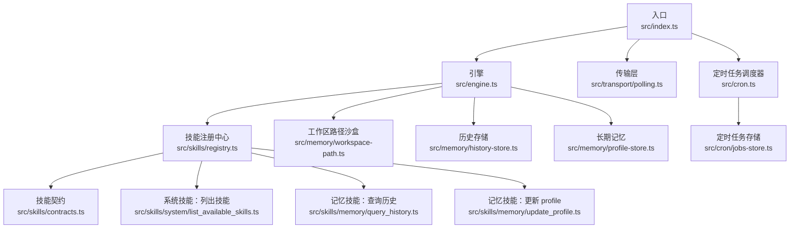
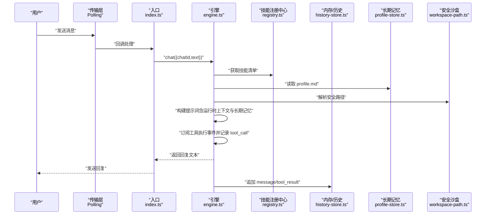
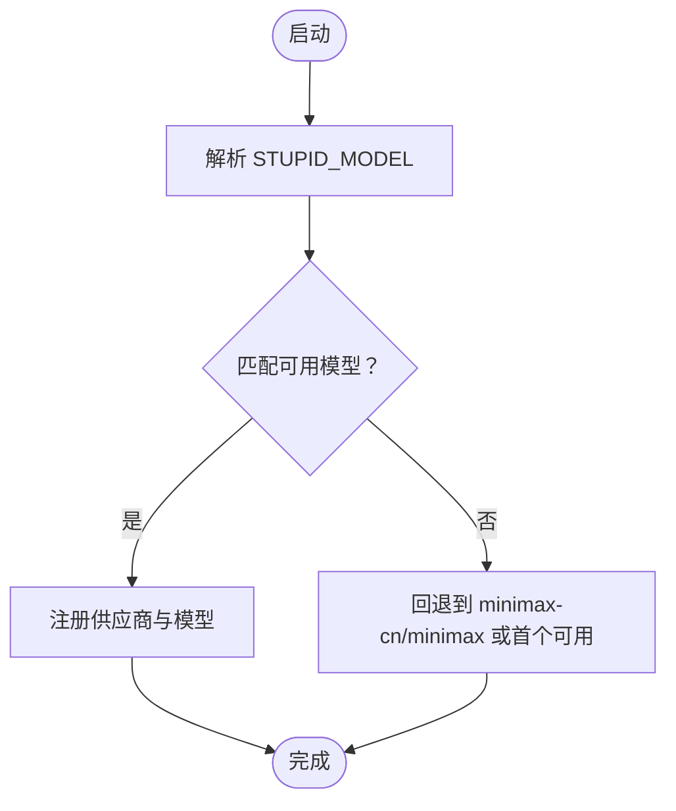
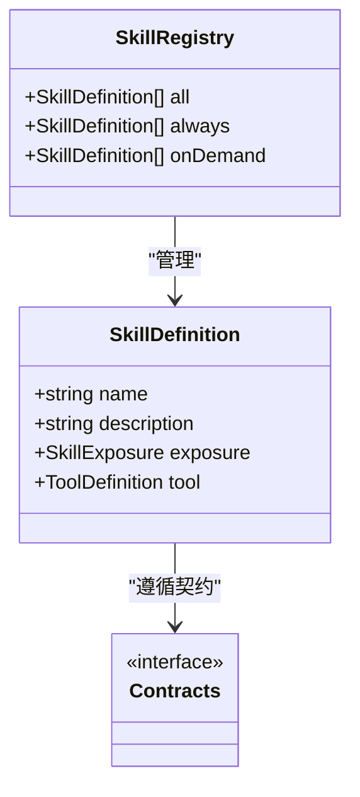
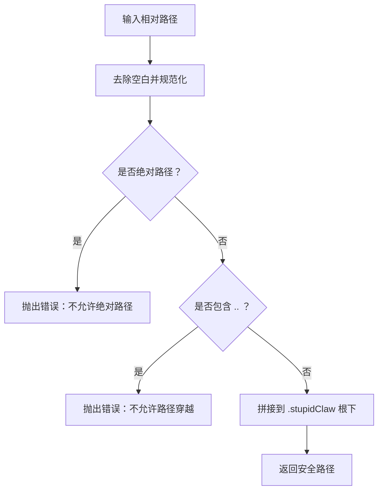
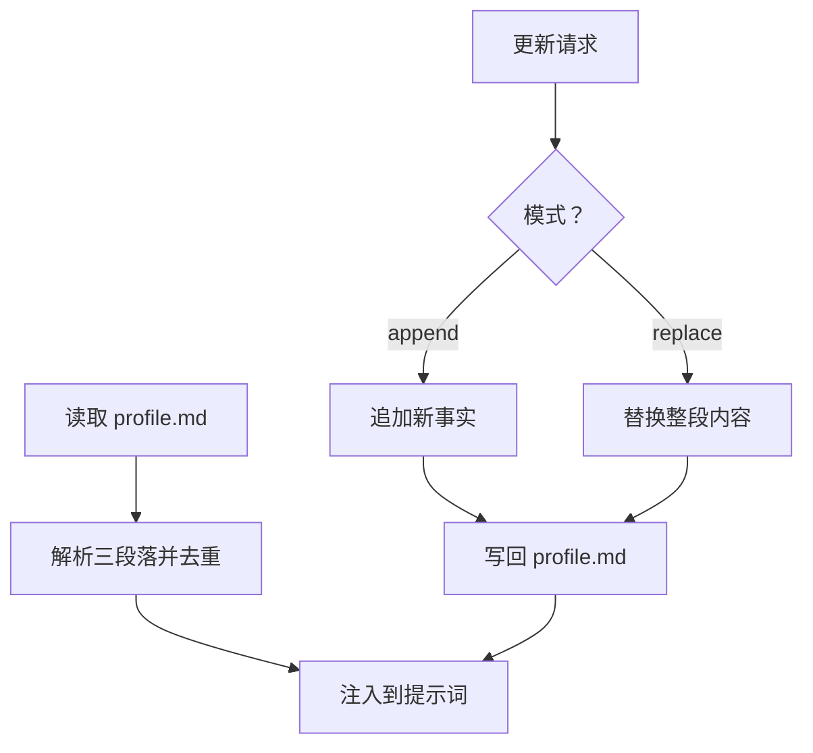
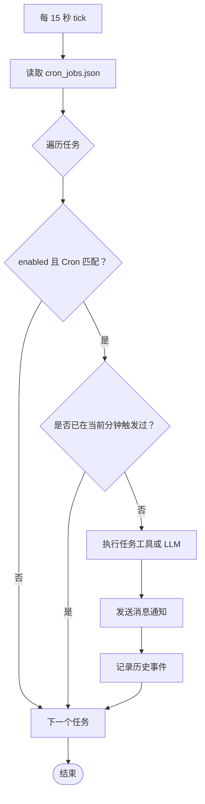
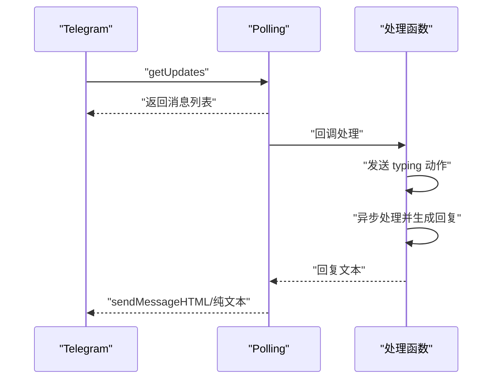
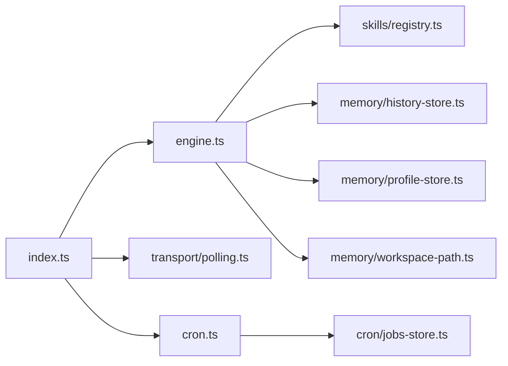

# 核心特性

<cite>
**本文引用的文件**
- [README.md](file://README.md)
- [index.ts](file://src/index.ts)
- [engine.ts](file://src/engine.ts)
- [init-providers.ts](file://src/init-providers.ts)
- [workspace-path.ts](file://src/memory/workspace-path.ts)
- [history-store.ts](file://src/memory/history-store.ts)
- [profile-store.ts](file://src/memory/profile-store.ts)
- [registry.ts](file://src/skills/registry.ts)
- [contracts.ts](file://src/skills/contracts.ts)
- [list_available_skills.ts](file://src/skills/system/list_available_skills.ts)
- [query_history.ts](file://src/skills/memory/query_history.ts)
- [update_profile.ts](file://src/skills/memory/update_profile.ts)
- [jobs-store.ts](file://src/cron/jobs-store.ts)
- [cron.ts](file://src/cron.ts)
- [polling.ts](file://src/transport/polling.ts)
</cite>

## 目录
1. [简介](#简介)
2. [项目结构](#项目结构)
3. [核心组件](#核心组件)
4. [架构总览](#架构总览)
5. [详细组件分析](#详细组件分析)
6. [依赖关系分析](#依赖关系分析)
7. [性能考量](#性能考量)
8. [故障排查指南](#故障排查指南)
9. [结论](#结论)
10. [附录](#附录)

## 简介
StupidClaw 是一个极简的本地 Agent 平台，基于 pi-mono 底座构建，强调“纯文本 + 文件系统”的安全与可控性。项目通过多模型支持（覆盖超过 15 家 AI 供应商）、渐进式技能披露机制、安全沙盒路径限制、长期记忆管理系统、定时任务功能等，形成一套完整的本地 AI Agent 解决方案。其核心理念是：严格限制在指定目录（.stupidClaw），不引入数据库与向量库，所有交互与记忆均以纯文本形式持久化，便于用户完全掌控。

- 多模型支持：覆盖 OpenAI、Anthropic、DeepSeek、Kimi、智谱、阿里 DashScope、Google Gemini、Groq、xAI、Ollama/LM Studio、OpenRouter 等多家供应商，并提供自定义兼容接口。
- 渐进式技能披露：将技能分为 always 与 on-demand 两类，先用内置 always 技能，按需再调用 on-demand 技能，降低初始复杂度与风险。
- 安全沙盒：统一解析与校验相对路径，禁止绝对路径与穿越（..），确保 AI 只能在 .stupidClaw 下读写。
- 长期记忆：以 profile.md 记录稳定事实、偏好与约束，结合历史事件（history）记录对话与工具调用，形成“稳定记忆 + 临时上下文”的双轨体系。
- 定时任务：基于标准 Cron 表达式，支持直接调用工具或走 LLM 执行，自动去重与分钟级触发，保障稳定可靠的任务执行。

章节来源
- [README.md:1-95](file://README.md#L1-L95)

## 项目结构
项目采用按功能域划分的目录组织方式，核心模块包括引擎（engine）、传输层（transport）、内存与历史（memory）、技能注册中心（skills）、定时任务（cron）等。入口文件负责初始化、单实例锁、工作区目录与传输层启动，并将外部消息交由引擎处理。

图表来源
- [index.ts:112-209](file://src/index.ts#L112-L209)
- [engine.ts:392-475](file://src/engine.ts#L392-L475)
- [polling.ts:52-89](file://src/transport/polling.ts#L52-L89)
- [cron.ts:251-264](file://src/cron.ts#L251-L264)
- [registry.ts:23-54](file://src/skills/registry.ts#L23-L54)
- [workspace-path.ts:32-41](file://src/memory/workspace-path.ts#L32-L41)
- [history-store.ts:37-42](file://src/memory/history-store.ts#L37-L42)
- [profile-store.ts:112-131](file://src/memory/profile-store.ts#L112-L131)
- [jobs-store.ts:124-142](file://src/cron/jobs-store.ts#L124-L142)

章节来源
- [README.md:22-51](file://README.md#L22-L51)
- [index.ts:112-209](file://src/index.ts#L112-L209)

## 核心组件
- 引擎（Engine）：负责模型选择、会话管理、提示词构建、工具订阅与历史记录追加。支持多供应商模型注册与兜底策略，提供调试开关与错误归一化。
- 技能注册中心（Skill Registry）：集中管理内置与文件系统技能，区分 always 与 on-demand 曝光级别，提供“列出可用技能”能力。
- 安全沙盒（Workspace Path）：统一解析与校验相对路径，禁止绝对路径与穿越，确保 AI 只能在 .stupidClaw 下读写。
- 长期记忆（Profile Store）：以 profile.md 维护稳定事实、偏好与约束，支持追加或替换模式，保证 Agent 对用户的稳定认知。
- 历史存储（History Store）：以每日 JSONL 文件记录消息、工具调用与结果，支持按 chatId 与日期查询，便于审计与回溯。
- 定时任务（Cron）：基于标准 Cron 表达式，支持直接工具调用或 LLM 执行，带分钟级去重与分钟粒度触发，保障稳定可靠的任务执行。
- 传输层（Polling/Webhook）：默认 Long Polling，适配 Telegram API，支持发送分片消息与 HTML 解析，具备错误降级与重试策略。

章节来源
- [engine.ts:392-475](file://src/engine.ts#L392-L475)
- [registry.ts:23-54](file://src/skills/registry.ts#L23-L54)
- [workspace-path.ts:32-41](file://src/memory/workspace-path.ts#L32-L41)
- [profile-store.ts:112-131](file://src/memory/profile-store.ts#L112-L131)
- [history-store.ts:37-42](file://src/memory/history-store.ts#L37-L42)
- [cron.ts:251-264](file://src/cron.ts#L251-L264)
- [polling.ts:52-89](file://src/transport/polling.ts#L52-L89)

## 架构总览
StupidClaw 的整体流程如下：入口启动后创建工作区与单实例锁，初始化技能注册中心与传输层；当收到外部消息时，引擎构建包含运行时上下文与长期记忆的提示词，调用底层 Agent 会话进行推理与工具执行；工具调用与对话结果被记录到历史；若配置了 Telegram Token，则通过轮询拉取消息并回复；同时，定时任务调度器按分钟扫描任务并触发执行，将结果通过传输层发送给用户。

图表来源
- [index.ts:189-208](file://src/index.ts#L189-L208)
- [engine.ts:484-509](file://src/engine.ts#L484-L509)
- [engine.ts:511-590](file://src/engine.ts#L511-L590)
- [engine.ts:680-705](file://src/engine.ts#L680-L705)
- [profile-store.ts:112-115](file://src/memory/profile-store.ts#L112-L115)
- [history-store.ts:37-42](file://src/memory/history-store.ts#L37-L42)
- [workspace-path.ts:32-35](file://src/memory/workspace-path.ts#L32-L35)

## 详细组件分析

### 多模型支持与供应商适配
- 模型注册：引擎在启动时创建 ModelRegistry，并根据环境变量动态注册多个供应商（含 OpenAI 兼容与 Anthropic 兼容），支持自定义 baseUrl 与模型 ID。
- 供应商映射：提供 PROVIDER_ENV_KEY_MAP 与 init-providers.ts 中的 PROVIDERS 列表，覆盖 OpenAI、Anthropic、Google、Groq、OpenRouter、xAI、DeepSeek、Kimi、DashScope、BigModel、Ollama、LM Studio 等，并支持自定义兼容接口。
- 模型选择：优先使用 STUPID_MODEL 指定的 provider:model_id，若不可用则回退到 minimax-cn 或 minimax，最终兜底到首个可用模型。
- 错误归一化：对 API Key 缺失等错误进行归一化提示，帮助用户快速定位配置问题。

图表来源
- [engine.ts:196-244](file://src/engine.ts#L196-L244)
- [engine.ts:246-383](file://src/engine.ts#L246-L383)
- [init-providers.ts:23-180](file://src/init-providers.ts#L23-L180)

章节来源
- [engine.ts:196-244](file://src/engine.ts#L196-L244)
- [engine.ts:246-383](file://src/engine.ts#L246-L383)
- [init-providers.ts:23-180](file://src/init-providers.ts#L23-L180)

### 渐进式技能披露机制
- 披露级别：技能分为 always 与 on-demand 两类。always 技能默认始终可用，on-demand 技能需用户明确调用。
- 注册与分类：技能注册中心将内置技能与文件系统技能合并，提供“列出可用技能”能力，指导用户按需调用。
- 使用场景：先使用 always 技能（如系统时间、列出技能、查询历史、更新 profile、技能创建、定时任务管理、天气查询、网络搜索、代码编写等），在需要历史或更复杂能力时再调用 on-demand 技能，降低初始复杂度与风险。

图表来源
- [registry.ts:13-54](file://src/skills/registry.ts#L13-L54)
- [contracts.ts:4-19](file://src/skills/contracts.ts#L4-L19)

章节来源
- [registry.ts:23-54](file://src/skills/registry.ts#L23-L54)
- [list_available_skills.ts:4-39](file://src/skills/system/list_available_skills.ts#L4-L39)

### 安全沙盒路径限制
- 路径规范化：拒绝绝对路径与路径穿越（..），仅允许相对路径，确保 AI 只能在 .stupidClaw 下读写。
- 目录确保：启动时自动创建 workspace、history、skills 等必要目录，避免运行时权限问题。
- 工作区根：统一通过 resolveSafePath 获取安全路径，所有文件操作均基于此根目录。

图表来源
- [workspace-path.ts:6-35](file://src/memory/workspace-path.ts#L6-L35)

章节来源
- [workspace-path.ts:6-41](file://src/memory/workspace-path.ts#L6-L41)

### 长期记忆管理系统
- profile.md 结构：包含 stable_facts（稳定事实）、preferences（偏好）、constraints（约束）三部分，支持追加或替换模式。
- 读取与更新：提供读取与更新接口，解析 Markdown 格式，去重并写回，保证数据一致性。
- 上下文注入：引擎在每轮对话中将 profile 内容注入提示词，使 Agent 能够基于长期记忆进行决策。

图表来源
- [profile-store.ts:50-101](file://src/memory/profile-store.ts#L50-L101)
- [engine.ts:484-509](file://src/engine.ts#L484-L509)

章节来源
- [profile-store.ts:112-131](file://src/memory/profile-store.ts#L112-L131)
- [engine.ts:484-509](file://src/engine.ts#L484-L509)

### 定时任务功能
- 任务存储：以 JSON 文件存储任务列表，支持启用/禁用、Cron 表达式、目标 chatId、sessionKey、requirement、skillNames/prompt/toolName/toolArgs 等字段。
- 触发机制：每 15 秒扫描一次，匹配 Cron 表达式且未在当前分钟触发过即执行；支持两种执行路径：直接调用工具（toolName）或走 LLM 执行（skillNames/prompt）。
- 结果通知：执行成功或失败都会通过传输层发送消息给用户，并记录到历史。

图表来源
- [cron.ts:171-249](file://src/cron.ts#L171-L249)
- [jobs-store.ts:124-142](file://src/cron/jobs-store.ts#L124-L142)

章节来源
- [cron.ts:1-265](file://src/cron.ts#L1-L265)
- [jobs-store.ts:4-21](file://src/cron/jobs-store.ts#L4-L21)

### 传输层与消息闭环
- 轮询模式：默认 Long Polling，适配 Telegram API，自动处理 webhook 冲突并恢复轮询。
- 消息处理：接收消息后发送 typing 动作，异步处理并在完成后回复；支持 Markdown 到 HTML 的转换与分片发送。
- 错误降级：当 HTML 解析失败时自动回退到纯文本分片发送，保证消息可达。

图表来源
- [polling.ts:52-89](file://src/transport/polling.ts#L52-L89)
- [polling.ts:215-242](file://src/transport/polling.ts#L215-L242)
- [index.ts:189-208](file://src/index.ts#L189-L208)

章节来源
- [polling.ts:52-89](file://src/transport/polling.ts#L52-L89)
- [polling.ts:215-242](file://src/transport/polling.ts#L215-L242)
- [index.ts:189-208](file://src/index.ts#L189-L208)

## 依赖关系分析
- 入口依赖：index.ts 依赖引擎、传输层、定时任务、工作区路径与技能注册中心，负责启动与消息闭环。
- 引擎依赖：engine.ts 依赖技能注册中心、历史存储、长期记忆、安全沙盒与系统提示词，负责会话与工具执行。
- 技能依赖：技能注册中心依赖各类内置技能与文件系统技能元数据，提供统一的技能暴露与分类。
- 定时任务依赖：cron.ts 依赖历史存储与传输层，jobs-store.ts 提供任务持久化。
- 传输层依赖：polling.ts 依赖 Telegram API，提供消息收发与分片处理。

图表来源
- [index.ts:112-209](file://src/index.ts#L112-L209)
- [engine.ts:392-475](file://src/engine.ts#L392-L475)
- [cron.ts:251-264](file://src/cron.ts#L251-L264)

章节来源
- [index.ts:112-209](file://src/index.ts#L112-L209)
- [engine.ts:392-475](file://src/engine.ts#L392-L475)
- [cron.ts:251-264](file://src/cron.ts#L251-L264)

## 性能考量
- 会话复用：引擎按 chatId 缓存 Agent 会话，减少重复初始化成本。
- 流式输出：订阅工具执行事件，优先使用流式 text_delta，避免重复拼接与冗余输出。
- 历史写入：历史事件采用异步追加，失败静默记录日志，不影响主流程。
- 定时任务：每 15 秒扫描一次，带分钟级去重，避免重复触发；任务执行前先写入 lastTriggeredAt，防止 LLM 调用耗时超过 tick 间隔导致重复触发。
- 传输层：消息分片与 HTML/纯文本双通道，提升消息送达率与渲染质量。

章节来源
- [engine.ts:461-475](file://src/engine.ts#L461-L475)
- [engine.ts:510-590](file://src/engine.ts#L510-L590)
- [cron.ts:171-249](file://src/cron.ts#L171-L249)
- [polling.ts:144-176](file://src/transport/polling.ts#L144-L176)

## 故障排查指南
- API Key 问题：引擎对 API Key 缺失等错误进行归一化提示，建议核对 .env 中对应供应商的密钥配置与 STUPID_MODEL 的 provider/model_id 拼写。
- Telegram Token 未配置：若未配置 TELEGRAM_BOT_TOKEN，轮询与定时任务不会启动；可通过 init 子命令或手动创建 .env 并填写必要参数。
- 路径访问异常：若出现“不允许绝对路径/路径穿越”类错误，请检查传入路径是否为相对路径且不包含 ..。
- 历史文件读取：历史按日期分片存储，若查询不到历史，确认日期与 chatId 参数是否正确，或检查文件是否存在。
- 定时任务未触发：检查 cron_jobs.json 中任务是否 enabled、Cron 表达式是否正确、是否已在当前分钟触发过。

章节来源
- [engine.ts:162-186](file://src/engine.ts#L162-L186)
- [index.ts:117-120](file://src/index.ts#L117-L120)
- [workspace-path.ts:6-26](file://src/memory/workspace-path.ts#L6-L26)
- [history-store.ts:50-82](file://src/memory/history-store.ts#L50-L82)
- [jobs-store.ts:124-142](file://src/cron/jobs-store.ts#L124-L142)

## 结论
StupidClaw 通过多模型支持、渐进式技能披露、安全沙盒、长期记忆与定时任务等核心特性，构建了一个轻量、可控、可扩展的本地 AI Agent 平台。其以文件系统为核心的数据持久化与严格的路径限制，确保了安全性与可审计性；以 always/on-demand 的技能披露策略降低了复杂度；以 profile 与历史双轨记忆体系提升了 Agent 的稳定性与连续性；以定时任务实现了自动化与主动服务能力。这些特性协同工作，形成了完整的本地 Agent 解决方案，适合希望在本地掌控 AI 能力与数据的用户与团队。

## 附录
- 快速上手与模型配置：参见官方文档与模型配置指南，了解如何申请 Token 与配置 API Key。
- 目录结构与边界：项目严格限制在 .stupidClaw 目录内，不引入数据库与向量库，消息默认通过 Telegram 轮询。

章节来源
- [README.md:9-14](file://README.md#L9-L14)
- [README.md:15-21](file://README.md#L15-L21)
- [README.md:54-95](file://README.md#L54-L95)