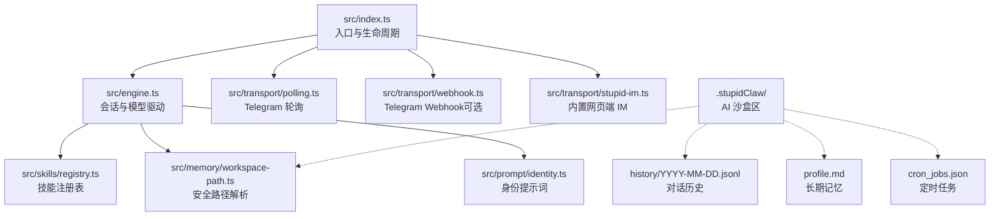
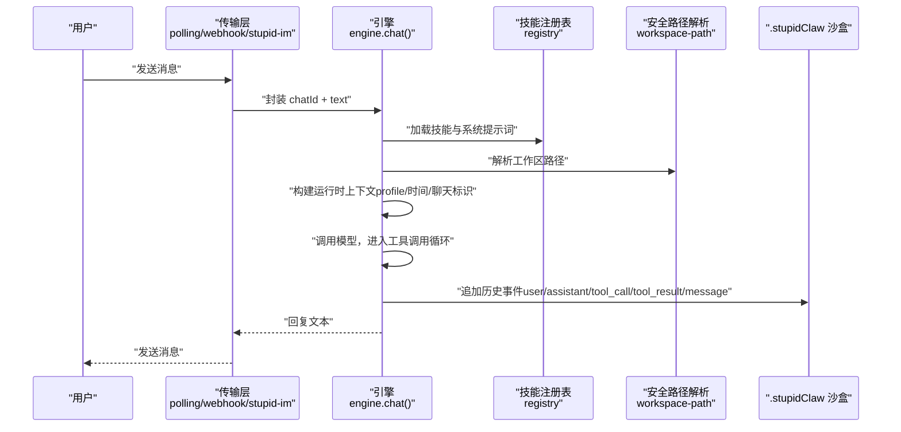
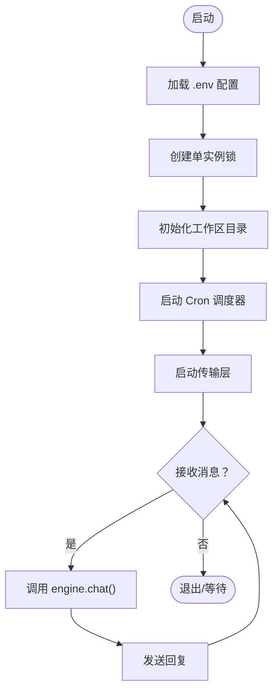
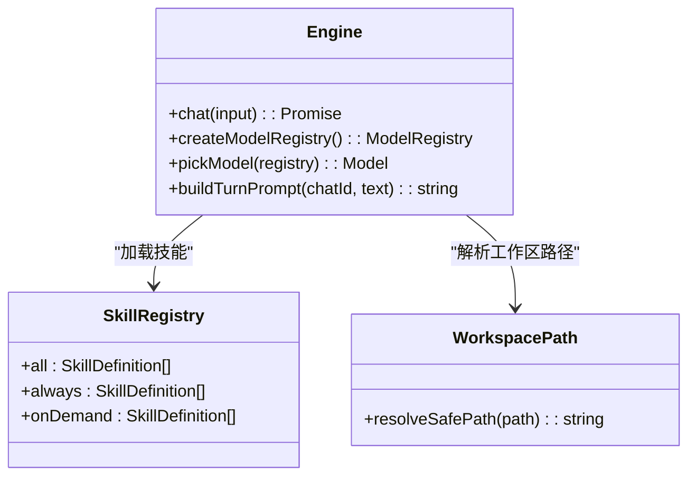
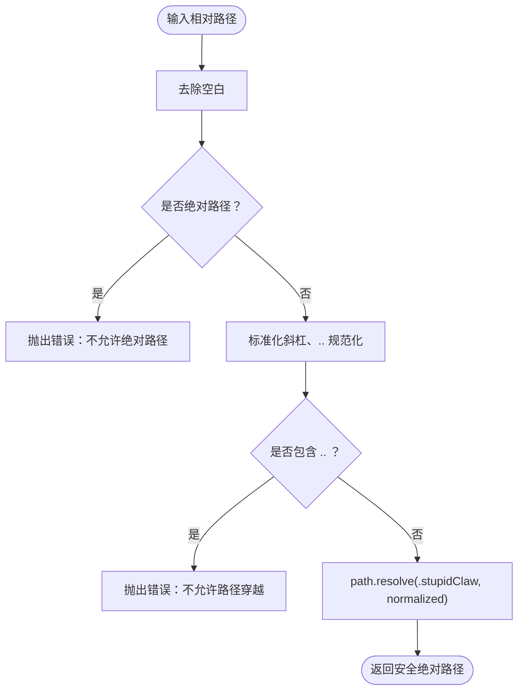
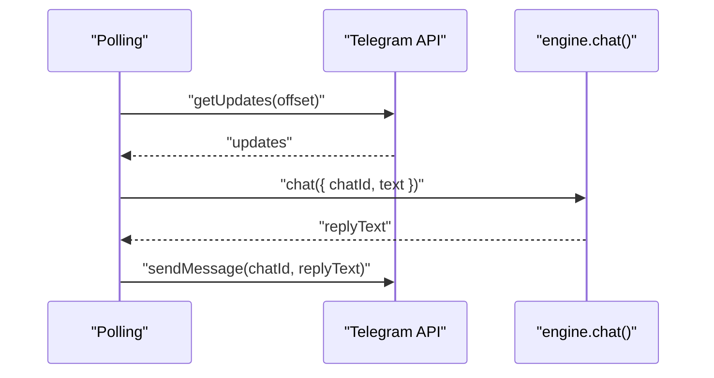
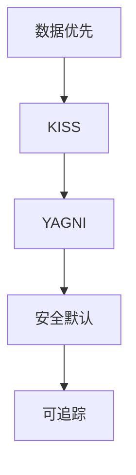
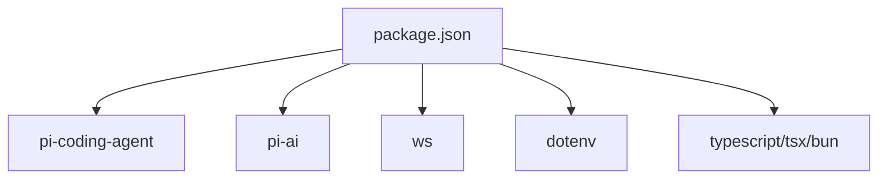

# 项目介绍

<cite>
**本文引用的文件**
- [README.md](file://README.md)
- [AGENTS.md](file://AGENTS.md)
- [USER_STORIES.md](file://USER_STORIES.md)
- [StupidClaw-详细设计文档-v3.md](file://StupidClaw-详细设计文档-v3.md)
- [StupidClaw-第1期-先用Polling跑通消息闭环.md](file://StupidClaw-第1期-先用Polling跑通消息闭环.md)
- [StupidClaw-第5期-安全沙盒PathJailing防止越权读写.md](file://StupidClaw-第5期-安全沙盒PathJailing防止越权读写.md)
- [package.json](file://package.json)
- [src/index.ts](file://src/index.ts)
- [src/engine.ts](file://src/engine.ts)
- [src/memory/workspace-path.ts](file://src/memory/workspace-path.ts)
- [src/skills/registry.ts](file://src/skills/registry.ts)
- [src/transport/polling.ts](file://src/transport/polling.ts)
- [docs/getting-started.md](file://docs/getting-started.md)
- [docs/models.md](file://docs/models.md)
- [install.sh](file://install.sh)
- [DEV_TODO.md](file://DEV_TODO.md)
</cite>

## 目录
1. [引言](#引言)
2. [项目结构](#项目结构)
3. [核心组件](#核心组件)
4. [架构总览](#架构总览)
5. [详细组件分析](#详细组件分析)
6. [依赖关系分析](#依赖关系分析)
7. [性能考量](#性能考量)
8. [故障排查指南](#故障排查指南)
9. [结论](#结论)
10. [附录](#附录)

## 引言
StupidClaw 是一个回归纯粹的极简本地 Agent，基于 pi-mono 底座设计，强调“只用文件系统、不引入数据库和向量库、严格限制在指定目录”的核心原则。项目以纯文本格式读写记忆，不依赖数据库的黑魔法，确保用户对代码与数据的完全掌控。它既是一个学习交流工具，也是一个可演进的工程骨架，通过“分期开发 + 教程同步”的方式，逐步完善消息闭环、技能系统、长期记忆、安全沙盒与定时任务等能力。

- 项目定位：极简本地 Agent，学习交流优先，工程可演进
- 设计哲学：KISS（Keep It Simple, Stupid）、YAGNI（You Aren’t Gonna Need It）、数据优先、安全默认
- 交互入口：默认 Telegram（Long Polling），可选 Webhook；同时提供内置网页端 IM（StupidIM）
- 数据边界：AI 只能读写 .stupidClaw 沙盒目录，src/ 代码区只读
- 目标用户：希望在本地可控环境下学习与实践 Agent 的开发者、学生与爱好者

**章节来源**
- [README.md:1-95](file://README.md#L1-L95)
- [StupidClaw-详细设计文档-v3.md:1-341](file://StupidClaw-详细设计文档-v3.md#L1-L341)

## 项目结构
项目采用“功能域 + 层次化”组织方式，核心目录与职责如下：
- src/：应用核心代码
  - engine.ts：基于 pi-mono 的会话与模型驱动
  - index.ts：入口与生命周期管理（单实例锁、工作区初始化、传输层启动）
  - memory/：历史与长期记忆的文件化存取
  - skills/：内置技能与技能注册表
  - transport/：消息传输层（Polling/Webhook/StupidIM）
  - prompt/：身份提示词模块
- .stupidClaw/：AI 沙盒区（运行时自动创建），包含 profile.md、cron_jobs.json、history/ 等
- public/：文档与网页端 IM
- docs/：快速上手、模型配置、故障排查等文档
- scripts/：资源监听脚本
- 根目录：安装脚本、包配置、教程文章与开发待办

**图表来源**
- [src/index.ts:1-216](file://src/index.ts#L1-L216)
- [src/engine.ts:1-706](file://src/engine.ts#L1-L706)
- [src/memory/workspace-path.ts:1-42](file://src/memory/workspace-path.ts#L1-L42)
- [src/skills/registry.ts:1-55](file://src/skills/registry.ts#L1-L55)
- [src/transport/polling.ts:1-243](file://src/transport/polling.ts#L1-L243)

**章节来源**
- [README.md:22-52](file://README.md#L22-L52)
- [StupidClaw-详细设计文档-v3.md:48-79](file://StupidClaw-详细设计文档-v3.md#L48-L79)

## 核心组件
- 入口与生命周期（src/index.ts）
  - 初始化工作区目录与单实例锁，确保进程唯一性
  - 启动 Cron 调度器与传输层，建立消息闭环
  - 提供 init 子命令与 --config 参数支持
- 会话与模型驱动（src/engine.ts）
  - 基于 @mariozechner/pi-coding-agent 的 Agent 会话
  - 动态注册多供应商模型（含本地 Ollama/LM Studio 与自定义兼容接口）
  - 构建运行时上下文（profile、时间戳、聊天标识），注入系统提示词
  - 订阅工具调用事件，追加历史日志
- 安全路径解析（src/memory/workspace-path.ts）
  - 统一安全路径解析，拒绝绝对路径、路径穿越与空路径
  - 所有文件落点收敛至 .stupidClaw，保障数据边界
- 技能注册表（src/skills/registry.ts）
  - 内置系统技能（时间查询、技能列表、历史查询、定时任务管理等）
  - 文件类技能与网络技能（搜索、天气）按需暴露
- 传输层（src/transport/polling.ts 与 webhook.ts）
  - Polling：长轮询拉取消息，自动处理 409 冲突与 webhook 清理
  - Webhook：可选增强模式，公网回调接入
  - StupidIM：内置网页端 IM，WebSocket 与 HTTP 复用同一端口

**章节来源**
- [src/index.ts:112-216](file://src/index.ts#L112-L216)
- [src/engine.ts:188-706](file://src/engine.ts#L188-L706)
- [src/memory/workspace-path.ts:32-42](file://src/memory/workspace-path.ts#L32-L42)
- [src/skills/registry.ts:23-55](file://src/skills/registry.ts#L23-L55)
- [src/transport/polling.ts:52-243](file://src/transport/polling.ts#L52-L243)

## 架构总览
StupidClaw 的整体架构围绕“消息闭环 + 文件化数据 + 安全边界”展开：
- 传输层负责接收用户消息（Telegram Polling/Webhook 或 StupidIM），并调用引擎
- 引擎负责构建上下文、选择模型、执行工具调用循环，并将结果写入历史
- 安全路径解析贯穿所有文件操作，确保 AI 只能在 .stupidClaw 沙盒内读写
- Cron 调度器在后台扫描任务，触发技能并主动推送消息

**图表来源**
- [src/index.ts:189-208](file://src/index.ts#L189-L208)
- [src/engine.ts:680-706](file://src/engine.ts#L680-L706)
- [src/skills/registry.ts:23-55](file://src/skills/registry.ts#L23-L55)
- [src/memory/workspace-path.ts:32-42](file://src/memory/workspace-path.ts#L32-L42)

**章节来源**
- [StupidClaw-详细设计文档-v3.md:219-239](file://StupidClaw-详细设计文档-v3.md#L219-L239)

## 详细组件分析

### 组件一：入口与生命周期（src/index.ts）
- 职责
  - 解析命令行参数（init 子命令、--config）
  - 单实例锁：创建 .stupidClaw/polling.lock，避免并发冲突
  - 初始化工作区目录与 Cron 调度器
  - 启动传输层（Telegram Polling/Webhook 或 StupidIM）
- 关键流程
  - acquireSingleInstanceLock() 与 releaseSingleInstanceLock() 确保进程唯一
  - ensureWorkspaceDirs() 确保 .stupidClaw 子目录存在
  - startTransport() 注册消息回调，发送 typing 状态，调用 engine.chat() 并回复

**图表来源**
- [src/index.ts:45-84](file://src/index.ts#L45-L84)
- [src/index.ts:112-216](file://src/index.ts#L112-L216)

**章节来源**
- [src/index.ts:112-216](file://src/index.ts#L112-L216)

### 组件二：引擎与模型驱动（src/engine.ts）
- 职责
  - 基于 pi-coding-agent 创建 Agent 会话，注册多供应商模型
  - 构建运行时上下文（runtime_context、profile、用户消息）
  - 订阅工具调用事件，追加历史日志
  - 输出最终回复文本，剥离思考标签
- 关键点
  - createModelRegistry() 动态注册 provider（含本地 Ollama/LM Studio 与自定义兼容接口）
  - pickModel() 支持 STUPID_MODEL=provider:model_id 格式
  - buildTurnPrompt() 注入 profile 与运行时上下文
  - chatWithPi() 订阅工具调用事件，追加 tool_call/tool_result

**图表来源**
- [src/engine.ts:188-706](file://src/engine.ts#L188-L706)
- [src/skills/registry.ts:13-55](file://src/skills/registry.ts#L13-L55)
- [src/memory/workspace-path.ts:32-42](file://src/memory/workspace-path.ts#L32-L42)

**章节来源**
- [src/engine.ts:188-706](file://src/engine.ts#L188-L706)

### 组件三：安全路径解析（src/memory/workspace-path.ts）
- 职责
  - 统一安全路径解析，拒绝绝对路径、路径穿越与空路径
  - 所有文件落点收敛至 .stupidClaw，保障数据边界
- 关键点
  - normalizeRelativePath() 校验与规范化
  - resolveSafePath() 生成最终绝对路径
  - ensureWorkspaceDirs() 启动时创建所需子目录

**图表来源**
- [src/memory/workspace-path.ts:6-35](file://src/memory/workspace-path.ts#L6-L35)

**章节来源**
- [src/memory/workspace-path.ts:1-42](file://src/memory/workspace-path.ts#L1-L42)
- [StupidClaw-第5期-安全沙盒PathJailing防止越权读写.md:53-88](file://StupidClaw-第5期-安全沙盒PathJailing防止越权读写.md#L53-L88)

### 组件四：传输层（Telegram Polling/Webhook/StupidIM）
- 职责
  - Polling：长轮询拉取消息，自动处理 409 冲突与 webhook 清理
  - Webhook：可选增强模式，公网回调接入
  - StupidIM：内置网页端 IM，WebSocket 与 HTTP 复用同一端口
- 关键点
  - getUpdates() 自动 deleteWebhook 后重试
  - sendMessage() 支持 Markdown→HTML 转换与超长消息切片
  - sendChatAction() 持续发送 typing 状态

**图表来源**
- [src/transport/polling.ts:52-243](file://src/transport/polling.ts#L52-L243)
- [src/index.ts:189-208](file://src/index.ts#L189-L208)

**章节来源**
- [src/transport/polling.ts:52-243](file://src/transport/polling.ts#L52-L243)
- [StupidClaw-第1期-先用Polling跑通消息闭环.md:70-116](file://StupidClaw-第1期-先用Polling跑通消息闭环.md#L70-L116)

### 组件五：技能系统（src/skills/registry.ts）
- 职责
  - 注册内置技能（系统时间、技能列表、历史查询、定时任务管理、网络搜索、天气、文件工具等）
  - 支持两类曝光策略：always（首轮即暴露）与 on_demand（按需暴露）
- 关键点
  - createSkillRegistry() 组合基础技能与文件技能元数据
  - list_available_skills 作为动态技能清单

**章节来源**
- [src/skills/registry.ts:23-55](file://src/skills/registry.ts#L23-L55)

### 概念总览
- 数据优先：先定义文件结构与不变量，再写业务代码
- KISS：单进程、单用户、单工作区，先跑通闭环
- YAGNI：不做“以后可能会用”的扩展点
- 安全默认：所有 AI 文件操作必须经过路径锁
- 可追踪：关键动作必须落日志与历史事件

[本图为概念性流程图，不直接映射具体源码文件，故无图表来源]

**章节来源**
- [StupidClaw-详细设计文档-v3.md:17-24](file://StupidClaw-详细设计文档-v3.md#L17-L24)

## 依赖关系分析
- 运行时依赖
  - @mariozechner/pi-coding-agent：Agent 会话与工具驱动
  - @mariozechner/pi-ai：模型注册与认证存储
  - ws：WebSocket 支持（StupidIM）
  - dotenv：环境变量加载
- 开发与构建
  - typescript、tsx、bun：开发与构建工具
  - @types/node、@types/ws：类型声明

**图表来源**
- [package.json:1-39](file://package.json#L1-L39)

**章节来源**
- [package.json:1-39](file://package.json#L1-L39)

## 性能考量
- 单实例锁：避免并发冲突，减少重复处理
- 超长消息切片：Telegram 4096 字符限制，按换行切片发送
- Markdown→HTML 转换：Telegram HTML 模式，避免 MarkdownV2 的复杂转义
- 工具调用订阅：边流式生成边追加历史，降低内存峰值
- 安全路径解析：集中校验，避免分散校验带来的误配风险

[本节为一般性指导，不直接分析具体文件]

## 故障排查指南
- 未检测到 .env 配置
  - 现象：程序可能无法正常工作
  - 处理：运行 npx stupid-claw init 或手动创建 .env 并填写必要凭证
- Telegram 409 冲突
  - 现象：getUpdates 返回 409
  - 处理：自动 deleteWebhook 后重试
- API Key 缺失或无效
  - 现象：模型调用失败
  - 处理：根据 STUPID_MODEL 提示补全对应供应商的 API Key
- 越权路径访问
  - 现象：路径被拒绝
  - 处理：确保传入相对路径且不包含 ../，所有文件落点收敛至 .stupidClaw

**章节来源**
- [src/index.ts:28-40](file://src/index.ts#L28-L40)
- [src/transport/polling.ts:21-34](file://src/transport/polling.ts#L21-L34)
- [src/engine.ts:162-186](file://src/engine.ts#L162-L186)
- [src/memory/workspace-path.ts:6-26](file://src/memory/workspace-path.ts#L6-L26)

## 结论
StupidClaw 以“极简、可控、可演进”为核心，通过文件系统承载记忆、以 pi-mono 驱动会话、以安全路径解析守护边界，构建了可学习、可交流、可扩展的本地 Agent 基座。它适合希望在本地可控环境中深入理解 Agent 工作原理与工程实践的学习者与开发者，也欢迎社区以教程文章与 PR 的形式共同完善。

[本节为总结性内容，不直接分析具体文件]

## 附录

### 快速上手与安装
- npx 极致极简运行：无需克隆代码，直接运行 npx stupid-claw
- 源码运行：安装依赖、复制 .env.example 为 .env、填写必要凭证后 pnpm dev
- 安装脚本：install.sh 自动检测 Node.js 与 pnpm，安装依赖并初始化 .env

**章节来源**
- [docs/getting-started.md:42-153](file://docs/getting-started.md#L42-L153)
- [install.sh:1-68](file://install.sh#L1-L68)

### 模型配置与供应商支持
- 支持多家云端供应商与本地模型（Ollama/LM Studio/vLLM 等）
- 通过 STUPID_MODEL=provider:model_id 选择模型
- init 向导支持交互式配置与在线探活

**章节来源**
- [docs/models.md:9-281](file://docs/models.md#L9-L281)
- [AGENTS.md:44-162](file://AGENTS.md#L44-L162)

### 用户故事与开发约定
- 用户故事覆盖 IM 抽象层、Markdown 渲染、文件浏览器、消息引用、Agent 状态可视化等
- 开发约定强调分支策略、教程与代码同步、开发待办维护

**章节来源**
- [USER_STORIES.md:7-765](file://USER_STORIES.md#L7-L765)
- [AGENTS.md:199-231](file://AGENTS.md#L199-L231)

### 教程文章与里程碑
- 分期教程文章记录每期目标与关键代码
- 里程碑涵盖消息闭环、技能系统、长期记忆、安全沙盒、定时任务、发布与工程收口等

**章节来源**
- [StupidClaw-第1期-先用Polling跑通消息闭环.md:1-174](file://StupidClaw-第1期-先用Polling跑通消息闭环.md#L1-L174)
- [StupidClaw-详细设计文档-v3.md:280-290](file://StupidClaw-详细设计文档-v3.md#L280-L290)
- [DEV_TODO.md:1-219](file://DEV_TODO.md#L1-L219)