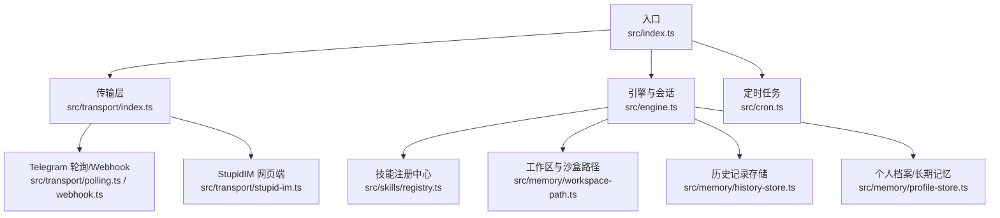
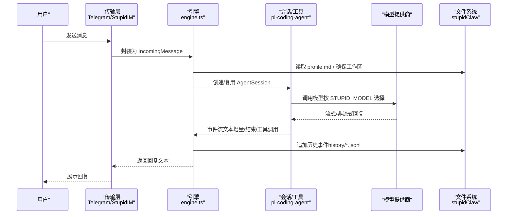
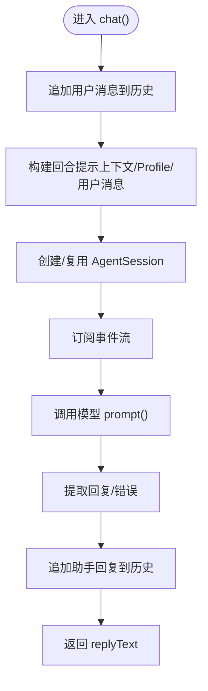
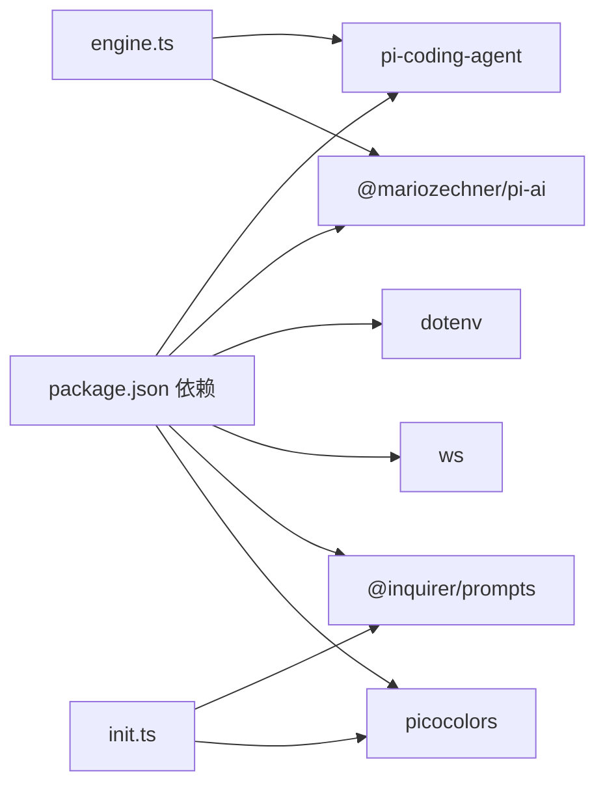

# 项目概述

<cite>
**本文引用的文件**
- [README.md](file://README.md)
- [package.json](file://package.json)
- [src/index.ts](file://src/index.ts)
- [src/engine.ts](file://src/engine.ts)
- [src/init.ts](file://src/init.ts)
- [src/memory/workspace-path.ts](file://src/memory/workspace-path.ts)
- [src/skills/registry.ts](file://src/skills/registry.ts)
- [src/transport/index.ts](file://src/transport/index.ts)
- [src/cron.ts](file://src/cron.ts)
- [src/memory/history-store.ts](file://src/memory/history-store.ts)
- [src/memory/profile-store.ts](file://src/memory/profile-store.ts)
- [src/skills/system/list_available_skills.ts](file://src/skills/system/list_available_skills.ts)
- [docs/getting-started.md](file://docs/getting-started.md)
- [docs/models.md](file://docs/models.md)
- [AGENTS.md](file://AGENTS.md)
</cite>

## 目录
1. [引言](#引言)
2. [项目结构](#项目结构)
3. [核心组件](#核心组件)
4. [架构总览](#架构总览)
5. [详细组件分析](#详细组件分析)
6. [依赖关系分析](#依赖关系分析)
7. [性能考量](#性能考量)
8. [故障排查指南](#故障排查指南)
9. [结论](#结论)
10. [附录](#附录)

## 引言
StupidClaw 是一个回归“极简”的本地 Agent，基于 pi-mono 底座设计，强调“只用文件系统、不引入数据库和向量库”，严格限制在指定目录（.stupidClaw）内进行读写，以纯文本形式管理记忆。项目通过 Telegram 或内置网页端 IM（StupidIM）与用户交互，提供多模型支持（超过15家AI供应商）、渐进式技能披露、安全沙盒机制、长期记忆管理、定时任务等能力。默认传输模式为 Long Polling，Webhook 为可选增强；Message as UI 默认为 Telegram。

## 项目结构
项目采用按功能域划分的组织方式，核心模块包括入口与控制流、引擎与模型调度、传输层（Telegram 轮询/Webhook/StupidIM）、技能系统、内存与工作区、定时任务等。

图表来源
- [src/index.ts:112-216](file://src/index.ts#L112-L216)
- [src/engine.ts:392-475](file://src/engine.ts#L392-L475)
- [src/transport/index.ts:47-71](file://src/transport/index.ts#L47-L71)
- [src/cron.ts:251-265](file://src/cron.ts#L251-L265)

章节来源
- [README.md:22-52](file://README.md#L22-L52)
- [src/index.ts:112-216](file://src/index.ts#L112-L216)
- [src/engine.ts:392-475](file://src/engine.ts#L392-L475)
- [src/transport/index.ts:47-71](file://src/transport/index.ts#L47-L71)
- [src/cron.ts:251-265](file://src/cron.ts#L251-L265)

## 核心组件
- 入口与生命周期
  - 单实例锁、优雅退出钩子、环境变量加载、工作区初始化、传输层启动、定时任务调度、消息处理主循环。
- 引擎与会话
  - 模型注册与选择、系统提示词构建、会话创建与复用、工具与技能注入、历史事件追加、错误归一化。
- 传输层
  - Telegram 轮询与 Webhook、StupidIM 网页端、消息发送与“正在输入”提示。
- 技能系统
  - 内置技能注册（系统、记忆、编码、网络、定时）、按需披露策略、技能目录查询。
- 内存与工作区
  - 沙盒路径校验与创建、历史 JSONL 记录、个人档案 Markdown。
- 定时任务
  - Cron 表达式匹配、任务去重、执行器回调、历史事件记录与通知。

章节来源
- [src/index.ts:112-216](file://src/index.ts#L112-L216)
- [src/engine.ts:392-475](file://src/engine.ts#L392-L475)
- [src/transport/index.ts:47-71](file://src/transport/index.ts#L47-L71)
- [src/skills/registry.ts:23-55](file://src/skills/registry.ts#L23-L55)
- [src/memory/workspace-path.ts:37-42](file://src/memory/workspace-path.ts#L37-L42)
- [src/memory/history-store.ts:37-83](file://src/memory/history-store.ts#L37-L83)
- [src/memory/profile-store.ts:112-132](file://src/memory/profile-store.ts#L112-L132)
- [src/cron.ts:147-249](file://src/cron.ts#L147-L249)

## 架构总览
StupidClaw 的运行时架构围绕“文件系统沙盒 + 多模型底座 + 渐进式技能披露 + 安全路径约束”展开。消息从 Telegram 或 StupidIM 进入，经传输层封装为统一消息对象，交由引擎创建或复用会话，结合系统提示词、技能与文件系统工具，调用底层模型完成推理与工具执行，期间将关键事件写入 .stupidClaw/history 与 profile，最终将结果通过相同通道返回。

图表来源
- [src/index.ts:189-208](file://src/index.ts#L189-L208)
- [src/engine.ts:484-607](file://src/engine.ts#L484-L607)
- [src/memory/history-store.ts:37-42](file://src/memory/history-store.ts#L37-L42)

章节来源
- [src/index.ts:189-208](file://src/index.ts#L189-L208)
- [src/engine.ts:484-607](file://src/engine.ts#L484-L607)
- [src/memory/history-store.ts:37-42](file://src/memory/history-store.ts#L37-L42)

## 详细组件分析

### 入口与生命周期（src/index.ts）
- 功能要点
  - 支持 init 子命令与 --config 指定 .env。
  - 单实例锁防止并发运行。
  - 环境变量加载与警告提示。
  - 初始化工作区目录与权限约束。
  - 启动定时任务调度器与传输层。
  - 主消息处理循环：发送“正在输入”、调用 chat、回复消息、日志记录。
- 关键流程
  - acquireSingleInstanceLock → ensureWorkspaceDirs → registerShutdownHooks
  - startCronScheduler → startTransport → onMessage 回调

章节来源
- [src/index.ts:16-40](file://src/index.ts#L16-L40)
- [src/index.ts:112-216](file://src/index.ts#L112-L216)

### 引擎与会话（src/engine.ts）
- 功能要点
  - 模型注册：内置与扩展供应商（OpenAI 兼容、DeepSeek、Kimi、DashScope、BigModel、Ollama/LM Studio、自定义兼容接口）。
  - 模型选择：STUPID_MODEL 解析与兜底策略。
  - 系统提示词：静态 + 文件技能提示拼接。
  - 会话管理：内存会话、工具注入（编码工具 + 自定义技能）、资源加载器。
  - 事件订阅：文本增量/结束、工具调用/结果、错误提取。
  - 历史与回退：追加历史事件、缺失时回退“收到：…”。
- 错误处理
  - API Key 归一化错误提示，帮助定位配置问题。
  - 提取最新助手消息与错误，用于兜底回复。

图表来源
- [src/engine.ts:680-706](file://src/engine.ts#L680-L706)
- [src/engine.ts:511-607](file://src/engine.ts#L511-L607)

章节来源
- [src/engine.ts:392-475](file://src/engine.ts#L392-L475)
- [src/engine.ts:484-607](file://src/engine.ts#L484-L607)
- [src/engine.ts:680-706](file://src/engine.ts#L680-L706)

### 传输层（src/transport/index.ts）
- 功能要点
  - Telegram 轮询：循环拉取消息，设置 offset，逐条处理。
  - Telegram Webhook：可选增强模式，按需启用。
  - StupidIM：内置网页端 IM，无需 Telegram 即可交互。
  - 消息封装：统一 IncomingMessage 接口，包含 chatId、text、reply、sendChatAction。
- 边界说明
  - 默认 TELEGRAM_MODE=polling；可通过环境变量切换 webhook。

章节来源
- [src/transport/index.ts:19-71](file://src/transport/index.ts#L19-L71)
- [README.md:15-21](file://README.md#L15-L21)

### 技能系统（src/skills/registry.ts）
- 功能要点
  - 内置技能：系统时间、历史查询、更新档案、技能创建、定时任务管理、网络搜索、天气查询、代码编写（Claude Code）。
  - 揭示策略：always（始终可用）、on_demand（按需调用）。
  - 技能目录：list_available_skills 输出技能清单与使用指引。
- 与引擎集成
  - 引擎在创建会话时注入 customTools 与 fileSkills，形成“按需披露”的工具集。

章节来源
- [src/skills/registry.ts:23-55](file://src/skills/registry.ts#L23-L55)
- [src/skills/system/list_available_skills.ts:4-40](file://src/skills/system/list_available_skills.ts#L4-L40)

### 内存与工作区（src/memory/*）
- 沙盒路径（workspace-path.ts）
  - 严格禁止绝对路径与 .. 路径穿越，统一相对路径规范化，限定在 .stupidClaw 根下。
- 历史记录（history-store.ts）
  - 按 UTC 日切分 JSONL 文件，支持查询与限制条数。
- 个人档案（profile-store.ts）
  - Markdown 结构化保存稳定事实、偏好与约束，支持追加/替换模式。

章节来源
- [src/memory/workspace-path.ts:6-35](file://src/memory/workspace-path.ts#L6-L35)
- [src/memory/history-store.ts:37-83](file://src/memory/history-store.ts#L37-L83)
- [src/memory/profile-store.ts:112-132](file://src/memory/profile-store.ts#L112-L132)

### 定时任务（src/cron.ts）
- 功能要点
  - Cron 表达式解析与匹配（分钟/小时/日/月/周）。
  - 任务去重：按分钟粒度避免重复触发。
  - 执行器回调：runSkill 与 runPrompt，分别对接技能或通用提示。
  - 历史事件：记录 tool_call/tool_result/message，失败时发送错误通知。
- 调度周期
  - 每 15 秒 tick 一次，保证跨任务执行时间较长时仍可稳定触发。

章节来源
- [src/cron.ts:85-109](file://src/cron.ts#L85-L109)
- [src/cron.ts:147-249](file://src/cron.ts#L147-L249)
- [src/cron.ts:251-265](file://src/cron.ts#L251-L265)

## 依赖关系分析
- 技术栈概览
  - 运行时：Node.js（ES Modules）、dotenv、ws。
  - 底座与工具：@mariozechner/pi-coding-agent、@mariozechner/pi-ai。
  - 交互：@inquirer/prompts（初始化向导）、picocolors（彩色输出）。
  - 构建与测试：tsx、bun、typescript、node --test。
- 项目边界
  - 仅使用文件系统，不引入数据库与向量库。
  - 默认 Message as UI：Telegram；默认传输：Long Polling；Webhook 可选。
  - AI 只能读写 .stupidClaw，不能触碰 src/。

图表来源
- [package.json:30-37](file://package.json#L30-L37)
- [src/engine.ts:1-17](file://src/engine.ts#L1-L17)
- [src/init.ts:4-6](file://src/init.ts#L4-L6)

章节来源
- [package.json:30-37](file://package.json#L30-L37)
- [README.md:15-21](file://README.md#L15-L21)

## 性能考量
- 会话复用：按 chatId 复用 AgentSession，减少模型初始化开销。
- 事件流处理：优先处理 text_delta，避免重复拼接 text_end 内容。
- 历史写入：异步追加 JSONL，避免阻塞主线程。
- 定时任务：15 秒间隔，兼顾实时性与稳定性；任务执行前写入 lastTriggeredAt，防止跨 tick 重复触发。
- 沙盒路径：严格的路径校验与规范化，避免 IO 异常与潜在风险。

## 故障排查指南
- 常见问题与定位
  - API Key 未配置或不匹配：引擎会归一化错误，提示检查 .env 中对应 provider 的密钥与 STUPID_MODEL 的拼写。
  - Telegram 未配置：仅能使用 StupidIM 网页端；确认 TELEGRAM_BOT_TOKEN 与 TELEGRAM_MODE。
  - 模型不可用：检查 STUPID_MODEL 与可用模型列表，或确认自定义兼容接口的 Base URL 与 API Key。
  - 路径异常：工作区路径包含 .. 或绝对路径会被拒绝；检查 resolveSafePath 的使用。
- 调试建议
  - 设置 DEBUG_STUPIDCLAW=1 与 DEBUG_PROMPT=1 查看运行时配置与完整 prompt。
  - 使用 list_available_skills 技能查看当前暴露的工具与使用说明。
  - 检查 .stupidClaw/history/<YYYY-MM-DD>.jsonl 与 profile.md 的内容与权限。

章节来源
- [src/engine.ts:162-186](file://src/engine.ts#L162-L186)
- [src/engine.ts:401-419](file://src/engine.ts#L401-L419)
- [src/memory/workspace-path.ts:6-26](file://src/memory/workspace-path.ts#L6-L26)
- [src/skills/system/list_available_skills.ts:27-32](file://src/skills/system/list_available_skills.ts#L27-L32)

## 结论
StupidClaw 以“文件系统 + 多模型 + 渐进式技能 + 沙盒路径”为核心，实现了极简而强大的本地 Agent。它通过 Telegram 与 StupidIM 提供双通道交互，借助 .stupidClaw 实现长期记忆与历史沉淀，配合定时任务与安全路径约束，满足从入门到进阶的多样化需求。项目边界清晰、可移植性强，适合学习交流与生产落地。

## 附录
- 快速上手
  - npx stupid-claw init 交互式生成 .env，随后 npx stupid-claw 启动。
  - 或源码运行：pnpm install → cp .env.example .env → 填写 STUPID_MODEL 与对应 API Key → pnpm dev。
- 模型配置
  - STUPID_MODEL=provider:model_id，支持超过15家供应商与本地模型；OpenRouter 可聚合多家模型。
- 项目边界
  - 仅文件系统、默认 Telegram 轮询、AI 仅限 .stupidClaw 目录。

章节来源
- [docs/getting-started.md:40-153](file://docs/getting-started.md#L40-L153)
- [docs/models.md:9-100](file://docs/models.md#L9-L100)
- [README.md:15-21](file://README.md#L15-L21)
- [AGENTS.md:7-11](file://AGENTS.md#L7-L11)