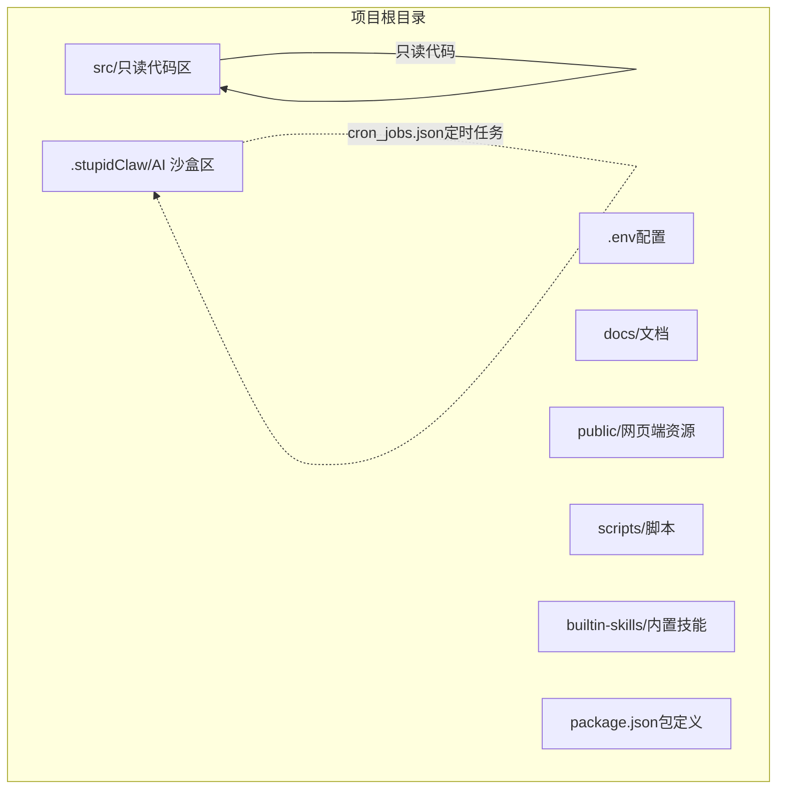
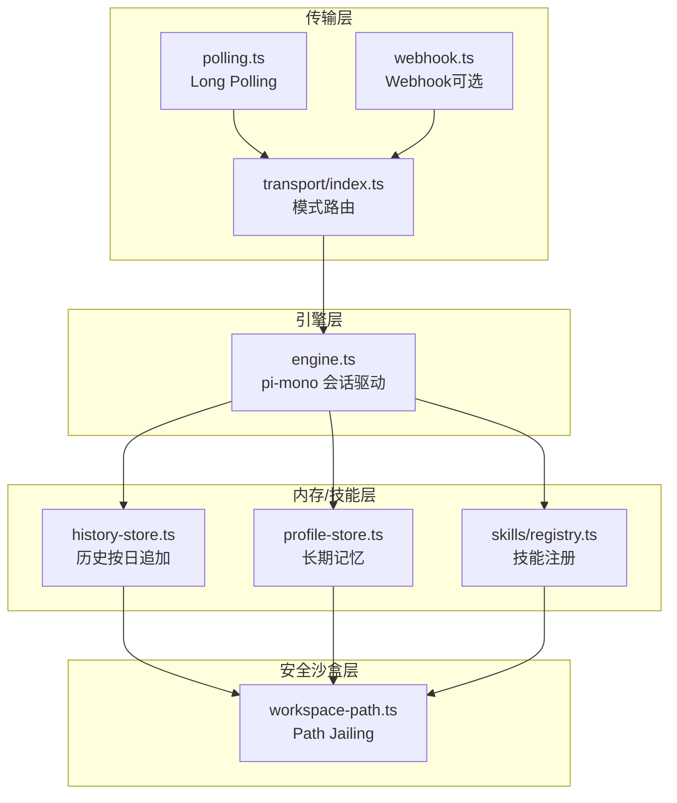
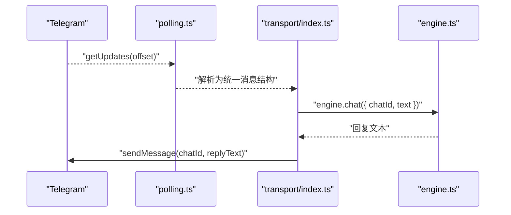
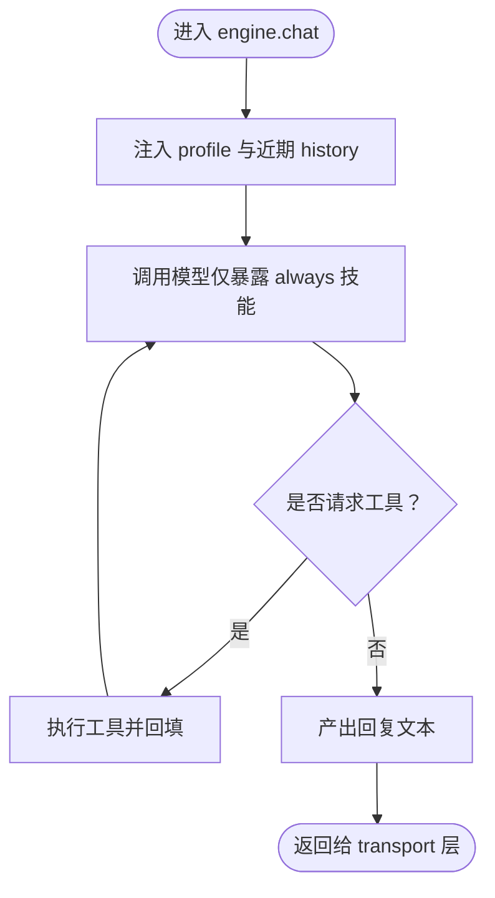
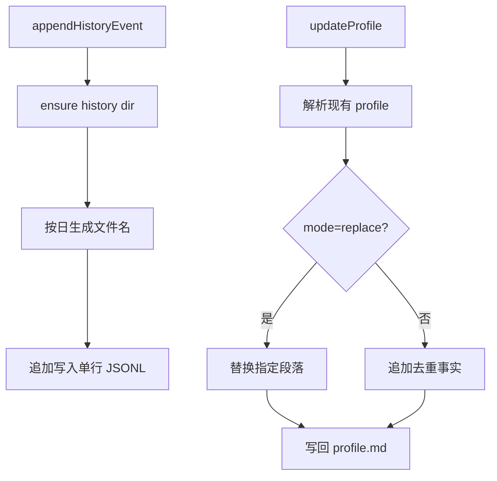
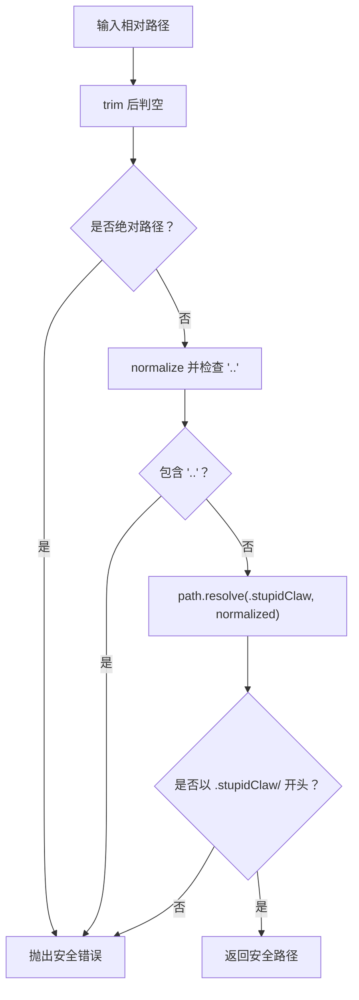
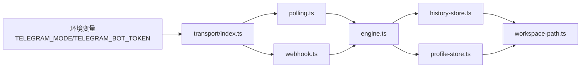

# 项目边界

<cite>
**本文引用的文件**
- [README.md](file://README.md)
- [StupidClaw-详细设计文档-v3.md](file://StupidClaw-详细设计文档-v3.md)
- [StupidClaw-第1期-先用Polling跑通消息闭环.md](file://StupidClaw-第1期-先用Polling跑通消息闭环.md)
- [StupidClaw-第5期-安全沙盒PathJailing防止越权读写.md](file://StupidClaw-第5期-安全沙盒PathJailing防止越权读写.md)
- [docs/getting-started.md](file://docs/getting-started.md)
- [src/transport/index.ts](file://src/transport/index.ts)
- [src/transport/polling.ts](file://src/transport/polling.ts)
- [src/transport/webhook.ts](file://src/transport/webhook.ts)
- [src/memory/workspace-path.ts](file://src/memory/workspace-path.ts)
- [src/memory/history-store.ts](file://src/memory/history-store.ts)
- [src/memory/profile-store.ts](file://src/memory/profile-store.ts)
- [src/init.ts](file://src/init.ts)
- [package.json](file://package.json)
</cite>

## 目录
1. [简介](#简介)
2. [项目结构](#项目结构)
3. [核心边界与约束](#核心边界与约束)
4. [架构总览](#架构总览)
5. [组件边界详解](#组件边界详解)
6. [依赖关系分析](#依赖关系分析)
7. [性能与可靠性考量](#性能与可靠性考量)
8. [故障排查与边界外行为](#故障排查与边界外行为)
9. [结论](#结论)

## 简介
本文件聚焦 StupidClaw 的“项目边界”，系统性说明设计限制与约束，帮助用户正确理解项目在哪些范围内提供功能、在哪些范围内保持极简与安全。重点涵盖：
- 技术栈边界：只用文件系统，不引入数据库与向量库
- 交互边界：默认 Message as UI 为 Telegram，传输模式默认 Long Polling，Webhook 为可选增强
- 数据边界：AI 只能读写 .stupidClaw 目录，src/ 为只读沙盒区
- 功能边界：对话闭环、技能系统、长期记忆、定时任务等在范围之内；多用户、分布式、向量检索等在范围之外

## 项目结构
StupidClaw 采用“动静分离”的目录结构，确保 AI 的读写与源码区严格隔离：
- src/：只读代码区（AI 绝对不可写）
- .stupidClaw/：AI 可读写沙盒区（必须加入 .gitignore）
- .env：运行时配置
- docs/：文档
- public/：内置网页端 IM 资源
- scripts/：资源监听脚本
- builtin-skills/：内置技能模板
- package.json：包与脚本定义

图表来源
- [StupidClaw-详细设计文档-v3.md:48-79](file://StupidClaw-详细设计文档-v3.md#L48-L79)
- [README.md:22-51](file://README.md#L22-L51)

章节来源
- [README.md:22-51](file://README.md#L22-L51)
- [StupidClaw-详细设计文档-v3.md:48-79](file://StupidClaw-详细设计文档-v3.md#L48-L79)

## 核心边界与约束
以下为项目明确的边界与约束，贯穿设计文档、实现与运行时行为：

- 技术栈边界
  - 只用文件系统，不引入数据库与向量库
  - 使用 pi-mono 作为会话内核，不重复实现复杂状态机
  - 交互入口固定为 Telegram，默认 Long Polling，Webhook 作为可选增强
  - 工具系统遵循 pi-skills 思路，支持渐进式披露
  - AI 可读写内容与源码彻底隔离（动静分离）

- 数据边界
  - AI 只能读写 .stupidClaw/，src/ 为只读
  - 历史按日 JSONL 追加写入，不原地修改
  - profile.md 为长期记忆，仅允许追加事实或覆盖指定段落，禁止整文件重写
  - cron_jobs.json 为定时任务清单，新增/更新时进行校验

- 功能边界
  - 在范围之内：Telegram 消息接入、回复、编辑（流式输出可选）、历史记录、长期记忆注入与更新、定时任务读写与执行、Cron 主动推送
  - 在范围之外：多用户隔离与账号系统、分布式调度与高可用、向量检索/RAG 索引/复杂知识库、通用权限平台与 RBAC

章节来源
- [README.md:15-21](file://README.md#L15-L21)
- [StupidClaw-详细设计文档-v3.md:7-14](file://StupidClaw-详细设计文档-v3.md#L7-L14)
- [StupidClaw-详细设计文档-v3.md:29-45](file://StupidClaw-详细设计文档-v3.md#L29-L45)

## 架构总览
StupidClaw 的边界体现在“传输层”“引擎层”“内存/技能层”“安全沙盒层”的协作中：
- 传输层：默认 Long Polling，Webhook 为可选增强；统一消息结构，屏蔽 Telegram 差异
- 引擎层：复用 pi-mono，注入 profile 与近期历史作为系统上下文，执行工具调用循环
- 内存/技能层：历史按日追加、profile 注入与更新、技能注册与按需披露
- 安全沙盒层：统一路径解析与越界拒绝，确保 .stupidClaw/ 为唯一可写区域

图表来源
- [src/transport/index.ts:1-71](file://src/transport/index.ts#L1-L71)
- [src/transport/polling.ts:1-243](file://src/transport/polling.ts#L1-L243)
- [src/transport/webhook.ts:1-86](file://src/transport/webhook.ts#L1-L86)
- [src/memory/history-store.ts:1-83](file://src/memory/history-store.ts#L1-L83)
- [src/memory/profile-store.ts:1-132](file://src/memory/profile-store.ts#L1-L132)
- [src/memory/workspace-path.ts:1-42](file://src/memory/workspace-path.ts#L1-L42)

## 组件边界详解

### 传输层：默认 Long Polling，Webhook 为可选增强
- 默认模式（推荐）：Long Polling，持续调用 Telegram getUpdates 拉取消息，适用于本机开发与个人部署，零公网依赖
- 增强模式（可选）：Webhook，通过公网 HTTPS 回调接收消息，适用于云服务器与低延迟场景
- 统一消息结构：IncomingMessage 抽象，屏蔽 Telegram 的差异，便于在两种模式下复用 engine.chat()

图表来源
- [src/transport/polling.ts:52-89](file://src/transport/polling.ts#L52-L89)
- [src/transport/index.ts:19-45](file://src/transport/index.ts#L19-L45)

章节来源
- [StupidClaw-第1期-先用Polling跑通消息闭环.md:10-16](file://StupidClaw-第1期-先用Polling跑通消息闭环.md#L10-L16)
- [StupidClaw-详细设计文档-v3.md:183-191](file://StupidClaw-详细设计文档-v3.md#L183-L191)
- [src/transport/index.ts:47-71](file://src/transport/index.ts#L47-L71)

### 引擎层：会话驱动与工具调用循环
- 职责：初始化 pi-mono 会话与模型驱动，注入 profile.md 与近期 history 作为系统上下文，执行工具调用循环（最大回合数默认 3）
- 与传输层解耦：engine.chat() 在两种传输模式下保持一致

图表来源
- [StupidClaw-详细设计文档-v3.md:174-180](file://StupidClaw-详细设计文档-v3.md#L174-L180)

章节来源
- [StupidClaw-详细设计文档-v3.md:174-180](file://StupidClaw-详细设计文档-v3.md#L174-L180)

### 内存/技能层：历史、长期记忆与技能注册
- 历史按日 JSONL 追加写入，不原地修改，文件名必须匹配 YYYY-MM-DD.jsonl，包含 ts/chatId/role/type 等字段
- 长期记忆 profile.md 为固定模板，顶层标题固定，模型只允许“追加事实”或“覆盖指定段落”，禁止整文件重写
- 技能注册支持两类曝光策略：always（首轮即暴露）与 on_demand（模型明确意图后再暴露）

图表来源
- [src/memory/history-store.ts:37-42](file://src/memory/history-store.ts#L37-L42)
- [src/memory/profile-store.ts:117-131](file://src/memory/profile-store.ts#L117-L131)

章节来源
- [StupidClaw-详细设计文档-v3.md:85-146](file://StupidClaw-详细设计文档-v3.md#L85-L146)
- [src/memory/history-store.ts:1-83](file://src/memory/history-store.ts#L1-L83)
- [src/memory/profile-store.ts:1-132](file://src/memory/profile-store.ts#L1-L132)

### 安全沙盒层：Path Jailing
- AI 相关读写只能落在 .stupidClaw/，任何路径穿越直接拒绝
- 统一路径解析：resolveSafePath() 对输入进行 trim/normalize/拒绝绝对路径/拒绝 .. 路径穿越，最终路径必须以 .stupidClaw/ 开头
- 所有文件落盘点统一接入：history-store、profile-store、skills 等均通过 resolveSafePath

图表来源
- [src/memory/workspace-path.ts:32-35](file://src/memory/workspace-path.ts#L32-L35)

章节来源
- [StupidClaw-第5期-安全沙盒PathJailing防止越权读写.md:15-31](file://StupidClaw-第5期-安全沙盒PathJailing防止越权读写.md#L15-L31)
- [StupidClaw-第5期-安全沙盒PathJailing防止越权读写.md:53-67](file://StupidClaw-第5期-安全沙盒PathJailing防止越权读写.md#L53-L67)
- [src/memory/workspace-path.ts:1-42](file://src/memory/workspace-path.ts#L1-L42)

## 依赖关系分析
- 传输层依赖 Telegram API（getUpdates/sendMessage），并通过环境变量控制模式（polling/webhook）
- 引擎层依赖 pi-mono 与模型驱动，注入 profile 与历史
- 内存/技能层依赖文件系统，受安全沙盒约束
- 安全沙盒层为所有文件读写提供统一入口，避免越界

图表来源
- [src/transport/index.ts:47-71](file://src/transport/index.ts#L47-L71)
- [src/transport/polling.ts:15-19](file://src/transport/polling.ts#L15-L19)
- [src/transport/webhook.ts:15-17](file://src/transport/webhook.ts#L15-L17)
- [src/memory/workspace-path.ts:4](file://src/memory/workspace-path.ts#L4)

章节来源
- [src/transport/index.ts:47-71](file://src/transport/index.ts#L47-L71)
- [src/transport/polling.ts:15-19](file://src/transport/polling.ts#L15-L19)
- [src/transport/webhook.ts:15-17](file://src/transport/webhook.ts#L15-L17)
- [src/memory/workspace-path.ts:4](file://src/memory/workspace-path.ts#L4)

## 性能与可靠性考量
- Long Polling：实现简单、零公网依赖，适合本机与个人部署；在高并发或低延迟需求下可切换 Webhook
- 文件系统写入：按日 JSONL 追加写入，避免原地修改；单行单事件，便于解析与审计
- 安全默认：路径穿越拒绝与 .stupidClaw/ 隔离，降低误操作风险
- 错误处理：文件不存在自动创建默认文件、JSON 损坏备份重建、工具参数非法返回结构化错误、LLM 超时重试、Telegram 发送失败最多重试 2 次

章节来源
- [StupidClaw-详细设计文档-v3.md:183-200](file://StupidClaw-详细设计文档-v3.md#L183-L200)
- [StupidClaw-详细设计文档-v3.md:257-264](file://StupidClaw-详细设计文档-v3.md#L257-L264)

## 故障排查与边界外行为
- 未配置 TELEGRAM_BOT_TOKEN：传输层会跳过 Telegram 轮询，但仍可通过 StupidIM 网页端进行对话
- Webhook 冲突：Long Polling 模式遇到 HTTP 409 时自动 deleteWebhook 后重试
- 越界路径：resolveSafePath 拒绝绝对路径、.. 路径穿越与非 .stupidClaw/ 路径，抛出安全错误
- 多用户/分布式：不在项目边界内，若需要请自行扩展（不保证兼容性）

章节来源
- [src/transport/index.ts:56-59](file://src/transport/index.ts#L56-L59)
- [src/transport/polling.ts:57-60](file://src/transport/polling.ts#L57-L60)
- [src/memory/workspace-path.ts:11-23](file://src/memory/workspace-path.ts#L11-L23)

## 结论
StupidClaw 的边界设计以“极简、可控、可追踪”为核心，通过：
- 技术栈边界：文件系统 + Telegram + Long Polling，避免复杂依赖
- 数据边界：.stupidClaw/ 与 src/ 明确隔离，路径越界一律拒绝
- 功能边界：对话闭环、技能系统、长期记忆、定时任务，不越界扩展
- 可靠性边界：错误处理与安全默认，保障运行稳定性

遵循以上边界，用户可在既定范围内获得稳定的功能体验，避免超出设计范围的期望与风险。